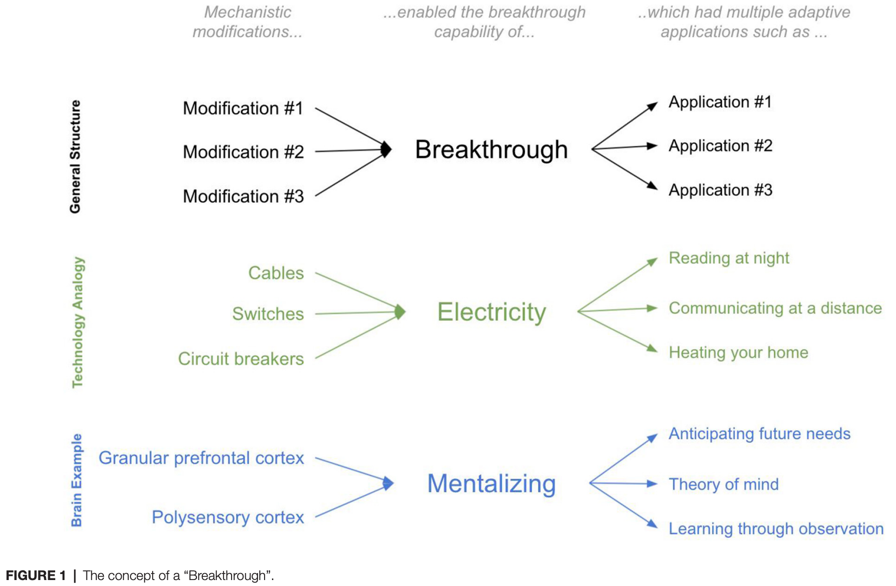
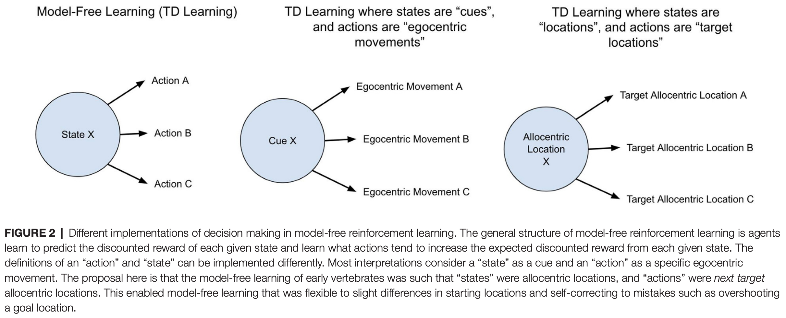
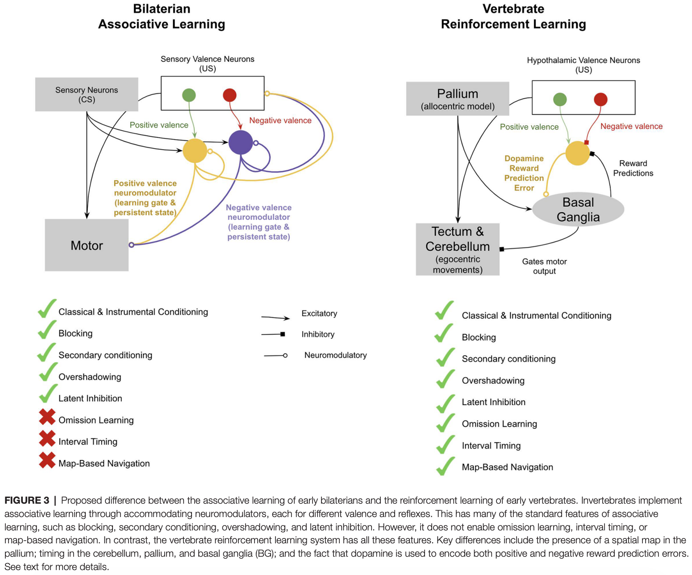
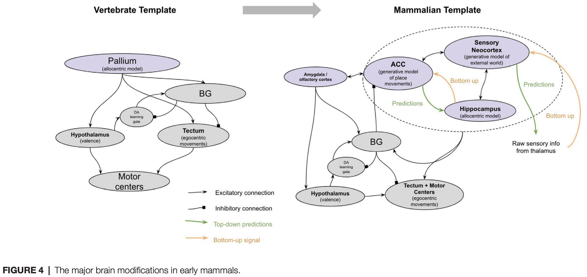
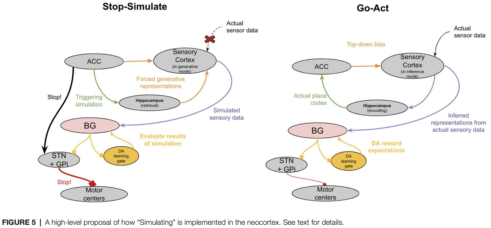
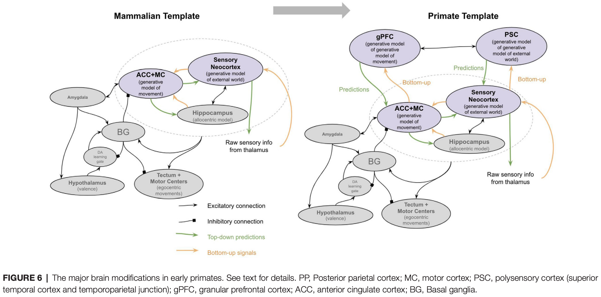
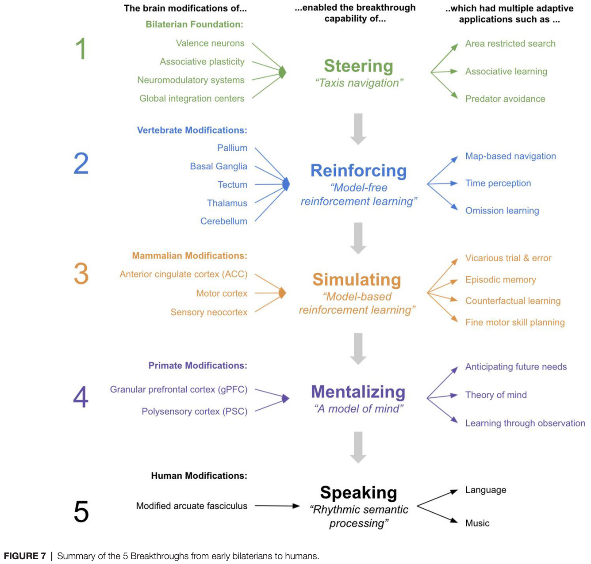

# 2 2021 Brain Evolution

- [Five Breakthroughs: A First Approximation of Brain Evolution From Early Bilaterians to Humans](https://pmc.ncbi.nlm.nih.gov/articles/PMC8418099/pdf/fnana-15-693346.pdf)

- Retracing the evolutionary steps by which human brains evolved can offer insights into the underlying mechanisms of human brain function as well as the phylogenetic origin of various features of human behavior. 
    - To this end, this article presents a model for interpreting the physical and behavioral modifications throughout major milestones in human brain evolution. 
    - This model introduces the concept of a “breakthrough” as a useful tool for interpreting suites of brain modifications and the various adaptive behaviors these modifications enabled. 
    - This offers a unique view into the ordered steps by which human brains evolved and suggests several unique hypotheses on the mechanisms of human brain function.

## INTRODUCTION

- Humans have an incredibly diverse suite of intellectual faculties as well as incredibly complicated brains. 
    - But all these varied faculties and brain structures are likely to have evolved from simpler prototypes in the simpler brains of our ancestors. 
    - This general idea of progressive complexification of behavior and brains from simpler roots has been elegantly articulated in [Paul Cisek's](https://scholar.google.com/citations?user=B2yaNZoAAAAJ&hl=en) theory of "phylogenetic refinement," whereby behaviors and brain structures are interpreted as the consequence of evolutionary refinement from more basic building blocks (Cisek, 2019). 
    - An essential aspect of this research paradigm is chronicling the specific brain modifications that occurred in the human lineage, and what specific behavioral modifications they enabled.

- Much work has been done to chronicle the specific brain modifications that occurred along major milestones in the human lineage from early bilaterians to extant (现存) humans (Kaas, 2009; Striedter and Northcutt, 2020). 
    - Work has also been done to reconstruct the adaptive behavioral abilities that emerged along major milestones in the human lineage from early bilaterians to extant humans (Murray et al., 2017; Cisek, 2019; Ginsburg and Jablonka, 2019; Bennett, 2021). 
    - **A challenge of this research paradigm is how numerous the brain and behavioral modifications have been throughout evolution.** 
    - The aim of this article is to introduce the concept of a "breakthrough" and use this concept to offer a first approximation explanation of a multitude of both brain and behavioral modifications that occurred during major evolutionary milestones. 
    - The general structure of the argument herein is that at each major milestone in human brain evolution, many neural modifications can be explained as having enabled a new single breakthrough, which was thereby applied in many adaptive ways.

### An Analogy to Technological Innovation: The Useful Concept of a “Breakthrough”

- To elaborate on this idea, I will draw on an analogy to technological innovation. 
    - Consider the modifications and applications of a technological breakthrough such as the transition from gas-powered to electrically-powered households during the late 19th century. 
    - **The physical modifications within a household were many: cables were laid, switches were added, circuit boards were installed. But all these new physical modifications can be reasonably understood through the lens of a single new breakthrough capability that they enabled — namely the capability of using electricity for energy.**
    - And this breakthrough capability was thereby applied in many adaptive ways: lighting a home at night for reading, heating a house during the cold without fire, speaking to faraway family members (using a telephone). 
    - The value of the physical modifications is defined only in the context of these adaptive applications.

- Now imagine you were an alien observer trying to "explain" the observed physical changes to the 19th century home, as well as the observed new adaptive abilities of 19th century homeowners. 
    - Without a notion of the underlying breakthrough (electricity), and instead only with a model of the adaptive abilities and the physical modifications themselves, explaining the transformation of the 19th century home would be more perplexing (复杂的). 
        - If you tried to explain individual physical modifications through the adaptive value they provided, **it would be unclear: what was the specific adaptive value of a single light switch or a single wire?** 
        - Conversely, if you tried to find the "substrates" underlying a given new "ability," such as reading at night, **the answer would also be unclear: entire suites of physical modifications worked together to enable these abilities. There was no single substrate.** 
        - **Further, many of the substrates of seemingly completely different newfound abilities are highly overlapping**: reading at night, heating your home during the cold, and communicating at a distance all used overlapping physical features within a home (all used common cords, switches, and circuit breakers). 
    - In contrast, armed with the concept of a breakthrough, both the new physical modifications and the seemingly different new abilities have a much more interpretable first approximation: the varied physical modifications together served the single purpose of using electricity for energy, and this **single breakthrough was applied in many different ways**, including reading at night and communicating at a distance.

- An additional benefit of the concept of a breakthrough is that it incorporates **prior constraints** into subsequent physical modifications and newfound abilities. 
    - Consider a technological breakthrough that occurred after that of electricity: the television (TV). 
    - **Can we understand the modifications and breakthroughs of TV without first understanding that of electricity?** 
    - TV was only possible because electricity came first and the ways in which electricity worked imposed constraints on how TVs would have to work. 
    - For example, TVs had to work on the relatively low voltage available within the home at the time. As such, we can only "explain" the specific modifications of TVs when we understand the constraints of the breakthrough that came before.

- In sum, there are two useful benefits of the concept of a breakthrough. 
    - The first is that it enables a useful first approximation of both physical modifications and the adaptive value they provide. 
    - The second is it provides a simple interpretation of ordered constraints, whereby prior breakthroughs imposed important constraints on future breakthroughs. 
- The analogy is far from perfect. 
    - For example, numerous technological modifications to a home can be planned in advance, whereas evolution can only work via tinkering over each evolutionary iteration. 
    - Regardless, this analogy is illustrative — it offers an instructive lens for the concept of a breakthrough and the useful benefits it offers in explaining transformations (see Figure 1). 
- This article is an attempt to apply this concept of ordered breakthroughs to brain evolution in order to offer explanations of the major brain and behavioral modifications throughout the evolutionary lineage from bilaterians to extant humans.

### The Approach

- In the context of brain evolution, I will define three key terms:
    - Physical Modifications: the actual physical changes in underlying neural structures.
    - Breakthrough: a new capability that these numerous physical changes enabled, and which had numerous adaptive behavioral applications.
    - Adaptive Applications: a new behavioral ability that offered survival and/or reproductive benefit to an animal and is one of many applications of an underlying breakthrough capability.

- Below I will chronicle what I propose are the five major breakthroughs that occurred from the first bilaterians to the first human brains. 
    - There are undeniably many more modifications than will be described below, however, I argue that a remarkably broad set of brain functions and behaviors across taxa throughout the human lineage can be understood through the lens of only these five major modifications. 
    - I will connect these major modifications to likely behavioral abilities that emerged throughout our evolutionary timelines. 
    - **This simplified model of brain evolution provides a useful "first approximation" of how and why brains evolved.**

- I intentionally call this a "model" and not a "theory." 
    - I make the following distinction between the two: 
        - a model is a useful approximation of a set of phenomena, 
        - whereas a theory is a comprehensive explanation of a set of phenomena (Wunsch, 1994). 
    - **Through this lens then, this article does not present a theory, as it is undeniably a simplification of the process of brain evolution.** 
    - Instead, what it presents is a model — a useful first approximation that can be used to interpret and explain a multitude of observations.

- Further, the scope of this article is intentionally anthropocentric (以人类为中心) — it seeks to chronicle the phylogenetic history of behavioral abilities in **the human lineage** between early bilaterians and extant humans. 
    - This requires an essential caveat (警告) to the hypotheses presented herein. 
    - Proposing a hypothesis regarding the emergence of abilities along the evolutionary lineage from early bilaterians to humans is not the same thing as proposing a hypothesis regarding a unique ability of humans relative to other extant animals alive today. 
    - For example, the hypothesis that **episodic memory emerged in early mammals** is not the same as a hypothesis that **only mammals exhibit episodic memory.** 
    - Convergent evolution is not the exception, but the rule.

- I will start by presenting the model and then provide evidence for the model.

## THE MODEL

### 1 Associative Learning: Steering (转向) in Early Bilaterians (两侧对称动物)

- The hypothesis here is that the major neural modifications that emerged in early bilaterians facilitated the breakthrough of "steering," which was thereby applied in multiple adaptive ways, such as in 
    - local area restricted search, 
    - avoiding predation (捕食), 
    - and maintaining homeostasis (体内动态平衡).

- **By "steering" I refer to the capability of categorizing external stimuli into two simple groups**
    - positive valence (for approach)
    - and negative valence (for escape). 
- Agents can then turn towards directions where "positive valence" stimuli increase in potency (效力) (or "negative valence" stimuli decrease) and turn away from directions where "positive valence" stimuli decrease in potency (or "negative valence" stimuli increase). 

- It is a breakthrough in the sense that an agent can navigate a complex environment remarkably well with only these simple categorizations and turning decisions. 
    - This navigational strategy is often called "taxis (趋向性) navigation," whereby organisms move towards or away from specific stimuli and thereby climb up or down sensory gradients. 
    - **Taxis navigation is present in single-celled organisms and almost definitely existed far before the first bilaterians. However, this model proposes that it was only in the first bilaterian animals where taxis navigation was implemented with neurons and muscles, and this unique implementation offered several additional benefits.**

- This model proposes that there were **four physical modifications** in early bilaterians: 
    - **a bilateral body plan**, 
    - **valence sensory neurons** that connected to global neural integration centers (the first "brain"), 
    - neurobiological mechanisms of **associative plasticity**, 
    - and **neuromodulatory systems** that generated persistent behavioral states. 

- An interpretation of how these neural structures together implemented "steering" is as follows. 
    - **A bilateral body plan** reduced navigational decision making to simply forward or backward, and left or right (Holló and Novák, 2012). 
    - The **sensory neurons** of early bilaterians were evolutionarily hardwired to categorize specific external stimuli into those for "approaching" (forward) and others for "avoiding" (turn). 
        - These sensory neurons were directly sensitive to internal states. 
        - A chemosensory neuron in early Bilateria that was responsive to food cues would then also be directly modulated by hunger signals. 
        - In this way, the sensory apparatus of early bilaterians would have directly computed valence. 
        - Further, the global neural integration centers of early bilaterians would have been used to integrate competing input across valence neurons, which would have enabled the selection of a single cross-model decision in the presence of tradeoffs.
            - For example, if an early bilaterian animal detected both the increase in a food cue (positive valence) and an increase in heat (negative valence), these different valence neurons would project to common interneurons where they could be integrated into a single decision of forward locomotion or turning depending on the relative strength of each valence response.
    - The mechanisms of **associative plasticity**, both postsynaptic and presynaptic, enabled early bilaterians to change the weights and hence valence of various stimuli. 
        - For example, experiencing pain in the presence of light could make light more aversive in the future. 
        - This enabled smarter steering decisions over time.
    - This model proposes that it was in these early bilaterians in whom **neuromodulators such as dopamine and norepinephrine (去甲肾上腺素) (and octopamine (章鱼胺))** were first used for valence-related signaling.
        - **Dopamine was released in the presence of food cues and persisted in extra synaptic space even after food cues disappeared. This enabled an animal to perform local area restricted search even in the absence of any specific food cues.** 
        - **Octopamine and norepinephrine did the same for negative valence stimuli, driving an animal to continue its relocation locomotion even after negative stimuli faded.**

- Together, these physical modifications enabled the breakthrough of "steering," which enabled early bilaterians to optimally explore and exploit food patches while maintaining homeostasis. 
    - This implementation of taxis-navigation within neurons and muscles may have enabled comparably larger organisms to use taxis navigation than the prior taxis mechanisms of cellular cilia. 
    - Further, such a neuron implementation may have enabled more accurate sensitivity to internal states and cross-modal integration. 
    - This breakthrough was only possible because bilaterian brains were built on the foundation of neurons and muscles that evolved prior in eumetazoans (真后生动物).

### 2 Model-Free RL: Reinforcing in Early Vertebrates (脊椎动物)

- The hypothesis here is that the brain modifications that emerged in early vertebrates facilitated the singular breakthrough of "reinforcing," which was thereby applied in multiple adaptive ways, such as in 
    - map-based navigation, 
    - interval timing, 
    - and omission learning.

- **By "reinforcing" I refer to "model-free reinforcement learning".** 
    - In reinforcement learning, a distinction is often made between "model-free" and "model-based" methods. 
    - In simple terms, model-based methods include the ability to "plan," which requires an agent to "play out actions" before taking them and choosing the sequence of actions that has the best outcome. 
        - This "playing out" of actions thereby requires a "model" of state transition probabilities. 
    - In contrast, model-free methods include only learning the direct association with the current state and the available actions. 

- **The hypothesis here is that this "model-free" method of learning first emerged in early vertebrates, while the "model-based" method emerged later with the first mammals.**

- Model-free reinforcement learning requires several features:
    - recognition of states, 
    - predicting the magnitude of reward,
    - predicting the timing of reward, 
    - temporal difference error signal, 
    - and the use of this error signal to update reward predictions. 

- Despite these shared features, there are still many different implementations and conceptualizations of model-free reinforcement learning and how it manifests in brains. As such, **two clarifications** must be made regarding the features of model-free reinforcement learning this hypothesis proposes emerged in early vertebrates.
    - **The first clarification** is regarding spatial maps. 
        - Model-based RL and spatial maps (sometimes called cognitive maps) are two concepts that sometimes get conflated (合并的) — it has been suggested that evidence for the presence of a spatial map in an animal, as evaluated by various map-based navigational tests, is evidence for the presence of model-based reinforcement learning. 
        - The reasoning being that a spatial map requires a "model" of space. 
        - However, **what makes an agent’s learning method model-based is not the presence of a spatial map but the use of that spatial map for the purpose of simulating future actions.** 
        - A spatial map can still be used in the context of model-free learning without such simulation of future actions.
            - For example, an agent’s current state can be defined as a location in space, and the actions it associates rewards with can be defined by the next target locations, which thereby would generate a homing vector from the current location to the next target location. This contains no "playing out" of state transition probabilities, but does have various adaptive properties, such as being robust to small changes in starting locations or paths (such as due to perturbations in water current). 
        - **The hypothesis here proposes that spatial maps first emerged in vertebrates but they were not used for simulating future actions, and only used for learning associations between the current location and rewarding next target locations (see Figure 2).**
    - **The second clarification** is regarding goal-directed vs. habitual behavior. 
        - Model-based learning and the ability to use reward identity in learning are sometimes conflated: it has been suggested that the presence of successful devaluation is evidence for the presence of model-based reinforcement learning. 
        - I will argue that this is not the case. 
        - A common experimental setup for such devaluation experiments is to allow a mouse to associate two levers each with a different type of food. Once this association is well learned, mice are allowed to eat one of those foods to satiation (饱腹感). 
        - When subsequently presented with each of these levers, mice will usually immediately favor the lever that produces the food that was not eaten to satiation (i.e., not devalued). 
        - Different experimental setups, as well as lesions of specific regions, can make mice insensitive to devaluation, whereby they will continue pushing the lever for the devalued food. 
        - Such behavior is typically considered to be "habitual" whereas that which is sensitive to devaluation is considered "goal-directed". 
        - Habitual behavior at times is conflated with model-free learning: habitual behavior demonstrates direct stimulus-response associations, which can seem analogous to direct learning of rewarding actions from a given state in model-free learning. 
        - And similarly, goal-directed behavior clearly requires a "stimulus-stimulus" association, where each lever is associated with the food itself, and not just the original reward — this has been suggested to be evidence of model-based learning. 
        - However, neither is necessarily the case. If "states" include interoceptive (内感受性的) information such as hunger level, then model-free learning can exhibit behavior that is sensitive to devaluation without any planning or playing out of future actions. 
        - Therefore, the proposal that early vertebrates were capable of model-free RL but not model-based RL does not suggest that all behavior of early vertebrates was habitual and insensitive to devaluation.

- The main **four new brain structures** that emerged with early vertebrates were 
    - the pallium (大脑皮层), 
    - the basal ganglia (BG) (基底神经节),
    - the tectum (顶盖), 
    - and the cerebellum (小脑) (Sugahara et al., 2017). 

- This entire network of new brain structures of early vertebrates can be reasonably understood through the lens of the emergence of model-free reinforcement learning with spatial maps and timing. 

- Study Note: Bilaterian Associative Learning
    - Core Principle:
        - Invertebrate associative learning does **not** follow the classical Hebbian rule (*"Neurons that fire together, wire together"*). It is a **three-factor heterosynaptic mechanism** where synaptic strengthening is strictly gated by a valence-encoded neuromodulator, completely independent of the firing state of the post-synaptic motor neuron.
    - Step 1: Initial State (Pre-Training)
        - **The Hard-Wired Circuit:** The Unconditioned Stimulus (US, e.g., food) has an innate, strong connection to the Motor Neuron, automatically driving behavioral output. It also connects directly to a valence-encoding Interneuron (e.g., the "Yellow" neuron).
        - **The Weak Link:** The Conditioned Stimulus (CS, e.g., odor) connects to the Motor Neuron via an extremely weak synapse ($W_{\text{CS} \rightarrow \text{Motor}}$).
        - **Result:** Presenting the CS alone cannot trigger the Motor Neuron because the signal fails to pass through the weak synapse.
    - Step 2: Coincidence Detection (During Training)
        - When the CS (odor) and US (food) are presented simultaneously, two independent pathways converge at the $W_{\text{CS} \rightarrow \text{Motor}}$ synapse:
            1. **Presynaptic Activity (CS):** The CS neuron depolarizes, releasing classical neurotransmitters (e.g., glutamate) into the synaptic cleft. These molecules sit ready at the post-synaptic receptors.
            2. **Neuromodulatory Volley (US):** Concurrently, the US neuron activates the Yellow Interneuron, which floods the local synaptic environment with a **neuromodulator** (e.g., octopamine).
    - Step 3: Molecular Gating & Persistent State (The Core Mechanism)
        - The synapse becomes the locus of a tripartite (three-factor) interaction:
            - **The Learning Gate:** The neuromodulator acts as a biochemical switch by binding to G-protein coupled receptors (GPCRs) on the synapse. It only permits structural changes when the CS neurotransmitter is simultaneously present.
            - **Biochemical Fixation:** This dual chemical presence activates an intracellular signaling cascade ($\text{cAMP} \rightarrow \text{Protein Kinase A}$). This pathway drives permanent structural modifications, such as inserting more post-synaptic receptors and increasing neurotransmitter release probability.
            - **Result:** The weight of $W_{\text{CS} \rightarrow \text{Motor}}$ is permanently upregulated from weak to strong.
    - Step 4: Conditioned Reflex (Post-Training)
        - Once the synaptic highway is built, the US (food) is removed.
        - When the CS (odor) is presented alone, it fires neurotransmitters into the newly optimized, highly sensitive synapse.
        - The amplified signal effortlessly crosses the threshold to fire the **Motor Neuron**, executing the learned behavior (e.g., approach) purely in response to the environmental cue.
    - The "US-Motor Ablation" Proof
        - If you experimentally sever the direct pathway from the US to the Motor Neuron, the Motor Neuron will remain completely silent and fail to fire during training.
        - However, because the US $\rightarrow$ Yellow Interneuron pathway remains intact, the neuromodulator is still released. Consequently, the convergence of the CS neurotransmitter and the neuromodulator at the synapse still occurs normally. **Therefore, the $W_{\text{CS} \rightarrow \text{Motor}}$ synapse will still strengthen successfully, proving that post-synaptic firing is a byproduct, not a cause, of this associative learning.**

- Study Note: Vertebrate Reinforcement Learning
    - Core Principle:
        - Vertebrate Reinforcement Learning does **not** rely on direct, rigid sensory-to-motor wiring. Instead, it is a **decoupled, model-based system** running an online **Temporal Difference (TD) Actor-Critic algorithm**. The circuit separates the prediction of "state value" from the selection of "motor actions," using **phasic dopamine** as a scalar algebraic error signal ($\delta_t$) to dynamically adjust multi-synaptic weights.
    - Step 1: State Representation & Space-Time Synthesis
        - When a Conditioned Stimulus (CS, e.g., a cue) appears in a complex environment, the brain does not treat it as an isolated signal. It builds a high-dimensional state vector ($\mathbf{s}_t$):
            - **Spatial Cognitive Mapping (Pallium/Cortex):** The Pallium constructs an allocentric, 3D model of the environment, computing the animal's exact spatial coordinates and contextual layout.
            - **Interval Timing (Cerebellum & Tectum):** Concurrently, the Cerebellum acts as a high-precision internal stopwatch, tracking the exact milliseconds elapsed since the onset of the CS.
            - **Result:** A unified spatio-temporal state vector $\mathbf{s}_t$ (encoding *"Where I am"* and *"Exactly what millisecond it is"*) is dispatched to the Basal Ganglia.
    - Step 2: Parallel Dual-Stream Processing (Actor vs. Critic)
        - The state vector $\mathbf{s}_t$ enters the Striatum (the input hub of the Basal Ganglia), where it splits into two completely independent, parallel anatomical pathways:
            1. **The Critic Stream (Striatum Matrix):** This pathway calculates the **State-Value Function $V(\mathbf{s}_t)$**. It answers the question: *"Based on this current situation and time, what is the total amount of reward I expect to receive in the future?"*
            2. **The Actor Stream (Striatum Striosome):** This pathway encodes the **Policy $\pi(a|\mathbf{s}_t)$** by calculating action preferences. It decides which motor plans to prepare but keeps them under lock and key via a structural **motor gate**.
    - Step 3: Computational Auditing via Dopamine (TD-RPE Calculation)
        - The animal executes an action $a_t$ sampled from its policy, shifting the world to a new state $\mathbf{s}_{t+1}$, which might yield an Unconditioned Stimulus (US, e.g., food reward $R_t$).
        - At this exact transition, the Midbrain Dopamine Neurons (the yellow node) act as an algebraic differentiator, calculating the **Temporal Difference Reward Prediction Error ($\delta_t$)**:

        $$\delta_t = R_t + \gamma V(\mathbf{s}_{t+1}) - V(\mathbf{s}_t)$$

        - **The Dopamine Phasic Burst ($\delta_t > 0$):** If the reward $R_t$ is higher than expected, or if the new state looks more promising than the last, dopamine neurons fire a massive burst, flooding the Basal Ganglia with a wave of dopamine.
        - **The Dopamine Pause ($\delta_t < 0$):** If an expected reward fails to materialize, dopamine neurons completely shut off, dropping local dopamine concentrations far below baseline levels.
    
    - Step 4: Three-Factor Credit Assignment & Synaptic Modification
        - The dopamine signal $\delta_t$ is broadcast globally across the Striatum to execute a **Three-Factor Learning Rule** ($\Delta W = \eta \cdot \text{Pre} \cdot \text{Post} \cdot \delta_t$), updating the synapses of both streams simultaneously:
            - **Updating the Critic:** The Critic's weights are adjusted to eliminate the error, forcing future value predictions $V(\mathbf{s}_t)$ to align perfectly with reality.
            - **Reshaping the Actor (Policy Optimization):** 
                - If **$\delta_t > 0$**, the dopamine burst triggers **Long-Term Potentipaton (LTP)** specifically at the synapses that just drove action $a_t$. The Basal Ganglia "opens the gate" wider, making this action highly likely to occur under this specific space-time state in the future. 
                - If **$\delta_t < 0$ (Omission)**, the drop in dopamine triggers **Long-Term Depression (LTD)**. The weights governing that failed action are actively slashed, instantly collapsing its future probability.
    - Why This Architecture Resolves the "Invertebrate Limitations"
        1. **Omission Learning (Green Check):** Because the dopamine system can output a **negative scalar ($\delta_t < 0$)**, it can execute mathematical subtraction on synapses. It does not wait for chemicals to slowly decay; it actively and rapidly erases bad behaviors when rewards disappear.
        2. **Interval Timing (Green Check):** Because the Cerebellum continuously stamps every millisecond into the state vector $\mathbf{s}_t$, the Critic computes a different value for $V(\mathbf{s}_{\text{1-second}})$ versus $V(\mathbf{s}_{\text{5-seconds}})$. The Actor learns to open the motor gate *only* at the precise millisecond where the reward margin is maximized.
        3. **Map-Based Navigation (Green Check):** Because the Actor is completely decoupled from sensory inputs and instead reads the Pallium's spatial map, the animal can use its value gradient to calculate and navigate entirely novel, unlearned shortcut routes to a goal if a familiar path is blocked.

---

- An interpretation of how these neural structures together implemented model-free RL is as follows (see Figure 3).
    - Specific subregions of the **pallium** acquired the ability to represent allocentric (客体中心) representations of space (a "spatial map"), while others acquired the ability to recognize patterns of stimulus cues. 
    - Valence neurons in the evolutionarily older hypothalamus (inherited from the valence neurons of early bilaterians) became direct controllers of dopamine responses, whereby positive valence neurons stimulated dopamine and negative valence neurons inhibited dopamine. 
    - Activation of dopamine allowed long–term potentiation in the synapses between the pallium and the striatum (纹状体) of the BG.
    - The BG then chunked together sequences of stimuli and places that tended to activate dopamine. 
    - The BG used these sequences to predict its own dopamine activations and used these predictions to inhibit dopamine neurons. 
    - This filtered out expected dopamine activations, thereby converting dopamine signals from a global valence signal to a reward prediction error (also called a "temporal difference learning signal"), which is an essential feature of model-free learning. 
    - The BG disinhibited neurons in the tectum, where allocentric representations from the pallium could be converted to egocentric movements, and hence drove movement towards specific "goal" locations activated in the BG. 
    - The pallial-BG system thereby learned sequences of allocentric goals that progressively climbed a dopamine gradient. 
    - This network generates "homing vectors" towards sequences of goal locations which are defined merely by climbing a dopamine gradient.
    - Timing signals within the cerebellum, and potentially also in the pallium, enabled a representation of time that allowed animals to make choices not only based on where they are relative to an outcome, but also when they are relative to an outcome.

- The breakthrough of model-free reinforcement learning would have offered early vertebrates numerous adaptive behavioral abilities. 
    - It would have enabled early vertebrates to navigate their environment not only with taxis-navigation, but also with map-based navigation — able to remember and navigate towards or away from specific locations in three-dimensional space. 
    - It would have enabled vertebrates to remember the specific timing between events, and thereby learn when to act. 
    - And it also would have allowed early vertebrates to not only learn from the presence of stimuli but also from the omission of stimuli. 
    - Such omission learning enabled vertebrates to perform much better on avoidance tasks.
    - Crucially, model-free learning would have only been possible in vertebrates because of the prior existence of **valence neurons** and **neuromodulatory signals** that evolved earlier in Bilateria.

### 3 Model-Based RL: Simulating in Early Mammals (哺乳动物)

- The hypothesis here is that the unique brain regions that emerged in early mammals facilitated the singular breakthrough of "simulating," which was thereby applied in multiple adaptive ways, such as in 
    - vicarious trial and error (VTE) (替代性试错行为), 
    - episodic memory (情景记忆), 
    - and counterfactual learning.

- **By "simulating" I simply refer to the ability to perform model-based reinforcement learning, whereby an animal can play out and simulate action sequences before taking an action.** 
    - **In early mammals, the dorsal pallium (背侧皮层) of the ancestral amniote (羊膜动物) transformed into the neocortex (新皮质) (Tosches et al., 2018).** 
    - **I propose that the unique capabilities offered by this new neocortex relative to the pallium were its ability to internally invoke simulated actions and stimuli.** 
    - A mammal with such an ability can pause, simulate a reality, manipulate it, evaluate it, and then act accordingly. 
    - This ability can be applied in many ways, such as for 
        - VTE (simulating paths), 
        - episodic memory (simulating a past event), 
        - or counterfactual learning (simulating alternative choices).

- An interpretation of how the neocortex enabled such model-based reinforcement learning is as follows. 
    - **The neocortex seems to be made up of a repeated columnar microcircuit (the "neocortical column"; Mountcastle, 1978).** 
    - There are many competing theories of the specific computations performed by this microcircuit — including 
        - predictive coding (Rao and Ballard, 1999; Bastos et al., 2012; Spratling, 2017; Keller and Mrsic-Flogel, 2018), 
        - adaptive resonance theory (Grossberg and Versace, 2008), 
        - and hierarchical temporal memory (George and Hawkins, 2009; Hawkins and Ahmad, 2016; Bennett, 2020). 
    - **Despite differences in these interpretations, they all generally agree that the microcircuit builds a self-supervised "model" with the purpose of predicting the entirety of its bottoms-up input.** 
    - **The self-supervised nature of the neocortex shares many features with a class of machine learning models called "generative models" (Kersten et al., 2004; Knill and Pouget, 2004; Parr and Friston, 2018).** 
    - A generative model learns a "latent representation" (also called a "model" or an "explanation") of its input. 
    - A generative model has two modes 
        - an "inference mode" where it picks a latent representation that best "explains" its bottom-up input 
        - and a "generative mode" where it generates its own training data given a specific latent representation. 
    - **Learning occurs by comparing the match between the simulated data and the actual data.** 
    - Learning is optimized to minimize such mismatches (i.e., minimize "prediction errors"). 
    - Hence these generative models are "self-supervised" — trained only by the degree with which their own model of reality has successfully predicted its own input.

- The neocortex of early mammals had two broad sub-regions: the frontal cortex and the sensory cortex (see Figure 4). 
    - **The frontal cortex** in early mammals is believed to be homologous (同源的) to the anterior cingulate cortex (ACC, 前扣带皮层) of later mammals (Laubach et al., 2018; van Heukelum et al., 2020). 
    - **The sensory cortex** had several homologous subregions for different modalities:
        - visual areas, 
        - somatosensory (躯体感觉) areas, 
        - and auditory areas. 
    - This model suggests that each subregion implemented a generative model of sensor data from a given modality, with the goal of explaining its own input. 
    - **However, this model proposes that the ACC served a different function, albeit (尽管) performing an identical computation. Instead of receiving input from external sensory, the ACC of all mammals receives input from the amygdala (杏仁核) and hippocampus (Reppucci and Petrovich, 2015), and projects throughout the sensory cortex (Zhang et al., 2014; Goll et al., 2015; Atlan et al., 2018; White et al., 2018; reviewed in Kamigaki, 2019).**
        - **I hypothesize that the ACC is building a generative model of "paths" from the hippocampus, given "goals" from the amygdala. The goal represented is not a complex representation of the actual objects or sensory stimulus, but rather the actual valence results in the amygdala. The ACC thereby tries to explain the sequence of places that will be taken given a latent representation of a "goal" from the amygdala.** 
        - **One interpretation of this is that the latent representation in ACC is a model of "intent" — it observes an animal’s path, place, and context from the hippocampus and attempts to predict why the animal is behaving the way it is.**
        - This is consistent with other conceptualizations of generative models in the context of movement, often referred to as "active inference" (Adams et al., 2012).

- This model proposes that one function of this ACC representation of "intent" is its ability to trigger internally invoked simulations, which thereby allowed animals to engage in model-based learning (see Figure 5). 
    - When an animal reaches a "choice point" where the right answer is uncertain, this uncertainty is represented by multiple conflicting predictions from different columns of the ACC. 
    - This conflicting set of predictions triggers the animal to pause its movements. 
    - The neural substrate of this pausing may be the ACC direct projection to the subthalamic nucleus (丘脑底核), which has been shown to be leveraged during top-down inhibition (Aron, 2006; Heikenfeld et al., 2020). 
    - The ACC can then trigger simulated paths through its loop with the hippocampus and can internally invoke the corresponding sensory representations of such paths through either its direct connections to the sensory cortex or through its indirect connections through the claustrum (屏状体) or hippocampus. 
    - During this "pause," the generative model in the sensory neocortex shifts from being externally driven ("inference mode") to internally driven ("generative mode").
    - The ACC will continue to explore "movements" consistent with its generative model of intent. 
    - These internally invoked representations of the world in the sensory neocortex can then be evaluated in the BG. 
    - When an imagined path finally achieves an outcome that leads the basal ganglia to release enough dopamine, it will trigger a "GO" response.
    - This accomplishes two things. 
        - First, it immediately sensitizes the "imagined" path that the ACC triggered through the hippocampus, thereby biasing subsequent movements to be consistent with what was imagined.
        - Second, it overcomes the ACC suppression of movement through the STN, enabling the evolutionarily older basal ganglia to take over behavior again.

- During ongoing movement, when columns of ACC agree in their predictions of subsequent movement, the ACC can still exert some control over behavior by biasing the latent representations in the sensory neocortex to be consistent with the imagined path. 
    - **This perhaps was the first version of "cognitive control" and "attention".** 
    - The ACC projects to sensory neocortex where it can perform "gain control" and bias sensory representations (Goll et al., 2015; Atlan et al., 2018; White et al., 2018).

- Note that this "pause-simulate" behavior does not only apply to imagining action paths, but it also equally applies to 
    - imagining past events (episodic memory), 
    - imagining alternative choices to choices you already made (counterfactual learning), 
    - and perhaps even working memory (holding things "in mind"). 
- **The important feature is the ability of the ACC to trigger internally invoked simulations in the sensory cortex, which can be used to train the basal ganglia vicariously.**

- The motor cortex emerged in later mammals (placentals; Beck et al., 1996; Kaas, 2012). 
    - Motor cortex can also be interpreted through the lens of a frontal region that builds a model of "intent" and uses it to predict movement and trigger internally invoked simulation in the presence of uncertainty.
    - In early mammals, the motor cortex was not required for moving in general but was required for movements that require preplanning. 
        - For example, movements where animals must grasp something they see or carefully step their feet on specific platforms requires simulating actions before moving—these fine movement skills are uniquely enabled by the motor cortex. 
    - **The motor cortex can simulate these actions through its projections to the somatosensory cortex; the same way ACC can simulate paths through its projections to overall sensory cortex.** 
        - The key difference between the motor cortex and the ACC is that the motor cortex gets its top-down input of "intent" from the ACC, and predicts specific body movements in the somatosensory cortex, while the ACC gets its top-down input of "intent" form the amygdala and predicts general navigational paths in the hippocampus. 
    - In this sense, the ACC relationship with the motor cortex was the first "motor hierarchy," where goals flowed from the ACC to motor cortex. 
    - Therefore, the addition of the motor cortex can be viewed as an elaboration on the previous ACC-sensory network, which enabled the planning of fine motor movements.

- The unique neocortical ability to trigger internally invoked simulations and use them for learning would not have been possible without two features inherited from earlier vertebrates. 
    - Firstly, spatial mapping in earlier vertebrates was repurposed in later mammals in order to explore environments vicariously. 
        - Without a spatial map, it would be impossible to simulate various movements and their consequences.
    - **Secondarily, internally invoked simulations work by training the basal ganglia vicariously — the basal ganglia does not have to tell the difference between an internally invoked or externally invoked sensory data from the sensory cortex, it merely learns what sequences of movements trigger dopamine release.** 
    - **This ability to learn vicariously was only possible because it was built on top of the foundation of the older basal ganglia.**

### 4 Mentalizing in Early Primates (灵长类)

- The hypothesis here is that the unique brain regions that emerged in early primates facilitated the singular breakthrough of "mentalizing," which was thereby applied in multiple adaptive ways.

- By "mentalizing" I refer to the ability to **construct a model of the mind, inclusive of an individual's intent and knowledge.**
    - Such a model of mind can be applied in multiple ways — three such ways are 
        - **anticipating future needs** 
        - **theory of mind** 
        - **learning skills through observation** 
    - All three of these can be seen merely as different applications of this singular ability of primates to engage in "mentalizing." 
    
- For example, mentalizing can be used to 
    - simulate a mind state of yourself that you do not have yet (imagining being hungry tomorrow if I do not gather food now, even though I am not hungry right now). 
    - simulate the mind state of another conspecific (同种个体) you are observing (such as imagining how they must feel given their situation). 
    - simulate the intentions and actions of others when you are watching them do various motor skills, which enables you to "learn by observation." 
- The behavioral manifestations are different, but the neural substrates are overlapping for a reason: the overall function is the same (**simulating a mind state**).

- The primary two new brain structures that emerged in early primates were the 
    - **granular prefrontal cortex (gPFC)**
    - **polysensory cortex (PSC)**

- An interpretation of how granular prefrontal cortex and PSC enabled such mentalizing is as follows (see Figure 6). 
    - gPFC gets its inputs from three primary sources: 
        - it is bidirectionally connected with the **ACC**, both directly and through the mediodorsal thalamus;
        - gPFC is interconnected with polysensory areas such as the superior temporal cortex and TPJ; 
        - it is interconnected with motor cortex both directly and indirectly through descending loops through the motor thalamus 
- **I hypothesize that gPFC and PSC together implement a generative model of the ACC-sensory generative model itself.** 
    - In other words, the gPFC-PSC generative model is constructed to "explain" the "intentions" from the ACC given "knowledge" from PSC. 
    - The emergent property of this is that it is effectively a generative model of one’s own "mind," the use of which can be thought of as "mentalizing".

- When applying this gPFC-PSC network to "mentalizing about oneself," an animal can anticipate a need it does not currently feel yet. 
    - One big difference between the ACC-sensory network and the gPFC-PSC network is that the ACC-sensory network is **self-supervised** to predict amygdala and hypothalamic activation, while the gPFC-PSC is self-supervised to predict **latent representations** within ACC-sensory network. 
    - The ACC-sensory network can predict paths that accomplish the needs currently experienced. 
    - On the other hand, gPFC-PSC network can simulate situations in the future and predict what intentions would be selected in the ACC-sensory network given such situations. 
    - The ACC-sensory network can’t do this because it is supervised to predict amygdala activation, which is therefore only sensitive to current needs. 
    - One reason this new network was adaptive was because it enabled early primates to anticipate future needs and hence plan much more flexibly than the mammals that came before. 
    - **Practically, this enables primates such as humans to go to the grocery store and pick up food for the week even when they are not yet hungry — or to bring a jacket on a trip even though they are not yet cold.** 
    - **This ability to "anticipate future needs" was originally thought to be unique to humans, summarized as the Bischof-Kohler Hypothesis (Bischof-Köhler, 1985), but this model proposes that it in fact evolved in early primates, which as we will see in later sections is consistent with more recent tests in nonhuman primates and non-primate mammals.**

- Once a generative model of one’s own mind exists, it can be applied not only to "mentalizing about oneself" but also to "mentalizing about others". 
    - Because the gPFC-PSC network is a model of what behaviors are generated from what intentions and knowledge, it can be applied to trying to identify what intentions and knowledge in others are consistent with their observed behaviors. 
    - The same way that the ACC-sensory system pauses and simulates objects and paths, the gPFC-PSC system can pause and simulate intentions and knowledge of others to generate a latent representation most consistent with the observed behavior.
    - This mentalizing about others can manifest itself in several ways.
        - First, it can be used in the basic theory of mind tasks to infer the knowledge of others given their perspective. 
        - And second, it can be used to learn motor skills through observation.

- One attractive feature of this proposal of the gPFC-PSC network is that it fits within the conceptualization of the **neocortical microcircuit.** 
    - Given the observation that the **neocortical column** seems **remarkably uniform** throughout the neocortex (Mountcastle, 1978), **any purported (声称的) new "function" attributed to a new neocortical region should be primarily a consequence of unique inputs and outputs, as opposed to any changes in the underlying computations of the neocortical column.** 
    - Consistent with this, the idea here is that the microcircuitry of the granular prefrontal cortex is the same as that of the ACC and sensory cortex: **it is still implementing a generative model.The difference is merely where it receives input from.** 
        - The ACC constructs a model getting bottom-up input from the **hippocampus**. 
            - The latent representation in the ACC is then a representation of an animal’s current intent (intent is an "explanation" of an observed path), which is used to make predictions of subsequent navigational paths. 
        - In contrast, the granular prefrontal cortex gets bottom-up input from the **ACC**. 
            - The latent representation in the granular prefrontal cortex is then a representation of a mind state (mind state is an "explanation of an intent") which is then used to construct make predictions about one’s own or others’ intent.

- Crucially, simulating mind states (mentalizing) in early primates was only possible because of the inherited ability to simulate world states that evolved in earlier mammals.
    - Mentalizing was built on the foundation of simulating world states. 
    - The model here proposes that **mentalizing network itself is a model of the mammalian ACC-sensory network**, literally built on top of the evolutionarily older brain structures.

### 5 Speaking in Early Humans

- The hypothesis here is that the unique brain regions that emerged in early humans facilitated the singular breakthrough of "speaking," which was thereby applied for language and music.

- By "speaking" I do not refer only to vocal communication, but broadly to semantic rhythmic communication in general.
    - Human brains, although bigger, are remarkably similar to the primate brains that came before. 
    - However, one fundamental difference that seemed to emerge was a modification to the **Arcuate Fasciculus (弓状束)** and its connectivity with the **Basal Ganglia ("AF-BG network")**. 
    - I hypothesize, as have others, that the neural innovations for language and music emerge from the unique connectivity of the arcuate fasciculus, as well as perhaps other additional connectivity with the striatum.
    - **This has been the classic view of language since the time of Wernicke.** 
    - More modern theories of language have criticized the simplicity of this original model and proposed additional structures. 
    - I do not make any specific claim on the exact mechanisms of language production, merely that language and music were emergent properties only possible with the additional connectivity of the arcuate fasciculus.

- The view here is that music and language are two sides of the same coin and emerge from the same neural innovations. 
    - There is an intuitive appeal to this hypothesis, as both music and language share many features. 
        - Both require rhythmic entertainment coordinated with other conspecifics. In other words, "beat perception" is necessary for both music and for taking turns appropriately in a conversation. 
        - Both are hierarchical and nested — music contains beats within "bars" within "phrases," and language contains phonemes within words within sentences. 
        - Both are highly "predictive" — when you hear an unfinished sentence such as "the ford mustang is my favorite ...," you cannot help but finish it. This is the same for music, when you hear an unresolved musical phrase.

- In the context of this model, one explanation for the ordering of these breakthroughs is that such rhythmic semantic processing for communication was only possible after the breakthrough of "mentalizing". 
    - Only with the ability to infer and understand the knowledge of others is one able to devise a reasonable communication to transfer information to someone. 
    - Consistent with this, the AF-BG network is very overlapping with the mentalizing regions that came before.

### Model Summary

- In Figure 7, you can see a summary of the proposed five breakthroughs, and the modifications and behaviors they explain. You can also see the homologous regions in human brains.

- As previously mentioned, one attractive feature of this model of five breakthroughs is that it incorporates evolutionary constraints and thereby helps understand how neural innovations build on each other. 
    - Consider the following dependencies suggested by this model.

- **Steering** in early bilaterians was only possible because of the neural building blocks that emerged earlier in eumetazoans, which provided all-or-nothing neurons with sensory cells and muscle cells. 
    - It provided inhibitory and excitatory neurons for the creation of neural circuits, and neuropeptides for the modulation of neural responses based on internal states.

- **Reinforcing (model-free RL)** in early vertebrates was only possible because of the features of steering in the ancestral bilaterian brain. 
    - The core mechanism for learning sequences of places is the temporal-difference learning mechanism which bootstraps these learned responses on hardcoded valence responses. 
    - Ancestral bilaterians had such valence responses that could stimulate the release of various neuromodulators. 
    - The pallial-BG-tectal circuit could then build plastic networks on top of these basic valence responses to enable learning more complex sequences of paths. 
    - This is consistent with other interpretations of behavior as evolving (through phylogeny and ontogeny) from the basic foundation of approach and withdrawal.

- **Simulating (model-based RL)** in early mammals was only possible because of model-free reinforcement learning in ancestral vertebrate brains.
    - Simulating requires: 
        - a "pointer" to a specific suite of stimuli; and 
        - a mechanism for manipulating key features of the stimuli once invoked.
    - The spatial map in the pallial hippocampus provided both of these features — internally invoking a "place" in the pallial hippocampus will reactivate a broad suite of learned responses to that place. 
    - Further, the ability to tether different places together and generate novel paths, enables the pallial hippocampus, if it were internally invoked, to imagine "novel" paths. 
    - **It is then no surprise that the neocortex is, in some ways, built directly on top of the much older hippocampus, and uses the hippocampus for its simulating functions, such as VTE and episodic memory.**

- **Mentalizing** in early primates was only possible because simulating in ancestral mammal brains came first. 
    - In the model described here, mentalizing is computationally the same as simulating, the only difference being that mentalizing uses a generative model of the mind itself, requiring new neocortical regions and new connectivity between them. 
    - Mentalizing could only occur after there was already a generative model of intent on which to simulate possible mind states.

- And lastly, **language and music** in early humans were only possible because of mentalizing in ancestral primate brains.
    - There are several pieces of evidence for this. 
        - **First, language and music are built directly on top of the neural structures of mentalizing: they emerge from uniquely primate mentalizing areas such as STS, TPJ, and the prefrontal cortex.** 
        - Second, **mirror neurons** have been highly implicated in both theories of language origin as well as language function. 
        - Third, people with disorders that disrupt mentalizing abilities, such as autists, also show language impairments. 
        - And lastly, as an infant develops, the advanced mentalizing abilities emerge first in children before language emerges, with "intersubjectivity" and "joint attention" occurring before words. 
    - These "theory of mind" abilities are a requirement for the development of language abilities. 
    - The connection between mentalizing and language makes sense through the lens of various theories of the evolution of language. 
    - **If the original evolutionary pressure for language was in fact for communicating the type and location of faraway food to conspecifics, as has been proposed, then it makes sense that it would at first require mentalizing: the goal of the communication is to figure out what your communication partner does not know that you want them to know, and how to use shared understanding to transfer this knowledge.**

## EVIDENCE FOR THE MODEL

### Evidence For the Proposed Phylogenetic Timing of Brain Modifications

#### Evidence That a Global Neural Integration Center (The First “Brain”) Emerged in Early Bilaterians

#### Evidence That the Pallium, Basal Ganglia, Tectum, and Cerebellum Emerged in Early Vertebrates

#### Evidence That the Neocortex With ACC and Sensory Regions Emerged in Early Mammals

#### Evidence That the Major Brain Modification of Early Primates Was the Addition of the “gPFC-PSC Network”

#### Evidence That the Major Brain Modification of Early Humans Was a Modification to the Arcuate Fasciculus

---

### Evidence for Proposed Phylogenetic Timing of Behavioral Abilities

#### Evidence That Taxis-Navigation and Associative Learning Emerged in Early Bilaterians

#### Evidence That Map-Based Navigation, Interval Timing, and Omission Learning Emerged in Early Vertebrates

#### Evidence That Vicarious Trial and Error, Episodic Memory, and Counterfactual Learning Emerged in Early Mammals

#### Evidence That Anticipating Future Needs, Theory of Mind, and Learning Through Observation Emerged in Early Primates

#### Evidence That Language and Music Emerged in Early Humans

---

### Evidence for Proposed Function of Specific Brain Modifications

#### Evidence That the Brain of Early Bilaterians Contained Valence Neurons and Neuromodulators Which Together Enabled Taxis Navigation

#### Evidence That the Pallial-BG-Tectal Network Performed the Function of Model-Free Reinforcement Learning in Early Vertebrates, and Was Applied to Enable Map-Based Navigation, Interval Timing, and Omission Learning

#### Evidence That the Neocortex Served the Function of Enabling Internally Invoked Simulations in Early Mammals, Which Was Applied for VTE, Counterfactual Learning, and Episodic Memory

#### Evidence That the gPFC-PSC Network Performed the Function of “Mentalizing” in Early Primates, and Was Similarly Applied for Anticipating Future Needs, Theory of Mind, and Learning Through Observation

#### Evidence That Modifications to the Arcuate Fasciculus Enabled Both Language and Music in Early Humans

---

## DISCUSSION

- Here I have argued that the proposed ordered set of five breakthroughs provides a first approximate explanation of a diverse set of both brain and behavioral modifications through major milestones in human brain evolution. 
    - This model of brain evolution provides a useful simplification through which to interpret brain modifications and the progressive complexification of behavior through phylogenetic refinement

### Caveats (警告)

- By summarizing such a long history into only a handful of "breakthroughs," I am undeniably simplifying the actual story. 
    - The objective is to provide a view of the "forest" of evolution at the cost of describing "the trees". 
    - This approach will inevitably miss some important changes in brains and behavior. 
    - However, as argued above, a surprisingly broad set of brain structures and behaviors can be understood through a remarkably small number of "breakthroughs."
    - Perhaps this is not so surprising, given that perhaps brain evolution often occurred in fits and starts, where some adaptive structure was stumbled upon, rapidly elaborated on, and then brains remained relatively stable for a long period of time afterward. 
    - This can be seen simply in the transition from our primate ancestors to homo sapiens. 
    - For 30 million years primate brains remained mostly unchanged. 
    - And then, over the last 1 million years our ancestors’ brains expanded by a multiple of three. 
    - A million years ago humans could not speak flexible language, and 100,000 years ago they could — this is a split second from an evolutionary perspective.

- It should also be noted that there is scant (很少) research with identically designed behavioral tests of animals across different phyla (门). 
    - This makes it both challenging and perilous (危险) to compare behavioral abilities across distant species. 
    - Many of the behavioral studies cited were not identically designed for each species tested nor evaluated using the same methods for different species, and hence such results must be interpreted with caution. 
    - For example, the experimental designs of asking a mouse to answer "unexpected Questions" from its own past are of course subtly different from asking the same Question of a cephalopod (头足类动物), who has a different sensory repertoire (全部技能) and is inevitably asked the Question in a different environment.
    - As such, differences in results may be a consequence of the experimental design as opposed to differences in abilities.
    - Further, comparative behavior research likely contains a positive results bias — whereby negative findings in animals are reported substantially less frequently than positive results.
    - As such, there are scant reports of negative findings in general, and it is challenging to conclude the lack of ability in an extant (现存) animal simply because of a lack of reports of its presence — the absence of evidence is not the evidence of absence. 
    - **As such, many pieces of this model are currently speculative and will require further studies comparing behavioral abilities across taxa (分类群).**

### Comparison to Other Work

- This work is highly inspired by others who have proposed ordered modifications in the evolution of brains: 
    - Eva Jablonka and Simona Ginsburg’s retelling (复述) of the evolution of learning systems, 
    - Paul Cisek’s theory of phylogenetic refinement,
    - Elisabeth Murray, Steven Wise, and Kim Garham’s work on the evolution of memory systems. 
- All three of these take an evolutionary approach to understanding how brains work today, by virtue of (凭借) retelling the evolutionary steps by which they came to be.

- My goal in this article is to add to this corpus of work in four ways. 
    - First, to provide an initial template and "first approximation" of the entire evolutionary story of the human brain, from the first bilaterains to the first homo sapiens.
    - Second, to simultaneously hypothesize the emergence of both brain regions and adaptive behaviors that these brain structures enabled. 
    - Third, to directly incorporate dependencies between each sequence of changes. 
    - Fourth, to attempt to explain broad behaviors using common neural innovations, as opposed to specifically focusing on a type of behavior (such as learning or memory). 
- In this last sense, this article is in some ways an attempt to bring together the ideas of Jablonka and Ginsburg, Cisek, and Murray, Wise, and Garham with the evolutionary neuroscience work of specific brain structures from Kaas and Striedter and Northcutt.

- **The most well-known model of brain evolution is Paul MacLean’s Triune Brain (1990)**, where he named the three brain systems that he argued evolved sequentially:
    - the **Reptilian** Complex 
    - the **Paleomammalian** Complex
    - the **Neomammalian** Complex 
- Despite how well known the model is, it has been highly discredited (被否定) and demonstrated to be **completely wrong** 

- A key flaw in MacLean’s model is the conceptualization of extant animals such as reptiles or monkeys as somehow "lower" animals, and humans as "higher." 
    - His idea that the human brain has a "reptile brain" and a "monkey brain" within it, incorrectly conceptualizes an extant monkey brain as being more primitive than a human brain. 
    - The truth is of course that all extant animals have gone through evolution for the same amount of time and evolved from common ancestors. 

- In contrast, the model of five breakthroughs proposed here is crafted to discuss specifically the evolutionary process only within the human lineage and is not meant to be used to make comparisons to extant animals today.
