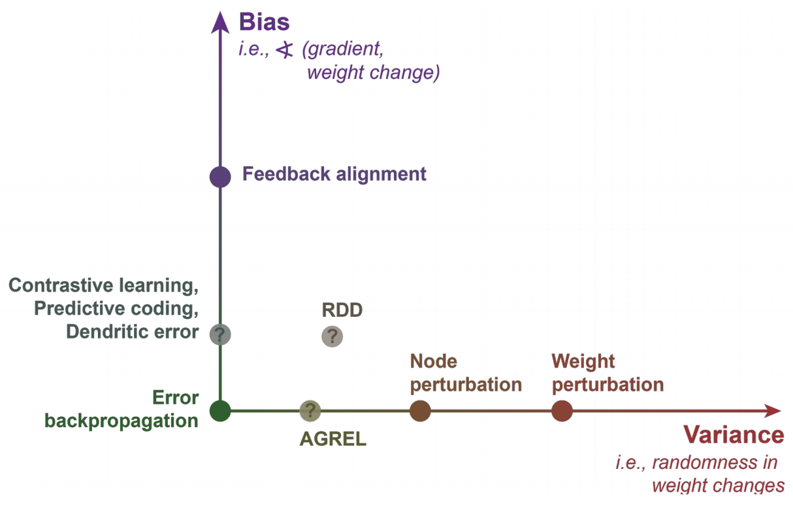
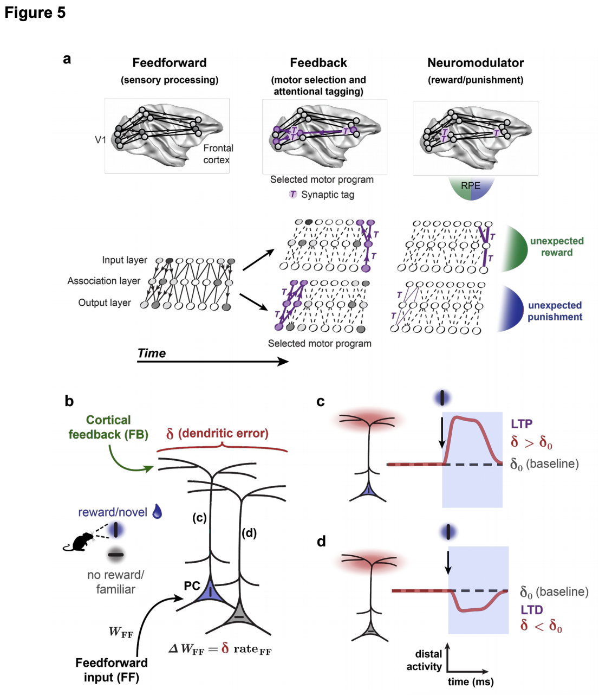

# 3 2019 DL framework for NS

- [A deep learning framework for neuroscience (optimization in the brain)](https://discovery.ucl.ac.uk/id/eprint/10086844/1/A%20deep%20learning%20framework%20for%20neuroscience%20-%20vFinalv2.pdf)

## Abstract

- Systems neuroscience seeks explanations for how the brain implements a wide variety of perceptual, cognitive and motor tasks. 
- **Conversely**, artificial intelligence attempts to design computational systems based on the tasks they will have to solve. 
    - In the case of artificial neural networks, the three components specified by design are 
        - the objective functions, 
        - the learning rules, and 
        - architectures. 
    - With the growing success of deep learning, which utilizes brain-inspired architectures, these three designed components have increasingly become central to how we model, engineer and optimize complex artificial learning systems. 
- Here we argue that a greater focus on these components would also benefit systems neuroscience. 
    - We give examples of how this **optimization-based framework** can drive theoretical and experimental progress in neuroscience. 
    - We contend that this principled perspective on systems neuroscience will help to generate more rapid progress. 

## Introduction

- Major technical advances are revolutionizing our ability to observe and manipulate brains at a large-scale and quantify complex behaviors. 
- How should we use this data to develop models of the brain? 

- When the **classical framework** for systems neuroscience was developed, we could only record from small sets of neurons. 
    - In this framework, 
        - a researcher observes neural activity, 
        - develops a theory of what individual neurons compute, 
        - then assembles a circuit-level theory of how the neurons combine their operations. 
    - This approach has worked well for **simple computations**. 
        - For example, we know how **central pattern generators** control `rhythmic movements`, 
        - how the **vestibulo-ocular reflex** promotes `gaze stabilization`, and 
        - how the **retina** `computes motion`. 
    - But, can this classical framework scale up to recordings of thousands of neurons and all of the behaviors that we may wish to account for? 
        - **Arguably, we have not had as much success with the classical approach in large neural circuits that perform a multitude of functions, like the neocortex or hippocampus.** 
        - In such circuits, researchers often find neurons with response properties that are difficult to summarize in a succinct (简洁) manner
    - The limitations of the classical framework suggest that new approaches are needed to take advantage of experimental advances. 

- A promising framework is emerging from the interactions between **neuroscience and AI**. 
    - The rise of deep learning as a leading machine learning method invites us to revisit Artificial Neural Networks (ANNs). 
    - At their core, ANNs model neural computation using simplified units that loosely mimic the integration and activation properties of real neurons. 
    - Units are implemented with varying degrees of abstraction, ranging from highly simplified linear operations to relatively complex models with multiple compartments, spikes, etc. 

- Importantly, the specific computations performed by ANNs are not designed, but learned.
    - However, human design still plays a role in determining three essential components in ANNs: 
        - the **learning goal**, expressed as an `objective function` (or loss function) to be maximized or minimized; 
        - a set of **learning rules**, expressed as `synaptic weight updates`; and 
        - the **network architecture**, expressed as the `pathways and connections for information flow` (Fig. 1). 
    - Within this framework, we do not seek to summarize how a computation is performed, but we do summarize what objective functions, learning rules and architectures would enable learning of that computation.

- Deep learning can be seen as a rebranding of long-standing ANN ideas. 
    - Deep ANNs possess multiple layers, either feedforward, or recurrent over time. 
    - The “layers” are best thought of as being analogous to brain regions, rather than as specific laminae in biological brains.
    - “Deep” learning specifically refers to training hierarchical ANNs in an end-to-end manner, such that plasticity in each layer of the hierarchy contributes to the learning goals, which requires a solution to the “credit assignment problem” (Box 1). 

- In recent years, progress in deep learning has come from the use of bigger ANNs, trained with bigger datasets using Graphics Processing Units (GPUs) that can efficiently handle the required computations. 
    - Such developments have produced solutions for many new problems, including image and speech classification and generation, language processing and translation, haptics and grasping, navigation, sensory prediction, game playing and reasoning.

- Many recent findings suggest that deep learning can inform our theories of the brain.
    - First, it has been shown that deep ANNs can, in some cases closely, mimic the representational transformations in primate perceptual systems, and thereby can be leveraged to manipulate neural activity. 
    - Second, many well-known behavioral and neurophysiological phenomena, 
        - including 
            - grid cells, 
            - shape tuning, 
            - temporal receptive fields, 
            - visual illusions, and 
            - apparent model-based reasoning, 
        - have been shown to emerge in deep ANNs trained on tasks similar to those solved by animals. 
    - **Third, many modeling studies have demonstrated that the apparent biological implausibility of end-to-end learning rules, e.g. learning algorithms that can mimic the power of the canonical backpropagation-of-error algorithm (backprop) (Fig. 2; see also Box 1), is overstated.** 
        - Relatively simple assumptions about cellular and subcellular electrophysiology, inhibitory microcircuits, patterns of spike timing, short term plasticity, and feedback connections **can enable biological systems to approximate backprop-like learning in deep ANNs**.
    - Hence, ANN-based models of the brain may not be as unrealistic as previously thought, and simultaneously, they appear to explain a lot of neurobiological data.

- With these developments, it is the right time to consider a deep-learning-inspired framework for systems neuroscience. 
    - We have a growing understanding of the key principles that underlie ANNs, and there are theoretical reasons to believe that these insights apply generally. 
    - Concomitantly (伴随地), our ability to monitor and manipulate large neural populations opens the door to new ways of testing hypotheses derived from the deep learning literature. 
    
- Here we sketch the scaffolding of a deep learning framework for modern systems neuroscience.

### Constraining learning in artificial neural networks and the brain with “task sets”

- The “No Free Lunch Theorems” demonstrated broadly that no learning algorithm can perform well on all possible problems. 
    - ANN researchers in the first decade of the 21st century thus argued that AI should be primarily concerned with the set of tasks that “...most animals can perform effortlessly, such as `perception` and `control`, as well as ... `long-term prediction`, `reasoning`, `planning`, and `communication`”. 
        - This set of tasks has been termed the “AI Set”, and the focus on building computers with capabilities that are similar to those of humans and animals is what distinguishes AI tasks from other tasks in computer science (note that the word “tasks” here refers broadly to any computation, including those that are unsupervised.)
        - Much of the success of deep learning can be attributed to the consideration given to learning in the AI Set. 

- Designing ANNs that are well-suited to learn specific tasks is an example of incorporating “inductive biases” (Box 2): assumptions that one makes about the nature of the solutions to a given optimization problem. 
    - Deep learning works so well, in part, because it uses appropriate inductive biases for the AI Set, particularly **hierarchical architectures**. 
        - For example, images can be well described by composing them into a hierarchical set of increasingly complex features: from edges, to simple combinations of these, to larger configurations that form objects. 
        - Language too can be considered a hierarchical construction, with phonemes assembled into words, words into sentences, sentences into narratives.

- However, deep learning also eschews (避开) hand-engineering, allowing the function computed by the system to emerge during learning. 
    - Thus, despite the common belief that deep learning relies solely on increases in computational power, or that it represents a “blank slate” approach to intelligence, many of the successes of deep learning have grown out of a balance between useful **inductive biases** and **emergent computation**, echoing the blend of nature and nurture which underpins the adult brain.

- Similarly, neuroscientists focus on the behaviors/tasks that a species evolved to perform.
    - This set of tasks overlaps with the AI Set, though possibly not completely, since different species have evolved strong inductive biases for their ecological niches. 
    - By considering this “Brain Set” for specific species — the tasks that are important for survival and reproduction for that species — researchers can focus on the features most likely to be key to learning. 
    - Just as departing from a pure blank slate was the key to the success of modern ANNs — e.g. by focusing on ANN designs with inductive biases that are useful for the AI Set — so we suspect that it will also be crucial to the development of a deep learning framework for systems neuroscience to focus on how a given animal might solve tasks in its appropriate Brain Set.

- Recognizing the importance of inductive biases in deep learning also helps address some existing misconceptions. 
    - Deep networks are often considered different from brains because they depend on large amounts of data. 
    - However, it is worth noting that 
        - (1) many species, especially humans, develop slowly with large quantities of experiential data and 
        - (2) that deep networks can work well in low data regimes if they have good inductive biases. 
            - For example, deep networks can learn how to learn quickly. 
    - In the case of brains, evolution could be one means by which such inductive biases are acquired.

#### Box 1: Learning and the “credit assignment problem”

- A natural definition of learning is that it is a change to a system that improves its performance. Suppose we have an objective function, $F(W)$, which measures how well a system is currently performing, given the $N$-dimensional vector of its current synaptic weights, $W$. If the synaptic weights change from $W$ to $W + \Delta W$, then the change in performance is $\Delta F = F(W + \Delta W) − F(W)$. If we make small changes to $W$, and $F$ is locally smooth, then $\Delta F$ is given approximately by $ \Delta F \approx (\Delta W)^T \cdot \nabla_W F $, where $\nabla_W F$ is the gradient of $F$ with respect to $W$. 

- Suppose we want to guarantee improved performance, i.e. we want to ensure $\Delta F > 0$. We know that there is an $N-1$ dimensional manifold of local changes in $W$ that all lead to the same improvement. Which one should we choose? Gradient-based algorithms derive from the intuition that we want to take the smallest step that gets us a specific level of improvement. If we choose a small step size, $\eta$, times the gradient $\nabla_W F$, then we will improve as much as possible for that step size. Thus, we have: $ \Delta F \approx (\eta \nabla_W F)^T \cdot \nabla_W F > 0 $. In other words, the objective function value increases with every step (when $\eta$ is small) according to the length of the gradient vector.

- The concept of “credit assignment” refers to the problem of determining how much “credit” or “blame” a given neuron or synapse should get for a given outcome. More specifically, it is a way of determining how each parameter in the system (e.g., each synaptic weight) should change to ensure that $\Delta F > 0$. In its simplest form, the “credit assignment problem” refers to the difficulty of assigning credit in complex networks. Updating weights using the gradient of the objective function, $\nabla_W F$, has proven to be an excellent means of solving the credit assignment problem in ANNs. A question that systems neuroscience faces is whether the brain also approximates something like gradient-based methods.

- The most common method for calculating gradients in deep ANNs is `backprop`. It uses the chain rule to recursively calculate gradients backwards from the output. But `backprop` rests on biologically implausible assumptions, such as 
    - symmetric feedback weights and 
    - distinct forward and backward passes of information. 
- Many different learning algorithms, not just `backprop`, can provide estimates of a gradient, and some of these do not suffer from `backprop`’s biological implausibility. However, algorithms differ in their variance and bias properties (Fig. 2). 
    - Algorithms such as `weight/node perturbation`, which reinforce random changes in synaptic weights through rewards, have high variance in their path along the gradient. 
    - Algorithms that use `random feedback weights` to communicate gradient information have high bias. 
- Various proposals have been made to minimize bias and variance in algorithms while maintaining their biological realism. 

#### Box 2: What are inductive biases?

- Learning is easier when we have prior knowledge about the kind of problems that we will have to solve. 
- Inductive biases are a means of embedding such prior knowledge into an optimization system. 
- Such inductive biases may be generic, such as hierarchy, or specific, such as convolutions. 
- Importantly, the inductive biases that exist in the brain will have been shaped by evolution to increase an animal’s fitness in both the broad context of life on Earth (e.g. life in a 3D world where one needs to obtain food, water, shelter, etc.), and in specific ecological niches. 
- Examples of inductive biases are: 
    - **Simple explanations**: When attempting to make sense of the world, simple explanations may be preferred, as articulated by **Occam’s Razor**. We can build this into ANNs using either **Bayesian frameworks** or by other mechanisms, such as **sparse representations**.
    - **Object permanence**: The world is organized into objects, which are spatio-temporally constant. We can build this into ANNs by learning representations that assume **consistent movement in sensory space**.
    - **Visual translation invariance**: A visual feature tends to have the same meaning regardless of its location. We can build this into ANNs using **convolution operations**.
    - **Focused attention**: Some aspects of the information coming into a system are more important than others. We can build this into ANNs through **attention mechanisms**.

### The three core components of a deep learning framework for the brain

- Deep learning combines human design with automatic learning to solve a task. 
- What is designed are not the computations (i.e. the specific input/output functions of the ANNs), but three components: 
    - **Objective functions** describe the goals of the learning system. 
        - They are functions of the synaptic weights of a neural network and the data it receives, but they can be defined without making reference to a specific task or dataset. 
        - For example, the **cross-entropy objective** function, which is common in machine learning, specifies a means of calculating performance on any categorization task, from distinguishing different breeds of dog in the `ImageNet` dataset to classifying the sentiment behind a tweet. 
        - We will return to some of the specific objective functions proposed for the brain below. 
    - **Learning rules** describe how the parameters in a model are updated. 
        - In ANNs, these rules are generally used to improve on the objective function. 
        - Notably, this is true not only for supervised learning (where an agent receives an explicit target to mimic), but also for unsupervised learning (where an agent must learn without any instruction) and reinforcement learning systems (where an agent must learn using only rewards/punishments). 
    - Finally, **architectures** describe how the units in an ANN are arranged and what operations they can perform. 
        - For example, `convolutional networks` impose a connectivity pattern whereby the same receptive fields are applied repeatedly over the spatial extent of an input.

- Why do so many AI researchers now focus on objective functions, learning rules and architectures instead of designing specific computations? 
    - The short answer is that this appears to be the most tractable way to solve real-world problems. 
    - Originally, AI practitioners believed that intelligent systems could be hand-designed by piecing together elementary computations. But results on the AI Set were underwhelming. 
    - It now seems clear that solving complex problems with pre-designed computations (e.g. such as handcrafted features) is usually too difficult and practically unworkable. 
    - In contrast, specifying objective functions, architectures, and learning rules works well.

- There is, though, a drawback: the computations that emerge in large-scale ANNs trained on high-dimensional datasets can be difficult to interpret. 
    - We can construct a neural network in a few lines of code, and for each unit in an ANN we can specify the equations that determine their responses to stimuli or relationships to behavior. 
    - However, after training, a network is characterized by millions of weights that collectively encode what the network has learned, and it is hard to imagine how we could describe such a system with only a small number of parameters, let alone in words.

- Such considerations of complexity are informative for neuroscience. 
    - For small circuits comprising only tens of neurons it may be possible to build compact models of individual neural responses and computations (i.e. to develop models that can be communicated using a small number of free parameters or words). 
    - But, considering that animals are solving many AI Set problems, it is likely that the brain uses solutions that are as complex as the solutions used by ANNs. 
    - This suggests that a normative (规范的) framework that explains why neural responses are as they are, might be best obtained by viewing neural responses as an emergent consequence of the interplay between objective functions, learning rules, and architecture. 
    - **With such a framework in hand, one could then train ANN models that do, in fact, predict neural responses well.** 
    - Of course, those ANN models would likely be non-compact, involving millions, billions or even trillions of free parameters, and being nigh (接近) indescribable with words. 
    - Hence, our claim is not that we could ever hope to predict neural responses with a compact model, but rather, that we could explain the emergence of neural responses within a compact framework.

- A question that naturally arises is whether the environment, or data, that an animal encounters should be a fourth essential component for neuroscience. 
    - Determining the “Brain Set” for an animal necessarily involves consideration of its evolutionary and ontogenic (个体发育的) milieu (环境).
    - Efforts to efficiently describe naturalistic stimuli and identify ethologically-relevant behaviors are crucial to neuroscience, and have shaped many aspects of nervous systems. 
    - However, the core issue we are addressing in this perspective piece is how to develop models of complex, hierarchical brain circuits, so we view the environment as a crucial consideration to anchor the core components, but not as one of the components itself.

- Once the appropriate Brain Set has been identified, the first question is: what is the **architecture** of the circuits? 
    - This involves descriptions of the cell types and their connectivity (micro, meso and macroscopic). 
    - Thus, uncontroversially, we propose that circuit-level descriptions of the brain are a crucial topic for systems neuroscientists. 
    - Thanks to modern techniques for circuit tracing and genetic lineage determination, rapid progress is being made. 
    - But, to reiterate, we would argue that understanding the architecture is not sufficient for understanding the circuit; rather, it should be complemented by knowledge of learning rules and objective functions.

- Many neuroscientists recognize the importance of **learning rules** and **architecture**. But identifying the **objective functions** that have shaped the brain, either during learning or evolution, is less common. 
    - **Unlike architectures and learning rules, objective functions may not be directly observable in the brain (Fig. 3).** 
    - Nonetheless, we can define them mathematically and without making reference to a specific environment or task. 
    - For example, **predictive coding models** minimize an objective function known as the **description length**, which measures how much information is required to encode sensory data using the neural representations. 
    - Several other objective functions have been proposed for the brain (Box 3). 
    - In this perspective piece, we are not advocating for any of these specific objective functions in the brain, as we are articulating a framework, not a model. 
    - One of our key claims is that even though we must infer them, objective functions are an attainable part of a complete theory of how the architectures or learning rules help to achieve a computational goal.

- This optimization framework has an added benefit: as with ANNs, the architectures, learning rules and objective functions of the brain are likely relatively simple and compact, at least in comparison to the list of computations performed by individual neurons. 
    - **The reason is that these three components must presumably be conveyed to offspring through a limited information bottleneck, i.e. the genome (which may not have sufficient capacity to fully specify the wiring of large vertebrate brains).** 
    - In contrast, the environment in which we live can convey vast amounts of complex and changing information that dwarf the capacity of the genome.
    - Since the responses of individual neurons are shaped by the environment, their computations should reflect this massive information source. 
    - We can see evidence of this in the ubiquity (无处不在) of neurons in the brain that have **high entropy in their activity** and that do not exhibit easy-to-describe correlations with the multitude of stimuli and behaviors that experimentalists have explored to date. 
    - To clarify our claim, we are suggesting that identifying a normative explanation using the three components may be a fruitful way to go on to develop better, non-compact models of the response properties of neurons in a circuit, as shown by recent studies that use task-optimized deep ANNs to determine the optimal stimuli for activating specific neurons. 
    - As an analogy, the theory of evolution by natural selection provides a compact explanation for why species emerge as they do, one which can be stated in relatively few words.
    - This compact explanation of the emergence of species can then be used to develop more complex, non-compact models of the phylogeny of specific species. 
    - Our suggestion is that normative explanations based on the three components could provide similar high-level theories for generating our lower-level models of neural responses, and that this would bring us one step closer to the form of “understanding” that many scientists seek.

- It is worth recognizing that researchers have long postulated objective functions and plasticity rules to explain the function of neural circuits. 
    - Many of them, however, have sidestepped the question of hierarchical credit assignment, which is key to deep learning.
    - There are clear experimental success stories too, including work on **predictive coding**, **reinforcement learning**, and **hierarchical sensory processing**. 
    - Thus, the optimization-based framework that we articulate here can, and has, operated alongside studies of individual neuron response properties. 
    - But, we believe that we will see even greater success if a framework focused on the three core components is adopted more widely.

#### Box 3: Are there objective functions for brains?

- Animals clearly have some baseline objective functions. 
    - For example, homeostasis (体内平衡) minimizes an objective function corresponding to the difference between a physiological variable (like blood oxygen levels) and a set-point for that variable.
    - Given the centrality of homeostasis to physiology, objective functions are arguably something that the brain must be concerned with.

- But, some readers may doubt whether the sort of objective functions used in machine learning are relevant to the brain. 
    - **For example, the cross-entropy objective function used in ANNs trained on categorization tasks is unlikely to be used in the brain, since it requires specification of the correct category for each sensory input.** 
    - Other objective functions are more ecologically plausible, though. 
    - Examples include 
        - **the description length objective function used in predictive coding models**, 
        - **the log-probability of action sequences scaled by the reward they have produced (which is used in reinforcement learning to maximize rewards)**, 
        - **increases in mutual information with the environment**, 
        - and **empowerment, which measures the degree of control an agent has in their environment**. 
    - These objective functions can all be specified mathematically for the brain without worrying about specific datasets, tasks or environments.

- There are, however, real challenges in tying objective functions to empirical and theoretical models in neuroscience. 
    - Many potential plasticity rules may not follow the gradient of any objective function at all, or only follow it partially (Fig. 3). 
    - This apparently complicates our problems, and makes it impossible to guarantee that objective functions are always involved in neural plasticity. 
    - As well, the brain likely optimizes multiple objective functions, some of which we may in fact learn (i.e. we may “learn-to-learn”; **for example, humans learn how to learn new board games**), and some of which may have been optimized over the course of evolution rather than in an individual animal (i.e. reflexes or reproductive behavior).

- Despite these complexities, we believe that consideration of objective functions is critical for systems neuroscience. 
    - After all, we know that biological variables, such as dopamine release, meaningfully relate to objective functions from reinforcement learning. 
    - In addition, although many potential learning rules may not directly follow the gradient of the objective function, they would still lead to an improvement in that objective function. 
    - Here, identifying an objective function allows us to establish whether a change in the phenotype of a neural circuit should be considered a form of learning. 
    - If things don’t “get better” according to some metric, how can we refer to any phenotypic plasticity as “learning” as opposed to just “changes”?

### Architectures, learning rules, and objective functions in the wet lab

- How can the framework articulated here engage with experimental work? 
    - **One way to make progress is to build working models using the three core components, then compare the models with the brain.** 
    - Such models should ideally check out on all levels: 
        - (1) They should solve the complex tasks from the Brain Set under consideration. 
        - (2) They should be informed by our knowledge of anatomy and plasticity. And, 
        - (3) they should reproduce the representations, and changes in representation, we observe in brains (Fig. 4). 
    - Of course, checking each of these criteria will be non-trivial. It may require many new experimental paradigms. 
    - **Checking that a model can solve a given task is relatively straightforward, but representational and anatomical matches are not straightforward to establish**, and this is an area of active research. 
    - Luckily, the modularity of the optimization framework allows researchers to attempt to study each of the three components in isolation.

### Empirical studies of architecture in the brain

- To be able to identify the architecture that defines the inductive biases of the brain, we need to continue performing experiments that explore neuroanatomy at the circuit level. 
    - To really frame neuroanatomy within an optimization framework, we must also be able to identify what information is available to a circuit, including where signals about action outcomes may come from. 
    - Ultimately, we want to be able to relate these aspects of anatomy to concrete biological markers that guide the developmental processes responsible for learning.

- There is considerable experimental effort already underway towards describing the anatomy of the nervous system. 
    - We are using a range of imaging techniques to quantify the anatomy and development of circuits. 
    - Extensive work is also conducted in mapping out the projections of neural circuits with cell-type specificity. 
    - Research attempting to map out the hierarchy of the brain has long existed, but **several groups are now probing which parts of deep ANN hierarchies may best reflect which brain areas.** 
    - For example, the representations in **striate cortex** (初级视皮层) (as measured, for example, by dissimilarity matrices) better match early layers of a deep ANN, while those in **inferotemporal cortex** (下颞叶皮层) better match later layers. 
    - This strain (类型) of work also involves optimization of the architecture of deep ANNs so that they provide a closer fit to representation dynamics in the brain, e.g. by exploring different recurrent connectivity motifs. 
    - Confronted with a bewildering set of anatomical observations that have been and will be made, theories and frameworks that place anatomy in a framework alongside objective functions and learning rules offer a way to zero in on those features with the most explanatory power.

### Empirical studies of learning rules in the brain

- There is a long tradition in neuroscience of studying synaptic plasticity rules. 
    - Yet, these studies have rarely explored how credit assignment may occur. 
    - However, as we discussed above (Box 1), credit assignment is key to learning in ANNs, and may be in the brain as well. 
    - Thankfully, **top-down feedback and neuromodulatory systems have become the focus of recent studies of synaptic plasticity.** 
    - **This has allowed some concrete proposals, e.g. as to how apical dendrites may be involved in credit assignment, or how top-down attention mechanisms combined with neuromodulators may solve the credit assignment problem (Fig. 5).** 
    - We may also be able to look at changes in representations and infer the plasticity rules from those observations. 
    - It is important for experimentalists to measure neural responses both during and after an animal has reached stable performance, so as to capture how representations evolve during learning. 
    - Work on learning rules with an eye to credit assignment is producing a finer-grained understanding of the myriad of factors that affect plasticity.

- In the future, we should be better placed to study learning rules with optimization in mind. 
    - As optical technologies improve, and potentially give us a means of estimating synaptic changes in vivo, we may be able to directly relate synaptic changes to things like behavioral errors. 
    - We could also directly test hypothesized biological models of learning rules that can solve the credit assignment problem, such as those that use attention or those that use dendritic signals for credit assignment (Fig. 5). 

- Figure 5: Biological models of credit assignment. 
    - (a) **Attention based models of credit assignment** propose that the credit assignment problem is solved by the brain using attention and neuromodulatory signals. 
        - According to these models, sensory processing is largely feedforward in early stages, then feedback “tags” neurons and synapses for credit, and **reward prediction errors (RPE)** determine the direction of plastic changes. 
        - This is illustrated at the bottom, where circles indicate neurons, and the gray level indicates their level of activity.
        - These models predict that the neurons responsible for activating a particular output unit will be tagged (T) by attentional feedback. Then, if a positive RPE is received, the synapses should potentiate. In contrast, if a negative RPE is received, the synapses should depress. 
        - This provides an estimate of a gradient for a category-based objective function. 
    - (b-d) **Dendritic models of credit assignment** propose that gradient signals are carried by “dendritic error” ($\delta$) signals in the apical dendrites of pyramidal neurons. 
        - (b) According to these models, feedforward weight updates are determined by a combination of feedforward inputs and $\delta$. In an experiment where two different stimuli are presented, and only one is reinforced, this leads to specific predictions. 
        - (c) If a neuron is tuned towards a stimulus that is reinforced, then reinforcement should lead to an increase in apical activity. 
        - (d) In contrast, if a neuron is tuned to an un-reinforced stimulus, its apical activity should decrease when reinforcement is received.

### Empirical studies of objective functions in the brain

- In some cases, the objective functions being optimized by the brain may be represented directly in neural signals that we can monitor and record. 
    - In other cases, objective functions may only exist implicitly with respect to the plasticity rules that govern synaptic updates. 
    - Normative concepts, such as optimal control, are applicable, and evolutionary ideas can inform our thinking. 
    - More specifically, ethology may provide guidance as to which functions would be useful for animals to optimize, giving us a meaningful intuitive space in which to think about objective functions.

- There is a long-standing literature trying to relate experimental data to objective functions. 
    - This starts with theoretical work relating known plasticity rules to potential objective functions. 
    - For example, there are studies that attempt to **estimate objective functions by comparing neural activity observed experimentally with the neural activity of ANNs trained on natural scenes.** 
    - There are also approaches that use **inverse reinforcement learning** to identify what a system optimizes. 
    - Moreover, one could argue that we can get a handle on objective functions by **looking for correlations between representational geometries optimized for a given objective and real neural representational geometries.** 
    - Another newly emerging approach asks what an animal’s circuits can optimize when controlling a Brain Computer Interface (BCI) device. 
    - Thus, a growing literature, which builds on previous work, helps us explore objective functions in the brain.

## Caveats and concerns

- One may argue that a focus on architectures, learning rules, and objective functions, and a move away from studying the coding properties of neurons, loses much of what we have learned so far, e.g. 
    - orientation selectivity, 
    - frequency tuning, 
    - spatial-tuning (place cells, grid cells). 
- However, our proposed framework is heavily informed by this knowledge. 
    - **Convolutional ANNs directly emerged from the observation of complex cells in the visual system.** 
    - Moreover, tuning curves are often measured in the context of learning experiments, and changes in tuning inform us about learning rules and objective functions.

- In a similar vein, a lot of computational neuroscience has emphasized models of the **dynamics of neural activity**, and that has not been a major theme in our discussion. 
    - As such, one might worry that our framework fails to connect with this past literature. 
    - However, the framework we articulate here does not preclude (排除) consideration of dynamics. 
    - A focus on dynamics may equally be repurposed for making inferences about architectures, learning rules and objective functions, which have long been a feature of models of neural dynamics.

- Another common objection to the relevance of deep learning for neuroscience is that many behaviors that animals engage in appear to require relatively little learning. 
    - However, **such innate behavior was “learned”, only on evolutionary timescales.** 
    - Hardwired behavior is, arguably, best described as strong inductive biases, since even pre-wired behaviors can be modified by learning (e.g. horses still get better at running after birth). 
    - Hence, even when a neural circuit engages in only moderate amounts of learning, an optimization framework can help us model its operations.

- The framework that we have laid out here makes the optimization of objective functions central to models of the brain. 
    - But a comprehensive theory of any brain likely requires attention to other constraints unrelated to any form of objective function optimization. 
    - For example, many aspects of physiology are determined by phylogenetic constraints that may be hold-overs from evolutionary ancestors. 
    - While these constraints are undoubtedly crucial for our models in neuroscience, we believe that it is the optimization of objective functions within these constraints that produces the rich diversity of neural circuitry and behavior that we observe in the brain.

- **Some of us, who are inclined to a bottom-up approach to understanding the brain, worry that attempts to posit objective functions or learning rules for the brain may be premature, needing far more details of brain operation than we currently possess.** 
    - Nonetheless, scientific questions necessarily are posed within some framework of thought. 
    - Importantly, we are not calling for abandoning bottom-up explanations. 
    - Instead, we hope that important new experimental questions will emerge from the framework suggested by ANNs (see e.g. Fig. 5).

- Finally, some researchers are concerned by the large number of parameters in deep ANNs, seeing them as a violation of Occam’s razor and merely an over-fitting to data.
    - Interestingly, recent work in AI shows that the behavior of massively over-parameterized learning systems can be counterintuitive — there appear to be intrinsic mathematical properties of over-parameterized learning systems that enable good generalization. 
    - Since the brain itself apparently contains a massive number of potential parameters to adapt (e.g. synaptic connections, dendritic ion channel densities, etc.), one might argue that the large number of parameters in deep ANNs actually makes them even more appropriate models of the brain.

## Conclusion

- Much of systems neuroscience has attempted to formulate succinct (简洁) statements about the function of **individual neurons** in the brain.
    - This approach has been successful at explaining some (relatively small) circuits and certain hard-wired behaviors. 
    - However, there is reason to believe that this approach will need to be complemented by other insights if we are to develop good models of plastic circuits with thousands, millions or billions of neurons. 
    - **There is, unfortunately, no guarantee that the function of individual neurons in the central nervous system can be compressed down to a human-interpretable, verbally articulable form.** 
    - Given that we currently have no good means of distilling the function of individual units in deep ANNs into words, and given that real brains are likely more, not less, complex, we suggest that systems neuroscience would benefit from focusing on the kinds of models that have been successful in ANN research programs, i.e. models grounded in the three essential components.

- Current theories in systems neuroscience are beautiful and insightful, but we believe that they could benefit from a cohesive framework founded in **optimization**. 
    - For example, local plasticity rules, such as Hebbian mechanisms, explain a great deal of biological data. 
    - But, to achieve good performance on complex tasks, Hebbian rules must be designed with objective functions and architectures in mind. 
    - Similarly, other researchers have, for good reason, pointed out the benefits of the inductive biases utilized by the brain. 
    - However, inductive biases are not on their own sufficient to solve complex tasks, like those contained in the AI Set or various Brain Sets. 
    - To solve these difficult problems, inductive biases must be paired with learning and credit assignment. 
    - If, as we have argued, the set of tasks that an animal can solve are an essential consideration for neuroscience, then it is critical to build models that can actually solve these tasks.

- Inevitably, both bottom-up descriptive work and top-down theoretical work will be required to make progress in systems neuroscience. 
    - It is important, though, to start with the right kind of top-down theoretical framing. 
    - Given the ability of modern machine learning to solve problems in the AI Set and numerous Brain Sets, it will be fruitful to guide the top-down framework of systems neuroscience research with machine learning insights. 
    - If we consider research data within the framework provided by this mindset, and focus our attention on the three essential components identified here, we believe we can develop theories of the brain that will reap the full benefits of the current technological revolution in neuroscience.
