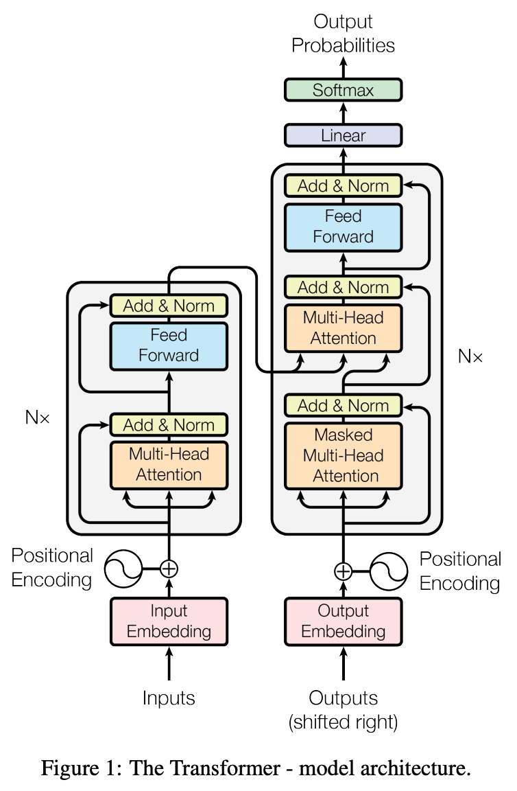
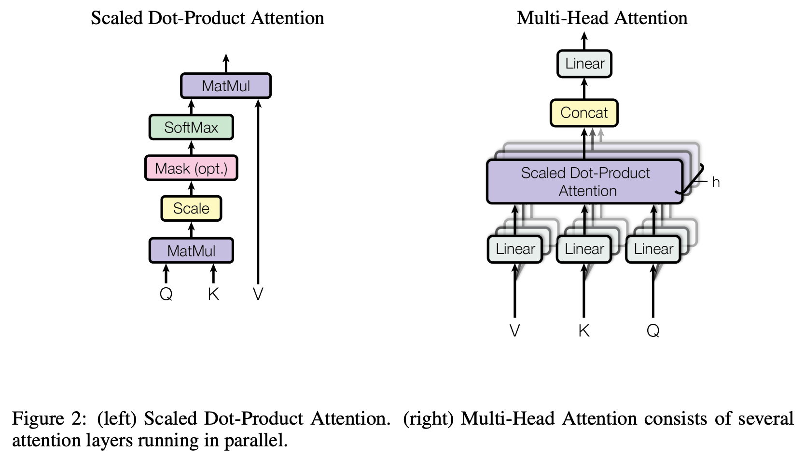
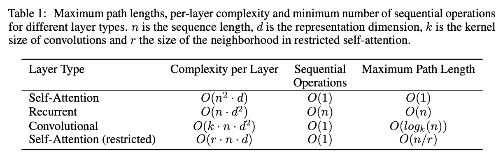

# 1 2017 Transformer

- [Full Version](./papers/01_Transformer.md)

## 3 Model Architecture

{width=400}

### 3.1 Encoder and Decoder Stacks

- The **encoder** maps an input sequence of symbol representations $(x_1, ..., x_n)$ to a sequence of continuous representations $z = (z_1, ..., z_n)$. 
- Given $z$, the **decoder** then generates an output sequence $(y_1, ..., y_m)$ of symbols one element at a time. 

- In addition to the two sub-layers in each encoder layer, **the decoder inserts a third sub-layer, which performs multi-head attention over the output of the encoder stack.** 
- **We also modify the self-attention sub-layer in the decoder stack to prevent positions from attending to subsequent positions.** 

### 3.2 Attention

- **The output is computed as a weighted sum of the values, where the weight assigned to each value is computed by a compatibility function of the query with the corresponding key.**

#### 3.2.1 Scaled Dot-Product Attention

- Queries and Keys: dim $d_k$, Values: dim $d_v$ 

$$ \text{Attention}(Q, K, V) = \text{softmax}(
{ Q K^T \over \sqrt{d_k} }) V $$

- we scale by $1 / \sqrt{d_k}$ because for large values of $d_k$, the dot products grow large in magnitude, pushing the `softmax` function into regions where it has extremely small gradients

#### 3.2.2 Multi-Head Attention

- In the Transformer, the **number of operations required to relate signals from two arbitrary input or output positions** is reduced to a constant, albeit **at the cost of reduced effective resolution due to averaging attention-weighted positions, an effect we counteract with Multi-Head Attention**
- Multi-head attention allows the model to jointly attend to information from different representation subspaces at different positions. With a single attention head, averaging inhibits this.

$$
\text{MultiHead}(Q, K, V ) = \text{Concat}(\text{head}_1, ..., \text{head}_h) W^O \\[5pt]
\text{where } \text{ head}_i = \text{Attention}(QW^Q_i, KW^K_i, V W^V_i)
$$

- Where the projections are parameter matrices with **shapes**: 
    - $W^Q_i, W^K_i \quad (d_\text{model}, d_k)$
    - $W^V_i \quad (d_\text{model}, d_v)$
    - $W^O \quad (h d_v, d_\text{model})$

- In this work we employ $h = 8$ parallel attention layers, or heads. For each of these we use $d_k = d_v = d_\text{model}/h = 64$. 

### 3.3 Position-wise Feed-Forward Networks

$$ \text{FFN}(x) = \text{ReLU}(x W_1 + b_1) W_2 + b_2 $$

### 3.5 Positional Encoding

$$
{2\pi \over \lambda} \equiv {1 \over 10000^{ 2i / d_\text{model} }} \\[5pt]
PE_{(pos, 2i)} = \sin({2\pi \over \lambda} pos) \\[5pt]
PE_{(pos, 2i+1)} = \cos({2\pi \over \lambda} pos)
$$

- where $pos$ is the position and $i$ is the dimension. 
    - That is, each dimension of the positional encoding corresponds to a sinusoid. 
    - The wavelengths form a geometric progression from $2\pi$ to $10000 \cdot 2\pi$. 
- We chose this function because we hypothesized it would allow the model to easily learn to attend by relative positions, since for any fixed offset $k$, $PE_{pos+k}$ can be represented as a linear function of $PE_{pos}$.
- We also experimented with using learned positional embeddings instead, and found that the two versions produced nearly identical results. We chose the sinusoidal version because it may allow the model to extrapolate to sequence lengths longer than the ones encountered during training.

## Upgrades

### 2021 RoPE: Rotary Positional Embeddings

- First introduced in the paper [RoFormer: Enhanced Transformer with Rotary Position Embedding (Su et al., 2021)](https://arxiv.org/pdf/2104.09864)
    - Represent a fundamental shift from adding positional information to **rotating** it within the attention mechanism 

- The Mathematical Core: Complex Rotation
    - The fundamental innovation of RoPE is that it encodes absolute position by applying a rotation to the query ($q$) and key ($k$) vectors in a way that their dot product depends only on the **relative distance** between them

- For a 2D vector $x = [x_1, x_2]^\top$, RoPE applies a rotation matrix $R_{\Theta, m}$ based on the token's position $m$:

$$ R_{\Theta, m} = \begin{pmatrix} \cos(m\theta) & -\sin(m\theta) \\ \sin(m\theta) & \cos(m\theta) \end{pmatrix} $$

- When applied to a query $q$ at position $m$ and a key $k$ at position $n$, the attention score (dot product) becomes:

$$ q_m^\top k_n = (R_{\Theta, m} q)^\top (R_{\Theta, n} k) = q^\top (R_{\Theta, m}^\top R_{\Theta, n}) k = q^\top R_{\Theta, n-m} k $$

- This mathematical identity proves that the model effectively ignores absolute position and focuses strictly on the relative distance $\Delta = n-m$

- High-Dimensional Implementation
    - In modern LLMs, the hidden dimension $d$ is broken into $d/2$ pairs of 2D subspaces. 
    - Each subspace $j$ is rotated at a different frequency $\theta_j$:
    
    $$\theta_j = 10000^{-2j/d} \qquad j \in \{0, 1, \dots, d/2 - 1\}$$
    
    - Low-index dimensions rotate quickly (fine-grained local position), while high-index dimensions rotate slowly (coarse long-range position)

- Scientific Properties & Benefits
    - **Long-Term Decay:** A critical property of RoPE is that as relative distance $|m-n|$ increases, the expected value of the dot product between query and key vectors naturally decreases. This mimics human language, where nearby words usually have more mutual relevance than distant ones
    - **Context Extrapolation:** Because RoPE uses a continuous functional form (sine/cosine) rather than a learned lookup table, it can handle sequence lengths (e.g., 128k or 1M tokens) that were never seen during the initial training phase
    - **Optimization Stability:** By isolating position into the attention mechanism rather than mixing it with semantic signal in the hidden state, RoPE prevents "positional memorization" and improves gradient flow in deep networks

### 2019 RMSNorm: Root Mean Square Layer Normalization

- The Timeline
    - [LayerNorm (2016)](https://arxiv.org/pdf/1607.06450): Proposed by Jimmy Lei Ba, et al. (University of Toronto). It was designed to solve the internal covariate shift in RNNs and later became the backbone of the 2017 Transformer.
    - [RMSNorm (2019)](https://arxiv.org/pdf/1910.07467): Proposed by Biao Zhang and Rico Sennrich. It gained massive popularity around 2023–2024 with the Llama series and is now the default for almost all high-performance LLMs in 2026.

- **LayerNorm (LN)**
    - LayerNorm centers the activations by subtracting the mean and then scales them by the standard deviation. For an input vector $x$ of dimension $d$:

    $$ \mu = \frac{1}{d} \sum_{i=1}^{d} x_i, \quad \sigma = \sqrt{\frac{1}{d} \sum_{i=1}^{d} (x_i - \mu)^2 + \epsilon} \\[5pt]
    \bar{x}_i = \frac{x_i - \mu}{\sigma } \cdot \gamma_i + \beta_i $$

    - **$\gamma$ (gain)** and **$\beta$ (bias)** are learnable parameters.
    - **The Cost:** Calculating $\mu$ requires a full pass over the data, and subtracting it requires another, making it computationally more "expensive" for hardware to parallelize.

- **RMSNorm**
    - The authors of RMSNorm hypothesized that the **re-centering** (subtracting the mean) wasn't actually providing the stability—it was the **re-scaling**. RMSNorm simplifies this by calculating only the Root Mean Square:

    $$ RMS(x) = \sqrt{\frac{1}{d} \sum_{i=1}^{d} x_i^2 + \epsilon} \\[5pt]
    \bar{x}_i = \frac{x_i}{RMS(x) } \cdot \gamma_i $$

    - **The Benefit:** Notice there is no $\mu$ and no $\beta$.
    - **The Efficiency:** It reduces the computational overhead by roughly **10–40%** per normalization layer because it bypasses the mean-offset calculation.

- The Science: Why it works
    - The primary goal of any normalization is to ensure that the "magnitude" of activations doesn't explode or vanish as they pass through dozens of layers.
    - **Invariant Scaling:** RMSNorm provides "re-scaling invariance." If the weights of a layer are scaled by a constant, the output remains normalized, which keeps the gradients stable.
    - **Simplified Geometry:** LayerNorm projects inputs onto a $d-1$ dimensional hyperplane (because of the mean subtraction) and then onto a sphere. RMSNorm simply projects them onto a $d$ dimensional sphere. In high-dimensional LLM space, that extra degree of freedom doesn't hurt performance; it actually helps speed up convergence.
    - **Hardware Friendliness:** In 2026, we optimize for **SRAM-to-Register** bandwidth. RMSNorm requires fewer intermediate variables to be stored in the GPU/TPU cache, allowing for faster "fused" kernels.

### 2020 SwiGLU: Swish-Gated Linear Unit

- Evolution of how models "filter" information:
    - **2017:** ReLU (The "Stone Age" - simple gating)
    - **2020:** GELU (The "Industrial Revolution" - smooth gating, used in GPT-3). [2016 Gaussian Error Linear Units](https://arxiv.org/pdf/1606.08415)
    - **2020-2023:** [SwiGLU](https://arxiv.org/pdf/2002.05202) (The "Modern Era" - introduced by Noam Shazeer; popularized by Llama and PaLM).
    - **2024-2026:** Variations like **dGated Linear Units** are common, but SwiGLU remains the core SOTA backbone for efficiency.

- GELU is a single-branch function:

    $$ \text{GELU}(x) = x \Phi(x) \approx x \cdot \sigma(1.702 \cdot x) $$

    - Where $\Phi(x) = P(X \le x)$ is the cumulative distribution function of the standard normal distribution. It essentially "weights" the input by how likely it is to be "active."

- The SwiGLU Upgrade:
    - SwiGLU is a **Gated Linear Unit (GLU)**. Instead of one linear transformation, it uses two in parallel, where one "gates" the other.
    
    $$ \text{SwiGLU}(x, W, V, b, c) = \text{Swish}_\beta(xW + b) \otimes (xV + c) $$

    - The symbol $\otimes$ denotes element-wise multiplication (Hadamard product).

- In modern SOTA implementations (where we drop the bias $b$ and $c$), the operation is:
    
    $$
    G = \text{SiLU}(xW_1) = (xW_1) \cdot \sigma(xW_1) \\[5pt]
    L = xW_3 \\[5pt]
    \text{output} = (G \otimes L) W_2
    $$

    - Old FFN: $x \xrightarrow{W_{up}} \text{GELU} \xrightarrow{W_{down}} \text{Output}$
    - SOTA FFN: $x \xrightarrow{W_1, W_3} (\text{SiLU}(xW_1) \otimes xW_3) \xrightarrow{W_2} \text{Output}$

- The Science: Why it Wins
    - The "Bilinear" Advantage: Standard activations like ReLU or GELU are fixed functions. SwiGLU is **bilinear**—the "gate" is learned. By having a dedicated weight matrix ($W_3$) for the value branch and another for the gate ($W_1$), the model can more surgically decide which dimensions of the hidden state should pass through.
    - Gradient Flow
        - **ReLU:** Has a "dead zone" for $x < 0$ where the gradient is exactly zero.
        - **GELU/Swish:** Are "stochastic-ish" smooth functions. They allow a small, negative gradient to flow, which helps with optimization.
        - **SwiGLU:** Because it’s a product of two learned projections, it creates a much more complex "loss landscape" that allows the model to learn sharper features during pre-training.
    - Parameter Efficiency
        - While SwiGLU uses **three** weight matrices ($W_1, W_2, W_3$) instead of the two used in standard Transformers, researchers found that the performance gain is so high that you can actually reduce the hidden dimension ($d_{ff}$) and still outperform a larger GELU-based model. 

| Feature | ReLU (2017) | GELU (2020) | SwiGLU (SOTA) |
| :--- | :--- | :--- | :--- |
| **Formula** | $\max(0, x)$ | $x P(X \le x)$ | $(\text{SiLU}(xW) \cdot xV)$ |
| **Shape** | Sharp kink at 0 | Smooth curve | Dynamic/Learned |
| **Gating** | Hard (On/Off) | Probabilistic | Learned Projection |
| **Compute Cost** | Lowest | Medium | High (Extra Matrix) |
| **SOTA Status** | Obsolete | Legacy (GPT-3/BERT) | **Standard (Llama/DeepSeek)** |

- Insight: SwiGLU as "Channel Attention"
    - **The core concept:** SwiGLU is to the **embedding dimension** (channels) what Attention is to the **sequence dimension** (tokens). While the Attention mechanism assigns a weight to each token in a sequence to determine "where" to look, **SwiGLU assigns a weight to each dimension of the embedding vector** to determine "what" signal is valid.
    - In a SOTA FFN (SwiGLU), we use a "neurons guarding neurons" approach:
        - **The Signal ($xW_3$):** A vector (a group of neurons) representing the raw candidate information.
        - **The Gate ($\text{SiLU}(xW_1)$):** Another vector (another group of neurons) that acts as the controller.
        - **The Interaction:** The Gate vector decides which specific neurons in the Signal group are "valid signals" for the current context via element-wise multiplication.
    - Why it’s superior to Old Tech (GELU/ReLU)
        - **Old Tech:** A neuron's validity was a lonely decision based only on its own value ($f(x)$).
        - **SwiGLU:** A neuron's validity is a **collaborative decision**. One group of neurons provides the content, while another provides the contextual filter, allowing for much more surgical "conditional logic" within the model's internal representations.
    - In 2026, this "Feature Gating" is why SwiGLU models feel significantly more "intelligent" and context-aware than the GPT-3 era models of the same parameter count.

### 2023 GQA: Grouped-Query Attention

- The Core Problem: The Memory Wall
    - In standard **Multi-Head Attention (MHA)**, every Query head has a corresponding Key and Value head. As context windows grow, the **KV Cache** (storing $K$ and $V$ for all tokens) becomes the primary memory bottleneck, often exceeding the model weights themselves.

- The Solution: 
    - **MHA (2017):** $H$ Query heads, $H$ Key heads, $H$ Value heads. (Highest quality, highest memory).
    - **MQA (2019):** $H$ Query heads, **1** Key head, **1** Value head. (Lowest memory, lower quality).
    - **GQA (2023-2026):** $H$ Query heads, **$G$** Key/Value heads (where $1 < G < H$).

- The Math:
    - **Grouping:** Divide $H$ Query heads into $G$ groups. Each group size is $S = H/G$.
    - **Shared Projection:** For each group $g \in \{1 \dots G\}$, all Queries $Q_{g,1} \dots Q_{g,S}$ share the same $K_g$ and $V_g$.
    - **Broadcasting:** During the attention score calculation:
    
    $$ \text{Attention}(Q_{g,s}, K_g, V_g) = \text{softmax}\left(\frac{Q_{g,s} K_g^T}{\sqrt{d_k}}\right) V_g $$
    
    - Mathematically, we **broadcast** (repeat) the $K$ and $V$ heads $S$ times to match the $Q$ count before the dot product.

### 2020 QK-Norm: Query-Key Normalization

- Background
    - Original idea from the 2020 paper [Query-Key Normalization for Transformers](https://arxiv.org/pdf/2010.04245)
    - Gained huge popularity in 2024–2025 in models like OLMo, Qwen, Llama variants, MiniMax, etc.
    - It's one of those "tiny change, massive impact" upgrades — basically mandatory now for stable large-scale training.

- In standard attention, the dot product $QK^T$ can grow very large as $d_{head}$ increases. Since `Softmax` is an exponential function, large input values lead to extreme "peaky" distributions where one token gets 99.9% of the attention. This "saturates" the gradients (making them near zero).

- **QK-Norm** changes the attention score calculation to:

$$ \text{Attention} = \text{Softmax}\left( \frac{\text{RMSNorm}(Q) \cdot \text{RMSNorm}(K)^T}{\sqrt{d_{head}}} \right) V $$

- By forcing the $Q$ and $K$ vectors to lie on a hypersphere (fixed radius) before the dot product, you ensure that the logit values remain within a predictable, stable range, regardless of how the weights are initialized or how much training has progressed.

- **The Science**
    - **Entropy Maintenance:** It prevents "entropy collapse," where the model becomes too certain about its attention early on and stops learning new relationships.
    - **Precision Stability:** In FP16 or BF16 training, exploding attention logits often cause numerical overflow (`Inf`). QK-Norm keeps values small, making it essential for low-precision 2026 training regimes.
    - **Magnitude/Direction Separation:** It forces the model to learn relationships based on the **angle** (semantic direction) between tokens rather than the raw **magnitude** of the activations.
