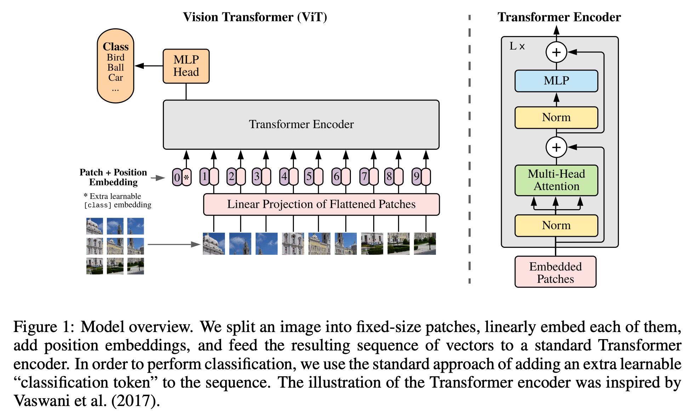
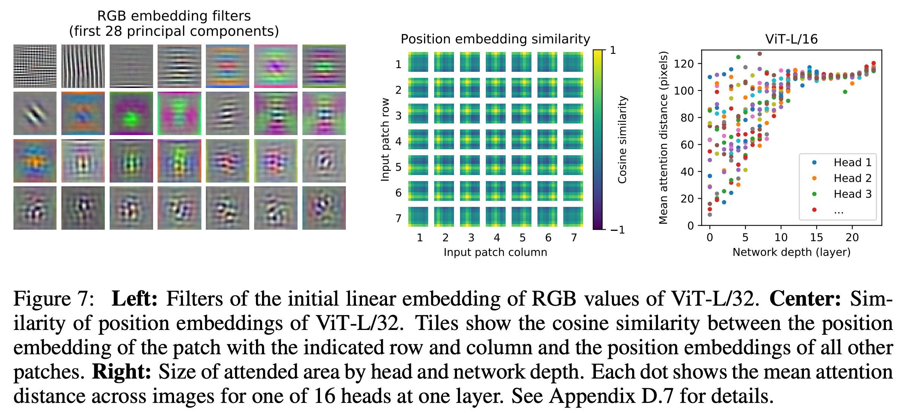
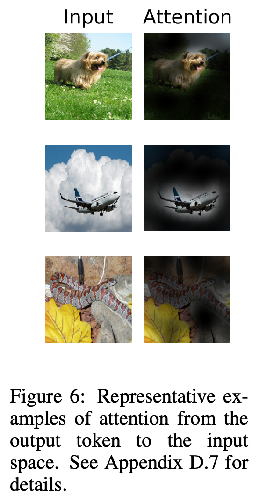

# 2 2020 ViT: Vision Transformer

- [Full Version](./papers/02_ViT_Vision_Transformer.md)

## 3 METHOD

- We apply a standard Transformer directly to images, **with the fewest possible modifications**. 
    - We split an image into patches and provide the sequence of linear embeddings of these patches as an input to a Transformer. 
    - Image patches are treated the same way as tokens (words) in an NLP application. 
    - We train the model on image classification in supervised fashion.

### 3.1 VISION TRANSFORMER (VIT)

$$\begin{align}
& z_0 = [x_\text{class}; x_p^1 E; x_p^2 E; ...; x_p^N E] + E_{pos}  
&& E \in R^{P^2 C \times D}, E_{pos} \in R^{(N+1) \times D} \\
& z'_l = \text{MSA}(\text{LN}(z_{l-1})) + z_{l-1} && l = 1...L \\
& z_l = \text{MLP}(\text{LN}(z'_l)) + z'_l && l = 1...L \\
& y = \text{LN}(z_L^0) &&
\end{align}$$

- To handle 2D images, we reshape the image $x \in R^{H \times W \times C}$ into a sequence of flattened 2D patches 
$x_p \in R^{N \times P^2 C}$, where $(H, W)$ is the resolution of the original image, $C$ is the number of channels, $(P, P)$ is the resolution of each image patch, and $N = H W / P^2$ is the resulting number of patches, which also serves as the effective input sequence length for the Transformer. 

- The Transformer uses constant latent vector size $D$ through all of its layers, so we flatten the patches and map to $D$ dimensions with a trainable linear projection (Eq. 1). We refer to the output of this projection as the **patch embeddings**.

- Similar to BERT’s [class] token, we prepend a learnable embedding to the sequence of embedded patches $(z_0^0 = x_\text{class})$, whose state at the output of the Transformer encoder $(z_L^0)$ serves as the
image representation $y$ (Eq. 4). Both during pre-training and fine-tuning, a classification head is attached to $z_L^0$. The classification head is implemented by a MLP with one hidden layer at pre-training time and by a single linear layer at fine-tuning time.

- Position embeddings are added to the patch embeddings to retain positional information. **We use standard learnable 1D position embeddings, since we have not observed significant performance gains from using more advanced 2D-aware position embeddings (Appendix D.4).** The resulting sequence of embedding vectors serves as input to the encoder. **The position embeddings at initialization time carry no information about the 2D positions of the patches and all spatial relations between the patches have to be learned from scratch.**

- The Transformer encoder (Vaswani et al., 2017) consists of alternating layers of multi-headed self-attention (MSA, see Appendix A) and MLP blocks (Eq. 2, 3). 
    - Layernorm (LN) is applied before every block, 
    - and residual connections after every block (Wang et al., 2019; Baevski & Auli, 2019).
    - The MLP contains two layers with a **GELU** non-linearity.

{width=200}
