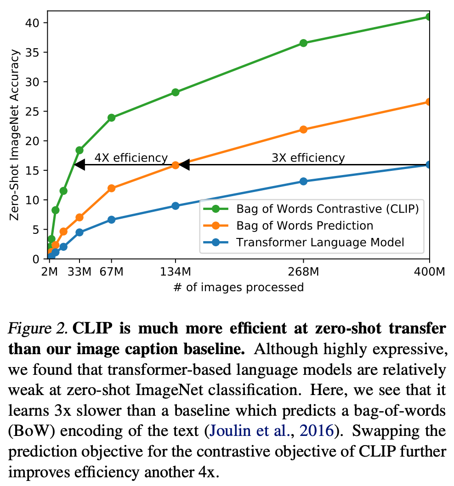
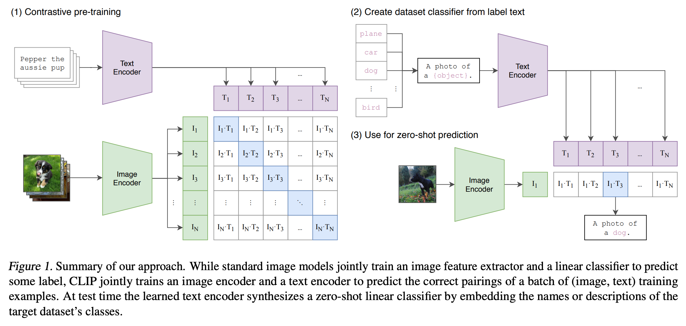

# 3 2021 CLIP: Contrastive Language Image Pretraining

- [Full Version](./papers/03_CLIP_Contrastive_Language_Image_Pretraining.md)

---

- SOTA computer vision systems are trained to predict a **fixed set of predetermined object categories**. 
- We demonstrate that the **simple pre-training** task of **predicting which caption goes with which image** is an efficient and scalable way to learn SOTA image representations from scratch on a dataset of 400 million (image, text) pairs collected from the internet. 

- Recent work in **contrastive representation learning** for images has found that **contrastive objectives** can learn better representations than their **equivalent predictive objective** (Tian et al., 2019). 

- Other work has found that **although generative models of images can learn high quality image representations, they require over an order of magnitude more compute than contrastive models with the same performance** (Chen et al., 2020a). 

- Noting these findings, we explored training a system to solve the potentially easier **proxy task of predicting only which text as a whole is paired with which image and not the exact words of that text.** 

{width=400}



- **Given a batch of $N$ (image, text) pairs, CLIP is trained to predict which of the $N \times N$ possible (image, text) pairings across a batch actually occurred.** 
    - To do this, CLIP learns a **multi-modal embedding space** by jointly training an image encoder and text encoder to 
        - **maximize the cosine similarity of the image and text embeddings of the $N$ real pairs in the batch** while 
        - **minimizing the cosine similarity of the embeddings of the $N^2 − N$ incorrect pairings.** 
    - **We optimize a symmetric cross entropy loss over these similarity scores.** 

```python
# Figure 3. Numpy-like pseudocode for the core of an implementation of CLIP.
# image_encoder - ResNet or Vision Transformer
# text_encoder - CBOW or Text Transformer
# I[n, h, w, c] - minibatch of aligned images
# T[n, l] - minibatch of aligned texts
# W_i[d_i, d_e] - learned proj of image to embed
# W_t[d_t, d_e] - learned proj of text to embed
# t - learned temperature parameter

# extract feature representations of each modality
I_f = image_encoder(I) #[n, d_i]
T_f = text_encoder(T) #[n, d_t]

# joint multimodal embedding [n, d_e]
I_e = l2_normalize(np.dot(I_f, W_i), axis=1)
T_e = l2_normalize(np.dot(T_f, W_t), axis=1)

# scaled pairwise cosine similarities [n, n]
logits = np.dot(I_e, T_e.T) * np.exp(t)

# symmetric loss function
labels = np.arange(n)
loss_i = cross_entropy_loss(logits, labels, axis=0)
loss_t = cross_entropy_loss(logits, labels, axis=1)
loss = (loss_i + loss_t)/2
```

- In Figure 3 we include pseudocode of the core of an implementation of CLIP. 
    - To our knowledge this batch construction technique and objective was first introduced in the area of deep metric learning as the **multi-class N-pair loss** Sohn (2016), was popularized for contrastive representation learning by Oord et al. (2018) as the **InfoNCE loss**, and was recently adapted for contrastive (text, image) representation learning in the domain of medical imaging by Zhang et al. (2020).

---

## 1. Setting up the Embeddings

Let's say we have a batch of $N$ pairs of (image, text).

1. **Image Matrix ($I$):** The image encoder processes the $N$ images and outputs a matrix of visual embeddings, $I \in \mathbb{R}^{N \times d}$, where $d$ is the embedding dimension.
2. **Text Matrix ($T$):** The text encoder processes the $N$ captions and outputs a matrix of textual embeddings, $T \in \mathbb{R}^{N \times d}$.

Before doing anything else, CLIP **normalizes** these vectors to have a length of 1 (L2 normalization), which means calculating their similarity is as simple as taking a dot product.

## 2. The Similarity Matrix

CLIP computes the cosine similarity between every image and every text description in the batch by multiplying the matrices:

$$A = I \cdot T^T$$

This results in an $N \times N$ matrix $A$, where the entry $A_{i,j}$ represents the similarity score between image $i$ and text $j$.

* **The Diagonal ($i = j$):** These are the *correct* pairs (e.g., Image 1 matched with Text 1). We want these scores to be as **high** as possible.
* **The Off-Diagonal ($i \neq j$):** These are the *incorrect* pairs (e.g., Image 1 matched with Text 2). We want these scores to be as **low** as possible.

To control how sharp or smooth the model's predictions are, CLIP multiplies this matrix by a learnable temperature parameter, $e^\tau$.

## 3. The Loss Function (InfoNCE)

CLIP minimizes the loss across two directions simultaneously: **Image-to-Text** classification and **Text-to-Image** classification. It uses a standard Cross-Entropy loss on both rows and columns.

### Image-to-Text Loss (Row-wise)

For a specific image $i$, the probability that it matches text $j$ is calculated using a softmax function over the row:

$$P(T_j \mid I_i) = \frac{\exp(A_{i,j} \cdot e^\tau)}{\sum_{k=1}^N \exp(A_{i,k} \cdot e^\tau)}$$

The loss for this row is the negative log-likelihood of picking the correct text ($i=j$):

$$\mathcal{L}_{\text{img2txt}} = -\frac{1}{N} \sum_{i=1}^N \log \left( \frac{\exp(A_{i,i} \cdot e^\tau)}{\sum_{k=1}^N \exp(A_{i,k} \cdot e^\tau)} \right)$$

### Text-to-Image Loss (Column-wise)

Similarly, for a specific text $j$, the loss for finding the right image over the column is:

$$\mathcal{L}_{\text{txt2img}} = -\frac{1}{N} \sum_{j=1}^N \log \left( \frac{\exp(A_{j,j} \cdot e^\tau)}{\sum_{k=1}^N \exp(A_{k,j} \cdot e^\tau)} \right)$$

### Total symmetric loss

The final loss that CLIP minimizes via gradient descent is the average of these two directional losses:

$$\mathcal{L}_{\text{total}} = \frac{\mathcal{L}_{\text{img2txt}} + \mathcal{L}_{\text{txt2img}}}{2}$$
