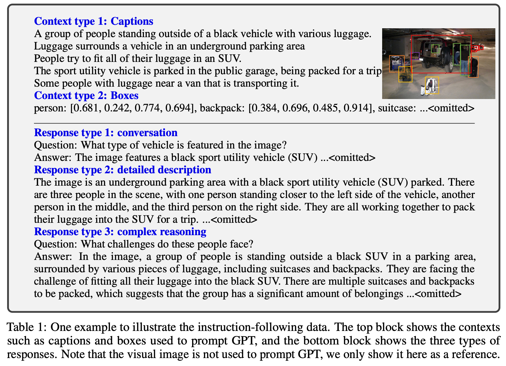
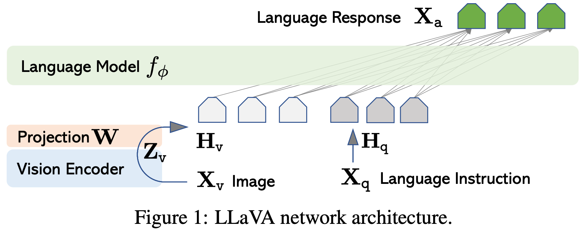
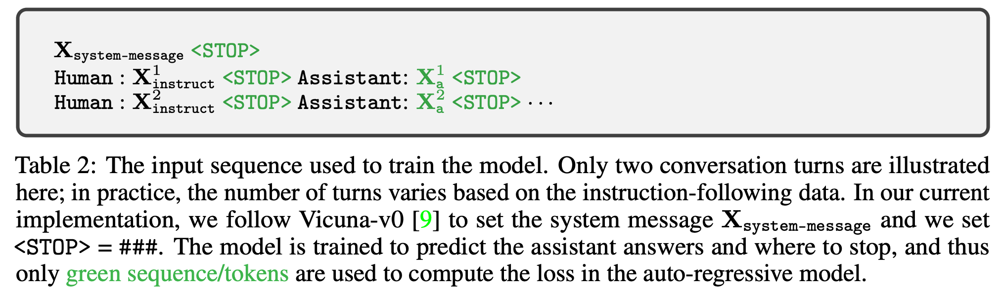

# 4 2023 LLaVA: Large Language and Vision Assistant

- [Full Version](./papers/04_LLaVA_Large_Language_and_Vision_Assistant.md)

## 3 GPT-assisted Visual Instruction Data Generation

- **We use GPT-4 for instruction-following data collection, based on the widely existing image-pair data.**
    - For an image $X_v$ and its associated caption $X_c$, it is natural to create a set of questions $X_q$ with the intent to instruct the assistant to describe the image content. **We prompt GPT-4 to curate such a list of questions** (see details in Appendix). 
    - Therefore, a simple way to **expand an image-text pair to its instruction-following version** is $\text{Human: } X_q \; X_v \text{ <STOP> Assistant: } X_c \text{ <STOP>}$. 
    - **in order to encode an image into its visual features to prompt a text-only GPT**, we use two types of symbolic representations: 
        - Captions typically describe the visual scene from various perspectives;
        - **Bounding boxes** usually localize the objects in the scene, and each box encodes the object concept and its spatial location. 

## 4 Visual Instruction Tuning

### 4.1 Architecture

- The primary goal is to effectively leverage the capabilities of both the **pre-trained LLM and visual model.** 
    - We choose **[Vicuna](https://github.com/lm-sys/FastChat) as our LLM** $f_{\phi}(\cdot)$ parameterized by $\phi$, as it has the best instruction following capabilities in language tasks among publicly available checkpoints.
    - For an input image $X_v$, we consider the pre-trained **CLIP visual encoder ViT-L/14**, which provides the visual feature $Z_v = g(X_v)$. 
    
- We apply a trainable projection matrix $W$ to convert $Z_v$ into language embedding tokens $H_v$, which have the same dimensionality as the word embedding space in the language model:

$$
H_v = W \cdot Z_v, \text{ with } Z_v = g(X_v)
$$

## 4.2 Training

- For each image $X_v$, we generate multi-turn conversation data $(X_q^1, X_a^1, ... , X_q^T, X_a^T)$, where $T$ is the total number of turns. 
- We organize them as a sequence, by treating all answers as the assistant’s response, and the instruction $X_\text{instruct}^t$ at the $t$-th turn as:

$$
X_\text{instruct}^t = \begin{cases}
\text{Randomly choose } [X_q^1, X_v] \text{ or } [X_v, X_q^1] & t = 1 \\ 
X_q^t & t > 1
\end{cases}
$$

- This leads to the unified format for the multimodal instruction-following sequence illustrated in Table 2. 

- We perform instruction-tuning of the LLM on the prediction tokens, using its original auto-regressive training objective. Specifically, for a sequence of length $L$, we compute the probability of the target answers $X_a$ by:

$$
p(X_a | X_v, X_\text{instruct}) = \prod_{i=1}^L 
p_\theta (x_i | X_v, X_{\text{instruct},<i}, X_{a,<i})
$$

- where $\theta$ is the trainable parameters, $X_{\text{instruct},<i}$ and $X_{a,<i}$ are the instruction and answer tokens in all turns before the current prediction token $x_i$, respectively. 

- For the conditionals in the equation above, we explicitly add $X_v$ to emphasize the fact that the image is grounded for all answers, and we omit $X_\text{system-message}$ and all previous `<STOP>` for better readability. 

- Stage 1: Pre-training for Feature Alignment. 
    - To strike a balance between concept coverage and training efficiency, we filter CC3M to 595K image-text pairs. 
    - These pairs are converted to the instruction-following data using the naive expansion method describe in Section 3. 
    - Each sample can be treated as a single-turn conversation. 
    - To construct the input $X_\text{instruct}$, for an image $X_v$, a question $X_q$ is randomly sampled, which is a language instruction to request the assistant to describe the image briefly. 
    - The ground-truth prediction answer $X_a$ is the original caption. 
    - **In training, we keep both the visual encoder and LLM weights frozen**, and maximize the likelihood of $p(X_a | X_v, X_\text{instruct})$ with trainable parameters $\theta = W$ (the projection matrix) only. 
    - **In this way, the image features $H_v$ can be aligned with the pre-trained LLM word embedding. This stage can be understood as training a compatible visual tokenizer for the frozen LLM.**

- Stage 2: Fine-tuning End-to-End. 
    - We always keep the visual encoder weights frozen, and continue to update both the pre-trained weights of the projection layer and LLM in LLaVA; i.e., the trainable parameters are $\theta = \{ W, \phi \}$. 
    - We consider two specific use case scenarios:
        - Multimodal Chatbot. We develop a Chatbot by fine-tuning on the 158K language-image instruction-following data in Section 3. Among the three types of responses, conversation is multi-turn while the other two are single-turn. They are uniformly sampled in training.
        - Science QA. We study our method on the ScienceQA benchmark, the first large-scale multimodal science question dataset that annotates the answers with detailed lectures and explanations. Each question is provided a context in the form of natural language or an image. The assistant provides the reasoning process in natural language and selects the answer among multiple choices. For training, we organize the data as a single turn conversation, the question & context as $X_\text{instruct}$, and reasoning & answer as $X_a$.
