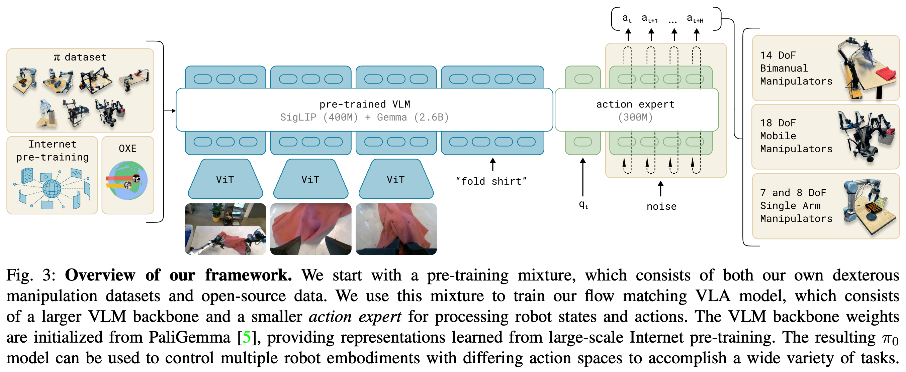

# 1 2024 $\pi_0$

- [$\pi_0$: A Vision-Language-Action Flow Model for General Robot Control](https://arxiv.org/pdf/2410.24164)

## Abstract

- Robot learning holds tremendous promise to unlock the full potential of flexible, general, and dexterous robot systems, as well as to address some of the deepest questions in artificial intelligence. 
    - However, bringing robot learning to the level of generality required for effective real-world systems faces major obstacles in terms of data, generalization, and robustness. 
    - In this paper, we discuss how generalist robot policies (i.e., robot foundation models) can address these challenges, and how we can design effective generalist robot policies for complex and highly dexterous tasks. 
    - We propose a novel **flow matching** architecture built on top of a **pre-trained vision-language model (VLM)** to inherit Internet-scale semantic knowledge. 
    - We then discuss how this model can be trained on a large and diverse dataset from multiple dexterous robot platforms, including single-arm robots, dual-arm robots, and mobile manipulators. 
    - We evaluate our model in terms of its ability to perform tasks via direct prompting, follow language instructions from people and from a high-level VLM policy, and its ability to acquire new skills via fine-tuning. 
    - Our results cover a wide variety of tasks, such as laundry folding, table cleaning, and assembling boxes.

## I. INTRODUCTION

> - A human being should be able to change a diaper, plan an invasion, butcher a hog, conn a ship, design a building, write a sonnet, balance accounts, build a wall, set a bone, comfort the dying, take orders, give orders, cooperate, act alone, solve equations, analyze a new problem, pitch manure, program a computer, cook a tasty meal, fight efficiently, die gallantly.
> - Specialization is for insects.
> - Robert A. Heinlein, Time Enough for Love

- Artificial intelligence systems come in all shapes and sizes, from highly specialized systems that solve complex problems inaccessible to the human mind, such as predicting the conformation of a protein, to systems that can produce lifelike high-resolution images or videos based on textual prompts. 
    - However, the axis along which human intelligence most outpaces machine intelligence is versatility: the ability to solve diverse tasks situated in varied physical environments, while responding intelligently to environmental constraints, language commands, and unexpected perturbations. 
    - Perhaps the most tangible progress toward this kind of versatility in AI can be seen in large language- and vision-language models: systems that are pre-trained on large and very diverse corpora of images and text from the web, and then fine-tuned (“aligned”) using more carefully curated datasets meant to induce the desired pattern of behavior and responsiveness. 
    - While such models have been shown to exhibit broad instruction-following and problem-solving abilities, they are not truly situated in a physical world the way that people are, and their understanding of physical interaction is based entirely on abstract descriptions. 
    - If such methods are to make tangible progress toward AI systems that exhibit the kind of physically situated versatility that people possess, we will need to train them on physically situated data — that is, data from embodied robot agents.

- Flexible and general-purpose models that can be tasked to perform a variety of robot behaviors have tremendous practical ramifications, but they may also offer solutions to some of the toughest challenges facing robot learning today, such as availability of data, generalization, and robustness. 
    - In natural language and computer vision, general-purpose foundation models that are pre-trained on diverse multi-task data tend to outperform narrowly tailored and specialized solutions. 
    - For example, if the goal is to recognize birds in photographs, it is likely more expedient to pre-train on many different image-language associations and then fine-tune or prompt for the bird recognition task, than it is to train on only bird recognition data. 
    - Similarly, we may find that for effective specialized robot systems, it is more effective to first pre-train on highly diverse robot data, and then fine-tune or prompt for the desired task. 
    - This can resolve the data scarcity challenge, because many more sources of data are available to a generalist model — including data from other tasks, other robots, or even non-robot sources — and it may resolve robustness and generalization challenges, because the diverse data exhibits a greater coverage of observations and actions, providing a variety of scenes, corrections, and recovery behaviors that might not be present in more narrow specialized data. 
    - Thus, adopting a large-scale pre-training approach to robot learning has the potential to address many of the field’s challenges and make practical learning-enabled robots a reality, while at the same time furthering our understanding of the deepest problems in artificial intelligence.

- However, developing such generalist robot policies — i.e., robot foundation models — involves a number of major challenges. 
    - First, any such research must be done at a very large scale, because the full benefits of large-scale pre-training are often not present at smaller scales. 
    - Second, it requires developing the right model architectures that can effectively make use of diverse data sources, while at the same time being able to represent the intricate and subtle behaviors necessary to interact with complex physical scenes. 
    - Third, it requires the right training recipe. This is perhaps the most important ingredient, as much of the recent progress with large models in NLP and computer vision has relied heavily on delicate strategies for curating pre-training and post-training data.

- In this paper, we present a prototype model and learning framework, which we call $\pi_0$, that illustrates how each of these three bottlenecks could be tackled. 
    - We illustrate our model and system in Figure 1. 
    - To incorporate diverse data sources, we begin by utilizing a pre-trained vision-language model (VLM) to import Internet-scale experience. 
    - By basing our model on a VLM, we inherit the general knowledge, semantic reasoning, and problem-solving abilities of language-and vision-language models. 
    - We then further train our model to incorporate robot actions, turning it into a vision-language-action (VLA) model. 
    - In order to make it feasible to utilize a variety of diverse robot data sources, we employ **cross-embodiment training**, where data from many robot types is combined into the same model. 
        - These different robot types have different configuration spaces and action representations, including single and dual-arm systems, as well as mobile manipulators. 
    - Additionally, in order to make it possible to perform highly dexterous and intricate physical tasks, we use an **action chunking** architecture with **flow matching** (a variant of diffusion) to represent complex continuous action distributions. 
    - This enables our model to control robots at frequencies of up to **50 Hz** for dexterous tasks such as laundry folding (see Figure 1). 
    - To combine flow matching with VLMs, we use a novel action expert that augments the standard VLM with flow-based outputs.

- As with language models, the architecture of our model is only part of our method. 
    - In order to flexibly and robustly perform complex tasks, we need the right training recipe.
    - Our recipe mirrors the pre-training/post-training separation commonly seen in exa-scale language- and image-language models, where the model is first pre-trained on a very large and diverse corpus, and then fine-tuned on more narrow and more carefully curated data to induce the desired pattern of behavior — in our case, dexterity, efficiency, and robustness.
    - Intuitively, training only on high-quality data does not teach the model how to recover from mistakes, since mistakes are rarely seen in such data. 
    - Training on only lower-quality pretraining data does not teach the model to act efficiently and robustly. 
    - Combining both provides the desired behavior: the model attempts insofar as possible to act in a manner similar to the high-quality data, but still has a repertoire of recoveries and corrections that it can deploy in the case of a mistake.

- The contributions of our work consist of a novel generalist robot policy architecture based on VLM pre-training and flow matching, and an empirical investigation of pre-training/post-training recipes for such robot foundation models. 
    - We evaluate our model out of the box with language commands, with fine-tuning to downstream tasks, and in combination with a high-level semantic policy that outputs intermediate language commands to perform complex and temporally extended tasks.
    - While our model and system make use of a variety of ideas presented in recent work, the combination of ingredients is novel, and the empirical evaluation demonstrates a level of dexterity and generality that goes significantly beyond previously demonstrated robot foundation models. 
    - We evaluate our approach by pre-training on over 10,000 hours of robot data, and fine-tuning to a variety of dexterous tasks, including laundry folding (see Figure 2), clearing a table, putting dishes in a microwave, stacking eggs into a carton, assembling a box, and bagging groceries.

## II. RELATED WORK

- Our work builds on recently proposed methods in large-scale robot learning, as well as multimodal language models.
    - Our work is most closely related to recently proposed vision-language-action (VLA) models, which use pre-trained VLMs that are fine-tuned for robot control. 
    - Such models employ **autoregressive discretization to represent actions in a manner analogous to text tokens.** 
    - In contrast, our model employs a novel design that fine-tunes a VLM to produce actions via flow matching, a variant of diffusion.
    - This allows us to handle high-frequency action chunks (up to 50 Hz) and highly dexterous tasks, which we show pose a major challenge for prior autoregressive VLAs. 
    - This resembles a number of recent works on diffusion models for action generation. 
        - In contrast to these works, our model uses a pre-trained VLM backbone. 
    - Our contribution is also fundamentally integrative, focusing on a framework for robot foundation models, including not only the model architecture itself but also a pre-training recipe, pre-training and post-training phases, and a range of real-world experiments.

- Outside of robot control, many models have been proposed that combine pre-trained language models with diffusion, including models that specifically hybridize diffusion and autoregressive large language models. 
    - Such models are typically concerned with **image generation**, but our action generation model builds on a number of previously proposed concepts. 
    - Like Zhou et al., we train our model via a diffusion-style (flow matching) loss applied on individual sequence elements, in lieu of the standard cross-entropy loss for decoder-only transformers. 
    - Like Liu et al., we use a separate set of weights for the tokens corresponding to diffusion. 
    - **Incorporating these concepts into a VLA model, we introduce what to our knowledge is the first flow matching VLA that produces high-frequency action chunks for dexterous control.**

- Our work also builds on a rich history of prior works on large-scale robot learning. 
    - Early work in this area often utilized self-supervised or autonomous data collection, providing a tractable data source for simple tasks such as grasping or pushing, but without the complexity of more dexterous behaviors. 
    - More recently, a number of high-quality datasets have been collected for robot control that enable broad generalization, but typically for simpler tasks that consist of object relocation and rudimentary furniture manipulation (e.g., drawer opening). 
    - More dexterous tasks have been studied at a smaller scale, typically with 10s or 100s of training trajectories, equivalent to 10 or less hours. 
    - Since one of our aims is to study complex and dexterous behaviors, we utilize a much larger dataset, with about 10,000 hours of demonstrations, complemented by the open-source [OXE dataset](https://github.com/google-deepmind/open_x_embodiment). 
    - To our knowledge, this represents by far the largest robot learning experiment in terms of the amount of robot data. 
    - At this scale, we show that a more sophisticated pre-training/post-training recipe is highly effective — analogously to the recipes used for large language models, a pre-training phase endows our model with a broad base of knowledge, which is then refined in a post-training phase with higher-quality curated data to achieve the desired behavior.

- The complexity of the tasks we illustrate goes significantly beyond prior work. 
    - While recent work has illustrated a number of more complex and dexterous behaviors, such as tying shoelaces or cooking shrimp, we show that our framework can learn very long tasks, sometimes tens of minutes in length, for behaviors that combine both physical dexterity and combinatorial complexity. 
    - For example, our laundry folding task requires the robot to manipulate a variety of clothing items that can start in any configuration, and fold multiple items in sequence. 
    - Our table bussing task requires discerning the class of novel objects (trash or dishes). 
    - We show that a single cross-embodiment model can be used as the base model for these tasks. 
    - **To our knowledge, our work demonstrates the longest dexterous tasks in the end-to-end robot learning literature.**

## III. OVERVIEW

- We provide an outline of our model and training procedure in Figure 3. 

- In our training framework, we first assemble a pre-training mixture consisting of a weighted combination of our own dexterous manipulation datasets (Section V-C), collected on 7 different robot configurations for 68 different tasks, and the entire OXE dataset, which contains data from 22 robots. 
    - The pre-training phase (Section V-A) also uses diverse language labels, combining task names and segment annotations (fine-grained labels for sub-trajectories, typically about 2 seconds in length). 
    - The purpose of the pre-training phase is to train a base model that exhibits broad capabilities and generalization, but is not necessarily specialized for high performance on any one task. 
    - This base model can follow language commands and perform a variety of tasks at rudimentary proficiency. 
    - For complex and dexterous tasks, we then employ a post-training procedure (Section V-A), which uses high-quality curated data to adapt the model to specific downstream tasks. 
    - We study both efficient post-training with small to moderate amounts of data, and high-quality post-training with larger datasets for complex tasks such as laundry folding and mobile manipulation.

- Our model, which we describe in Section IV, is based on the **PaliGemma vision-language model**, which we then further train with our data mixture. 
    - To turn the base PaliGemma VLM into $\pi_0$, we add action outputs that use flow matching to generate continuous action distributions. 
    - We describe this design in detail in the following section. 
    - Note that we use PaliGemma for convenience and because of its comparatively small size (which is useful for real-time control), but our framework is compatible with any base pre-trained VLM.

## IV. THE $\pi_0$ MODEL

- In this paper, we use the word “token” to refer to **an input/output slot along the sequence dimension**, whether the slot corresponds to 
    - a discrete variable (e.g., a language token) or 
    - a continuous variable (e.g., an image patch or a robot action).

- The $\pi_0$ model, illustrated in Figure 3, consists primarily of a language model transformer backbone. 
    - **Following the standard late fusion VLM recipe, image encoders embed the robot’s image observations into the same embedding space as language tokens.** 
    - We further augment this backbone with robotics-specific inputs and outputs — namely, **proprioceptive state** and **robot actions.** 
    - $\pi_0$ uses conditional flow matching to model the continuous distribution of actions. 
    - Flow matching provides our model with high precision and multimodal modeling capability, making it especially well suited to high-frequency dexterous tasks. 
    - Our architecture is inspired by **Transfusion**, which trains a single transformer using multiple objectives, with 
        - tokens corresponding to **continuous** outputs supervised via a **flow matching loss** and 
        - tokens corresponding to **discrete** outputs supervised via a **cross-entropy loss.** 
    - Building on Transfusion, we additionally found that using a separate set of weights for the robotics-specific (action and state) tokens led to an improvement in performance. 
    - This design is analogous to a **mixture of experts** with two mixture elements, where 
        - the first element is used for image and text inputs, and 
        - the second is used for robotics-specific inputs and outputs. 
    - We refer to the second set of weights as the action expert.

- Formally, we want to model the data distribution $p(A_t|o_t)$, where $A_t = [a_t, a_{t+1}, ..., a_{t+H−1}]$ corresponds to an action chunk of future actions (we use $H = 50$ for our tasks). 
    - observation: $o_t = [I_t^1, ..., I_t^n, l_t, q_t]$, 
        - **multiple RGB images**: $I_t^i$ is $i$-th image (with 2 or 3 images per robot), 
        - **language command**: $l_t$ is a sequence of language tokens, 
        - **proprioceptive state**: $q_t$ is a vector of joint angles. 
    - **The images $I_t^i$ and state $q_t$ are encoded via corresponding encoders and then projected via a linear projection layer into the same embedding space as the language tokens.**

- For each action $a_{t'}$ in the action chunk $A_t$, we have a corresponding action token that we feed through the action expert. 
    - During training, we supervise these action tokens using a conditional flow matching loss,

$$ L^\tau(\theta) = \mathbb{E}_{ p(A_t|o_t), \; q(A_t^\tau|A_t) } \| v_\theta(A_t^\tau, o_t) - u(A_t^\tau |A_t) \|^2  $$

- where subscripts denote robot timesteps and superscripts denote flow matching timesteps, with $\tau \in [0, 1]$. 
    - Recent work in high-resolution image and video synthesis has shown that flow matching can achieve strong empirical performance when combined with a simple linear-Gaussian (or optimal transport) probability path, given by $q(A_t^\tau|A_t) = \mathcal{N}(\tau A_t, (1 − \tau) \mathbf{I})$
    - In practice, the network is trained by 
        - sampling random noise $\epsilon \sim \mathcal{N}(0, \mathbf{I})$
        - computing the “noisy actions” $A_t^\tau = \tau A_t + (1 − \tau)\epsilon$
        - training the network outputs $v_\theta(A_t^\tau, o_t)$ to match the denoising vector field $u(A_t^\tau|A_t) = A_t − \epsilon$
    - **The action expert uses a full bidirectional attention mask, so that all action tokens attend to each other.** 
    - During training, we sample the flow matching timestep $\tau$ from a **beta distribution** that emphasizes lower (noisier) timesteps. 
    - See Appendix B for more details.

- At **inference time**, we generate actions by integrating the learned vector field from $\tau = 0$ to $\tau = 1$, starting with random noise $A_t^0 \sim \mathcal{N}(0, \mathbf{I})$. We use the forward **Euler integration** rule:

$$ A_t^{\tau+dt} = A_t^\tau + v_\theta(A_t^\tau, o_t) \cdot dt $$

- where $dt$ is the integration step size. 
    - We use $10$ integration steps (corresponding to $dt = 0.1$) in our experiments. 
    - Note that inference can be implemented efficiently by caching the attention keys and values for the prefix $o_t$ and only recomputing the suffix corresponding to the action tokens for each integration step. 
    - We provide more details regarding the inference procedure, including the inference time for each part of the model, in Appendix D.

- While in principle our model can be initialized from scratch or fine-tuned from any VLM backbone, in practice we use PaliGemma as our base model. 
    - PaliGemma is an open-source **3 billion** parameter VLM that offers a convenient tradeoff between size and performance. 
    - We add **300M** parameters for the **action expert** (which is initialized from scratch) for a total of 3.3 billion parameters. 
    - We provide a full description of the model architecture in Appendix B.

- **Non-VLM baseline model.** 
    - In addition to our main VLA model, we also trained a similar baseline model that did not use a VLM initialization for ablation experiments. 
    - This model, which we refer to as $\pi_0$-small, has **470M** parameters, does not use VLM initialization, and has a number of small differences that we found to be helpful for training on our data without VLM initialization, which are summarized in Appendix C.
    - This model is used in our comparisons to evaluate the benefits of incorporating VLM pertaining.

## V. DATA COLLECTION AND TRAINING RECIPE

- Broadly capable robot foundation models require not only an expressive and powerful architecture, but also the right dataset and, more importantly, the right training recipe. 
    - In the same way that LLM training is typically divided into pre-training and post-training phases, we employ a multistage training procedure for our model. 
    - The goal of the pretraining phase is to expose the model to a diverse range of tasks so that it can acquire broadly applicable and general physical capabilities, while the goal of the post-training phase is to provide the model with the ability to skillfully and fluently execute the desired downstream task. 
    - Because of this, the requirements for the pre-training and post-training datasets are distinct: 
        - the pre-training dataset should cover as many tasks as possible, and within each of those tasks should cover a diversity of behaviors. 
        - The post-training dataset should instead cover behaviors that are conducive to effective task execution, which should exhibit a consistent and fluent strategy. 
    - Intuitively, the diverse (but lower quality) pre-training data allows the model to recover from mistakes and handle highly varied situations, which might not otherwise occur in the high-quality post-training data, while the post-training data teaches the model to perform the task well.

### A. Pre-training and post-training

- We provide an overview of our pre-training mixture in Figure 4. 
    - Since each training example corresponds to a timestep — i.e., a tuple $(o_t, A_t)$, — we will quantify data in terms of timesteps in this discussion. 
    - 9.1% of the training mixture consists of open-source datasets, including OXE, Bridge v2, and DROID. 
    - The robots and tasks in these datasets typically have one or two cameras and use low-frequency control, between 2 and 10 Hz. 
    - However, these datasets cover a wide range of objects and environments. 
    - To learn dexterous and more complex tasks, we also use 903M timesteps of data from our own datasets, where 106M steps are from single-arm robots and 797M are from dual-arm robots.
    - This data has 68 tasks, where each task is composed of complex behaviors — e.g., the “bussing” task involves putting a wide range of different dishes, cups, and utensils into a bussing bin, and a wide array of trash items into the garbage.
    - Note that this definition of task is significantly different from prior work, which typically uses any combination of noun and verb (e.g., “pick up the cup” vs. “pick up the plate”) to constitute a distinct task. 
    - Therefore, the actual range of behaviors in our dataset is significantly broader than this number of “tasks” would imply. 
    - We discuss the specific robots and tasks in our dataset in more detail in Section V-C.

- Since the datasets are somewhat imbalanced in size (e.g., the more difficult laundry folding tasks are overrepresented), we weight each task-robot combination by $n^{0.43}$, where $n$ is the number of samples for that combination, such that over-represented combinations are down-weighted. 
    - The configuration vector $q_t$ and action vectors $a_t$ always have the dimensionality of the largest robot in the dataset (18 in our case, to accommodate two 6-DoF arms, 2 grippers, a mobile base, and a vertically actuated torso). 
    - **For robots with lower-dimensional configuration and action spaces, we zero-pad the configuration and action vectors.** 
    - **For robots with fewer than three images, we also mask out the missing image slots.**

- In the post-training phase, we fine-tune our model with a smaller task-specific dataset to specialize it to particular downstream applications. 
    - As mentioned previously, our definition of “task” is fairly broad — e.g., the “bussing” task requires manipulating a wide range of different objects. 
    - Different tasks require very different datasets, with the simplest of the tasks necessitating only 5 hours and the most complex tasks using 100 or more hours of data.

### B. Language and high-level policies

- More complex tasks that require semantic reasoning and high-level strategy, such as table bussing, can also benefit from a high-level policy that decomposes high-level tasks (such as “bus the table”) into more immediate subtasks (such as “pick up the napkin” or “throw the napkin into the trash”). 
    - Since our model is trained to process language inputs, **we can use a high-level VLM to make these semantic inferences, a method that is analogous to LLM/VLM planning methods such as SayCan.** 
    - We use such a high-level policy to assist our model with high-level strategy for several of our experimental tasks, as we will discuss in Section VI.

### C. Robot system details

## VI. EXPERIMENTAL EVALUATION

### A. Evaluating the base model

### B. Following language commands

### C. Learning new dexterous tasks

### D. Mastering complex multi-stage tasks

## VII. DISCUSSION, LIMITATIONS, AND FUTURE WORK

- We presented a framework for training a robot foundation model, which we refer to as $\pi_0$, that consists of pretraining on highly diverse data, followed by either out-of-box evaluation or fine-tuning to complex downstream tasks.

- Our empirical evaluation studies tasks that combine dexterity, generalization, and temporally extended multi-stage behaviors.
    - Our model incorporates Internet-scale vision-language model (VLM) pre-training with flow matching for representing complex high-frequency action chunks. 
    - Our pre-training mixture consists of 10,000 hours of dexterous manipulation data from 7 different robot configurations and 68 tasks, in addition to large amounts of previously collected robot manipulation data from OXE, DROID, and Bridge. 
    - To our knowledge, this represents the largest pre-training mixture ever used for a robot manipulation model. 
    - Our fine-tuning experiments include over 20 tasks, where we show that our model outperforms a variety of baselines, including prior VLA models and models designed specifically for dexterous manipulation. 
    - We also examine how our post-training recipe can enable highly complex tasks, such as folding multiple articles of clothing from arbitrary initial configurations or assembling boxes.

- Our framework broadly resembles the training procedures employed for large language models, which typically consist of pre-training a base model on very large datasets scraped from the web, followed by a post-training procedure that aims to “align” the model to enable it to follow instructions and perform user commands. 
    - It is generally recognized that most of the “knowledge” in such models is acquired in the pretraining phase, while the post-training phase serves to tell the model how it should leverage that knowledge to fulfill user commands. 
    - Our experiments imply that an analogous phenomenon might take place with robot foundation models, where pre-trained models have some zero-shot capabilities, but complex tasks like laundry following require fine-tuning with high-quality data. 
    - **Training on only this high-quality data results in a brittle model that does not reliably recover from mistakes, while running the pre-trained model in zero shot does not always exhibit the fluent strategies demonstrated in the post-training data.**

- We hope that our results will serve as a stepping stone toward general and broadly applicable robot foundation models.
    - Our experiments suggest that such models may soon be a reality, but there are a number of limitations and ample room for future work. 
    - First, our experiments do not yet provide a comprehensive understanding of how the pre-training datasets should be composed: we combined all data available to us, but understanding what type of data is more helpful to add and how it should be weighted remains an open problem. 
    - Not all tasks in our evaluation work reliably, and it remains unclear how to predict how much and what kind of data is needed to attain near-perfect performance. 
    - Finally, it remains to be seen how much positive transfer there is in combining highly diverse data, particularly from different tasks and different robots: although our results suggest that universal pre-trained robot foundation models might become a reality, it is left for future work to understand whether this universality extends to much more distinct domains, such as autonomous driving, navigation, and legged locomotion.
