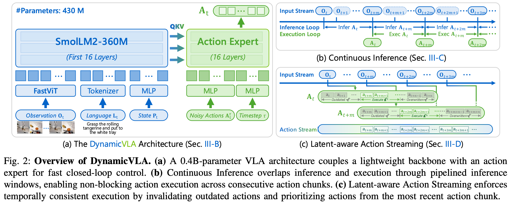
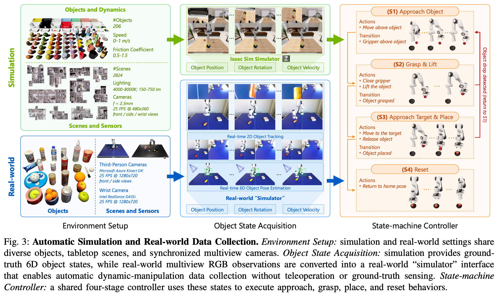

# 2 2026 NTU DynamicVLA

- [DynamicVLA: A Vision-Language-Action Model for Dynamic Object Manipulation](https://arxiv.org/pdf/2601.22153)

## Abstract

- Manipulating dynamic objects remains an open challenge for Vision-Language-Action (VLA) models, which, despite strong generalization in static manipulation, struggle in dynamic scenarios requiring rapid perception, temporal anticipation, and continuous control. 

- We present DynamicVLA, a framework for dynamic object manipulation that integrates temporal reasoning and closed-loop adaptation through three key designs: 
    - a compact 0.4B VLA using a **convolutional vision encoder** for spatially efficient, structurally faithful encoding, enabling fast multimodal inference; 
    - Continuous Inference, enabling overlapping reasoning and execution for lower latency and timely adaptation to object motion; and 
    - Latent-aware Action Streaming, which bridges the perception–execution gap by enforcing temporally aligned action execution. 

- To fill the missing foundation of dynamic manipulation data, we introduce the Dynamic Object Manipulation (DOM) benchmark, built from scratch with an auto data collection pipeline that efficiently gathers 200K synthetic episodes across 2.8K scenes and 206 objects, and enables fast collection of 2K real-world episodes without teleoperation (遥控操作). 

- Extensive evaluations demonstrate remarkable improvements in response speed, perception, and generalization, positioning DynamicVLA as a unified framework for general dynamic object manipulation across embodiments.

## I. INTRODUCTION

- Dynamic object manipulation is a fundamental yet under-explored frontier in robotics. 
    - Real-world interaction often involves objects in motion, such as handing, repositioning, or stabilizing items, requiring robots to perceive, predict, and act under rapidly changing conditions. 
    - Even minor latency may cause task failure, making dynamic manipulation a far more challenging problem than static grasping.

- To date, robots have been evaluated on moving targets such as throwing, soccer, and table tennis, relying on reactive control and handcrafted perception pipelines that operate only in structured settings. 
    - Recent works such as `DBC-TFP` and `GEM` extend manipulation to moving objects but remain limited to predictable, conveyor-belt–like motion. 
    - Meanwhile, concurrent VLA models, including `RDT2`, `RTVLA`, and `VLASH`, demonstrate real-time interaction with fast-moving targets, but these tasks tolerant to timing and spatial error. 
    - For example, a paddle can return a ball over a wide area, so the interaction does not require the precise 6DoF control needed for dynamic object manipulation.
    - However, open-ended dynamic manipulation, which involves uncertain motion, precise contact, and tight perception–action alignment, remains largely unsolved.

- While VLA models have shown strong performance on static manipulation, where object states remain fixed during inference, latency plays only a minor role in such settings. 
    - Early VLAs relied on 3B–7B vision-language backbones and still achieved high success rates despite slow inference.
    - More recent designs improve efficiency by reducing model size and increasing throughput while maintaining comparable performance. 
    - However, as illustrated in Figure 1a, dynamic manipulation imposes far stricter demands because inference delays de-synchronize perception from action and require models to anticipate future object motion, a capability not addressed by prior VLAs for manipulation.

- To address these issues, we propose DynamicVLA, a framework for dynamic object manipulation that integrates temporal reasoning and closed-loop adaptation through three key designs: 
    - a compact 0.4B-parameter VLA that adopts a **convolutional vision encoder** for efficient spatial compression and stronger structural preservation, enabling significantly faster and more compact inference in dynamic manipulation settings; 
    - Continuous Inference, a pipelined execution scheme that overlaps prediction and action execution to eliminate inter-chunk waiting and maintain a continuous action stream under dynamic object motion; and 
    - Latent-aware Action Streaming, a latency-aware execution mechanism that restores temporal alignment by discarding outdated actions and prioritizing the most recent predictions at each timestep, ensuring temporally consistent control despite inference delay.

- Since existing robotic datasets overwhelmingly capture static scenes and offer no large-scale foundation for dynamic object manipulation, we construct the Dynamic Object Manipulation (DOM) benchmark with a fully automated data collection pipeline validated across multiple robot embodiments, including Franka Emika Panda and AgileX PiPER. 
    - In simulation, **Isaac Sim** and our task-driven state machine controller use real-time 6D object pose and velocity to drive the robot to manipulate moving objects, producing 200K episodes across 2.8K diverse simulation-ready 3D scenes and 206 objects. 
    - Teleoperation is fundamentally ineffective for real-world dynamic manipulation, since fast-moving objects routinely exceed human reaction limits. 
    - To address this, we build a real-world “simulator” pipeline that performs 3D object tracking using dual RGB views to estimate 6D pose and infer velocity, and then drives the same state-machine controller to execute autonomous trials, with humans only initiating object motion when necessary.

- We extensively evaluate DynamicVLA across dynamic manipulation tasks, multiple robot embodiments, and both simulation and real-world settings, using the DOM benchmark together with 16 real-robot tasks. 
    - Our evaluation examines the model’s limits in real-time responsiveness, adaptation to sudden changes in object motion, perceptual grounding of appearance, motion, and spatial descriptions, and generalization to unseen objects, novel scenes, and new motion regimes. 

- In summary, the contributions of this work consist of 
    - a compact 0.4B-parameter VLA tailored for dynamic manipulation, 
    - together with two modules that enable real-time closed-loop control. 
    - Continuous Inference overlaps inference and execution to eliminate inter-chunk waiting, while Latent aware Action Streaming enforces temporal alignment between perception and action. 
    - We further introduce the DOM benchmark, which supplies large-scale dynamic manipulation data through automated pipelines in both simulation and the real world across multiple robot embodiments.

## II. RELATED WORK

### Vision-Language-Action Models. 

- Inspired by the success of
    - Large Language Models (LLMs) [36, 40, 1, 41] 
        - [36] OpenAI. GPT-4 technical report. 
        - [40] Llama Team. The llama 3 herd of models. 
        - [1] DeepSeek AI. DeepSeek-R1: Incentivizing reasoning capability in LLMs via reinforcement learning. 
        - [41] Qwen Team. Qwen2.5-1M technical report. 
    - Vision Language Models (VLMs) [25, 26, 42], 
        - [25] Haotian Liu. Visual instruction tuning.
        - [26] Haotian Liu. Improved baselines with visual instruction tuning.
        - [42] Qwen Team. Qwen2.5-VL technical report.

- Vision-LanguageAction (VLA) models extend VLMs with action generation.
    - **Transformer-based methods** [57, 7] use Transformers to model state-action-reward sequences. 
        - [57] Sergey Levine. Learning fine-grained bimanual manipulation with low-cost hardware.
        - [7] Chelsea Finn. RT-1: robotics transformer for real world control at scale. 
    - **LLM/VLM-based methods** [60, 17] treat VLA tasks as sequence-to-sequence problems for action generation. 
        - [60] RT-2: Vision-Language-Action models transfer web knowledge to robotic control. 
        - [17] Sergey Levine. OpenVLA: An open-source Vision-Language-Action model. 
    - **Diffusion-based methods** [9, 32] model policies as denoising diffusion models. 
        - [9] Diffusion policy: Visuomotor policy learning via action diffusion.  
        - [32] Chelsea Finn. Fine-tuning Vision-Language-Action models: Optimizing speed and success.
    - **LLM and diffusion model methods** [14, 6] combine LLMs for representation and diffusion models for action generation. 
        - [14] Sergey Levine. Octo: An open-source generalist robot policy. 
        - [6] Chelsea Finn. **$\pi_0$: A Vision-Language-Action flow model for general robot control.**
    - **Video generation with inverse kinematics methods** [53, 49, 37] generate motion sequences and convert them into actions. 
        - [53] Pieter Abbeel. Learning interactive real-world simulators. 
        - [49] Unleashing large-scale video generative pretraining for visual robot manipulation.
        - [37] VideoWorld: Exploring knowledge learning from unlabeled videos. 

- However, existing VLA models often suffer from **slow inference speeds**, limiting their use in scenarios requiring precise or rapid execution.

### Robot Learning Datasets. 

- Real-world datasets [28, 45, 35, 50] provide high-fidelity interactions but are costly and hard to scale, while simulated datasets [30, 24, 20, 21, 33] offer scalability yet suffer from the sim-to-real gap. 
- Most benchmarks focus on simple tabletop manipulation (e.g., pick-and-place, pushing) with limited task diversity, though recent work explores long-horizon [24, 55], language-conditioned [58, 16], and tactile-rich [52, 2] settings. 
- Generative models [34, 47, 53, 48] introduce interactive elements but remain constrained by artifacts, low frame rates, and memory. 
- Despite progress in standardization and multi-embodiment learning, current datasets lack dynamic objects, limiting applicability to environments with independent motion.

### Robot Dynamic Manipulation. 

- Robotic manipulation has been studied largely in static settings, and existing methods for moving objects remain task-specific or rely on predictable motion. 
    - Approaches such as DBC-TFP [56] and GEM [22] operate mainly in structured, conveyor-like scenarios. 
    - Concurrent VLA methods, including RDT-2 [43], RTVLA [27], and VLASH [39], demonstrate real-time interaction with fast moving targets, but these interactions permit large contact margins and do not involve precise 6DoF manipulation. 
    - Consequently, general dynamic manipulation under uncertain motion and fine contact constraints remains under-explored.

## III. THE DYNAMIC-VLA MODEL

### A. Problem Formulation

- We study dynamic object manipulation, where a robot must manipulate objects whose states evolve continuously during perception, reasoning, and execution. 

- At time step $t$, the VLA model $M$ receives 
    - a temporal window of visual observations $O_t = \{o_{t−k}, ... , o_t\}$, 
    - a language instruction $L_t$, and 
    - its proprioceptive (本体感受的) state $P_t$, 
- and predicts 
    - an action sequence $A_t = \{a_t, ..., a_{t+n}\}$, i.e., 
    
$$ A_t = M(O_t,L_t, P_t) $$

- The physical environment includes 
    - a latent object state $s_t$, describing the object’s 6D pose and motion.
    - Crucially, object motion does not pause during inference: while the model reasons over $O_t$, the object transitions from $s_t$ to $s_{t+m}$, where **$m$ denotes inference latency**, leading to potential misalignment between perception and execution.

### B. The DynamicVLA Architecture

- Since inference latency directly limits the range of object motion in dynamic manipulation, we design a compact 0.4B VLA model for fast and spatially efficient multimodal reasoning, illustrated in Figure 2a.

#### Vision–Language Backbone. 

- We adopt SmolLM2-360M [3] as the **language backbone**, resulting in an overall tiny model size. 
    - Following SmolVLA [38], we truncate the **language backbone** to its first 16 transformer layers, significantly reducing inference latency with minimal impact on multimodal reasoning.
    - [3] **Hugging Face** SmolLM2: when smol goes big - data-centric training of a small language model. 
    - [38] **Hugging Face** SmolVLA: A Vision-Language-Action model for affordable and efficient robotics. 

- **Unlike existing VLMs that rely on transformer-based vision encoders, we employ a convolutional vision encoder, FastViT [44], which performs efficient spatial compression and avoids quadratic token growth when processing multi-frame visual inputs.** 
    - [44] **Apple** FastViT: A fast hybrid vision transformer using structural reparameterization. 

#### Diffusion-Based Action Expert. 

- The action expert $E_\theta$ predicts an action chunk $A_t$ conditioned on the multimodal features produced by the VLM backbone. 
    - Following diffusion-style action modeling [23, 12], we instantiate $E_\theta$ as a conditional **Flow Matching Transformer** [6] and train it using the objective
    - [23] **Meta** Flow matching for generative modeling.
    - [12] **Stability AI** Scaling rectified flow transformers for high-resolution image synthesis.
    - [6] Chelsea Finn. **$\pi_0$: A Vision-Language-Action flow model for general robot control**

$$
\text{\color{blue} Training: Flow Matching Loss} \\[5pt]
L(\theta) = \mathbb{E}_{ t\sim \mathcal{U}(0, 1),\; x_0 \sim \mathcal{N}(0, I),\; x_1 \sim p_\text{data} } \| v_\theta(x_t, t) - (x_1-x_0) \|^2 \\[5pt]
x_t := (1 - t) x_0 + t x_1 = x_0 + t (x_1 - x_0) \\[10pt]
\text{input: } x_t, t \qquad
\text{model: } v_\theta(\cdot) \qquad
\text{target: } x_1 - x_0 \\[10pt]
\text{\color{blue} Inference: Numerical Integration} \\[5pt]
x_1 = x_0 + \int_0^1 v_\theta(x_t, t) \; dt 
$$

$$ L^\tau(\theta) = \mathbb{E}_{ \epsilon \sim \mathcal{N}(0, I), \; p(A_t|f_t) } \|
    E_\theta(A_t^\tau, O_t) - (A_t - \epsilon)
\|^2 \\[10pt]
A_t^\tau := (1-\tau) \epsilon + \tau A_t   $$

- where superscript $\tau \in [0, 1]$ denotes flow matching timesteps.
- $f_t$ represents the VLM features extracted from $O_t$
- Under this objective, $E_\theta(A_t^\tau, O_t)$ learns to match the **denoising vector field** $\epsilon - A_t$

### C. Continuous Inference

- At time step $t$, the VLA model $M$ predicts an action sequence $A_t = \{a_t, ..., a_{t+n}\}$. 

- **In existing VLA models [18, 6, 15], a new inference is triggered only after the previously predicted action sequence $A_t$ is fully executed.** 
    - This serializes inference and execution, introducing inter-chunk waiting that stalls control until the next action sequence is available and degrades responsiveness under dynamic object motion.

- **Under Continuous Inference, inference cycles are triggered as soon as the previous inference finishes, independent of whether the previously predicted action sequence has been exhausted**, as shown in Figure 2b. 

- **Let $m$ denote the inference delay, i.e., the number of timesteps between the start and completion of an inference cycle.** 
    - Inference therefore completes at timesteps $t, t + m, t + 2m, ... $ where $m$ may vary across cycles; 
    - for clarity, we assume a constant $m$ in the formulation.
    - During execution, actions from $A_t$ are executed continuously while the next action sequence $A_{t+m}$ is being inferred.
    - We assume $n > m$, such that a new action sequence becomes available before the execution of the current sequence completes. 
    - Consequently, execution does not block on inference completion, eliminating inter-chunk waiting.

### D. Latent-aware Action Streaming

- As presented in Figure 2c, **inference delay $m$ introduces temporal misalignment between predicted actions and the evolving environment**, which manifests in two ways:
    - Perception–Execute Gap: when inference is initiated at time $t$ to predict $A_t$, the predicted actions become available only at $t + m$, by which time the observation has evolved to $O_{t+m}$. Consequently, actions $\{a_t, ..., a_{t+m−1}\}$ are no longer aligned with the current observation.
    - Conflicts Between Overlapping Action Chunks: continuous inference allows a new action sequence $A_{t+m}$ to be generated before the execution of $A_t$ is complete, resulting in multiple candidate actions for the same execution timestep.

- Latent-aware Action Streaming resolves both issues through an explicit execution strategy. 
    - Specifically, actions in $A_t$ corresponding to timesteps earlier than $t + m$ are **discarded as outdated**, and execution proceeds with the subsequence $\{a_{t+m}, ..., a_{t+n}\}$. 
    - For timesteps where $A_t$ and $A_{t+m}$ overlap, actions from the newer sequence $A_{t+m}$ are prioritized, overwriting those from $A_t$, allowing execution to adapt promptly to the most recent environment state, particularly under dynamic object motion.

## IV. THE DYNAMIC OBJECT MANIPULATION BENCHMARK

### A. Overview

- Dynamic Object Manipulation (DOM) is the first large scale benchmark dedicated to dynamic object manipulation, addressing the lack of standardized datasets for evaluating robotic policies on moving objects. 
    - DOM provides scalable data collection through fully automated pipelines in both simulation and the real world, producing 200K synthetic episodes and 2K real-world episodes, where teleoperation is ineffective due to human reaction limits under fast object motion. 
    - The benchmark organizes dynamic manipulation scenarios along structured interaction, perception, and generalization dimensions, enabling consistent and comparable evaluation across algorithms and robot embodiments.

### B. Benchmark Dimensions

- As illustrated in Figure 1c, DOM evaluates dynamic manipulation ability across three principal dimensions:

- Interaction. This dimension evaluates how effectively a policy responds to evolving object motion. 
    - Closed-loop reactivity, which measures how quickly the robot adjusts to objects moving at different speeds; 
    - Dynamic adaptation, where the policy must handle abrupt changes in motion such as direction shifts or unexpected disturbances; 
    - Long-horizon sequencing, which assesses whether the policy maintains coherent behavior over extended interactions and prioritizes actions as motion events unfold.

- Perception. This dimension evaluates how well a policy perceives and grounds visual and linguistic cues in dynamic environments. 
    - Visual understanding, which measures the ability to distinguish objects with similar shapes, textures, or materials; 
    - Spatial reasoning, which examines whether the policy can infer object positions and relative arrangements in cluttered or changing scenes; 
    - Motion perception, which assesses how accurately the policy interprets object motion cues such as speed and direction.

- Generalization. This dimension evaluates how robustly a policy transfers across novel objects, scenes, and motion patterns. 
    - Visual generalization, which measures adaptation to unseen shapes, appearances, and scene layouts; 
    - Motion generalization, which assesses whether the policy can handle new speed ranges, altered friction conditions, and trajectory patterns that differ from those observed during training; 
    - Disturbance Robustness, which tests the ability to maintain stable behavior under external perturbations such as unexpected pushes, collisions, or sensor noise.

### C. Simulation Data Collection

- Our simulation framework is designed with two core objectives: 
    - to rapidly scale up dynamic manipulation data for pretraining VLA policies, and 
    - to produce a reproducible and standardized benchmark that supports fair and consistent evaluation across future work. 
    
- As shown in Figure 3, we construct a high-throughput pipeline in **Isaac Sim** [31] that unifies scene and object sampling, multi-view perception, realtime object-state acquisition, and closed-loop control.

- Objects and Dynamics. 
    - We include 206 everyday objects from **Objeverse** [11] spanning fruits, vegetables, containers, and other household items, with texture augmentation for additional visual diversity. 
    - Object speeds are sampled from 0–0.75 m/s (with some remaining static) and friction coefficients from 0.5–1.5. 
    - Multiple objects are placed in the workspace, allowing natural interactions during motion.

- Scenes and Sensors. 
    - We derive 2.8K diverse 3D scenes from 3D-FRONT [13], curated to ensure a clean, flat tabletop and to remove self-occluding or unrealistic object placements. 
    - Each scene is instrumented with three cameras: 
        - two third-person views placed 1 m from the robot (front at 0.6 m height and left at 0.35 m height) and 
        - a wrist-mounted camera. 
    - All cameras capture RGB frames at 25 FPS with a 480×360 resolution, using a 2.3 mm focal length aligned with **Azure Kinect** intrinsics. 
    - We randomize scene illumination by sampling color temperature from 4000–8000 K, light intensity from 150–750 lm, and light source positions from $x \in [−50, 50] m, y \in [−50, 50] m, z \in [10, 20] m$.

- Object State Acquisition. 
    - The simulator maintains ground truth 6D object states throughout each episode.
    - Isaac Sim randomizes physical parameters and propagates object motion via the physics engine, from which we extract per-object position, rotation, and linear/angular velocity at 25 Hz. 
    - The resulting noise-free trajectories provide the controller with real-time motion cues for short-horizon prediction and state transitions. 
    - This interface is later mirrored in the real-world pipeline to ensure consistent behavior across embodiments.

- State Machine Controller. 
    - The state machine consumes realtime 6D object pose, velocity, and the 6D pose of a static target object, and executes a four-stage closed-loop routine:
        - Approach Object: predict near-future object motion (about 0.23 s) and position the end effector 10 cm above the predicted location with continuous updates. 
        - Grasp & Lift: descend, stabilize residual motion, and secure a grasp before lifting. 
        - Approach Target & Place: move toward the placement pose derived from the target object’s 6D geometry and place the object accurately. 
        - Reset: return to the home pose to begin the next episode. This design produces reactive, prediction informed trajectories, enabling scalable generation of realistic dynamic manipulation episodes.

### D. Real-World Data Collection

- Teleoperation is widely used for collecting demonstrations, but it breaks down for dynamic manipulation: human reaction is too slow to track fast-moving objects, even with homo-morphic interfaces. 
    - Meanwhile, the real world lacks ground-truth 6D object states, making the simulator’s closed-loop pipeline impossible to replicate directly. 
    - To address both issues, we build a real-world “simulator”—a high-frequency perception and state-estimation system that approximates simulator-style object states using commodity RGB-D sensors and enables fast (≈10 s per episode), teleoperation-free collection of large scale dynamic manipulation data that runs identically on Franka and PiPER for consistent multi-embodiment coverage.

- Environment Setup. 
    - We use 25 physical household objects spanning containers, food items, bottles, and tools, with multiple objects per episode, including pick/place targets and natural distractors. 
    - The scene is captured by two synchronized third-person RGB cameras (Azure Kinect DK) placed at front and side viewpoints, along with a wrist-mounted RealSense D435i, matching the simulation geometry and supplying synchronized, calibrated RGB streams for state estimation.

- Object State Acquisition. 
    - To replicate the simulator’s state interface, we build a “real-time” simulator that outputs 6D object pose and velocity. 
    - EfficientTAM [51] supplies per-view object masks from the synchronized third-person cameras, and a geometric triangulation step recovers the 3D centroid. 
    - Linear and angular velocities are obtained by fitting motion over a short temporal window, producing a smooth, low-latency 6D state stream compatible with the controller’s requirements.

- State-machine Controller. 
    - The same four-stage controller used in simulation runs unchanged in the real world, consuming the estimated 6D object states and target pose.

## V. EXPERIMENTS

## VI. DISCUSSION AND FUTURE WORK

