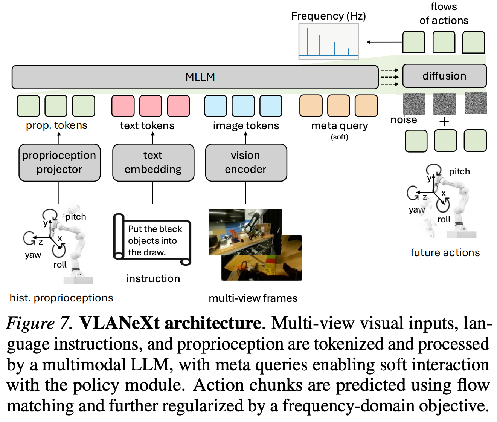

# 3 2026 NTU VLANeXt

- [VLANeXt: Recipes for Building Strong VLA Models](https://arxiv.org/pdf/2602.18532)
- The codebase is available at https://github.com/DravenALG/VLANeXt

## Abstract

- Following the rise of large foundation models, Vision–Language–Action models (VLAs) emerged, leveraging strong visual and language understanding from Vision-Language Models for general purpose policy learning. 

- Yet, the current VLA landscape remains fragmented and exploratory.
    - Although many groups have proposed their own VLA models, inconsistencies in training protocols and evaluation settings make it difficult to identify which design choices truly matter. 
    - To bring structure to this evolving space, we reexamine the VLA design space under a unified framework and evaluation setup. 
    - **Starting from a simple VLA baseline similar to RT-2, which is the origin of VLA**, we systematically dissect design choices along three dimensions: 
        - foundational components, 
        - perception essentials, and 
        - action modelling perspectives.
    - From this study, we distill 12 key findings that together form a practical recipe for building strong VLA models. 
    - The outcome of this exploration is a simple yet effective model, VLANeXt. 
    - It outperforms the SOTA methods on the LIBERO and LIBERO-plus benchmarks and demonstrates strong performance in real-world experiments.
    - We release a unified and easy-to-use codebase to reproduce our findings, explore the design space, and develop new VLA variants on top of a shared foundation. 
    

## 1. Introduction

- Recent advances in foundation models have reshaped how we think about general-purpose robot control. 
    - Instead of training task-specific policies, a growing line of work builds Vision–Language–Action (VLA) models that leverage large Vision-Language Models to map visual observations and language instructions directly to robot actions. 
    - By inheriting rich visual understanding and language grounding from foundation models, VLAs offer a scalable route toward general-purpose, language-conditioned robot policies.
    - Since the emergence of VLAs, both academia and industry have proposed a wide range of models demonstrating strong performance and encouraging generalization across diverse tasks
    - Most VLA approaches build on a similar paradigm: they build on pre-trained LLMs or VLMs, processing visual observations together with language instructions to derive action-relevant representations for policy learning. 
    - This pipeline introduces numerous design choices, including how to interface the VLM with the policy module, how to train the policy, how to select essential perceptual inputs, and how actions should be represented and modeled.
    - Despite rapid progress, early exploration of VLAs remains something of a “primordial (原始的) soup”, rich in ideas but lacking clear structure. 
    - While prior work has explored VLA design from certain perspectives, differences in training protocols and evaluation setups make it difficult to identify which design choices in the shared VLA design space truly matter.

- This work aims to provide a more systematic understanding of this fragmented design space by comprehensively reexamining VLA design spaces under a unified framework and evaluation protocol. 
    - While several prior works have made preliminary attempts to explore VLA designs, their investigations remain limited in scope. 
    - This study aims to provide a more comprehensive and in-depth analysis of this domain. 
    - In detail, we begin with a simple baseline VLA, similar to RT-2, which is the origin of VLA and serves as a strong reference point for analyzing the effectiveness of different design choices. 
    - We evaluate all variants on two commonly used VLA benchmarks, including LIBERO and LIBERO-plus, where LIBERO-plus extends the original benchmark with controlled and unseen perturbations to better assess robustness and generalization. 
    - Within this setup, we systematically explore the design space along three dimensions: 
        - foundational components, covering core VLM-policy architectures and action learning objectives; 
        - perception essentials: examining the role of visual, language, and proprioceptive inputs; and 
        - action modeling perspective: investigating designs and auxiliary objectives that facilitate action generation. 
    - We conduct more than 500 distinct experiments over the above three dimensions, and distill 12 key findings that together form a practical recipe for building strong VLA models, summarized in Fig. 2.

- We highlight several findings that we believe are novel and noteworthy for the field: 
    - a soft connection between the VLM and the policy module performs slightly better than both loose and tight coupling strategies; 
    - video inputs, even though the VLM is already pre-trained on video understanding, still fails to distill useful information for action learning; 
    - conditioning proprioceptive input in the VLM yields better performance than either omitting proprioception or injecting it directly into the policy module; and 
    - framing action generation as a time-series forecasting problem and incorporating frequency-domain modeling provides an effective and efficient way to improve action prediction.

- The outcome of this study is a simple yet effective VLA model, VLANeXt, derived directly from the design principles uncovered in our systematic exploration. 
    - Rather than relying on aggressive model scaling or task-specific engineering, VLANeXt achieves SOTA performance on both LIBERO and LIBERO-plus (Fig. 1), and adapts effectively to real-world manipulation tasks. 
    - These results show that strong VLA performance can emerge from principled design choices within a unified framework. 
    - To support further progress in this direction, we release a unified and easy-to-use codebase that standardizes training and evaluation while exposing the key components of the VLA design space. 
    - The framework is intentionally lightweight and minimally encapsulated, enabling researchers to reproduce our findings, probe alternative design choices, and build new VLA variants on top of a shared, transparent foundation.

## 2. Recipes for Building Strong VLA Models

- In this section, we detail the step-by-step evolution from a simple baseline to the final VLANeXt model. 
    - We organize our exploration along three aspects: 
        - foundational components (Sec. 2.1), 
        - perception essentials (Sec. 2.2), and 
        - action modeling perspectives (Sec. 2.3). 
    - An overview is shown in Fig. 2, with full results in Table 1.

- Evaluation Setup. 
    - We perform the roadmap exploration on LIBERO and LIBERO-plus. 
    - Main experiments are conducted on the spatial suite as our primary testbed, while the resulting insights generalize across the other suites (Object, Goal, and Long), which can also be seen in Table 5.

- **Baseline.** 
    - Our baseline follows the VLA pipeline introduced in RT-2, the origin of VLAs, and later adopted by OpenVLA. 
    - **We use LLaMA 3.2 (3B parameters) as the language backbone.** Since LLaMA does not natively support visual inputs, we also paired our backbone with the **SigLIP2 as the vision encoder**.
    - **A subset of rarely used text tokens is repurposed as action tokens, enabling action prediction in the same autoregressive framework.** 
    - **Continuous actions are discretized using a simple binning strategy and modeled as classification over bin indices.** 
    - We intentionally start from this minimal, classical RT2-style setup to provide a clean reference point for analyzing the effects of different design choices. 

### 2.1. The Foundational Components

- In this section, we investigate some core design choices of VLAs, including architectures and training losses.

#### Policy Module Design. 

- **Our baseline follows RT2 and OpenVLA, reusing text tokens for action classification.** 
    - **We first examine whether an explicit policy head is necessary.**
    - To this end, we append a class token to the text and visual embeddings and feed its LLM output into a **two-layer policy head (transformer architecture)** for action classification (Fig. 3(a)(b)).
    - **Results show that introducing a separate policy head performs slightly better than directly reusing text tokens (Table 1), suggesting that decoupling action prediction from the linguistic token space is beneficial.**

- We further investigate whether a more expressive policy module brings additional gains. 
    - Specifically, we replace the single class token with multiple tokens (16) and expand the policy network from 2 to 12 layers, making the design conceptually similar to **MetaQuery** (Fig. 3(c)). 
    - **This enlarged policy module yields a significant performance improvement (Table 1). Our final model adopts this design.**

#### Action Chunking. 

- Our baseline predicts actions one step at a time. 
    - Here, we evaluate **action chunking, which predicts multiple future actions jointly** and is known to improve inference efficiency. 
    - Results show that **longer chunk horizons consistently improve action generation performance** (Table 1), suggesting that modeling a longer temporal window of action provides a more coherent view of the action sequence. 
    - **We therefore adopt action chunking with a chunk size of 8.**

#### Action Learning Objective. 

- An action chunk is a continuous vector of shape $(t, \text{dim})$. 
    - **Our baseline discretizes this vector using binning (first normalizing to −1 and 1, then dividing into 256 bins) and treats action prediction as classification, following OpenVLA.** 
    - We compare this with alternative objectives, including 
        - **direct regression**, 
        - **diffusion-based losses** such as 
            - **DDIM** (Song et al., 2021; Zhang et al., 2025c), 
            - **flow matching** (Lipman et al., 2021; Lv et al., 2025),    
        - **VQVAE–based codebook classification** (codebook size 1024 and each action assigns 3 codes. Van Den Oord et al., 2017; Esser et al., 2021).

- Results show that 
    - **regression achieves the strongest performance,** 
    - with **diffusion-based objectives close behind,** 
    - while **classification-based approaches perform worst** (Table 1).

- **In addition, we also notice that when the performance gets higher, the flow-matching objective will eventually outperform the regression loss, since it can represent precise control signals.** 

- **We therefore adopt the flow-matching objective.** 

- We also observe that classification using the VQ–VAE–based codebook underperforms relative to the binning strategy. 
    - We attribute this to the fact that the action spaces are low-rank, meaning a simple binning approach provides sufficient resolution.

#### VLM Backbone Capacity. 

- Our baseline uses LLaMA as the backbone. We evaluate alternative VLM backbones to study how backbone strength affects VLA performance, including 
    - **PaliGemma-3B (used in the $\pi$ series)** and 
    - the **Qwen-VL family**, 
- which represent some of the most capable open-source VLMs currently available.

- Results show a consistent trend: **stronger VLM backbones yield better VLA performance** (Table 1), with 
    - `Qwen3-VL4B` > `Qwen3-VL-2B` > `LLaMA-3.2-3B` and `PaliGemma-3B` 
    - We use **Qwen3-VL-2B** in subsequent experiments as a strong yet efficient choice. 
    - This finding differs from (Zhang et al., 2026). A possible reason is that our larger policy module can better exploit the representational capacity of stronger VLMs, whereas the lightweight policy head in (Zhang et al., 2026) may limit such gains. We leave a deeper investigation to future work.

#### VLM-Policy Connection. 

- We next study how different connection strategies between the VLM and the policy module affect performance. 
    - Our baseline adopts a MetaQuery-style design, as discussed in “Policy Module Design”. 
    - **We refer to this design as the loose strategy, where the VLM and policy module are fully decoupled.** 
    - **We compare this with a tight strategy that connects the two modules layer by layer, as in the $\pi$ series.** 
    - Inspired by these two designs, we further **introduce a soft strategy that also connects them layer by layer but inserts learnable queries as a latent buffer between the modules (Fig. 4).** 
    - In detail, for the above three connection strategies, we all use the **cross attention as the condition technique**, and the timestep is conditioned by [**adaLN** like (Peebles & Xie, 2023)](https://arxiv.org/pdf/2212.09748)

- **Results show that the soft strategy slightly outperforms both loose and tight connections (Table 1), suggesting that the learnable query buffer helps better transfer useful representations from the VLM’s textual space to the policy module’s action space.** 
    - This may be viewed as introducing a latent buffer between the two components, analogous to reasoning in a latent space (Hao et al., 2024). **We adopt the soft connection in subsequent models.**

### 2.2. The Perception Essentials

- In this section, we shift our focus from foundational components to perception, investigating whether and how different modalities (e.g., visual observations and actions) should be provided as inputs to VLAs.

#### Temporal Observation History. 

- We examine whether incorporating temporal observation history improves performance. 
    - **Our baseline follows OpenVLA and uses only the current frame as input.** 
    - We extend this to include multiple past frames, leveraging the **video capability of the Qwen3-VL-2B backbone** for a controlled comparison. 
    - Results show that **adding temporal history does not improve action generation and slightly degrades performance (Table 1)!!! indicating that redundant temporal inputs may introduce noise or distract the model, even though the backbone is already pre-trained in video understanding.**

#### Camera View Horizon. 

- We study the effect of camera viewpoints on VLA performance. 
    - **Our baseline uses a single third-person view, following OpenVLA.**
    - Many robotics datasets additionally provide an in-hand wrist camera, allowing choices between single-view and multi-view inputs. 
    - Results show that **combining third-person and wrist views significantly improves performance (Table 1), suggesting that multi-view observations provide complementary geometric cues that help resolve spatial ambiguities.**

#### Proprioception Conditioning. 

- We examine the role of proprioception, which provides information about the robot’s internal state and motion history. 
    - **Our baseline, following OpenVLA, does not use proprioceptive inputs.** 
    - We compare three variants: 
        - **best: conditioning the VLM**, 
        - conditioning the policy module, and 
        - conditioning both (Fig. 5). 
    - In detail, for the VLM part, we will use the proprioception as input, and for the policy part, we will use the action as input to align with the generated action.

- Results show that conditioning proprioception in the VLM yields the best performance (Table 1). 
    - We hypothesize that integrating proprioception at the VLM level allows better fusion with visual and language inputs, whereas injecting it directly into the policy module may reduce reliance of action prediction on visual observations and instructions.
    - Although this appears to differ from the conclusion reported in [Zhao et al.](https://arxiv.org/pdf/2509.18644), where they claim that proprioception is not needed, their study evaluates architectures where proprioception is injected only into the policy module. **In that setting, removing proprioception improves performance, which is consistent with our findings.**

- We further compare three different integration mechanisms, including 
    - a linear projector, 
    - a transformer-based projector, and 
    - a transformer projector with masked reconstruction pretraining (He et al., 2022). 
- The transformer-based projector performs slightly better (Table 1); **for simplicity, we use the linear projector in the final design.**

### 2.3. Action Modelling Perspectives

- Here, we examine auxiliary design and training objectives to facilitate action generation.

#### World Modelling. 

- We examine augmenting action prediction with an auxiliary world modeling objective (Lv et al.,2025; Cen et al., 2025b). 
    - To maintain relatively fair comparison, we don’t use a pre-trained visual generator. 
    - Instead, we tokenize images using the **Emu3.5 image tokenizer** (Cui et al., 2025) and **predict future image tokens with a next-token objective. The target is the future frame at a fixed horizon (8 steps, aligned with the action chunk length).**
    - **The visual generation module is inserted between the VLM and the policy module with layer-wise connections (Fig. 6).**
    - Adding **world modeling improves action generation performance** (Table 1), indicating that predicting future observations is beneficial. 
    - However, it nearly **triples training time**, substantially increasing computational cost. **We therefore exclude world modeling from the final recipe.**

#### Time Series Forecasting. 

- We also **explore facilitating action generation from a time-series forecasting perspective.**
    - Inspired by frequency-domain modeling in time-series prediction, we **introduce a simple auxiliary loss that minimizes the MSE between predicted and ground truth actions in the frequency domain.** 
    - We use the **discrete cosine transform to convert the action to the frequency domain**, and assign higher weights to low-frequency components and lower weights to high-frequency components, as high-frequency components are often noisier.
    - This strategy improves action generation performance, slightly surpassing the world modeling objective while adding negligible training overhead (Table 1). 
    - The gain likely arises because it serves as a regularization term to avoid the model over-fitting to the jitter in trajectory, which mainly improves the model’s generalization ability.

### 2.4. Summary of Recipes

- Starting from a classical **RT-2/OpenVLA-style baseline**, we find that strong VLA performance emerges from a series of principled design choices. Beneficial changes include: 
    - **replacing token reuse with a deeper, dedicated policy module;**
    - **adopting action chunking to model longer temporal action horizons;** 
    - **using continuous objectives such as flow matching** (with regression also effective under simple distributions);
    - **employing a stronger VLM backbone** (Qwen3-VL-2B as an effective–efficient choice); and 
    - **connecting the VLM and policy module through soft, layer-wise interactions with learnable query buffers.**

- On the perception side, 
    - **multi-view inputs (third-person + wrist)** and 
    - **VLM-side proprioception conditioning** 
- improve performance, while `redundant temporal observation history` is unnecessary. 

- Moreover, adding 
    - **a lightweight frequency domain auxiliary loss** further boosts action generation with negligible cost. 

- Although world modeling also improves performance, its substantially higher training cost makes it less practical. 

- Together, these choices form a practical recipe for building a strong and efficient VLA model, which we call VLANeXt.

## 3. Benchmarks Evaluations

### 3.1. Settings

### 3.2. LIBERO Benchmark Results

### 3.3. LIBERO-plus Benchmark Results

## 4. Real-World Evaluations

### 4.1. Settings

### 4.2. Results

## 5. Conclusion

- This work moves toward a more systematic understanding of VLA models. 
    - Rather than introducing another standalone architecture, we revisit the VLA pipeline and show that many gains arise from principled design choices within a unified framework. 
    - In particular, how the VLM interacts with the policy module, how multimodal signals such as proprioception are fused, and how temporal structure in actions is modeled all play central roles. 
    - Several observations carry broader implications. 
    - Modest architectural refinements, such as soft VLM–policy coupling or VLM-side proprioception conditioning, can meaningfully influence performance, indicating that where information is injected matters as much as what information is used. 
    - Viewing action generation as structured sequence modeling, for example, through frequency-domain objectives, also shows that ideas from time-series learning transfer effectively to robotics.
    - Meanwhile, richer objectives like world modeling improve performance but introduce notable computational overhead, highlighting the importance of efficiency-aware design.
    - We hope this work encourages a shift from ad-hoc model variations toward more controlled exploration of the VLA design space. 
    - By releasing a unified, lightweight framework, we aim to support systematic studies and shared progress.
    - Extending this perspective to more diverse embodiments, longer-horizon reasoning, extensive mid-training, and richer world-interaction objectives remains an important direction for future research.
