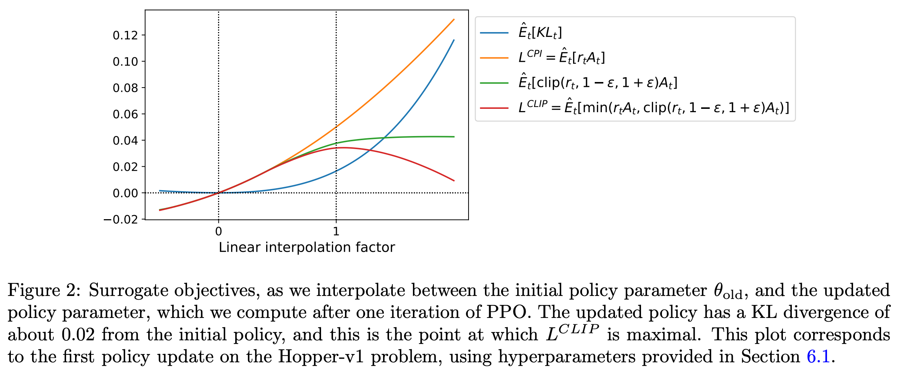
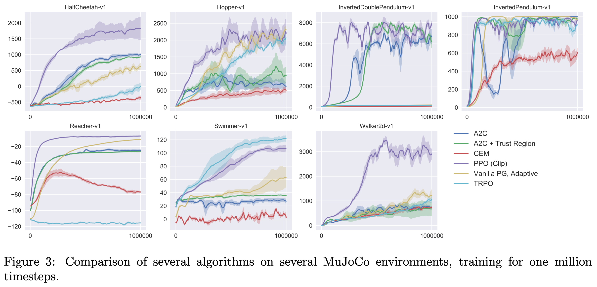

# 1 2017 PPO

- [Proximal Policy Optimization Algorithms](https://arxiv.org/pdf/1707.06347)

## Gemini Overview

- Proximal Policy Optimization (PPO) was specifically designed to bridge the gap between **Vanilla Policy Gradient** (which is simple but unstable and data-inefficient) and **TRPO** (which is stable but mathematically complex and incompatible with shared network architectures).

| Feature / Aspect | Vanilla Policy Gradient | Trust Region Policy Optimization (TRPO) | PPO Innovations & Advantages |
| --- | --- | --- | --- |
| **Objective Function** | $L^{PG}(\theta) = E_t[ \log \pi_\theta (a_t\|s_t) A_t] $ | $L^{CPI}(\theta) = E_t[ r_t(\theta) A_t ]$ subject to a hard mean KL constraint ($\le \delta$). | **Clipped Surrogate Objective ($L^{CLIP}$):** Pessimistic bound that clips the probability ratio $r_t(\theta)$ within $[1-\epsilon, 1+\epsilon]$, eliminating incentives for destructively large updates without hard constraints. |
| **Optimization Method** | First-order (Stochastic Gradient Ascent). | Second-order approximation (Conjugate Gradient method + Fisher Information Matrix computation). | **First-order Optimization:** Solved using standard gradient ascent (like Adam), making it vastly **simpler to implement** and computationally cheaper per step. |
| **Data / Sample Efficiency** | **Poor.** Performs only one gradient update per data sample; multiple updates on the same trajectory lead to collapse. | **Good.** Safe, large steps allowed by the trust region, but second-order calculations are slow in wall-clock time. | **High (Mini-batch Updates):** Safely allows **multiple epochs of mini-batch updates** on the same batch of collected trajectory data, greatly increasing sample efficiency. |
| **Architecture Compatibility** | Fully compatible. | **Incompatible** with shared parameters (Policy & Value networks) or architectures utilizing noise (e.g., Dropout). | **Fully Compatible:** Seamlessly handles joint architectures. The overall objective cleanly combines the policy loss, value function error ($L^{VF}$), and an exploration entropy bonus ($S$). |
| **Alternative Method** | N/A | Uses a fixed KL penalty variant ($L^{KLPEN}$), but a single $\beta$ coefficient fails to work across different tasks. | **Adaptive KL Penalty:** Alternatively introduces a dynamically scaling penalty coefficient $\beta$ that adjusts automatically if the KL divergence drifts from a target value ($d_{\text{targ}}$). |
| **Overall Balance** | Simple, but unstable and data-inefficient. | Stable and data-efficient, but mathematically complex and rigid. | **Favorable Balance:** Strikes the optimal trade-off between **sample complexity, implementation simplicity, and wall-clock execution time.** |

- Key Takeaway:
    - The core innovation of PPO is achieving the **reliability and step-size boundaries of TRPO** while throwing away the complex second-order math. 
    - By switching to a first-order optimization with **clipping**, PPO enables **multi-epoch mini-batch training** on the same data sample, which drastically boosts sample efficiency and makes it robust enough to use a single neural network for both policy and value predictions.

## Abstract

- We propose a new family of policy gradient methods for reinforcement learning, which alternate between sampling data through interaction with the environment, and optimizing a "surrogate" (代理的) objective function using stochastic gradient ascent. 
    - Whereas standard policy gradient methods perform one gradient update per data sample, we propose a novel objective function that enables multiple epochs of **mini-batch updates**.
    - The new methods, which we call proximal policy optimization (PPO), have some of the benefits of **trust region policy optimization (TRPO)**, but they are 
        - much simpler to implement, 
        - more general, 
        - and have better sample complexity (empirically). 
    - Our experiments test PPO on a collection of benchmark tasks, including simulated robotic locomotion and Atari game playing, and we show that PPO outperforms other **online** policy gradient methods, and overall strikes a favorable balance between sample complexity, simplicity, and wall-time.

## 1 Introduction

- In recent years, several different approaches have been proposed for reinforcement learning with neural network function approximators. 
    - The leading contenders are 
        - **deep Q-learning**,
        - **“vanilla” policy gradient** methods, 
        - **trust region / natural policy gradient** methods 
    - However, there is room for improvement in developing a method that is scalable (to large models and parallel implementations), data efficient, and robust (i.e., successful on a variety of problems without hyperparameter tuning). 
        - **Q-learning** (with function approximation) **fails on many simple problems and is poorly understood**,
            - While **DQN** works well on game environments like the Arcade Learning Environment with **discrete action spaces**, it has not been demonstrated to perform well on **continuous control** benchmarks such as those in OpenAI Gym and described by Duan et al.
        - **vanilla policy gradient** methods have poor data efficiency and robustness; 
        - **trust region policy optimization (TRPO)** is relatively complicated, and is not compatible with architectures that include noise (such as dropout) or parameter sharing (between the policy and value function, or with auxiliary tasks).

- This paper seeks to improve the current state of affairs by introducing an algorithm that attains the data efficiency and reliable performance of **TRPO**, while using only first-order optimization.
    - We propose a novel objective with clipped probability ratios, which forms a pessimistic estimate (i.e., lower bound) of the performance of the policy. 
    - To optimize policies, we alternate between 
        - sampling data from the policy 
        - and performing several epochs of optimization on the sampled data.

- Our experiments compare the performance of various different versions of the surrogate objective, and find that **the version with the clipped probability ratios performs best.** 
    - We also compare PPO to several previous algorithms from the literature. 
    - On continuous control tasks, it performs better than the algorithms we compare against. 
    - On Atari, it performs significantly better (in terms of sample complexity) than **A2C** and similarly to **ACER** though it is much simpler.

## 2 Background: Policy Optimization

### 2.1 Policy Gradient Methods

- Policy gradient methods work by computing an estimator of the policy gradient and plugging it into a stochastic gradient ascent algorithm. 

- The most commonly used gradient estimator has the form

$$ g = E_t [ \nabla_\theta \log \pi_\theta (a_t | s_t) A_t ] $$

- where $\pi_\theta$ is a stochastic policy 
- and $A_t$ is an estimator of the advantage function at timestep $t$

- Here, the expectation $E_t[...]$ indicates the empirical average over a finite batch of samples, in an algorithm that alternates between sampling and optimization. 

- Implementations that use automatic differentiation software work by constructing an objective function whose gradient is the policy gradient estimator; the estimator $g$ is obtained by differentiating the objective

$$ L^{PG}(\theta) = E_t[ \log \pi_\theta (a_t|s_t) A_t ] $$

- While it is appealing to perform multiple steps of optimization on this loss $L^{PG}$ using the same trajectory, doing so is not well-justified, and empirically it often leads to destructively large policy updates (see Section 6.1; results are not shown but were similar or worse than the "no clipping or penalty" setting).

### 2.2 Trust Region Methods

- In `TRPO`, an objective function (the “surrogate” objective) is maximized subject to a **constraint on the size of the policy update**. Specifically, 

$$
r_t(\theta) :=  { \pi_\theta (a_t|s_t) \over \pi_{\theta_\text{old}} (a_t|s_t) } \\[5pt]
\text{maximize}_\theta \quad \boxed{ L^{CPI}(\theta) := E_t \left[ r_t(\theta) A_t \right] } \\[5pt]
\text{subject to} \quad E_t[ \text{KL}[ \pi_{\theta_\text{old}} (\cdot|s_t), \pi_\theta (\cdot|s_t) ] ] \le \delta
$$

- Here, $\theta_\text{old}$ is the vector of policy parameters before the update. 
- The superscript $CPI$ refers to **Conservative Policy Iteration**, where this objective was proposed. 

- This problem can efficiently be approximately solved using the **conjugate gradient algorithm**, after making a linear approximation to the objective and a quadratic approximation to the constraint.

- The theory justifying TRPO actually suggests using a penalty instead of a constraint, i.e., solving the unconstrained optimization problem

$$
\text{maximize}_\theta \quad L^{KLPEN}(\theta) := E_t \left[
    r_t(\theta) A_t
    - \beta \text{KL}[ \pi_{\theta_\text{old}} (\cdot|s_t), \pi_\theta (\cdot|s_t) ]
\right]
$$

- for some coefficient $\beta$. 

- This follows from the fact that a certain surrogate objective (which computes the max KL over states instead of the mean) forms a lower bound (i.e., a pessimistic bound) on the performance of the policy $\pi$. 

- TRPO uses a hard constraint rather than a penalty because it is hard to choose a single value of $\beta$ that performs well across different problems — or even within a single problem, where the the characteristics change over the course of learning. 

- Hence, to achieve our goal of a first-order algorithm that emulates the monotonic improvement of TRPO, experiments show that it is not sufficient to simply choose a fixed penalty coefficient $\beta$ and optimize the penalized objective Equation with SGD; additional modifications are required.

## 3 Clipped Surrogate Objective

- **Without a constraint, maximization of $L^{CPI}$ would lead to an excessively large policy update; hence, we now consider how to modify the objective, to penalize changes to the policy that move $r_t(\theta)$ away from 1.**

- The main objective we propose is the following:

$$ r^{clip} \equiv \text{clip}(r_t(\theta), 1-\epsilon, 1+\epsilon) \\[5pt]
L^{CLIP}(\theta) = E_t[ \min( r_t(\theta) A_t,  r^{clip} A_t ) ] $$

- where epsilon is a hyperparameter, say, $\epsilon = 0.2$ 

- The motivation for this objective is as follows. 
    - The first term inside the `min` is $L^{CPI}$
    - The second term $r^{clip} A_t$ modifies the surrogate objective by clipping the probability ratio, which removes the incentive for moving $r_t$ outside of the interval $[1 − \epsilon, 1 + \epsilon]$. 
    - Finally, we take the minimum of the clipped and unclipped objective, **so the final objective is a lower bound (i.e., a pessimistic bound)** on the unclipped objective. 
    - With this scheme, we only ignore the change in probability ratio when it would make the objective improve, and we include it when it makes the objective worse. 

- Note that $L^{CLIP}(\theta) = L^{CPI}(\theta)$ to first order around $\theta_\text{old}$ (i.e., where $r = 1$), however, they become different as $\theta$ moves away from $\theta_\text{old}$. 

- Figure 1 plots a single term (i.e., a single $t$) in $L^{CLIP}$; note that the probability ratio $r$ is clipped at $1 − \epsilon$ or $1 + \epsilon$ depending on whether the advantage is positive or negative.

- Figure 2 provides another source of intuition about the surrogate objective $L^{CLIP}$.
    - It shows how several objectives vary as we interpolate along the policy update direction, obtained by proximal policy optimization (the algorithm we will introduce shortly) on a continuous control problem. 
    - **We can see that $L^{CLIP}$ is a lower bound on $L^{CPI}$, with a penalty for having too large of a policy update.**

## 4 Adaptive KL Penalty Coefficient

- **Another approach, which can be used as an alternative to the clipped surrogate objective, or in addition to it,**
    - is to use a penalty on KL divergence, and to adapt the penalty coefficient so that we achieve some target value of the KL divergence $d_\text{targ}$ each policy update. 
    - **In our experiments, we found that the KL penalty performed worse than the clipped surrogate objective, however, we’ve included it here because it’s an important baseline.**

- In the simplest instantiation of this algorithm, we perform the following steps in each policy update:
    - Using several epochs of **minibatch** SGD, optimize the KL-penalized objective $L^{KLPEN}(\theta)$
    - Compute $d = E_t[ \text{KL} ]$
        - If $d < d_\text{targ} / 1.5$, $\beta \gets \beta / 2$
        - If $d > d_\text{targ} \times 1.5$, $\beta \gets \beta \times 2$

- The updated $\beta$ is used for the next policy update. 
- With this scheme, we occasionally see policy updates where the KL divergence is significantly different from $d_\text{targ}$, however, these are rare, and $\beta$ quickly adjusts. 
- The parameters $1.5$ and $2$ above are chosen heuristically, but the algorithm is not very sensitive to them. 
- The initial value of $\beta$ is a another hyperparameter but is not important in practice because the algorithm quickly adjusts it.

## 5 Algorithm

- The surrogate losses from the previous sections can be computed and differentiated with a minor change to a typical policy gradient implementation. 
    - For implementations that use automatic differentiation, one simply constructs the loss $L^{CLIP}$ or $L^{KLPEN}$ instead of $L^{PG}$, and one performs multiple steps of stochastic gradient ascent on this objective.

- Most techniques for computing **variance-reduced advantage-function** estimators make use a learned state-value function $V(s)$; for example, **generalized advantage estimation**, or the finite-horizon estimators. 

- If using a neural network architecture that shares parameters between the policy and value function, we must use a loss function that combines the policy surrogate and a value function error term. 
- This objective can further be augmented by adding an entropy bonus to ensure sufficient exploration, as suggested in past work
- Combining these terms, we obtain the following objective, which is (approximately) maximized each iteration:

$$ L_t^{CLIP+VF+S}(\theta) = E_t[ L_t^{CLIP}(\theta) - c_1 L_t^{VF}(\theta) + c_2 S[\pi_\theta](s_t) ] \\[5pt]
L_t^{VF} = (V_\theta(s_t) - V_t^\text{targ})^2 $$

- where $c_1, c_2$ are coefficients, 
- and $S$ denotes an **entropy bonus**, 

---

- One style of policy gradient implementation, popularized in [Mni+16] and well-suited for use with recurrent neural networks, runs the policy for $T$ timesteps (**where $T$ is much less than the episode length**), and uses the collected samples for an update. 
    - This style requires an advantage estimator that **does not look beyond timestep $T$.** 
    - The estimator used by [Mni+16] is

$$ A_t = -V(s_t) + r_t + \gamma r_{t+1} + ... + \gamma^{T-t+1} r_{T-1} + \gamma^{T-t} V(s_T) $$

- where $t$ specifies the time index in $[0, T]$, within a given length-$T$ trajectory segment. 

- Generalizing this choice, we can use a **truncated version of Generalized Advantage Estimation**, which reduces to equation above when $\lambda = 1$:

$$
A_t = \delta_t + (\gamma \lambda) \delta_{t+1} + ... + (\gamma \lambda)^{T-t+1} \delta_{T-1} \\[5pt]
\delta_t := r_t + \gamma V(s_{t+1}) - V(s_t)
$$

- A proximal policy optimization (PPO) algorithm that uses fixed-length trajectory segments is shown below. 
    - Each iteration, each of $N$ **(parallel) actors** collect $T$ timesteps of data. 
    - Then we construct the surrogate loss on these $NT$ timesteps of data, and optimize it with **mini-batch Adam**, for $K$ epochs.

---

- **Algorithm 1 PPO, Actor-Critic Style**
    - for iteration = 1, 2, . . . do
        - for actor = 1, 2, . . . , N do
            - Run policy $\pi_{\theta_\text{old}}$ in environment for $T$ timesteps
            - Compute advantage estimates $A_1, ..., A_T$
        - Optimize surrogate $L$ wrt $\theta$, with $K$ epochs and **minibatch** size $M \le NT$
        - $\theta_\text{old} \gets \theta$

---

## 6 Experiments

### 6.1 Comparison of Surrogate Objectives

- First, we compare several different surrogate objectives under different hyperparameters. Here, we compare the surrogate objective $L^{CLIP}$ to several natural variations and ablated versions.

- For the KL penalty, one can either use a fixed penalty coefficient $\beta$ or an adaptive coefficient as described in Section 4 using target KL value $d_\text{targ}$. 
    - Note that we also tried clipping in log space, but found the performance to be no better.

- Because we are searching over hyperparameters for each algorithm variant, we chose a computationally cheap benchmark to test the algorithms on. 
    - Namely, we used 7 simulated robotics tasks implemented in OpenAI Gym, which use the `MuJoCo` physics engine. 
    - We do one million timesteps of training on each one. 
    - Besides the hyperparameters used for clipping ($\epsilon$) and the KL penalty ($\beta, d_\text{targ}$), which we search over, the other hyperparameters are provided in in Table 3.

- To represent the policy, we used a **fully-connected MLP** with two hidden layers of $64$ units, and `tanh` nonlinearities, outputting the mean of a Gaussian distribution, with variable standard deviations, following [Sch+15b; Dua+16]. 
    - **We don’t share parameters between the policy and value function (so coefficient $c_1$ is irrelevant), and we don’t use an entropy bonus.**

- Each algorithm was run on all 7 environments, with 3 random seeds on each. 
    - We scored each run of the algorithm by computing the average total reward of the last 100 episodes. 
    - We shifted and scaled the scores for each environment so that the random policy gave a score of $0$ and the best result was set to $1$, and averaged over 21 runs to produce a single scalar for each algorithm setting.

- The results are shown in Table 1. 
    - Note that the score is negative for the setting without clipping or penalties, because for one environment (half cheetah) it leads to a very negative score, which is worse than the initial random policy.

### 6.2 Comparison to Other Algorithms in the Continuous Domain

- Next, we compare PPO (with the “clipped” surrogate objective from Section 3) to several other methods from the literature, which are considered to be effective for continuous problems. 
    - We compared against tuned implementations of the following algorithms: 
        - **Trust Region Policy Optimization** [Sch+15b], 
        - **cross-entropy method (CEM)** [SL06], 
        - **Vanilla Policy Gradient** with adaptive step-size
        - **A2C** [Mni+16], 
        - **A2C with trust region** [Wan+16]. 
            - A2C stands for **advantage actor critic**, and is a synchronous version of A3C, which we found to have the same or better performance than the asynchronous version. 
    - For PPO, we used the hyperparameters from the previous section, with $\epsilon = 0.2$. 
    - **We see that PPO outperforms the previous methods on almost all the continuous control environments.**

### 6.3 Showcase in the Continuous Domain: Humanoid Running and Steering

- To showcase the performance of PPO on high-dimensional continuous control problems, we train on a set of problems involving a 3D humanoid, where the robot must 
    - run, steer, and get up off the ground, 
    - possibly while being pelted (连续攻击) by cubes. 
- The three tasks we test on are 
    - `RoboschoolHumanoid`: forward locomotion only, 
    - `RoboschoolHumanoidFlagrun`: position of target is randomly varied every 200 timesteps or whenever the goal is reached, 
    - `RoboschoolHumanoidFlagrunHarder`, where the robot is pelted by cubes and needs to get up off the ground. 
- See Figure 5 for still frames of a learned policy, and Figure 4 for learning curves on the three tasks. 

- Hyperparameters are provided in Table 4. 
- In concurrent work, Heess et al. used the adaptive KL variant of PPO (Section 4) to learn locomotion policies for 3D robots.

### 6.4 Comparison to Other Algorithms on the Atari Domain

- We also ran PPO on the Arcade Learning Environment benchmark and compared against well-tuned implementations of A2C and ACER. 
    - For all three algorithms, we used the same policy network architecture as used in [Mni+16]. 
    - The hyperparameters for PPO are provided in Table 5. 
    - For the other two algorithms, we used hyperparameters that were tuned to maximize performance on this benchmark.
    - A table of results and learning curves for all 49 games is provided in Appendix B. 
    - We consider the following two scoring metrics: 
        - average reward per episode over entire training period (which favors fast learning), and 
        - average reward per episode over last 100 episodes of training (which favors final performance). 
    - Table 2 shows the number of games “won” by each algorithm, where we compute the victor by averaging the scoring metric across three trials.

| | A2C | ACER | PPO | Tie |
| :--- | :---: | :---: | :---: | :---: |
| (1) avg. episode reward over all of training | 1 | 18 | **30** | 0 |
| (2) avg. episode reward over last 100 episodes | 1 | **28** | 19 | 1 |

## 7 Conclusion

- We have introduced proximal policy optimization, a family of policy optimization methods that use multiple epochs of stochastic gradient ascent to perform each policy update. 
- These methods have the stability and reliability of trust-region methods but are much simpler to implement, requiring only few lines of code change to a vanilla policy gradient implementation, applicable in more general settings (for example, when using a joint architecture for the policy and value function), and have better overall performance.
