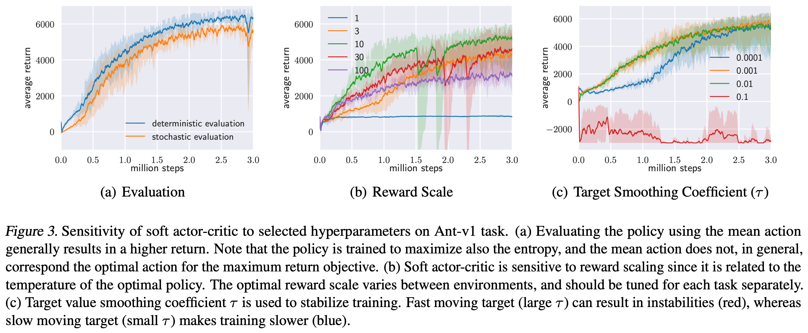
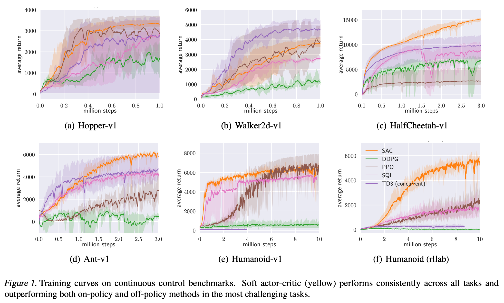
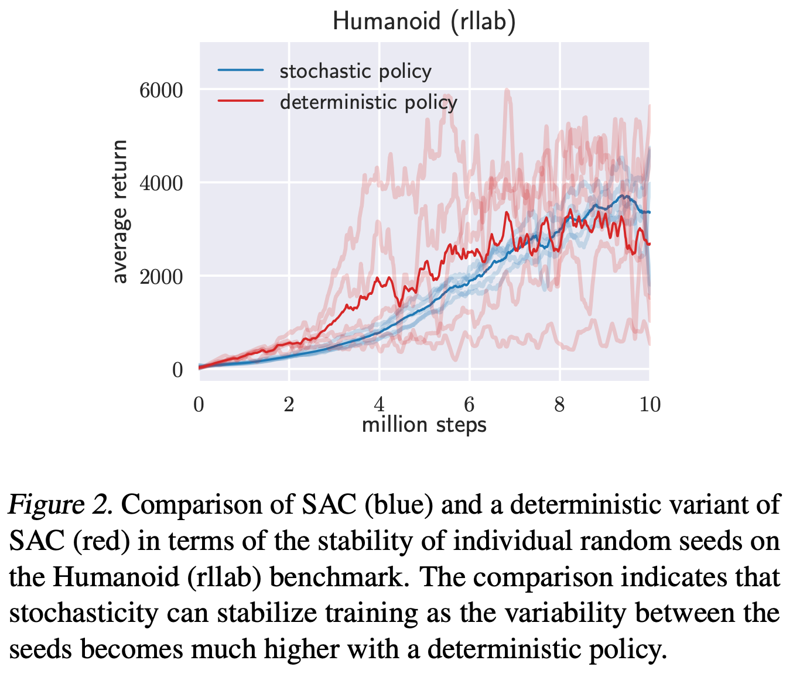

# 2 2018 SAC

- [Soft Actor-Critic: Off-Policy Maximum Entropy Deep Reinforcement Learning with a Stochastic Actor](https://arxiv.org/pdf/1801.01290)

- The source code of our SAC implementation and videos are available online.
    - https://github.com/haarnoja/sac
    - [video](https://www.youtube.com/watch?v=AMlKbCuYdS8&t=34s)

## Important

- Reward scale:
    - **Soft actor-critic is particularly sensitive to the scaling of the reward signal, because it serves the role of the temperature of the energy-based optimal policy and thus controls its stochasticity.**
    - **In practice, we found reward scale to be the only hyperparameter that requires tuning, and its natural interpretation as the inverse of the temperature in the maximum entropy framework provides good intuition for how to adjust this parameter.**

## Abstract

- Model-free deep reinforcement learning (RL) algorithms have been demonstrated on a range of challenging decision making and control tasks.

- However, these methods typically suffer from two major challenges: 
    - very high sample complexity 
    - and brittle convergence properties, which necessitate meticulous hyperparameter tuning. 
- Both of these challenges severely limit the applicability of such methods to complex, real-world domains.

- In this paper, we propose soft actor-critic, an **off-policy** actor-critic deep RL algorithm based on the maximum entropy reinforcement learning framework. 
    - **In this framework, the actor aims to maximize expected reward while also maximizing entropy. That is, to succeed at the task while acting as randomly as possible.** 
    - Prior deep RL methods based on this framework have been formulated as Q-learning methods. 
    - By combining **off-policy updates** with a stable stochastic actor-critic formulation, our method achieves state-of-the-art performance on a range of **continuous control** benchmark tasks, outperforming prior on-policy and off-policy methods. 
    - Furthermore, we demonstrate that, in contrast to other off-policy algorithms, our approach is very stable, achieving very similar performance across different random seeds.

## 1. Introduction

- Model-free deep reinforcement learning (RL) algorithms have been applied in a range of challenging domains, from games (Mnih et al., 2013; Silver et al., 2016) to robotic control (Schulman et al., 2015). 

- The combination of RL and high-capacity function approximators such as neural networks holds the promise of automating a wide range of decision making and control tasks, but widespread adoption of these methods in real-world domains has been hampered by two major challenges. 
    - First, model-free deep RL methods are notoriously expensive in terms of their sample complexity. 
        - Even relatively simple tasks can require millions of steps of data collection, and complex behaviors with high dimensional observations might need substantially more.
    - Second, these methods are often brittle with respect to their hyperparameters: learning rates, exploration constants, and other settings must be set carefully for different problem settings to achieve good results. 
- Both of these challenges severely limit the applicability of model-free deep RL to real-world tasks.

- **One cause for the poor sample efficiency of deep RL methods is on-policy learning**: 
    - some of the most commonly used deep RL algorithms, such as 
        - TRPO (Schulman et al., 2015),
        - PPO (Schulman et al., 2017b) 
        - or A3C (Mnih et al., 2016),
    - **require new samples to be collected for each gradient step.**
    - This quickly becomes extravagantly (奢侈地) expensive, as the number of gradient steps and samples per step needed to learn an effective policy increases with task complexity. 
    
- **Off-policy algorithms aim to reuse past experience.** 
    - **This is not directly feasible with conventional policy gradient formulations, but is relatively straightforward for Q-learning based methods (Mnih et al., 2015).** 
    - Unfortunately, the combination of off-policy learning and high-dimensional, nonlinear function approximation with neural networks presents a major challenge for stability and convergence (Bhatnagar et al.,2009). 
    - This challenge is further exacerbated (使恶化) in continuous state and action spaces, where a separate actor network is often used to perform the maximization in Q-learning. 
    - A commonly used algorithm in such settings, **deep deterministic policy gradient (DDPG) (Lillicrap et al., 2015)**, 
        - provides for sample-efficient learning 
        - but is notoriously challenging to use due to its extreme brittleness and hyperparameter sensitivity (Duan et al., 2016; Henderson et al., 2017).

- We explore how to design an efficient and stable model-free deep RL algorithm for **continuous state and action spaces**. 
    - To that end, we draw on the maximum entropy framework, which augments the standard maximum reward reinforcement learning objective with an entropy maximization term (Ziebart et al., 2008; Toussaint, 2009; Rawlik et al., 2012; Fox et al., 2016; Haarnoja et al., 2017). 
    - Maximum entropy reinforcement learning alters the RL objective, though the original objective can be recovered using a temperature parameter (Haarnoja et al., 2017). 
    - **More importantly, the maximum entropy formulation provides a substantial improvement in exploration and robustness**: as discussed by Ziebart (2010), maximum entropy policies are robust in the face of model and estimation errors, and as demonstrated by (Haarnoja et al., 2017), they improve exploration by acquiring diverse behaviors. 
    - Prior work has proposed model-free deep RL algorithms that perform on-policy learning with entropy maximization (O’Donoghue et al., 2016), as well as off-policy methods based on soft Q-learning and its variants (Schulman et al., 2017a; Nachum et al., 2017a; Haarnoja et al., 2017). 
        - However, the on-policy variants suffer from poor sample complexity for the reasons discussed above, 
        - while the off-policy variants require complex approximate inference procedures in continuous action spaces.

- In this paper, we demonstrate that we can devise (设计) an off-policy maximum entropy actor-critic algorithm, which we call soft actor-critic (SAC), which provides for both sample efficient learning and stability. 
    - This algorithm extends readily to very complex, high-dimensional tasks, such as the **Humanoid benchmark** (Duan et al., 2016) with **21 action dimensions**, where off-policy methods such as `DDPG` typically struggle to obtain good results (Gu et al., 2016). 
    - SAC also avoids the complexity and potential instability associated with approximate inference in prior off-policy maximum entropy algorithms based on soft Q-learning (Haarnoja et al., 2017). 
    - We present a convergence proof for policy iteration in the maximum entropy framework, and then introduce a new algorithm based on an approximation to this procedure that can be practically implemented with deep neural networks, which we call soft actor-critic. 
    - We present empirical results that show that soft actor-critic attains a substantial improvement in both performance and sample efficiency over both off-policy and on-policy prior methods.
    - We also compare to twin delayed deep deterministic (TD3) policy gradient algorithm (Fujimoto et al., 2018), which is a concurrent work that proposes a deterministic algorithm that substantially improves on DDPG.

## 2. Related Work

- Our soft actor-critic algorithm incorporates three key ingredients: 
    - an actor-critic architecture with separate policy and value function networks, 
    - an off-policy formulation that enables reuse of previously collected data for efficiency, 
    - and entropy maximization to enable stability and exploration.

- We review prior works that draw on some of these ideas in this section. 

- Actor-critic algorithms are typically derived starting from policy iteration, which alternates between 
    - policy evaluation — computing the value function for a policy
    - and policy improvement — using the value function to obtain a better policy (Barto et al., 1983; Sutton & Barto, 1998). 
- In large-scale reinforcement learning problems, it is typically impractical to run either of these steps to convergence, and instead the value function and policy are optimized jointly.

- In this case, the policy is referred to as the actor, and the value function as the critic. 

- Many actor-critic algorithms build on the standard, on-policy policy gradient formulation to update the actor (Peters & Schaal, 2008), and many of them also consider the entropy of the policy, but instead of maximizing the entropy, they use it as an regularizer (Schulman et al., 2017b; 2015; Mnih et al., 2016; Gruslys et al., 2017). 
    - On-policy training tends to improve stability but results in poor sample complexity.
    - There have been efforts to increase the sample efficiency while retaining robustness by incorporating off-policy samples and by using higher order variance reduction techniques (O’Donoghue et al., 2016; Gu et al., 2016). 
    - However, fully off-policy algorithms still attain better efficiency. 

- **A particularly popular off-policy actor-critic method, DDPG (Lillicrap et al., 2015), which is a deep variant of the deterministic policy gradient (Silver et al., 2014) algorithm**, 
    - uses a Q-function estimator to enable off-policy learning,
    - and a deterministic actor that maximizes this Q-function.
    - As such, this method can be viewed both as a deterministic actor-critic algorithm and an approximate Q-learning algorithm. 
    - **Unfortunately, the interplay between the deterministic actor network and the Q-function typically makes DDPG extremely difficult to stabilize and brittle to hyperparameter settings** (Duan et al., 2016; Henderson et al., 2017).
    - As a consequence, it is difficult to extend DDPG to complex, high-dimensional tasks, and on-policy policy gradient methods still tend to produce the best results in such settings (Gu et al., 2016). 
    
- Our method instead combines off-policy actor-critic training with a **stochastic actor**, and further aims to maximize the entropy of this actor with an entropy maximization objective. 
    - We find that this actually results in a considerably more stable and scalable algorithm that, in practice, exceeds both the efficiency and final performance of DDPG. 
    - A similar method can be derived as a zero-step special case of stochastic value gradients (SVG(0)) (Heess et al., 2015). 
    - However, SVG(0) differs from our method in that it optimizes the standard maximum expected return objective, and it does not make use of a separate value network, which we found to make training more stable.

- Maximum entropy reinforcement learning optimizes policies to maximize both the expected return and the expected entropy of the policy. 
    - This framework has been used in many contexts, from 
        - inverse reinforcement learning (Ziebart et al., 2008) 
        - to optimal control (Todorov, 2008; Toussaint, 2009; Rawlik et al., 2012). 
    - In guided policy search (Levine & Koltun, 2013; Levine et al., 2016), the maximum entropy distribution is used to guide policy learning towards high-reward regions. 
    - More recently, several papers have noted the connection between Q-learning and policy gradient methods in the framework of maximum entropy learning (O’Donoghue et al., 2016; Haarnoja et al., 2017; Nachum et al., 2017a; Schulman et al., 2017a). 
    - While most of the prior model-free works assume a discrete action space, Nachum et al. (2017b) approximate the maximum entropy distribution with a Gaussian and Haarnoja et al. (2017) with a sampling network trained to draw samples from the optimal policy. 
    - Although the soft Q-learning algorithm proposed by Haarnoja et al. (2017) has a value function and actor network, it is not a true actor-critic algorithm: the Q-function is estimating the optimal Q-function, and the actor does not directly affect the Q-function except through the data distribution. 
    - Hence, Haarnoja et al. (2017) motivates the actor network as an approximate sampler, rather than the actor in an actor-critic algorithm. 
    - Crucially, the convergence of this method hinges on how well this sampler approximates the true posterior. 
    - In contrast, we prove that our method converges to the optimal policy from a given policy class, regardless of the policy parameterization. 
    - Furthermore, these prior maximum entropy methods generally do not exceed the performance of state-of-the-art off-policy algorithms, such as DDPG, when learning from scratch, though they may have other benefits, such as improved exploration and ease of fine-tuning. 
    - In our experiments, we demonstrate that our soft actor-critic algorithm does in fact exceed the performance of prior state-of-the-art off-policy deep RL methods by a wide margin.

## 3. Preliminaries

- We first introduce notation and summarize the standard and maximum entropy reinforcement learning frameworks.

### 3.1. Notation

- We address policy learning in continuous action spaces.
    - We consider an infinite-horizon Markov decision process (MDP), defined by the tuple $(S, A, p, r)$, where the 
        - state space $S$ 
        - and the action space $A$ are continuous, 
        - and the unknown state transition probability $p: S \times S \times A \to [0, \infty)$ represents the probability density of the next state $s_{t+1} \in S$ given the current state $s_t \in S$ and action $a_t \in A$.
        - The environment emits a bounded reward $r: S \times A \to[r_{\min}, r_{\max}]$ on each transition. 
    - We will use $\rho_\pi (s_t)$ and $\rho_\pi (s_t, a_t)$ to denote the state and state-action marginals of the trajectory distribution induced by a policy $\pi(a_t|s_t)$.

### 3.2. Maximum Entropy Reinforcement Learning

- Standard RL maximizes the expected sum of rewards

$$ \sum_t E_{ (s_t, a_t) \sim \rho_\pi } [ r(s_t, a_t) ] $$

- We will consider a more general maximum entropy objective (see e.g. Ziebart (2010)), which favors stochastic policies by augmenting the objective with the expected entropy of the policy over $\rho_\pi(s_t)$:

$$ J(\pi) = \sum_{t=0}^T E_{ (s_t, a_t) \sim \rho_\pi } [ r(s_t, a_t) + \alpha H(\pi(\cdot|s_t)) ] $$

- The **temperature parameter $\alpha$** determines the relative importance of the entropy term against the reward, and thus controls the stochasticity of the optimal policy. 
    - The maximum entropy objective differs from the standard maximum expected reward objective used in conventional reinforcement learning, though the conventional objective can be recovered in the limit as $\alpha \to 0$. 
    - For the rest of this paper, we will omit writing the temperature explicitly, as it can always be subsumed into the reward by scaling it by $\alpha^{-1}$.

- This objective has a number of conceptual and practical advantages. 
    - First, the policy is incentivized to explore more widely, while giving up on clearly unpromising avenues 途径.
    - Second, the policy can capture multiple modes of near optimal behavior. In problem settings where multiple actions seem equally attractive, the policy will commit equal probability mass to those actions. 
    - Lastly, prior work has observed improved exploration with this objective (Haarnoja et al., 2017; Schulman et al., 2017a), and in our experiments, we observe that it considerably improves learning speed over state-of-art methods that optimize the conventional RL objective function. 

- We can extend the objective to **infinite horizon problems** by introducing a discount factor $\gamma$ to ensure that the sum of expected rewards and entropies is finite. 
    - Writing down the maximum entropy objective for the **infinite horizon discounted case** is more involved (Thomas, 2014) and is deferred to **Appendix A**.

- Prior methods have proposed directly solving for the optimal Q-function, from which the optimal policy can be recovered (Ziebart et al., 2008; Fox et al., 2016; Haarnoja et al., 2017). 
    - We will discuss how we can devise (设计) a soft actor-critic algorithm through a **policy iteration formulation**, where we instead evaluate the Q-function of the current policy and update the policy through an off-policy gradient update. 
    - Though such algorithms have previously been proposed for conventional reinforcement learning, our method is, to our knowledge, **the first off-policy actor-critic method in the maximum entropy reinforcement learning framework.**

## 4. From Soft Policy Iteration to Soft Actor-Critic

- Our off-policy soft actor-critic algorithm can be derived starting from a maximum entropy variant of the **policy iteration method**. 
    - We will first present this derivation, verify that the corresponding algorithm converges to the optimal policy from its density class, and then present a practical deep reinforcement learning algorithm based on this theory

### 4.1. Derivation of Soft Policy Iteration

- We will begin by deriving soft policy iteration, a general algorithm for learning optimal maximum entropy policies that alternates between policy evaluation and policy improvement in the maximum entropy framework. 
- Our derivation is based on a tabular setting, to enable theoretical analysis and convergence guarantees, and we extend this method into the general continuous setting in the next section. 
- We will show that soft policy iteration converges to the optimal policy within a set of policies which might correspond, for instance, to a set of parameterized densities.
- In the policy evaluation step of soft policy iteration, we wish to compute the value of a policy $\pi$ according to the maximum entropy objective in Equation 1. 

- Lemma 1 (Soft Policy Evaluation) 
    - For a fixed policy $\pi$, the **soft Q-value** can be computed iteratively, starting from any function $Q^0: S \times A \to R$ and repeatedly applying a **modified soft Bellman backup operator** $T^\pi$ given by

    $$ Q^{k+1} := T^\pi Q^k(s_t, a_t) := r(s_t, a_t) + \gamma E_{s_{t+1}\sim p}[V^k(s_{t+1})] \\[5pt] 
    V^k(s_t) := E_{a_t \sim \pi} [ Q^k(s_t, a_t) - \log \pi(a_t|s_t) ] $$

    - Then the sequence $Q^k$ will converge to the **soft Q-value** of $\pi$ as $k \to \infty$
    - Proof. See Appendix B.1.

- In the policy improvement step, we **update the policy towards the exponential of the new Q-function.** 
    - **This particular choice of update can be guaranteed to result in an improved policy in terms of its soft value.** 
    - Since in practice we prefer policies that are tractable (易驾驭的), we will additionally restrict the policy to some set of policies $\Pi$, which can correspond, for example, to a parameterized family of distributions such as Gaussians. To account for the constraint that $\pi \in \Pi$, we project the improved policy into the desired set of policies.
    - **While in principle we could choose any projection, it will turn out to be convenient to use the information projection defined in terms of the Kullback-Leibler divergence.** 
    - In the other words, in the policy improvement step, **for each state**, we update the policy according to

$$ \pi_\text{new} = \argmin_{\pi' \in \Pi} D_{KL} \left(
\pi'(\cdot|s_t) \middle\| { \exp( Q^{\pi_\text{old}}(s_t, \cdot) ) \over Z^{\pi_\text{old}}(s_t) }
\right) $$

- The **partition function** $Z^{\pi_\text{old}}(s_t)$ **normalizes the distribution**, and while it is intractable (棘手) in general, it **does not contribute to the gradient** with respect to the new policy and **can thus be ignored**, as noted in the next section. 

- Lemma 2 (Soft Policy Improvement). 
    - For this projection, we can show that the new, projected policy has a higher value than the old policy with respect to the objective in Equation 1. 
    - Let $\pi_\text{old} \in \Pi$ and let $\pi_\text{new}$ be the optimizer of the minimization problem defined in Equation 4. 
    - Then $Q^{\pi_\text{new}}(s_t, a_t) \ge Q^{\pi_\text{old}}(s_t, a_t)$ for all $(s_t, a_t) \in S \times A$ with $|A| < \infty$
    - Proof. See Appendix B.2.

- The full soft policy iteration algorithm alternates between
    - the soft policy evaluation 
    - and the soft policy improvement steps, 
- and it will provably converge to the optimal maximum entropy policy among the policies in $\Pi$ (Theorem 1).
- **Although this algorithm will provably find the optimal solution, we can perform it in its exact form only in the tabular case.** 
    - **Therefore, we will next approximate the algorithm for continuous domains, where we need to rely on a function approximator to represent the Q-values**, 
    - and running the two steps until convergence would be computationally too expensive. 
    - **The approximation gives rise to a new practical algorithm, called soft actor-critic.**

- Theorem 1 (Soft Policy Iteration). 
    - Repeated application of **soft policy evaluation** and **soft policy improvement** from any $\pi \in \Pi$ converges to a policy $\pi^*$ such that $Q^{\pi^*}(s_t, a_t) \ge Q^\pi(s_t, a_t)$ for all $\pi \in \Pi$ and $(s_t, a_t) \in S \times A$, assuming $|A| < \infty$.
    - Proof. See Appendix B.3.

### 4.2. Soft Actor-Critic

- As discussed above, large **continuous domains** require us to derive a **practical approximation** to soft policy iteration. 
    - To that end, we will use **function approximators** for both the Q-function and the policy, and instead of running evaluation and improvement to convergence, alternate between optimizing both networks with stochastic gradient descent. 
    - We will consider 
        - a parameterized state value function $V_\psi(s_t)$, 
        - soft Q-function $Q_\theta(s_t, a_t)$, 
        - and a tractable policy $\pi_\phi(a_t|s_t)$.
    - The parameters of these networks are $\psi, \theta, \phi$. 
    - For example, 
        - **the value functions can be modeled as expressive neural networks**, 
        - **and the policy as a Gaussian with mean and covariance given by neural networks.** 
    - We will next derive update rules for these parameter vectors.

- The state value function approximates the soft value. 
    - **There is no need in principle to include a separate function approximator for the state value** $V(s_t)$, since it is related to the Q-function and policy according to Equation 3. 
    - This quantity can be estimated from a single action sample from the current policy without introducing a bias, 
    - **but in practice, including a separate function approximator for the soft value $V(s_t)$ can stabilize training and is convenient to train simultaneously with the other networks.** 
    - The soft value function is trained to minimize the squared residual error

$$ J_V(\psi) = E_{s_t \sim D} \left[ {1\over 2} \left(
V_\psi(s_t) - \hat{V}(s_t) \right)^2 \right] \\[5pt]
\hat{V}(s_t) := E_{a_t \sim \pi_\phi} [ Q_\theta(s_t, a_t) - \log \pi_\phi(a_t|s_t) ] $$

- where $D$ is the distribution of **previously sampled states and actions, or a replay buffer.** 

- The gradient can be estimated with an unbiased estimator

$$ \nabla_\psi J_V(\psi) = 
\left(
V_\psi(s_t) - 
Q_\theta(s_t, a_t) + \log \pi_\phi(a_t|s_t) 
\right) \nabla_\psi V_\psi(s_t) $$

- **where the actions are sampled according to the current policy, instead of the replay buffer.** 

- **The soft Q-function parameters can be trained to minimize the soft Bellman residual**

$$ J_Q(\theta) = E_{(s_t, a_t)\sim D} \left[ {1\over 2} \left(
Q_\theta(s_t, a_t) - \hat{Q}(s_t, a_t) \right)^2 \right] \\[5pt]
\hat{Q}(s_t, a_t) := r(s_t, a_t) + \gamma E_{s_{t+1}\sim p}[V_{\bar{\psi}}(s_{t+1})] \\[10pt]
\nabla_\theta J_Q(\theta) = ( Q_\theta(s_t, a_t) - r(s_t, a_t) - \gamma V_{\bar{\psi}}(s_{t+1}) ) \nabla_\theta Q_\theta(s_t, a_t) $$

- **The update makes use of a target value network $V_{\bar{\psi}}$, where $\bar{\psi}$ can be an exponentially moving average of the value network weights, which has been shown to stabilize training (Mnih et al., 2015).** 
    - Alternatively, we can update the target weights to match the current value function weights periodically (see Appendix E). 
    
- Finally, the policy parameters can be learned by directly minimizing the expected KL-divergence in Equation 4:

$$ J_\pi(\phi) = E_{s_t\sim D} \left[ D_{KL} \left(
\pi_\phi( \cdot|s_t ) \middle\| { \exp( Q_\theta(s_t, \cdot) ) \over Z_\theta(s_t) }
 \right) \right] $$

- There are several options for minimizing $J_\pi$. 
    - A typical solution for **policy gradient methods** is to use the **likelihood ratio gradient estimator (Williams, 1992)**, which does not require backpropagating the gradient through the policy and the target density networks. 
    - **However, in our case, the target density is the Q-function, which is represented by a neural network and can be differentiated, and it is thus convenient to apply the reparameterization trick instead, resulting in a lower variance estimator.** 
    - To that end, we reparameterize the policy using a neural network transformation

$$ a_t = f_\phi(\epsilon_t ; s_t) $$

- where $\epsilon_t$ is an input noise vector, sampled from some fixed distribution, such as a spherical Gaussian. We can now rewrite the objective in Equation 10 as

$$ J_\pi(\phi) = E_{s_t\sim D, \; \epsilon_t \sim \mathcal{N} } \left[
\log \pi_\phi( f_\phi(\epsilon_t ; s_t) | s_t )
- Q_\theta(s_t, f_\phi(\epsilon_t ; s_t))
\right] $$

- where $\pi_\phi$ is defined implicitly in terms of $f_\phi$, and we have noted that **the partition function is independent of $\phi$ and can thus be omitted.** 
- We can approximate the gradient of Equation 12 with

$$ \nabla_\phi J_\pi(\phi) = \boxed{ \nabla_\phi \log \pi_\phi( a_t | s_t ) + \nabla_{a_t} \log \pi_\phi(a_t|s_t) \; \nabla_\phi f_\phi(\epsilon_t;s_t) } \\[5pt]
- \nabla_{a_t}Q(s_t, a_t) \; \nabla_\phi f_\phi(\epsilon_t;s_t) $$

- where $a_t$ is evaluated at $ f_\phi(\epsilon_t;s_t) $. 
- **This unbiased gradient estimator extends the DDPG style policy gradients (Lillicrap et al., 2015) to any tractable stochastic policy.**

---

- Study note for **the boxed term**:
    - In a **reparameterized policy (like a Gaussian policy)**, your neural network doesn't output the action directly. 
        - Instead, the network takes the state $s_t$ and outputs the parameters of a distribution ($\mu_\phi(s_t)$ and $\log \sigma_\phi(s_t)$).
        - The reparameterization function $f_\phi(\epsilon_t; s_t)$ is the deterministic mapping that takes those network outputs and combines them with independent noise $\epsilon_t \sim \mathcal{N}(0, I)$ to sample an action:
        
        $$ a_t = f_\phi(\epsilon_t; s_t) = \mu_\phi(s_t) + \sigma_\phi(s_t) \odot \epsilon_t $$

    - There are two paths for $\phi$:
        - As the functional parameter dictating the shape of the distribution: $\pi_\phi(\cdot)$
        - Inside the action argument via the reparameterization function: $a_t = f_\phi(\epsilon_t; s_t)$
    - If you change the weights $\phi$ slightly, two things happen simultaneously:
        - The distribution shifts: The actual shape/landscape of the probability density function $\pi_\phi$ changes. 
        - The action moves: The specific action $a_t$ generated by $f_\phi$ shifts to a new position on that landscape.

    - If you have a function $g(\phi, a(\phi))$, its total derivative with respect to $\phi$ is:
    
    $$ {d \over d\phi} g(\phi, a(\phi)) = {\partial g \over \partial \phi} \cdot 1 + {\partial g \over \partial a} {\partial a \over \partial \phi} $$

---

- **Our algorithm also makes use of two Q-functions to mitigate positive bias in the policy improvement step that is known to degrade performance of value based methods (Hasselt, 2010; Fujimoto et al., 2018).** 
    - In particular, we parameterize two Q-functions, with parameters $\theta_i$, and train them independently to optimize $J_Q(\theta_i)$. 
    - **We then use the minimum of the Q-functions for the value gradient in Equation 6 and policy gradient in Equation 13, as proposed by Fujimoto et al. (2018).** 
    - Although our algorithm can learn challenging tasks, including a **21-dimensional Humanoid**, using just a single Q-function, 
        - **we found two Q-functions significantly speed up training, especially on harder tasks.** 
    - The complete algorithm is described in Algorithm 1. The method alternates between 
        - collecting experience from the environment with the current policy 
        - and updating the function approximators using the stochastic gradients from batches sampled from a replay buffer. 
    - **In practice, we take a single environment step followed by one or several gradient steps (see Appendix D for all hyperparameter).** 
        - Using off-policy data from a replay buffer is feasible because both value estimators and the policy can be trained entirely on off-policy data. 
    - The algorithm is agnostic to the parameterization of the policy, as long as it can be evaluated for any arbitrary state-action tuple.

---

- **Algorithm 1 Soft Actor-Critic**
    - Initialize parameter vectors $\psi, \bar{\psi}, \theta, \phi$
    - for each iteration do
        - for each environment step do
            - $a_t \sim \pi_\phi(a_t|s_t) \quad s_{t+1} \sim p(s_{t+1}|s_t, a_t)$
            - $D \gets D \cup \{(s_t, a_t, r(s_t, a_t), s_{t+1})\}$
        - for each gradient step do
            - $\psi \gets \psi - \lambda_V \nabla_\psi J_V(\psi)$
            - $\theta_i \gets \theta_i − \lambda_Q \nabla_{\theta_i} J_Q(\theta_i) \text{ for } i \in \{1, 2\}$
            - $\phi \gets \phi − \lambda_\pi \nabla_\phi J_\pi(\phi)$
            - $\bar{\psi} \gets \tau \psi + (1 − \tau) \bar{\psi}$

$$ J_V(\psi) = E_{s_t \sim D} \left[ {1\over 2} \left(
V_\psi(s_t) - \hat{V}(s_t) \right)^2 \right] \\[5pt]
\hat{V}(s_t) := E_{a_t \sim \pi_\phi} [ Q_\theta(s_t, a_t) - \log \pi_\phi(a_t|s_t) ] \\[10pt]
J_Q(\theta) = E_{(s_t, a_t)\sim D} \left[ {1\over 2} \left(
Q_\theta(s_t, a_t) - \hat{Q}(s_t, a_t) \right)^2 \right] \\[5pt]
\hat{Q}(s_t, a_t) := r(s_t, a_t) + \gamma E_{s_{t+1}\sim p}[V_{\bar{\psi}}(s_{t+1})] \\[10pt]
J_\pi(\phi) = E_{s_t\sim D, \; \epsilon_t \sim \mathcal{N} } \left[
\log \pi_\phi( f_\phi(\epsilon_t ; s_t) | s_t )
- Q_\theta(s_t, f_\phi(\epsilon_t ; s_t))
\right] $$

---

## 5. Experiments

- The goal of our experimental evaluation is to understand how the **sample complexity** and **stability** of our method compares with prior off-policy and on-policy deep reinforcement learning algorithms. 

- We compare our method to prior techniques on a range of challenging continuous control tasks from the OpenAI gym benchmark suite (Brockman et al., 2016) and also on the rllab implementation of the Humanoid task (Duan et al., 2016). 

- Although the easier tasks can be solved by a wide range of different algorithms, **the more complex benchmarks, such as the 21-dimensional Humanoid (rllab), are exceptionally difficult to solve with off-policy algorithms (Duan et al., 2016).** 

- The stability of the algorithm also plays a large role in performance: easier tasks make it more practical to tune hyperparameters to achieve good results, while the already narrow basins (盆) of effective hyperparameters become prohibitively small for the more sensitive algorithms on the hardest benchmarks, leading to poor performance (Gu et al., 2016).

- We compare our method to 
    - **deep deterministic policy gradient (DDPG)** (Lillicrap et al., 2015), an algorithm that is regarded as one of the more efficient off-policy deep RL methods (Duan et al., 2016); 
    - **proximal policy optimization (PPO)** (Schulman et al., 2017b), a stable and effective on-policy policy gradient algorithm; 
    - and **soft Q-learning (SQL)** (Haarnoja et al., 2017), a recent off-policy algorithm for learning maximum entropy policies. 
        - Our SQL implementation also includes two Q-functions, which we found to improve its performance in most environments. 
    - **twin delayed deep deterministic policy gradient algorithm (TD3)** (Fujimoto et al., 2018), using the author-provided implementation. 
        - This is an extension to DDPG, proposed concurrently to our method, that first applied the double Q-learning trick to continuous control along with other improvements. 
    - **trust region path consistency learning (Trust-PCL)** (Nachum et al., 2017b) 
    - and two other variants of SAC in Appendix E. 

- We turned off the exploration noise for evaluation for DDPG and PPO. 
- For maximum entropy algorithms, which do not explicitly inject exploration noise, we either evaluated with the exploration noise (SQL) or use the mean action (SAC).

### 5.1. Comparative Evaluation

- Figure 1 shows the total average return of evaluation rollouts during training for `DDPG, PPO, and TD3`. 
    - We train five different instances of each algorithm with different random seeds, with each performing one evaluation rollout every 1000 environment steps. 
        - The solid curves corresponds to the mean and the shaded region to the minimum and maximum returns over the five trials.
    - The results show that, overall, SAC performs comparably to the baseline methods on the easier tasks and outperforms them on the harder tasks with a large margin, both in terms of learning speed and the final performance. 
        - For example, DDPG fails to make any progress on Ant-v1, Humanoidv1, and Humanoid (rllab), a result that is corroborated by prior work (Gu et al., 2016; Duan et al., 2016). 
    - **SAC also learns considerably faster than PPO as a consequence of the large batch sizes PPO needs to learn stably on more high-dimensional and complex tasks.** 
    - Another maximum entropy RL algorithm, SQL, can also learn all tasks, but it is slower than SAC and has worse asymptotic performance.
    - The quantitative results attained by SAC in our experiments also compare very favorably to results reported by other methods in prior work (Duan et al., 2016; Gu et al., 2016; Henderson et al., 2017), indicating that both the sample efficiency and final performance of SAC on these benchmark tasks exceeds the state of the art. 
    - All hyperparameters used in this experiment for SAC are listed in Appendix D.

### 5.2. Ablation Study

- The results in the previous section suggest that algorithms based on **the maximum entropy principle** can outperform conventional RL methods on challenging tasks such as the humanoid tasks. 

- In this section, we further examine which particular components of SAC are important for good performance. 

- We also examine how sensitive SAC is to some of the most important hyperparameters, namely 
    - reward scaling 
    - and target value update smoothing constant.

#### Stochastic vs. deterministic policy. 

- Soft actor-critic learns stochastic policies via a maximum entropy objective. 
    - The entropy appears in both the policy and value function. 
        - In the policy, it prevents premature convergence of the policy variance (Equation 10). 
        - In the value function, it encourages exploration by increasing the value of regions of state space that lead to high-entropy behavior (Equation 5).
    - To compare how the stochasticity of the policy and entropy maximization affects the performance, **we compare to a deterministic variant of SAC that does not maximize the entropy and that closely resembles DDPG**, with the exception of 
        - having two Q-functions, 
        - using hard target updates, 
        - not having a separate target actor, 
        - and using fixed rather than learned exploration noise. 
    - Figure 2 compares five individual runs with both variants, initialized with different random seeds. 
    - Soft actor-critic performs much more consistently, while the deterministic variant exhibits very high variability across seeds, indicating **substantially worse stability.** 
    - As evident from the figure, learning a stochastic policy with entropy maximization can drastically stabilize training. 
    - This becomes especially important with harder tasks, where tuning hyperparameters is challenging. 
    - In this comparison, we updated the target value network weights with hard updates, by periodically overwriting the target network parameters to match the current value network (see Appendix E for a comparison of average performance on all benchmark tasks).

#### Policy evaluation. 

- Since SAC converges to stochastic policies, it is often beneficial to make the final policy deterministic at the end for best performance. 
    - For evaluation, we approximate the maximum a posteriori action by choosing the mean of the policy distribution. 
    - Figure 3(a) compares training returns to evaluation returns obtained with this strategy indicating that **deterministic evaluation can yield better performance.** 
    - It should be noted that all of the training curves depict the sum of rewards, which is different from the objective optimized by SAC and other maximum entropy RL algorithms, including SQL and Trust-PCL, which maximize also the entropy of the policy.

#### Reward scale. 

- **Soft actor-critic is particularly sensitive to the scaling of the reward signal, because it serves the role of the temperature of the energy-based optimal policy and thus controls its stochasticity.** 
    - Larger reward magnitudes correspond to lower entries. 
    - Figure 3(b) shows how learning performance changes when the reward scale is varied: 
        - For small reward magnitudes, the policy becomes nearly uniform, and consequently fails to exploit the reward signal, resulting in substantial degradation of performance. 
        - For large reward magnitudes, the model learns quickly at first, but the policy then becomes nearly deterministic, leading to poor local minima due to lack of adequate exploration.
        - With the right reward scaling, the model balances exploration and exploitation, leading to faster learning and better asymptotic performance. 
    - **In practice, we found reward scale to be the only hyperparameter that requires tuning, and its natural interpretation as the inverse of the temperature in the maximum entropy framework provides good intuition for how to adjust this parameter.**

#### Target network update. 

- **It is common to use a separate target value network that slowly tracks the actual value function to improve stability.** 
    - We use an exponentially moving average, with a smoothing constant $\tau$, to update the target value network weights as common in the prior work (Lillicrap et al., 2015; Mnih et al., 2015). 
    - A value of $1$ corresponds to a hard update where the weights are copied directly at every iteration and $0$ to not updating the target at all. 
    - In Figure 3(c), we compare the performance of SAC when $\tau$ varies. 
    - Large $\tau$ can lead to instabilities while small $\tau$ can make training slower. 
    - However, we found the range of suitable values of $\tau$ to be relatively wide and we used the same value (**0.005**) across all of the tasks. 
    - In Figure 4 (Appendix E) we also compare to another variant of SAC, where instead of using exponentially moving average, we copy over the current network weights directly into the target network every 1000 gradient steps. 
        - **We found this variant to benefit from taking more than one gradient step between the environment steps, which can improve performance but also increases the computational cost.**

## 6. Conclusion

- We present soft actor-critic (SAC), an `off-policy` `maximum entropy` deep reinforcement learning algorithm that provides sample-efficient learning while retaining the benefits of entropy maximization and stability. 
    - Our theoretical results derive soft policy iteration, which we show to converge to the optimal policy. 
    - From this result, we can formulate a soft actor-critic algorithm, and we empirically show that it outperforms state-of-the-art model-free deep RL methods, including the off-policy DDPG algorithm and the on-policy PPO algorithm. 
        - In fact, the sample efficiency of this approach actually exceeds that of DDPG by a substantial margin. 
    - Our results suggest that stochastic, entropy maximizing reinforcement learning algorithms can provide a promising avenue for improved robustness and stability, and further exploration of maximum entropy methods, including methods that incorporate 
        - second order information (e.g., trust regions (Schulman et al., 2015)) 
        - or more expressive policy classes 
    - is an exciting avenue for future work.
