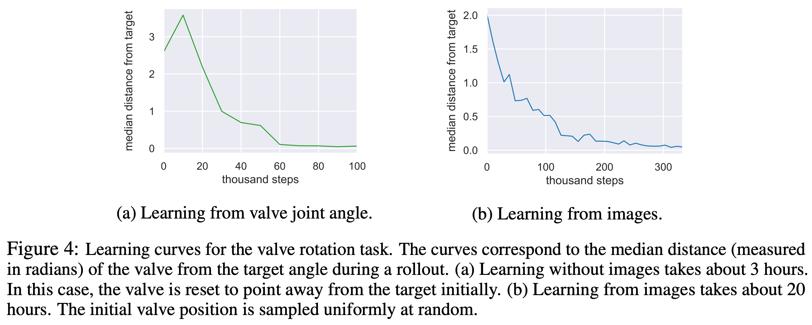

# 2 2018 SAC v2

- [Soft Actor-Critic Algorithms and Applications](https://arxiv.org/pdf/1812.05905)

- https://github.com/rail-berkeley/softlearning/
- https://sites.google.com/view/sac-and-applications/

## Abstract

- Model-free deep reinforcement learning (RL) algorithms have been successfully applied to a range of challenging sequential decision making and control tasks.
- However, these methods typically suffer from two major challenges: 
    - high sample complexity 
    - and brittleness to hyperparameters. 
- Both of these challenges limit the applicability of such methods to real-world domains. 
- In this paper, we describe Soft Actor-Critic (SAC), our recently introduced off-policy actor-critic algorithm based on the maximum entropy RL framework. 
- In this framework, the actor aims to simultaneously maximize **expected return** and **entropy**; that is, to succeed at the task while acting as randomly as possible. 
- **We extend SAC to incorporate a number of modifications that accelerate training and improve stability with respect to the hyperparameters, including a constrained formulation that automatically tunes the temperature hyperparameter.** 

- We systematically evaluate SAC on a range of benchmark tasks, as well as challenging real-world tasks such as 
    - locomotion for a quadrupedal robot 
    - and robotic manipulation with a dexterous hand. 
- With these improvements, SAC achieves state-of-the-art performance, outperforming prior on-policy and off-policy methods in sample-efficiency and asymptotic performance.
- Furthermore, we demonstrate that, in contrast to other off-policy algorithms, our approach is very stable, achieving similar performance across different random seeds. 
- These results suggest that SAC is a promising candidate for learning in real-world robotics tasks.

## 1 Introduction

## 2 Related Work

## 3 Preliminaries

### 3.1 Notation

### 3.2 Maximum Entropy Reinforcement Learning

- Maximum entropy objective:

$$ J(\pi) = \sum_{t=0}^T E_{ (s_t, a_t) \sim \rho_\pi } [ r(s_t, a_t) + \alpha H(\pi(\cdot|s_t)) ] $$

## 4 From Soft Policy Iteration to Soft Actor-Critic

### 4.1 Soft Policy Iteration

- Bellman backup operator:

$$ Q^{k+1} := T^\pi Q^k(s_t, a_t) := r(s_t, a_t) + \gamma E_{s_{t+1}\sim p}[V^k(s_{t+1})] \\[5pt] 
V^k(s_t) := E_{a_t \sim \pi} [ Q^k(s_t, a_t) - {\color{red}\alpha} \log \pi(a_t|s_t) ] $$

- In the policy improvement step, for each state, we update the policy
according to

$$ \pi_\text{new} = \argmin_{\pi' \in \Pi} D_{KL} \left(
\pi'(\cdot|s_t) \middle\| { \exp( {\color{red}\alpha^{-1}} Q^{\pi_\text{old}}(s_t, \cdot) ) \over Z^{\pi_\text{old}}(s_t) }
\right) $$

### 4.2 Soft Actor-Critic

- **The soft Q-function parameters can be trained to minimize the soft Bellman residual**:

$$ J_Q(\theta) = E_{(s_t, a_t)\sim D} \left[ {1\over 2} \left(
Q_\theta(s_t, a_t) - \hat{Q}(s_t, a_t) \right)^2 \right] \\[5pt]
\hat{Q}(s_t, a_t) := r(s_t, a_t) + \gamma E_{s_{t+1}\sim p}[ {\color{red} V_{\bar{\theta}}}(s_{t+1})] \\[10pt]
\nabla_\theta J_Q(\theta) = ( Q_\theta(s_t, a_t) - r(s_t, a_t) - \gamma {\color{red} V_{\bar{\theta}}}(s_{t+1}) ) \nabla_\theta Q_\theta(s_t, a_t) $$

- **where the value function is implicitly parameterized through the soft Q-function parameters via Equation 3**
    - **In (Haarnoja et al., 2018c) we introduced an additional function approximator for the value function, but later found it to be unnecessary.**

- The update makes use of a target soft Q-function with parameters $\bar{\theta}$ that are obtained as an **exponentially moving average** of the soft Q-function weights, which has been shown to stabilize training (Mnih
et al., 2015).

- Finally, the policy parameters can be learned by directly minimizing the expected KL-divergence in Equation 4:

$$ J_\pi(\phi) = E_{s_t\sim D} \left[ D_{KL} \left(
\pi_\phi( \cdot|s_t ) \middle\| { \exp( {\color{red}\alpha^{-1}} Q_\theta(s_t, \cdot) ) \over Z_\theta(s_t) }
\right) \right] \\[5pt]
\text{ignore } Z_\theta(s_t) \text{, scale by } \alpha: \\[5pt]
{\color{red} J_\pi(\phi) = E_{s_t\sim D} \left[ E_{a_t\sim \pi_\phi} \left[
\alpha \log \pi_\phi( a_t|s_t ) -  Q_\theta(s_t, a_t)  
\right] \right] } $$

- Study note: $$ D_{KL}(P \parallel Q) := E_{x \sim P} [ \log P(x) - \log Q(x)] $$

- We reparameterize the policy using a neural network transformation:

$$ a_t = f_\phi(\epsilon_t ; s_t) $$

- where $\epsilon_t$ is an input noise vector, sampled from some fixed distribution, such as a spherical Gaussian. We can now rewrite the objective in Equation 7 as:

$$ J_\pi(\phi) = E_{s_t\sim D, \; \epsilon_t \sim \mathcal{N} } \left[
{\color{red} \alpha} \log \pi_\phi( f_\phi(\epsilon_t ; s_t) | s_t )
- Q_\theta(s_t, f_\phi(\epsilon_t ; s_t))
\right] $$

- We can approximate the gradient of Equation 9 with:

$$ \nabla_\phi J_\pi(\phi) = \boxed{ \nabla_\phi {\color{red} \alpha} \log \pi_\phi( a_t | s_t ) + \nabla_{a_t} {\color{red} \alpha} \log \pi_\phi(a_t|s_t) \; \nabla_\phi f_\phi(\epsilon_t;s_t) } \\[5pt]
- \nabla_{a_t}Q(s_t, a_t) \; \nabla_\phi f_\phi(\epsilon_t;s_t) $$

## 5 Automating Entropy Adjustment for Maximum Entropy RL

- In the previous section, we derived a practical off-policy algorithm for learning maximum entropy policies of a given temperature.
    - **Unfortunately, choosing the optimal temperature is non-trivial, and the temperature needs to be tuned for each task.** 
    - Instead of requiring the user to set the temperature manually, we can automate this process by formulating a different maximum entropy reinforcement learning objective, where the entropy is treated as a constraint. 

- The **magnitude of the reward** differs not only across tasks, but it also depends on the policy, which improves over time during training. 
    - Since the **optimal entropy** depends on this magnitude, this makes the temperature adjustment particularly difficult: 
        - the entropy can vary unpredictably both across tasks and during training as the policy becomes better. 
        - Simply forcing the entropy to a fixed value is a poor solution, since the policy should be free to explore more in regions where the optimal action is uncertain, but remain more deterministic in states with a clear distinction between good and bad actions. 
        
- Instead, we formulate a constrained optimization problem where the average entropy of the policy is constrained, while the entropy at different states can vary. 
    - Similar approach was taken in (Abdolmaleki et al., 2018), **where the policy was constrained to remain close to the previous policy.** 
    - We show that the dual to this constrained optimization leads to the soft actor-critic updates, along with an additional update for the dual variable, which plays the role of the temperature. 
    
- Our formulation also makes it possible to learn the entropy with more expressive policies that can model multi-modal distributions, such as policies based on normalizing flows (Haarnoja et al., 2018a) for which no closed form expression for the entropy exists. 

- We will derive the update for finite horizon case, and then derive an approximation for stationary policies by dropping the time dependencies from the policy, soft Q-function, and the temperature.

- **Our aim is to find a stochastic policy with maximal expected return that satisfies a minimum expected entropy constraint.** Formally, we want to solve the constrained optimization problem

$$ \max_{\pi_{0:T}} E_{\rho_\pi} \left[ \sum_{t=0}^T r(s_t, a_t) \right] \\[5pt]
s.t. \quad E_{(s_t, a_t)\sim \rho_\pi} [-\log \pi_t(a_t|s_t) ] \ge H \quad \forall t $$

- where $H$ is a desired minimum expected entropy. 

- Note that, for fully observed MDPs, the policy that optimizes the expected return is deterministic, so we expect this constraint to usually be tight and do not need to impose an upper bound on the entropy.

- Since the policy at time $t$ can only affect the **future** objective value, we can employ an (approximate) **dynamic programming** approach, solving for the policy backward through time. We rewrite the objective as an **iterated maximization**

$$ \max_{\pi_0} \left(
E[r(s_0, a_0)] + \max_{\pi_1} \left(
E[r(s_1, a_1)] + ...
\right) \right) $$

- subject to the constraint on entropy. 

- Starting from the last time step, we change the constrained maximization to the **dual problem (method of Lagrange multipliers)**

$$ \max_{\pi_T} E [r(s_T, a_T)] =
\min_{\alpha_T \ge 0} \max_{\pi_T} E[ r(s_T, a_T) - \alpha_T \log \pi(a_T|s_T) ] - \alpha_T H $$

- where $\alpha_T$ is the **dual variable (Lagrange Multiplier)**
- We have also used **strong duality**, which holds since the **objective is linear** and the **constraint (entropy) is convex function in $\pi_T$**. 

- This dual objective is closely related to the maximum entropy objective with respect to the policy, and the optimal policy is the maximum entropy policy corresponding to temperature $\alpha_T: \pi^*_T(a_T|s_T;\alpha_T)$. We can solve for the **optimal dual variable**:

$$ \alpha^*_T = \argmin_{\alpha_T} E_{a_t\sim\pi^*_t} [ -\alpha_T \log\pi^*_T (a_T|s_T; \alpha_T) - \alpha_T H ] $$

- To simplify notation, we make use of the recursive definition of the soft Q-function

$$ !!! $$

- Now, subject to the entropy constraints and again using the dual problem, we have

$$ !!! $$

- **In this way, we can proceed backwards in time and recursively optimize Equation 11.** Note that the optimal policy at time $t$ is a function of the dual variable $\alpha_t$. 
- Similarly, we can solve the optimal dual variable $\alpha^*_t$ after solving for $Q^∗_t$ and $π^∗_t$:

$$ \alpha^*_t = \argmin_{\alpha_t} E_{a_t\sim\pi^*_t} [ -\alpha_t \log\pi^*_t (a_t|s_t; \alpha_t) - \alpha_t H ] $$

- The **solution above** along with the **policy and soft Q-function updates** described in Section 4 constitute the core of our algorithm, and 
    - **in theory, exactly solving them recursively optimize the optimal entropy-constrained maximum expected return objective in Equation 11,** 
    - **but in practice, we will need to resort to function approximators and stochastic gradient descent.**

## 6 Practical Algorithm

- Our algorithm makes use of **two soft Q-functions to mitigate positive bias** in the policy improvement step that is known to degrade performance of value based methods (Hasselt, 2010; Fujimoto et al., 2018). 
    - In particular, we parameterize two soft Q-functions, with parameters $\theta_i$, and train them independently to optimize $J_Q(\theta_i)$. 
    - We then use the **minimum of the the soft Q-functions** for the stochastic gradient in Equation 6 and policy gradient in Equation 10, as proposed by Fujimoto et al. (2018). 
    - Although our algorithm can learn challenging tasks, including a 21-dimensional Humanoid, **using just a single Q-function**, 
    - we found **two soft Q-functions significantly speed up training, especially on harder tasks.**

- **In addition to the soft Q-function and the policy, we also learn $\alpha$ by minimizing the dual objective in Equation 17.** 
    - This can be done by approximating dual gradient descent (Boyd & Vandenberghe, 2004). 
    - Dual gradient descent alternates between optimizing the Lagrangian with respect to the primal variables to convergence, and then taking a gradient step on the dual variables. 
    - While optimizing with respect to the primal variables fully is impractical, a truncated version that performs incomplete optimization (even for a single gradient step) can be shown to converge under convexity assumptions (Boyd & Vandenberghe, 2004). 
    - While such assumptions do not apply to the case of nonlinear function approximators such as neural networks, **we found this approach to still work in practice.** 
    - Thus, we compute gradients for $\alpha$ with the following objective:

$$ J(\alpha) = E_{a_t\sim\pi_t} [ -\alpha \log\pi_t (a_t|s_t) - \alpha H ] $$

- The final algorithm is listed in Algorithm 1. 
    - The method alternates between collecting experience from the environment with the current policy and updating the function approximators using the stochastic gradients from batches sampled from a replay pool. 
    - Using off-policy data from a replay pool is feasible because both value estimators and the policy can be trained entirely on off-policy data. 
    - The algorithm is agnostic to the parameterization of the policy, as long as it can be evaluated for any arbitrary state-action tuple.

---

- **Algorithm 1 Soft Actor-Critic**
    - Input: $\theta_1, \theta_2, \phi$. (Initial parameters)
    - $\bar{\theta}_1 \gets \theta_1, \bar{\theta}_2 \gets \theta_2$  (Initialize target network weights)
    - $D \gets \emptyset $. (Initialize an empty replay pool)
    - for each **iteration** do
        - for each **environment step** do
            - $a_t \sim \pi_\phi(a_t|s_t)$. (Sample action from the policy)
            - $s_{t+1} \sim p(s_{t+1}|s_t, a_t)$. (Sample transition from the environment)
            - $D \gets D \cup \{(s_t, a_t, r(s_t, a_t), s_{t+1})\}$. (Store the transition in the replay pool)
        - for each **gradient step** do
            - $\theta_i \gets \theta_i − \lambda_Q \nabla_{\theta_i} J_Q(\theta_i) \quad i \in \{1, 2\}$. (Update the Q-function parameters)
            - $\phi \gets \phi − \lambda_\pi \nabla_\phi J_\pi(\phi)$. (Update policy weights)
            - $\alpha \gets \alpha − \lambda \nabla_\alpha J(\alpha)$. (Adjust temperature)
            - $\bar{\theta}_i \gets \tau \theta_i + (1 − \tau) \bar{\theta}_i \quad i \in \{1, 2\}$. (Update target network weights)

$$ J_Q(\theta) = E_{(s_t, a_t)\sim D} \left[ {1\over 2} \left(
Q_\theta(s_t, a_t) - \hat{Q}(s_t, a_t) \right)^2 \right] \\[5pt]
\hat{Q}(s_t, a_t) := r(s_t, a_t) + \gamma E_{s_{t+1}\sim p}[ {\color{red} V_{\bar{\theta}}}(s_{t+1})] \\[10pt]
J_\pi(\phi) = E_{s_t\sim D, \; \epsilon_t \sim \mathcal{N} } \left[
{\color{red} \alpha} \log \pi_\phi( f_\phi(\epsilon_t ; s_t) | s_t )
- Q_\theta(s_t, f_\phi(\epsilon_t ; s_t))
\right] \\[10pt] 
J(\alpha) = E_{a_t\sim\pi_t} [ -\alpha \log\pi_t (a_t|s_t) - \alpha H ] $$

---

## Appendix C Enforcing Action Bounds

- We use an unbounded Gaussian as the action distribution. 
- However, in practice, the actions needs to be bounded to a finite interval. 
- To that end, we apply an invertible squashing function (tanh) to the Gaussian samples, and employ the change of variables formula to compute the likelihoods of the bounded actions. 
- In the other words, let $u \in R^D$ be a random variable and $\mu(u|s)$ the corresponding density with infinite support. 
    - Then $a = \tanh(u)$, where $\tanh$ is applied element-wise, is a random variable with support in $(−1, 1)$ with a density given by

$$ \pi(a|s) = \mu(u|s) \left| \det \left( {d a \over d u} \right) \right|^{-1} $$

- Since the Jacobian ${da\over du} = \text{diag}(1 − \tanh^2(u))$ is diagonal, the log-likelihood has a simple form

$$ \log \pi(a|s) = \log \mu(u|s) - \sum_{i=1}^D \log(1 - \tanh^2(u_i)) $$

## 7 Experiments

- The goal of our experimental evaluation is to understand how the sample complexity and stability of our method compares with prior off-policy and on-policy deep reinforcement learning algorithms.

- We compare our method to prior techniques on a range of challenging continuous control tasks from the OpenAI gym benchmark suite (Brockman et al., 2016) and also on the rllab implementation of the Humanoid task (Duan et al., 2016). 
    - Although the easier tasks can be solved by a wide range of different algorithms, the more complex benchmarks, such as the 21-dimensional Humanoid (rllab), are exceptionally difficult to solve with off-policy algorithms (Duan et al., 2016). 

- The stability of the algorithm also plays a large role in performance: easier tasks make it more practical to tune hyperparameters to achieve good results, while the already narrow basins of effective hyperparameters become prohibitively small for the more sensitive algorithms on the hardest benchmarks, leading to poor performance (Gu et al., 2016).

### 7.1 Simulated Benchmarks

- We compare our method to 
    - deep deterministic policy gradient (DDPG) (Lillicrap et al., 2015), an algorithm that is regarded as one of the more efficient off-policy deep RL methods (Duan et al., 2016); 
    - proximal policy optimization (PPO) (Schulman et al., 2017b), a stable and effective on-policy policy gradient algorithm; 
    - and soft Q-learning (SQL) (Haarnoja et al., 2017), a recent off-policy algorithm for learning maximum entropy policies. 
        - Our SQL implementation also includes two Q-functions, which we found to improve its performance in most environments. 
    - twin delayed deep deterministic policy gradient algorithm (TD3) (Fujimoto et al., 2018), using the author-provided implementation. 
        - This is an extension to DDPG, proposed concurrently to our method, that first applied the double Q-learning trick to continuous control along with other improvements. 
    - We turned off the exploration noise for evaluation for DDPG and PPO. 
    - For maximum entropy algorithms, which do not explicitly inject exploration noise, we either evaluated with the exploration noise (SQL) or use the mean action (SAC). 
    
- Figure 1 shows the total average return of evaluation rollouts during training for DDPG, PPO, and TD3. 
    - We train five different instances of each algorithm with different random seeds, with each performing one evaluation rollout every 1000 environment steps. 
    - The solid curves corresponds to the mean and the shaded region to the minimum and maximum returns over the five trials. 
    - **For SAC, we include both** 
        - **a version, where the temperature parameter is fixed and treated as a hyperparameter and tuned for each environment separately (orange),** 
        - **and a version where the temperature is adjusted automatically (blue).** 
    - The results show that, overall, SAC performs comparably to the baseline methods on the easier tasks and outperforms them on the harder tasks with a large margin, both in terms of learning speed and the final performance. 
        - For example, DDPG fails to make any progress on Ant-v1, Humanoid-v1, and Humanoid (rllab), a result that is corroborated by prior work (Gu et al., 2016; Duan et al., 2016). 
        - **SAC also learns considerably faster than PPO as a consequence of the large batch sizes PPO needs to learn stably on more high-dimensional and complex tasks.** 
        - Another maximum entropy RL algorithm, SQL, can also learn all tasks, but it is slower than SAC and has worse asymptotic performance. 
    - The quantitative results attained by SAC in our experiments also compare very favorably to results reported by other methods in prior work (Duan et al., 2016; Gu et al., 2016; Henderson et al., 2017), indicating that both the sample efficiency and final performance of SAC on these benchmark tasks exceeds the state of the art. 
    - **The results also indicate that the automatic temperature tuning scheme works well across all the environments, and thus effectively eliminates the need for tuning the temperature.** 
    - All hyperparameters used in this experiment for SAC are listed in Appendix D.

### 7.2 Quadrupedal Locomotion in the Real World

- In this section, we describe an application of our method to learn walking gaits directly in the real world. 
    - **We use the Minitaur robot, a small-scale quadruped with eight direct-drive actuators (Kenneally et al., 2016).** 
    - Each leg is controlled by two actuators that allow it to move in the sagittal plane. 
    - The Minitaur is equipped with motor encoders that measure the motor angles and an IMU that measures orientation and angular velocity of Minitaur’s base. 
    - The action space are the swing angle and the extension of each leg, which are then mapped to desired motor positions and tracked with a PD controller (Tan et al., 2018). 
    - The observations include the motor angles as well as roll and pitch angles and angular velocities of the base. 
    - We exclude yaw since it is unreliable due to drift and irrelevant for the walking task. 
    - **Note that latencies and contacts in the system make the dynamics `non-Markovian`, which can significantly degrade learning performance.** 
        - **We therefore construct the state out of the current and past five observations and actions.** 
    - The reward function rewards large forward velocity, which is estimated using a motion capture system, and penalizes large angular accelerations, computed via finite differentiation from the last three actions. 
    - We also found it necessary to penalize for large pitch angles and for extending the front legs under the robot, which we found to be the most common failure cases that would require manual reset. 
    - **We parameterize the policy and the value functions with feed-forward neural networks with two hidden-layers and 256 neurons per layer.**

- We have developed a semi-automatic robot training pipeline that consists of two components parallel jobs: training and data collection. 
    - These jobs run asynchronously on two different computers. 
    - **The training process runs on a workstation, which updates the neural networks and periodically downloads the latest data from the robot and uploads the latest policy to the robot.** 
    - On the robot, the on-board **Nvidia Jetson TX2** runs the data collection job, which executes the policy, collects the trajectory and uploads these data to the workstation through Ethernet. 
    - Once the training is started, minimal human intervention is needed, except for the need to reset the robot state if it falls or drifts far from the initial state.

- This learning task presents substantially challenges for real-world reinforcement learning. 
    - The robot is under-actuated (欠驱动), and must therefore delicately balance contact forces on the legs to make forward progress. 
    - An untrained policy can lose balance and fall, and too many falls will eventually damage the robot, making sample-efficient learning essential. 

- **Our method successfully learns to walk from `160k environment steps`, or approximately `400 episodes` with maximum length of `500` steps, which amount to approximately `2 hours` of real-world training time.**

- However, in the real world, the utility of a locomotion policy hinges critically on its ability to generalize to different terrains and obstacles. 
    - **Although we trained our policy only on flat terrain (地形), as illustrated in Figure 2 (first row), we then tested it on varied terrains and obstacles (other rows). Because soft actor-critic learns robust policies, due to entropy maximization at training time, the policy can readily generalize to these perturbations without any additional learning.** 
    - The robot is able to 
        - walk up and down a slope (first row), 
        - ram through an obstacle made of wooden blocks (second row), 
        - and step down stairs (third row) without difficulty, **despite not being trained in these settings.**
    - **To our knowledge, this experiment is the first example of a deep reinforcement learning algorithm learning under-actuated quadrupedal locomotion directly in the real world without any simulation or pretraining.** 

### 7.3 Dexterous Hand Manipulation

- Our second real-world robotic task involves training a 3-finger dexterous robotic hand to manipulate an object. 
    - The hand is based on the “dclaw” hand, discussed by (Zhu et al., 2018). 
    - This hand has 9 DoFs, each controlled by a Dynamixel servo-motor. 
    - The policy controls the hand by sending target joint angle positions for the on-board PID controller. 
    - The manipulation task requires the hand to rotate a “valve” - like object (resembling a sink faucet), as shown in Figure 3. 
    - In order to perceive the valve, the robot must use raw RGB images, which are illustrated in the second row of Figure 3.
    - **The images are processed in a neural network, consisting of `two convolutional` (four 3x3 filters) and max pool (3x3) layers, followed by `two fully connected` layers (256 units).** 
    - The robot must rotate the valve into the correct position, with the colored part of the valve facing directly to the right, from any random starting position. 
    - The initial position of the valve is reset uniformly at random for each episode, forcing the policy to learn to use the raw RGB images to perceive the current valve orientation. 
    - A small motor is attached to the valve to automate resets and to provide the ground truth position for the determination of the reward function. 
        - The position of this motor is not provided to the policy.
    - This task is exceptionally challenging due to both the perception challenges and the physical difficulty of rotating the valve with such a complex robotic hand. 
    - As can be seen in the accompanying video on the project website, rotating the valve requires a complex finger gait where the robot moves the fingers over the valve in a coordinated pattern, and stops precisely at the desired position.
    - **Learning this task directly from raw RGB images requires `300k environment interaction steps`, which is the equivalent of `20 hours` of training, including all resets and neural network training time (Figure 4).** 
    - **To our knowledge, this task represents one of the most complex robotic manipulation tasks learned directly end-to-end from raw images in the real world with deep reinforcement learning, without any simulation or pretraining.** 
    - We also learned the **same task without images** by feeding the valve position directly to the neural networks. In that case, learning takes `3 hours`, which is substantially faster than what has been reported earlier on the same task using `PPO (7.4 hours)` (Zhu et al., 2018).

## 8 Conclusion

- In this article, we presented soft actor-critic (SAC), an off-policy maximum entropy deep reinforcement learning algorithm that provides sample-efficient learning while retaining the benefits of entropy maximization and stability. 

- Our theoretical results derive soft policy iteration, which we show to converge to the optimal policy. From this result, we can formulate a practical soft actor-critic algorithm that can be used to train deep neural network policies, and we empirically show that it matches or exceeds the performance of state-of-the-art model-free deep RL methods, including the off-policy TD3 algorithm and the on-policy PPO algorithm without any environment specific hyperparameter tuning. 

- **Our real-world experiments indicate that soft actor-critic is robust and sample efficient enough for robotic tasks learned directly in the real world, such as locomotion and dexterous manipulation.**
    - To our knowledge, these results represent the first evaluation of deep reinforcement learning for real-world training of under-actuated walking skills with a quadrupedal robot, as well as one of the most complex dexterous manipulation behaviors learned with deep reinforcement learning end-to-end from raw image observations.
