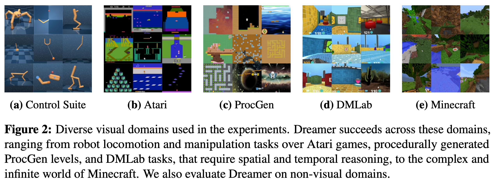
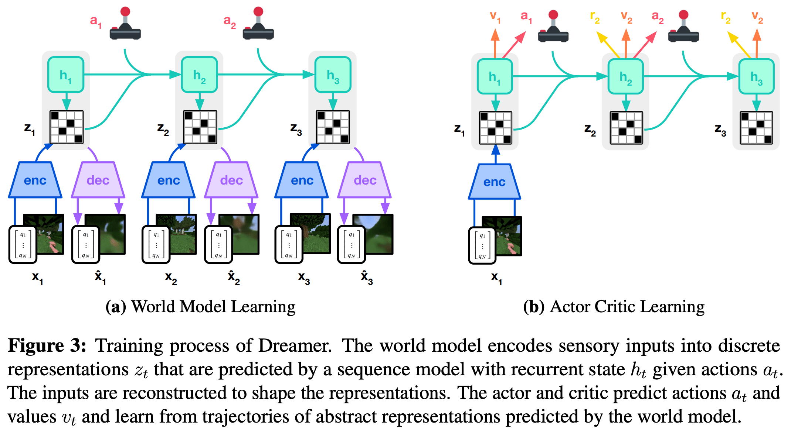

# 3 2023 DreamerV3

- [Mastering Diverse Domains through World Models](https://arxiv.org/pdf/2301.04104)

## Abstract

- Developing a general algorithm that learns to solve tasks across a wide range of applications has been a fundamental challenge in artificial intelligence. 
    - Although current reinforcement learning algorithms can be readily applied to tasks similar to what they have been developed for, configuring them for new application domains requires significant human expertise and experimentation. 
    
- **We present DreamerV3, a general algorithm that outperforms specialized methods across over 150 diverse tasks, with a single configuration.** 

- **Dreamer learns a model of the environment and improves its behavior by imagining future scenarios.** 
    - Robustness techniques based on normalization, balancing, and transformations enable stable learning across domains. 
    - Applied out of the box, Dreamer is the **first algorithm** to collect diamonds in Minecraft from scratch without human data or curricula. 
    - This achievement has been posed as a significant challenge in artificial intelligence that requires exploring farsighted strategies from pixels and sparse rewards in an open world. 

- Our work allows solving challenging control problems without extensive experimentation, making reinforcement learning broadly applicable.

## Introduction

- Reinforcement learning has enabled computers to solve tasks through interaction, such as 
    - surpassing humans in the games of `Go and Dota`. 
    - It is also a key component for improving `large language models` beyond what is demonstrated in their pretraining data. 
    
- While **PPO** has become a standard algorithm in the field of reinforcement learning, more specialized algorithms are often employed to achieve higher performance. 
    - These specialized algorithms target the unique challenges posed by different application domains, such as 
        - continuous control 
        - discrete actions
        - sparse rewards
        - image inputs
        - spatial environments
        - board games
    - However, applying reinforcement learning algorithms to sufficiently new tasks — such as moving from video games to robotics tasks — requires substantial effort, expertise, and computational resources for tweaking the hyperparameters of the algorithm. 
    - This brittleness poses a bottleneck in applying reinforcement learning to new problems and also limits the applicability of reinforcement learning to computationally expensive models or tasks where tuning is prohibitive. 
    
- Creating a general algorithm that learns to master new domains without having to be reconfigured has been a central challenge in artificial intelligence and would open up reinforcement learning to a wide range of practical applications.

- **We present Dreamer, a general algorithm that outperforms specialized expert algorithms across a wide range of domains while using fixed hyperparameters, making reinforcement learning readily applicable to new problems.** 
    - The algorithm is based on the idea of learning a **world model** that equips the agent with rich perception and the ability to imagine the future. 
    - The `world model` predicts the outcomes of potential actions, 
    - a `critic neural network` judges the value of each outcome, 
    - and an `actor neural network` chooses actions to reach the best outcomes. 
    
- **Although intuitively appealing, robustly learning and leveraging world models to achieve strong task performance has been an open problem.** 
    - Dreamer overcomes this challenge through a range of robustness techniques based on 
        - normalization, 
        - balancing, 
        - transformations. 
    - We observe robust learning not only across over `150` tasks from the domains summarized in Figure 2, **but also across model sizes and training budgets**, offering a predictable way to increase performance. 
    - Notably, larger model sizes not only achieve higher scores but also require less interaction to solve a task.

- To push the boundaries of reinforcement learning, we consider the popular video game `Minecraft` that has become a focal point of research in recent years, with international competitions held for developing algorithms that autonomously learn to collect diamonds in Minecraft.
    - Solving this problem without human data has been widely recognized as a substantial challenge for artificial intelligence because of the 
        - sparse rewards, 
        - exploration difficulty, 
        - long time horizons, 
        - procedural diversity of this open world game. 
    - Due to these obstacles, previous approaches resorted to using **human expert data and domain-specific curricula**. 
    - **Applied out of the box, Dreamer is the first algorithm to collect diamonds in Minecraft from scratch.**

## Learning algorithm

- We present the third generation of the Dreamer algorithm. 
    - The algorithm consists of **three neural networks**: 
        - the `world model predicts` the outcomes of potential actions, 
        - the `critic judges` the value of each outcome, 
        - the `actor chooses` actions to reach the most valuable outcomes. 
    - The components are trained concurrently from `replayed experience` while the agent interacts with the environment. 
    - To succeed across domains, all three components need to accommodate **different signal magnitudes** and robustly balance terms in their objectives. 
        - This is challenging as we are not only targeting similar tasks within the same domain but aim to learn across diverse domains with fixed hyperparameters.
    - This section introduces the world model, critic, and actor along with their robust loss functions, as well as tools for robustly predicting quantities of unknown orders of magnitude.

### World model learning

- The world model learns **compact representations of sensory inputs** through `autoencoding` and enables `planning` by **predicting future representations and rewards for potential actions.** 

- Figure 3: Training process of Dreamer. 
    - The world model encodes sensory inputs into **!!! discrete representations !!!** $z_t$ that are predicted by a sequence model with recurrent state $h_t$ given actions $a_t$
    - The inputs are reconstructed to shape the representations. 
    - The actor and critic predict actions $a_t$ and values $v_t$ and learn from trajectories of abstract representations predicted by the world model.

- We implement the world model as a [**Recurrent State-Space Model (RSSM)**](https://arxiv.org/pdf/1811.04551), shown in Figure 3. 
    - First, an `encoder` maps sensory inputs $x_t$ to **stochastic** representations $z_t$. 
    - Then, a sequence model with recurrent state $h_t$ predicts the sequence of these representations given past actions $a_{t−1}$. 
    - The concatenation of $h_t$ and $z_t$ forms the **model state** from which we predict rewards $r_t$ and episode continuation flags $c_t \in \{0, 1\}$ and reconstruct the inputs to ensure informative representations:

$$
\text{RSSM} \begin{cases}
\text{Sequence model:} & h_t = f_\phi(h_{t-1}, z_{t-1}, a_{t-1}) \\
\text{Encoder:} & z_t \sim q_\phi(z_t | h_t, x_t) \\
\text{Dynamics predictor:} & \hat{z}_t \sim p_\phi(\hat{z}_t | h_t) \\
\end{cases} \\
\begin{cases}
\text{Reward predictor:} & \hat{r}_t \sim p_\phi (\hat{r}_t | h_t, z_t) \\
\text{Continue predictor:} & \hat{c}_t \sim p_\phi(\hat{c}_t | h_t, z_t) \\
\text{Decoder:} & \hat{x}_t \sim p_\phi(\hat{x}_t | h_t, z_t)
\end{cases}
$$

- Figure 4 visualizes **long-term video predictions** of the world model. 
    - The encoder and decoder use 
        - `convolutional neural networks (CNN)` for image inputs 
        - `multi-layer perceptrons (MLPs)` for vector inputs 
    - The dynamics, reward, and continue predictors are also `MLPs`.
    
- **The representations are sampled from a vector of softmax distributions and we take straight-through gradients through the sampling step**

- Given a sequence batch of inputs $x_{1:T}$, actions $a_{1:T}$, rewards $r_{1:T}$, and continuation flags $c_{1:T}$, the world model parameters $\phi$ are optimized **end-to-end** to minimize the prediction loss $L_\text{pred}$, the dynamics loss $L_\text{dyn}$, and the representation loss $L_\text{rep}$ with corresponding loss weights $\beta_\text{pred} = 1, \beta_\text{dyn} = 1, \beta_\text{rep} = 0.1$:

$$ L(\phi) = E_{q_\phi}[ \sum_{t=1}^T \sum_k \beta_k L_k(\phi) ] $$

- The **prediction loss** trains 
    - the `decoder` and `reward predictor` via the **symlog squared loss** described later, 
    - the `continue predictor` via **logistic regression**. 
- The **dynamics loss** trains 
    - the `sequence model` to predict the next representation by minimizing the **KL divergence** between 
        - the predictor $p_\phi(z_t|h_t)$ and 
        - the next stochastic representation $q_\phi(z_t|h_t,x_t)$. 
- The **representation loss**, in turn, trains 
    - the representations to become more predictable allowing us to use a factorized dynamics predictor for fast sampling during imagination training. 

- The two losses differ in the **stop-gradient operator** $\text{sg}(\cdot)$ and their loss scale. 
- To avoid a degenerate solution where the dynamics are trivial to predict but fail to contain enough information about the inputs, we employ free bits by clipping the dynamics and representation losses below the value of $1 \text{nat} \approx 1.44 \text{bits}$. 
- This disables them while they are already minimized well to focus learning on the prediction loss:

$$
L_\text{pred}(\phi) = -\ln p_\phi(x_t|z_t, h_t) - \ln p_\phi(r_t|z_t, h_t) - \ln p_\phi(c_t|z_t, h_t) \\[5pt]
L_\text{dyn}(\phi) = \max(1, \text{KL}[ \; \text{sg}(q_\phi(z_t|h_t, x_t))  \; \parallel \; p_\phi(z_t|h_t) \; ]) \\[5pt]
L_\text{rep}(\phi) = \max(1, \text{KL}[ \; q_\phi(z_t|h_t, x_t)  \; \parallel \; \text{sg}( p_\phi(z_t|h_t) ) \; ]) 
$$

- Previous world models require scaling the representation loss differently based on the visual complexity of the environment. 
    - Complex 3D environments contain details unnecessary for control and thus prompt a stronger regularizer to simplify the representations and make them more predictable. 
    - In games with static backgrounds and where individual pixels may matter for the task, a weak regularizer is required to extract fine details. 
    - We find that combining free bits with a small representation loss resolves this dilemma, allowing for fixed hyperparameters across domains. 
    
- Moreover, we transform vector observations using the `symlog` function described later, to prevent large inputs and large reconstruction gradients, further stabilizing the trade-off with the representation loss.

- We occasionally observed spikes the in KL losses in earlier experiments, consistent with reports for **deep variational autoencoders**. 
    - To prevent this, we parameterize the categorical distributions of the encoder and dynamics predictor as mixtures of 1% uniform and 99% neural network output, making it impossible for them to become deterministic and thus ensuring well-behaved KL losses. 

- Further model details and hyperparameters are included in the supplementary material.

### Critic learning
