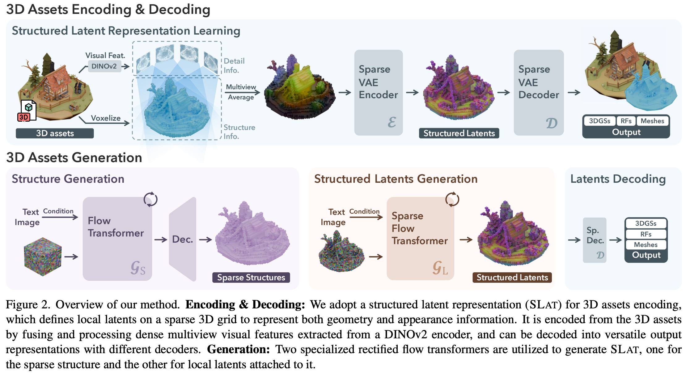
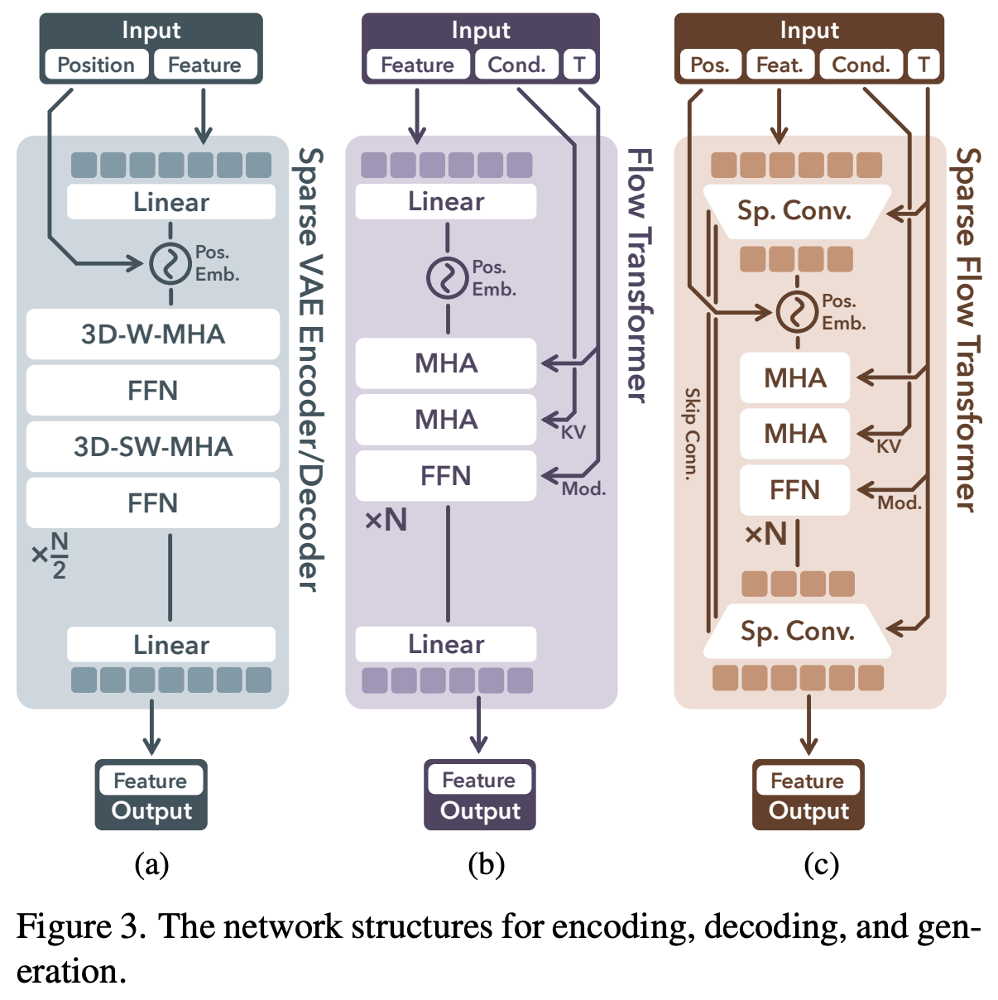

# 4 2024 Microsoft TRELLIS

- [Structured 3D Latents for Scalable and Versatile 3D Generation](https://arxiv.org/pdf/2412.01506)

- https://github.com/Microsoft/TRELLIS

## Abstract

- We introduce a novel 3D generation method for versatile and high-quality 3D asset creation. 
    - The cornerstone (基石) is a unified **Structured LATent (SLAT)** representation which **allows decoding to different output formats**, such as **Radiance Fields, 3D Gaussians, and meshes.** 
    - This is achieved by integrating a sparsely-populated 3D grid with dense multi-view visual features extracted from a powerful **vision foundation model**, comprehensively capturing both structural (geometry) and textural (appearance) information while maintaining flexibility during decoding.

- We employ **rectified flow transformers** tailored for SLAT as our 3D generation models and train models with up to 2 billion parameters on a large 3D asset dataset of **500K diverse objects**. 
    - Our model generates high-quality results with text or image conditions, significantly surpassing existing methods, including recent ones at similar scales. 
    - We showcase flexible output format selection and local 3D editing capabilities which were not offered by previous models.

## 1. Introduction

- While AI Generated Content (AIGC) for 3D has made tremendous progress in recent years, existing 3D generative models still fall short in generation quality compared to their 2D predecessors, where large image generation models have enabled ready-to-use tools that exert a profound impact on today’s digital industry.

- Unlike 2D images, typically represented by pixel grids, 3D data encompasses diverse representations like 
    - meshes, 
    - point clouds, 
    - Radiance Fields, and 
    - 3D Gaussians.
- Each format is tailored for specific applications and may encounter difficulties when adapted for other tasks. 
    - For instance, while numerous studies have utilized 3D representations like meshes or implicit fields for object geometry generation, they often falter (衰退) in detailed appearance modeling compared to those relying on representations equipped with advanced volumetric rendering capabilities (e.g., 3D Gaussians and Radiance Fields). 
    - Conversely, generative models based on Radiance Fields or 3D Gaussians excel in rendering high-quality appearances but struggle with plausible geometry extraction. 
    - Moreover, the unique structured or unstructured characteristics of different representations complicate processing through a consistent network architecture. 
    - These issues hinder the development of a standardized 3D generative modeling paradigm, in contrast to the consensus in recent advanced 2D generation methods that learn generative models within a unified latent space.

- In this paper, we aim to develop a unified and versatile latent space that facilitates high-quality 3D generation across various representations, accommodating diverse downstream requirements.
    - This problem is highly challenging and has rarely been addressed by previous approaches.
    - **To tackle this, our primary strategy is to introduce explicit sparse 3D structures in the latent space design.** 
    - These structures enable decoding into different 3D representations by characterizing attributes within the local voxels surrounding an object, as is evidenced by recent advancements in the 3D reconstruction field. 
    - This approach also allows for efficient high-resolution modeling by bypassing voxels without 3D information, and introduces locality that facilitates flexible editing.

- However, even with such structures, achieving high quality decoding into different 3D representations is still non-trivial, as it requires the latent representation to encapsulate both comprehensive geometry and appearance information of the 3D assets. 
    - **To address this issue, our second strategy is to equip the sparse structures with a powerful vision foundation model for detailed information encoding**, given its demonstrated strong 3D awareness and capability for detailed representation. 
    - This approach bypasses the need for a dedicated 3D encoder, and eliminates the costly pre-fitting process of aligning 3D data with specific representations.

- Given these two strategies, we introduce **Structured LATents (SLAT)**, a unified 3D latent representation for high quality, versatile 3D generation. 
    - SLAT marries sparse structures with powerful visual representations. 
    - It defines local latents on active voxels intersecting the object’s surface. 
    - The local latents are encoded by fusing and processing image features from densely rendered views of the 3D asset, while attaches them onto active voxels. 
    - These features, derived from powerful pre-trained vision encoders, capture detailed geometric and visual characteristics, complementing the coarse structure provided by the active voxels.
    - Different decoders can then be applied to map SLAT to diverse 3D representations of high quality.

- **Building on SLAT, we train a family of large 3D generation models, dubbed TRELLIS in this paper, with text prompts or images as conditions.** 
    - A two stage pipeline is applied which first generates the sparse structure of SLAT, followed by generating the latent vectors for non-empty cells. 
    - We employ **rectified flow transformers** as our backbone models and adapt them properly to handle the sparsity in SLAT. 
    - We train TRELLIS with up to 2 billion parameters on a large dataset of carefully-collected 3D assets. 
    - Through extensive experiments, we show that our model can create high-quality 3D assets with detailed geometry and vivid texture, significantly surpassing previous methods. 
    - Moreover, it can easily generate 3D assets with different output formats to meet diverse downstream requirements.

- We summarize the notable features of our method below:
    - High quality. It produces diverse 3D assets at high quality with intricate shape and texture details.
    - Versatile generation. It takes text or image prompts and can generate various final 3D representations including but not limited to Radiance Fields, 3D Gaussians, and meshes.
    - **Flexible editing. It enables flexible tuning-free 3D editing such as the deletion, addition, and replacement of local regions, guided by text or image prompts.**
    - Fitting-free training. No 3D fitting is needed for the training objects in the entire process.

- Given these strong performance and multifold advantages, we believe our new models can serve as powerful 3D generation foundations and unlock new possibilities for the 3D vision community. 
    - We hope our work can shed some light on 3D-representation-agnostic asset modeling, in contrast to the field’s relentless pursuit of and adaptation to new representations. 
    - All our code, model, and data are released to facilitate reproduction and downstream applications.

## 2. Related Works

### 3D generative models. 

- Early 3D generation methods primarily leveraged **Generative Adversarial Nets (GANs)** to model 3D distributions, but faced challenges in scaling to more diverse scenarios.

- Later approaches employed **diffusion models** for various representations like point clouds, voxel grids, Triplanes, and 3D Gaussians. 

- Some alternatives adopted **GPT style autoregressive models** for mesh generation. 

- Despite these advancements, efficiency remains a challenge for generative modeling in raw data space.

- **To enhance both quality and efficiency, recent studies have resorted to generation in a more compact latent space.** 

- Some methods mainly focused on shape modeling, often requiring an additional texturing phase for complete 3D asset generation.
    - Among them, a few approaches incorporated appearance information, but faced difficulties to model highly detailed appearance due to their surface representations.
    - Other works built latent representations for Radiance Fields or 3D Gaussians, which may pose challenges for accurate surface modeling. 
    
- 3DTopia-XL encoded both geometry and appearance using latent primitives, but its pre-fitting process is both costly and lossy. 

- In this work, we aim to build a versatile latent space that supports decoding into various 3D representations of high quality.

### 3D creation with 2D generative models. 

- Instead of directly training 3D generative models, some recent methods leveraged 2D generative models to create 3D assets due to their superior generalization abilities. 

- A pivotal work, DreamFusion, optimized 3D assets by distilling from pre-trained image diffusion models, followed by a large group of successors with more advanced distillation techniques. 

- Another group of works involves generating multi-view images via 2D diffusions and reconstructing 3D assets from them. 

- However, these 2D-assisted approaches often yield lower geometry quality compared to native 3D models learned from 3D data collections, due to inherent multiview inconsistency in 2D generative models.

### Rectified flow models. 

- **Rectified flow models have recently emerged as a novel generative paradigm that challenges the dominance of diffusions.** 
    - Recent works have demonstrated the effectiveness of them for large-scale image and video generation. 
    - In this paper, we also apply rectified flow models and demonstrate their abilities for 3D generation at scale.

## 3. Methodology

- We aim to generate high-quality 3D assets in various 3D representation formats given text or image conditions. 
    - Figure 2 shows an overview, with details described below.

### 3.1. Structured Latent Representation

- For a 3D asset $O$, we encode its geometry and appearance information using a unified structured latent representation $z$, which defines **a set of local latents on a 3D grid**:

$$ z = \{(z_i, p_i)\}_{i=1}^L \quad z_i \in R^C, p_i \in \{0, 1, ..., N − 1\}^3 $$

- where $p_i$ is the positional index of an active voxel in the 3D grid intersecting with the surface of $O$
- $z_i$ denotes a local latent attached to the corresponding voxel, the derivation of which will be described later 
- $N$ is the spatial length of the 3D grid, 
- $L$ is the total number of active voxels. 

- **Intuitively, the active voxels $p_i$ outline the coarse structure of the 3D asset, while the latents $z_i$ capture finer details of appearance and shape.** 

- Together, these structured latents encompass the **entire surface** of $O$, effectively capturing both the overall form and intricate details.

- Due to the sparsity of 3D data, the number of active voxels is significantly smaller than the total size of the grid, i.e., $L \ll N^3$, allowing to be constructed at a relatively high resolution. 

- By default, we set $N = 64$ which leads to an average value of $L = 20K$.

### 3.2. Structured Latents Encoding and Decoding

- With the structured latent representation, we develop an effective encoding scheme to encode 3D assets to it, and introduce different decoders for reconstruction across various 3D representations. 
    - The details are outlined below.

#### Visual feature aggregation. 

- We first convert each 3D asset $O$ into a voxelized feature 

$$ f = \{(f_i, p_i)\}_{i=1}^L $$

- $f_i$ is a visual feature recording detailed structure and appearance information of the local region.

- **To derive $f_i$ for each active voxel, we aggregate features extracted from dense multiview images of $O$** 
    - We render images from randomly sampled camera views on a sphere and extract feature maps using a **pre-trained DINOv2 ViT encoder (by Meta)** 
    - **Each voxel is projected onto the multiview feature maps to retrieve features at corresponding locations, and their average is used as $f_i$, as shown in Fig. 2 (left-top).**

- We set $f$ to match the resolution of the structured latents $z$
(i.e., $64^3$). 

- **Empirically, this is sufficient to reconstruct the original 3D asset at high fidelity, thanks to the strong representation capabilities of DINOv2 features together with the coarse structure provided by the active voxels.**

#### Sparse VAE for structured latents.

- With the voxelized feature $f$, we introduce a **transformer-based VAE architecture** for 3D assets encoding. Specifically, 
    - an **encoder** $E$ first encodes $f$ to structured latents $z$, 
    - followed by a **decoder** $D$ that converts $z$ into a 3D asset represented by certain 3D representation. 

- **Reconstruction losses** are then applied between the decoded 3D assets and the ground truth to train the encoder and decoder in an **end-to-end manner**, along with a **KL-penalty** on $z_i$ to encourage **normal distribution regularization** following [Latent Diffusion](https://github.com/CompVis/latent-diffusion)

- The encoder and decoder share the same transformer structure, as shown in Fig. 3a. 
    - To handle sparse voxels, we serialize input features from active voxels and add **sinusoidal positional encodings** based on their voxel positions, creating tokens with variable context length $L$, which are subsequently processed through transformer blocks. 
    - Considering the locality characteristic of the latents, we incorporate **shifted window attention** in 3D space to enhance local information interaction, which also improves efficiency compared to a full attention implementation.

#### Decoding into versatile formats. 

- Our structured latents support decoding into diverse 3D representations, such as 3D Gaussians, Radiance Fields, and meshes, via respective decoders: `DGS`, `DRF`, and `DM`. 
    - These decoders share the same architecture except for their output layers, and can be **trained using specific reconstruction losses tailored to their representations**:

##### 3D Gaussians. 

- The decoding process is formulated as:

$$ D_{GS}: \{(z_i, p_i)\}_{i=1}^L \to \{\{(o_i^k, c_i^k, s_i^k, \alpha_i^k, r_i^k )\}_{k=1}^K \}_{i=1}^L $$

- where each $z_i$ is decoded into $K$ Gaussians with 
    - position offsets $o$, colors $c$, scales $s$, opacities $\alpha$, rotations $r$

- To maintain locality of $z_i$, we constrain the final positions $x$ of the Gaussians to the vicinity of their active voxel: 

$$ x_i^k = p_i + \tanh(o_i^k) $$

- The reconstruction losses consist of $L_1$, `D-SSIM` and `LPIPS` between rendered Gaussians and the ground truth images.

##### Radiance Fields. 

- The decoding process is defined as:

$$ D_{RF}: \{(z_i, p_i)\}_{i=1}^L \to \{( v_i^x, v_i^y, v_i^z, v_i^c )\}_{i=1}^L $$

- where $v_i^x, v_i^y, v_i^z \in R^{16\times 8} \quad v_i^c \in R^{16\times 4}$ are the **CP-decomposition** of a local radiance volume at $8^3$ following Strivec [22], while the reconstruction losses are similar to those for Gaussians.

##### Meshes.

- The decoding process is as follows:

$$ D_M: \{(z_i, p_i)\}_{i=1}^L \to \{\{(w_i^j, d_i^j)\}_{j=1}^{64} \}_{i=1}^L $$

- where $w_i^j \in R^{45}$ are the flexible parameters in FlexiCubes [74] and $d_i^j \in R^8$ is signed distance values for the eight vertices of the corresponding voxel. 

- We append two **convolutional upsampling blocks** after the transformer backbone to increase the final output resolution to $256^3$ (i.e., each $z_i$ for a grid of $4^3$), extract meshes from 0-level isosurfaces, and compute $L_1$ between rendered depth (normal) maps and their ground truth as the reconstruction losses.

- **In practice, we adopt Gaussians to learn the encoder and decoder end-to-end due to their high fidelity and efficiency.** 
    - For other output formats, we simply freeze the learned encoder and train their decoders from scratches as described above. 
    - Despite trained with Gaussians, the learned structured latents can faithfully reconstruct other formats, demonstrating strong extensibility (See Tab. 1). 
    - We leave more implementation details in Sec. A.2.

### 3.3. Structured Latents Generation

- We introduce a two-stage generation pipeline to generate the structured latents, which 
    - first generates the sparse structure, 
    - followed by the local latents attached to it. 
- For modeling the latent distribution, we employ **rectified flow models**. 
- We will first provide a brief introduction to these models before detailing our generation pipeline.

#### Rectified flow models.

- Rectified flow models use a linear interpolation forward process,  which interpolates between data samples $x_0$ and noises $\epsilon$
with a timestep $t$. 
- The backward process is represented as a time-dependent vector field, moving noisy samples toward the data distribution, and can be approximated with a neural network $v_\theta$ by minimizing the **conditional flow matching (CFM) objective**:

$$ x(t) = (1 − t) x_0 + t \epsilon \\[5pt]
v(x, t) = \nabla_t x \\[5pt]
L_{CFM}(\theta) = \mathbb{E}_{t, x_0, \epsilon} \| v_\theta(x, t) - (\epsilon - x_0) \|_2^2 $$

#### Sparse structure generation. 

- In the first stage, we aim to generate the sparse structure $\{p_i\}_{i=1}^L$
    - To enable this with a tensorized neural network, we convert the sparse active voxels into a dense binary 3D grid $O \in \{0, 1\}^{N\times N\times N}$, setting voxel values to $1$ if active, and $0$ otherwise.

- Directly generating the dense grid $O$ is computationally expensive. 
    - We introduce a **simple VAE with 3D convolutional blocks** to compress it into a low-resolution feature grid $S \in R^{D\times D\times D\times C_S}$. 
    - **Since $O$ represents only coarse geometry, this compression is nearly lossless, enhancing efficiency significantly.** 
    - It also converts the discrete values in $O$ into continuous features suited for rectified flow training.

- We introduce a simple transformer backbone $G_S$ for generating $S$, as shown in Fig. 3b. An input dense noisy grid is serialized, combined with positional encodings (as in Sec. 3.2), and fed into the transformer for denoising.
    - Timestep information is incorporated using **adaptive layer normalization (adaLN)** and a gating mechanism [67]. 
    - Conditions are injected through **cross attention layers** as keys and values. 
    - For text conditions, we use features from a pre-trained **CLIP [71] model**. 
    - For image conditions, we adopt visual features from **DINOv2**. 
    - The denoised feature grid $S$ is decoded into the discrete grid $O$, and further converted back to active voxels $\{p_i\}_{i=1}^L$ as the final sparse structure.

#### Structured latents generation. 

- In the second stage, we generate latents $\{z_i\}_{i=1}^L$ given the structure $\{p_i\}_{i=1}^L$ using a transformer $G_L$ designed for sparse structures (Fig. 3c).

- Instead of directly serializing input noisy latents as in the sparse VAE encoder in Sec. 3.2, we improve efficiency by packing them into a shorter sequence before serialization, similarly as done by DiT [67]. 

- Due to our sparse structure, we apply a downsampling block with sparse convolutions [90] to pack latents within a $2^3$ local region, followed by multiple time-modulated transformer blocks. 

- A convolutional upsampling block is appended at the end of the transformer, with skip connections to the downsampling block that facilitates spatial information flow. 

- Like in $G_S$, timesteps are integrated via **adaLN** layers, and text/image conditions are injected through **cross-attentions.**

- We train $G_S$ and $G_L$ separately using the CFM objective in Eq. (5). 

- After training, structured latents $z = \{(z_i, p_i)\}_{i=1}^L$ can be sequentially generated by the two models and converted into high-quality 3D assets in various formats by different decoders: $D_{GS}, D_{RF}, D_M$. See Sec. A for more details.

### 3.4. 3D Editing with Structured Latents

- Our method supports flexible 3D editing and we present two simple tuning-free editing strategies.

#### Detail variation. 

- The separation between the structure and latents enables detail variation of 3D assets without affecting the overall coarse geometry.     
    - This can be easily accomplished by preserving the asset’s structure and executing the second generation stage with different text prompts.

#### Region-specific editing. 

- The locality of SLAT allows for region-specific editing by altering voxels and latents in targeted areas while leaving others unchanged. 
    - To this end, we adapt **Repaint [55]** to our two-stage generation pipeline.
    - Given a bounding box for the voxels to be edited, we modify our flow models’ sampling processes to create new content in that region, conditioned on the unchanged areas and any provided text or image prompts. 
    - Consequently, the first stage generates new structures within the specified region, and the second stage produces coherent details.

## 4. Experiments

### 4.1. Reconstruction Results

### 4.2. Generation Results

### 4.3. Ablation Study

### 4.4. Applications

## 5. Conclusion

- We introduced a novel 3D generation method for versatile and high-quality 3D asset creation. 
    - At its core lies SLAT, a structured latent representation that allows decoding to versatile output formats by comprehensively encoding both geometry and appearance information into localized latents anchored on a sparse 3D grid, where the latents are fused and processed from dense multiview image features extracted by a powerful vision foundation model.
    - We proposed a two-stage generation pipeline utilizing rectified flow transformers tailored for SLAT generation at scale.
    - Extensive experiments demonstrated the superiority of our method in 3D generation, in terms of quality, versatility, and editability, highlighting its strong potential for a wide range of real-world applications in digital production.
