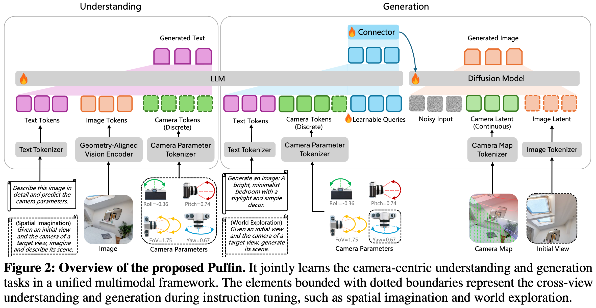

# 6 2025 NTU Puffin

- [THINKING WITH CAMERA: A UNIFIED MULTIMODAL MODEL FOR CAMERA-CENTRIC UNDERSTANDING AND GENERATION](https://arxiv.org/pdf/2510.08673)
- https://github.com/KangLiao929/Puffin

## ABSTRACT

- Camera-centric **understanding** and **generation** are two cornerstones of **spatial intelligence**, yet they are typically studied in isolation. 
    - We present Puffin, a unified camera-centric multimodal model that extends spatial awareness along the camera dimension. 
    - Puffin integrates language regression and diffusion-based generation to interpret and create scenes from arbitrary viewpoints. 
    - To bridge the modality gap between cameras and vision-language, we introduce a novel paradigm that **treats camera as language**, enabling thinking with camera. 
    - This guides the model to align spatially grounded visual cues with photographic terminology while reasoning across geometric context. 
    - Puffin is trained on Puffin-4M, a large-scale dataset of 4 million **vision-language-camera triplets.** 
    - We incorporate both global camera parameters and pixel-wise camera maps, yielding flexible and reliable spatial generation.
    - Experiments demonstrate Puffin’s superior performance over specialized models for camera-centric generation and understanding. 
    - With our designed instruction tuning, Puffin generalizes to diverse cross-view tasks such as spatial imagination, world exploration, and photography guidance. 

## 1 INTRODUCTION

- For machines, cameras serve as the primary interface to the physical world, enabling **spatial intelligence** that underlies applications such as robotics, AR/VR, and autonomous driving. 
    - In general, two principal camera-centric objectives work in tandem (协同地) to enable machines to perceive and interact with their spatial context. 
        - On the one hand, understanding the camera geometry from images, namely how the 3D world is projected onto the 2D image plane, lays the foundation for machines to recover spatial structure and navigate complex environments. 
        - On the other hand, by modulating intrinsic and extrinsic parameters, cameras encode spatial relationships and offer flexible control over spatial content generation, which simulates how the world appears from any viewpoint or orientation. 
    - **To date, these two perspectives have been commonly treated as isolated problems and independently explored by the research community.**

- In this work, we make the first attempt to unify camera-centric understanding and generation in a cohesive framework. 
    - Motivated by recent progress in **unified understanding and generation with large multimodal models (LMMs)**, we extend this paradigm to the spatial domain, where camera geometry plays a central role. 
    - However, unlike language or images, camera parameters are abstract and non-intuitive: they describe `field-of-view (FoV)`, `orientation`, or `perspective` in numerical form rather than semantic content. 
    - This discrepancy introduces a modality gap when integrating cameras into LMMs. **For instance, when users specify “20° roll” or “35mm lens” for controllable generation, existing models often ignore or misinterpret such cues, pursuing semantic alignment while neglecting precise spatial control.** 
    - Similarly, current LMMs tend to collapse geometric details into coarse representations when understanding camera information, leading to spatially inconsistent outputs. 
    - As a result, naively extending LMMs cannot resolve conflicts between modalities, producing suboptimal performance in both tasks.

- To address this challenge, we introduce Puffin, a unified multimodal framework that interprets cameras as a first-class modality. 
    - Puffin combines **autoregressive** and **diffusion** modeling to jointly perform camera-centric understanding and generation. 
    - Instead of treating camera parameters as auxiliary labels, Puffin introduces the notion of `thinking with camera`, aligning spatially grounded visual cues with professional photographic terminology while reasoning over geometric context. 
    - This design provides a shared chain-of-thought across multimodal tasks, enabling spatially consistent understanding and controllably aligned generation.

- To support this framework, we construct Puffin-4M, a large-scale dataset of 4 million vision-language-camera triplets. 
    - Puffin-4M includes **single-view images** with 
        - precise camera parameters, 
        - descriptive captions, 
        - pixel-wise camera maps, and 
        - spatial reasoning annotations across diverse indoor and outdoor scenarios. 
    - Beyond single views, it also incorporates cross-view and aesthetic (美学) images, making it a versatile (多功能) benchmark for both understanding and generation tasks.

- Experimental results show Puffin outperforms specialized models for camera-centric understanding or generation, and can be adapted to diverse downstream applications. 
    - We illustrate the versatile capabilities of our Puffin model in Figure 1. 
    - In each generated image (a), the target camera is marked at the bottom left, and the horizon lines are visualized from the estimated camera parameters (b). 
    - For world exploration (d), we visualize 3D reconstruction results derived from the initial and generated views. 
    
- Our main contributions are threefold:
    - We make the first attempt to seamlessly integrate camera geometry into a unified multimodal model, introducing a camera-centric framework to advance multimodal **spatial intelligence**
    - We propose thinking with camera, a novel mechanism that guides the model to align spatially grounded visual cues with photographic terminology, bridging the modality gap between camera and vision-language and enabling effective spatial reasoning.
    - We construct Puffin-4M, a large-scale dataset of 4M vision-language-camera triplets spanning diverse indoor and outdoor scenes, and establish a comprehensive benchmark for evaluating camera-centric multimodal models.

## 2 RELATED WORK

### Large Multimodal Models. 

- Built upon a **visual encoder** and a **large language model (LLM)**, LMMs process mixed visual and textual inputs and perform understanding and reasoning via language generation. 
    - Fueled by large-scale pre-training of the vision and language models and sophisticated instruction-tuning, LMMs excel at high-level understanding tasks, such as object localization, counting, and optical character recognition. 
    - However, these models, **optimized for semantic alignment between vision and language, remain limited in capturing image intrinsics (e.g., depth and geometry), which constrains their ability in camera understanding and spatial reasoning.**
    - To bridge this gap, it is crucial to enrich LMMs with geometry-aware prior knowledge that preserves structural details beyond semantics. 
    - Moreover, aligning such geometric cues with linguistic tokens provides a pathway to extend the reasoning capacity of LMMs from abstract semantics to physically grounded spatial understanding.

### Unified Multimodal Models. 

- **As an extension of standard LMMs, unified multimodal models jointly learn visual understanding and generation within a single framework.** 

- **Two main design philosophies are typically adopted.** 
    - One line of work formulates visual generation as **auto-regression over either discrete or continuous image tokens, sharing LLM parameters for both understanding and generation.** 
    - Another line **aligns pre-trained LMMs with diffusion modules, enabling faster convergence and lower training cost.** 

- While both types of models advance general image understanding and generation, they are constrained to simplistic camera assumptions (e.g., fixed front-view, predefined FoVs), hindering their practical applicability to realistic and complex environments. 

- To this end, we introduce a camera-centric framework that jointly performs camera understanding and controllable generation.

### Camera Geometry from Vision. 

- Tasks such as camera calibration and pose estimation have long been a central topic in 3D vision. 
    - While **earlier learning-based works attempted to directly regress camera parameters from input images**, 
    - recent advances increasingly explore the use of intermediate representations or geometry fields to bridge the prediction gap. 
    - Representative approaches leverage geometric structures or semantic features to alleviate the inherent difficulty of inferring camera parameters from a few views. 
    - Building on priors of the camera model and the perspective properties of captured images, a growing body of methods proposes to learn **dense geometry fields**, such as 
        - distortion distribution maps, 
        - pixel displacement fields, 
        - camera rays, 
        - perspective fields, or 
        - incidence fields. 
    - However, such representations typically emphasize low-/mid-level patterns, limiting their ability to capture a holistic and coherent (连贯的) spatial concept. 
    - Rather than pursuing better representations, this work explores an alternative perspective: **interpreting the camera as language.**

## 3 CAMERA-CENTRIC UNIFIED MULTIMODAL MODEL

- Puffin, as illustrated in Figure 2, unifies camera-centric understanding and generation within a multimodal paradigm. 
    - For **understanding**, we introduce a geometry-aligned **vision encoder** to a **large language model (LLM)** to retain rich geometric features and enhance the model’s capacity for spatial analysis. 
    - For **generation**, a connector module learns to map the hidden states of the LLM (via a set of learnable queries) into conditioning signals that can be interpreted by the **diffusion model**. 
- To facilitate the integration of camera geometry, apart from the **discrete camera tokens derived from numerical camera parameters**, we introduce **continuous camera latent obtained from pixel-wise camera maps**, allowing fine-grained spatial control in image generation.

### 3.1 CAMERA UNDERSTANDING

- Definition. 
    - In this work, **camera understanding is formulated as a question-answering task conditioned on image content.** 
    - The generated text consists of a concise description or spatial reasoning along with the estimated camera parameters (i.e., roll, pitch, FoV) of the input image. 
    - Unlike previous methods that directly estimate the parameters from images, our approach integrates camera geometry within the text and performs next-token prediction in a multimodal sequence modeling paradigm.

- Motivation. 
    - As illustrated in Figure 3 (left), previous classical and learning-based methods focus on extracting or learning representations to predict the camera parameters, such as geometric structures or semantic features with confidence estimates.
    - However, these representations often emphasize low-/mid-level patterns, limiting their ability to capture a holistic and coherent spatial concept. 
    - As a result, existing approaches tend to excel in scenarios with rich features but struggle to generalize across diverse visual environments.

- Thinking. 
    - Instead of focusing on how to learn a representation, we propose to interpret the camera as language and introduce the notion of thinking with camera. 
    - It guides the LMMs to align spatially grounded visual cues with photographic terminology while reasoning across geometric context. 
    - The details of each key element are elaborated below.

- Spatially Grounded Visual Cues. 
    - The 3D world is governed by physical laws, where gravity and human design shape stable spatial regularities that serve as strong perceptual priors. 
    - Texture-less regions such as sky, ceilings, floors, or ground surfaces lack local features but encode vertical regularities critical for pitch estimation. 
    - Similarly, FoV estimation relies on perceiving spatial composition, including the foreground–background ratio, object scale, and depth distribution. 
    - While such properties are difficult to infer from purely visual representations, they are implicitly captured by LMMs as knowledge priors. 
    - Thus, we embed these spatially grounded visual cues into our thinking captions, enabling the model to perform explicit spatial reasoning about camera geometry.

- Professional Photographic Terms. 
    - Existing LMMs typically acquire over-abstracted semantics, whereas the detailed numerical values of camera parameters are too fine-grained to estimate precisely.
    - As a practical alternative, professional photographic terms (e.g., close-up, tilt-up, Dutch angle) are widely used in annotations and well aligned with LMM knowledge. 
    - Thus, we leverage them as intermediate supervisory signals to naturally bridge low-/mid-level camera geometry and high-level multimodal reasoning. 
    - These terms, derived as quantized abstractions of camera parameters, are merged with textual scene descriptions, making global spatial arrangements linguistically accessible. 
    - The parameter-to-term mapping can be formulated as $f: p \to t$, in which the mapping $f$ is shown in Table A1.

- Geometric Context. 
    - As shown in Figure 3 (right), we decouple camera parameters across geometric context (roll, pitch, and FoV), which aligns specific spatially grounded visual cues such as sky, foreground composition, and object-level depth ordering with each professional photographic terminology.
    - By anchoring numerical attributes to semantically meaningful descriptors, our framework bridges abstract visual features and physically interpretable geometry. 
    - The final parameters are predicted through this structured spatial reasoning.

- With the above designs, we interpret the camera as language by grounding its physical attributes in stable spatial regularities. 
    - Numerical parameters are abstracted into professional photographic terms, providing a semantic vocabulary aligned with LMMs. 
    - Through this mapping, camera geometry becomes linguistically interpretable, allowing structured spatial reasoning for accurate camera parameter prediction. 
    - We visualize more reasoning results in Figure A4.

- Choosing a Suitable Vision Encoder. 
    - A straightforward approach to camera understanding is to fine-tune existing LMMs that couple a vision encoder with an LLM, but this naive strategy faces two major limitations: 
        - vision encoders in LMMs are primarily designed for recognition tasks and thus yield condensed features lacking geometric fidelity, and 
        - language components contain little prior knowledge of spatial perception, reducing adaptability to camera-centric tasks. 
    - As a result, such fine-tuning can lead to performance bottlenecks and even underperform pure vision based methods (see Section 5.4). 
    - To overcome these issues, we introduce a geometry-aligned vision encoder distilled from both **semantic (e.g., CLIP, SigLIP)** and **vision-centric (e.g., DINO, SAM)** teachers, offering versatile features that preserve geometric fidelity while maintaining strong semantic understanding. 
    - **We then align this encoder with an LLM (Qwen) via progressive unfreezing and joint fine-tuning.** 
    - This staged optimization stabilizes training and fosters spatial awareness that bridges low-/mid-level structural cues with high-level linguistic reasoning. 
    - The detailed training recipe is provided in Section 3.4.

### 3.2 CAMERA-CONTROLLABLE GENERATION

- Motivation. 
    - Unlike image understanding, image generation requires complex cross-modal alignment and the synthesis of fine-grained visual details. 
    - As discussed in Section 3.1, the detailed numerical values of camera parameters are too specific for current LMMs to interpret effectively, failing to faithfully capture the realistic spatial distribution required for camera-controllable generation.

- Thinking. 
    - To address this, we design a step-by-step process that integrates visual detail analysis with reasoning. 
    - The model first infers the potential visual cues from vanilla captions, and then uses this textual reasoning as a semantic planning stage to guide image generation. 
    - For instance, a large pitch value may correspond to an expansive sky with clouds in outdoor scenes or to pendant lights and uncluttered ceilings indoors. 
    - Beyond textual reasoning, numerical camera parameters are translated into professional photographic terms more suitable for LMMs, naturally aligning with the reasoning process in camera understanding. 
    - We therefore adopt a shared chain-of-thought mechanism between understanding and controllable generation. 
    - As shown in Figure 1 (c), given a small pitch value and a caption describing a modern interior, our method translates the value into a photographic term (e.g., small tilt-down), imagines salient cues such as a windowsill, and produces more precise spatial simulation than the baseline.

- Flexible and Faithful Control. 
    - The pipeline of camera-controllable generation is shown in Figure 2 (right). 
    - The key design is to incorporate pixel-wise camera maps as a continuous latent of camera geometry, apart from the discrete camera tokens derived from numerical parameters. 
    - Unlike tokens that capture only global attributes, these dense maps encode local geometric context at each pixel, including orientation and displacement cues. 
    - By converting maps into continuous latent, the diffusion model receives fine-grained spatial priors that preserve global camera settings while adapting to subtle geometric variations, thus offering flexible control of spatial layout and viewpoint. 
    - Additionally, we introduce a connector module as an adaptive interface between the LLM and the diffusion model, where a set of learnable queries together with text and camera tokens extract and restructure LLM hidden representations, which are then projected into conditioning signals for generation. 
    - This design enables semantic and geometric understanding from the LLM to faithfully guide the diffusion model.

### 3.3 INSTRUCTION TUNING

- Although our Puffin focuses on single-view camera calibration and text-to-image controllable generation, it can be flexibly extended to cross-view settings with only minor modifications, such as appending additional tokens and switching prompts according to the target task. 
    - As shown in Figure 2, the dotted modules denote cross-view understanding and generation. 
    - We explore three tasks: 
        - spatial imagination, where the model imagines the scene description of a target view given its camera parameters and an initial view; 
        - world exploration, where the model generates the target view, incorporating an additional yaw parameter to represent cross-view deviations and conditioning on both the target-view camera map and the VAE-encoded initial view (with text descriptions randomly dropped to support both text-conditioned and text-free generation); and 
        - photographic guidance, where the model suggests camera parameter adjustments from an initial view to achieve images with higher photographic aesthetics. 
    - Visualization results are presented in Figure 10.

### 3.4 TRAINING RECIPE

- We conduct a multi-stage training strategy, where the **vision encoder**, **LLM**, and the **diffusion model** are aligned in the first stage. 
- Then, in the supervised fine-tuning (SFT) stage, the models are jointly optimized using both base and thinking datasets. 
- Finally, an instruction-tuning stage is applied, involving various cross-view generation and understanding tasks. 
- The details are listed in Table 1. We elaborate each training stage as follows.

#### Stage I - Alignment. 

- In this stage, we align the vision encoder with the LLM by training only the **MLP projector** for the understanding task, where the framework learns to **predict both text descriptions and camera parameters from the input image.** 

- For generation, the framework takes 
    - text descriptions, 
    - camera parameters, and 
    - the camera map 
- as inputs, and learns to synthesize the target image with the corresponding description and configuration.

- Specifically, we train **learnable queries and a connector** to bridge the LLM and the diffusion transformer, where the connector maps LLM hidden states into conditioning signals for the diffusion model. 

- A **cross-entropy loss** and **diffusion loss** supervise the understanding and generation, respectively, while parameters of the vision encoder, LLM, and diffusion model remain frozen.

#### Stage II - SFT. 

- After aligning different modalities, we unfreeze all modules except the **VAE** and fine-tune the entire framework, using the same inputs and outputs as in Stage I. 
- To stabilize training, we apply gradient scaling of $0.1$ to the vision encoder.

#### Stage III - SFT w/ Thinking. 

- To further bridge the modality gap between the camera and vision-language, **we introduce thinking with camera in this stage**. 

- The implementation is the same as Stage-II, except that **the training data contains spatial reasoning captions (the details of obtaining such captions are provided in Section 4).** 

- Beyond generation and understanding, this stage also learns the textual reasoning task, which enriches the vanilla captions with spatially grounded visual cues and translates specific camera parameter values into professional photographic terms.

#### Stage IV - Instruction Tuning. 

- Finally, we improve our model’s ability to adapt to diverse spatial configurations. 
- In particular, three types of cross-view data are trained simultaneously, including the spatial imagination, world exploration, and photographic guidance. 

- The KV cache mechanism is utilized in cross-view generation. 
- The vision encoder is frozen while other modules are trainable.

---

- We release three model variants: `Puffin-Base`, `Puffin-Thinking`, and `Puffin-Instruct`, to accommodate different application needs. 
    - `Puffin-Base` provides a foundation model for unified camera understanding and camera-controllable image generation; 
    - `Puffin-Thinking` enhances spatial reasoning and generation; and 
    - `Puffin-Instruct` is optimized by instruction tuning, supporting cross-view tasks and complex multimodal interactions.

- **Study note**:
    1. Base Model (**Pre-training**)
        - This is the foundation. 
        - The AI spends months reading massive amounts of raw web data, books, and code. 
        - It learns grammar, facts, and pattern matching. 
        - You must have a Base Model first; it provides the raw intelligence and vocabulary.
    2. Instruct Model (Alignment)
        - The Base Model is taken and refined using **Supervised Fine-Tuning (SFT) and human feedback**. 
        - It learns how to be an **assistant**, follow formatting rules, and answer questions instead of just predicting the next word.
    3. Thinking Model (**Reasoning**)
        - Finally, the aligned model undergoes specialized **Reinforcement Learning (RL)** focused on logic. 
        - It is trained to generate hidden thought chains, reward itself for catching its own mistakes, and deliberate before outputs. (Note: Sometimes developers train "thinking" behaviors directly on top of a base model, but the model still learns to instruct and reason in this advanced final phase).

## 4 DATASET CONSTRUCTION

## 5 EXPERIMENTS

### 5.1 IMPLEMENTATION DETAILS

### 5.2 EVALUATIONS ON CAMERA UNDERSTANDING

### 5.3 EVALUATIONS ON CAMERA-CONTROLLABLE GENERATION

### 5.4 ABLATION STUDIES

### 5.5 APPLICATIONS

### 5.6 LIMITATION AND FUTURE WORK

## 6 CONCLUSION

- We introduce Puffin, a unified multimodal model that jointly performs camera-centric understanding and generation across arbitrary viewpoints. 
    - These two tasks have been commonly treated as isolated problems and independently explored by the research community. 
    - Yet, in essence, they represent two complementary sides: decoding the geometry of the world and encoding it back into controllable, perceptually consistent visual content. 
    - Unlike previous unified models restricted to oversimplified front-view assumptions, Puffin eliminates the modality gap by interpreting the camera as language and leverages the notion of thinking with camera. 
    - We argue that unifying camera-centric understanding and generation anchors perception and synthesis to a shared representation of camera geometry, allowing machines to reason about space more holistically and interactively. 
    - Such a unified camera-centric model underpins robust spatial intelligence and fosters more versatile applications.
