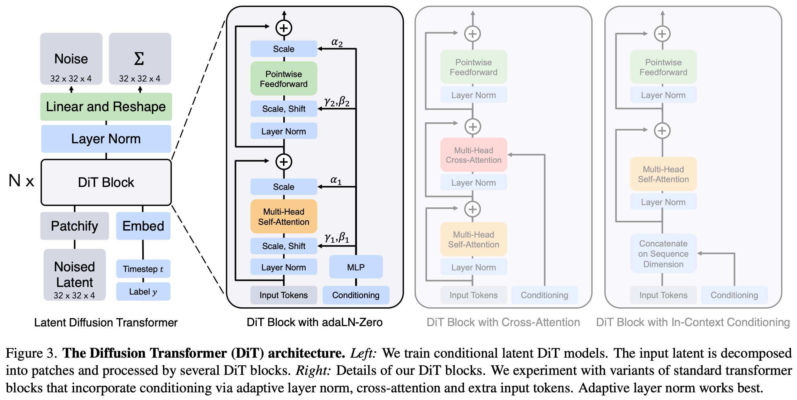
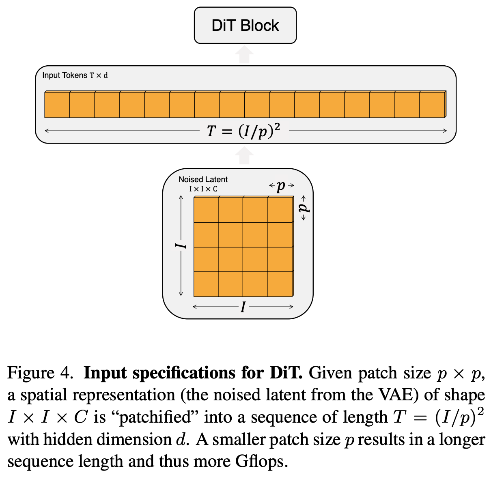

# 1 2022 DiT: Diffusion Transformer

## Abstract

- We explore a new class of diffusion models based on the transformer architecture. 
    - We train **latent diffusion** models of images, replacing the commonly-used `U-Net` backbone with a transformer that operates on **latent patches**. 
    - We analyze the scalability of our Diffusion Transformers (DiTs) through the lens of forward pass complexity as measured by `Gflops`. 
    - We find that DiTs with higher Gflops — through increased transformer depth/width or increased number of input tokens — consistently have lower FID. 
    - In addition to possessing good scalability properties, our largest DiT-XL/2 models outperform all prior diffusion models on the class-conditional ImageNet 512×512 and 256×256 benchmarks, achieving a SOTA FID of 2.27 on the latter.

## 1. Introduction

- Machine learning is experiencing a renaissance powered by transformers. 
    - Over the past five years, neural architectures for natural language processing, vision and several other domains have largely been subsumed by transformers. 
    - Many classes of image-level generative models remain holdouts (顽固分子) to the trend, though — while transformers see widespread use in **autoregressive** models, they have seen less adoption in other generative modeling frameworks. 
        - For example, diffusion models have been at the forefront of recent advances in image-level generative models; yet, they all adopt a **convolutional U-Net** architecture as the de-facto choice of backbone.

- The seminal work of Ho et al. first introduced the U-Net backbone for diffusion models. 
    - Having initially seen success within pixel-level autoregressive models and conditional GANs, the U-Net was inherited from PixelCNN++ with a few changes. 
    - The model is convolutional, comprised primarily of ResNet blocks. 
    - In contrast to the standard U-Net, additional spatial self-attention blocks, which are essential components in transformers, are interspersed at lower resolutions. 
    - Dhariwal and Nichol ablated several architecture choices for the UNet, such as the use of adaptive normalization layers to inject conditional information and channel counts for convolutional layers. 
    - However, the high-level design of the UNet from Ho et al. has largely remained intact.

- With this work, we aim to demystify the significance of architectural choices in diffusion models and offer empirical baselines for future generative modeling research. 
    - **We show that the U-Net inductive bias is not crucial to the performance of diffusion models, and they can be readily replaced with standard designs such as transformers.** 
    - As a result, diffusion models are well-poised to benefit from the recent trend of architecture unification — e.g., by inheriting best practices and training recipes from other domains, as well as retaining favorable properties like scalability, robustness and efficiency. 
    - A standardized architecture would also open up new possibilities for cross-domain research.

- In this paper, we focus on a new class of diffusion models based on transformers. 
    - We call them Diffusion Transformers, or DiTs for short. 
    - DiTs adhere to the best practices of Vision Transformers (ViTs), which have been shown to scale more effectively for visual recognition than traditional convolutional networks (e.g., ResNet).

- More specifically, we study the scaling behavior of transformers with respect to network complexity vs. sample quality. 
    - We show that by constructing and benchmarking the DiT design space under the **Latent Diffusion Models (LDMs) framework, where diffusion models are trained within a VAE’s latent space**, we can successfully replace the U-Net backbone with a transformer. 
    - We further show that DiTs are scalable architectures for diffusion models: there is a strong correlation between the network complexity (measured by Gflops) vs. **sample quality (measured by FID).** 
    - By simply scaling-up DiT and training an LDM with a high-capacity backbone (118.6 Gflops), we are able to achieve a SOTA result of 2.27 FID on the class-conditional 256 × 256 ImageNet generation benchmark.

## 2. Related Work

### Transformers. 

- Transformers have replaced domain-specific architectures across language, vision, reinforcement learning and meta-learning. 
    - They have shown remarkable scaling properties under increasing model size, training compute and data in the language domain, as **generic autoregressive models** and as **ViTs**. 
    - Beyond language, transformers have been trained to auto-regressively predict pixels. 
    - They have also been trained on discrete codebooks as both autoregressive models and masked generative models; the former has shown excellent scaling behavior up to 20B parameters. 
    - Finally, transformers have been explored in DDPMs to synthesize non-spatial data; e.g., to generate CLIP image embeddings in `DALL·E 2`. 
    - In this paper, we study the scaling properties of transformers when used as the backbone of diffusion models of images.

### Denoising diffusion probabilistic models (DDPMs).

- Diffusion and score-based generative models have been particularly successful as generative models of images, in many cases outperforming generative adversarial networks (GANs) which had previously been SOTA. 
    - Improvements in DDPMs over the past two years have largely been driven by **improved sampling techniques**, most notably **classifier-free guidance**, reformulating diffusion models to predict noise instead of pixels and using cascaded DDPM pipelines where low-resolution base diffusion models are trained in parallel with upsamplers. 
    - For all the diffusion models listed above, convolutional U-Nets are the de-facto choice of backbone architecture. 
    - Concurrent work introduced a novel, efficient architecture based on attention for DDPMs; 
    - we explore pure transformers.

### Architecture complexity. 

- When evaluating architecture complexity in the image generation literature, it is fairly common practice to use parameter counts. 
    - In general, parameter counts can be poor proxies for the complexity of image models since they do not account for, e.g., image resolution which significantly impacts performance.
    - Instead, much of the model complexity analysis in this paper is through the lens of theoretical Gflops. 
    - This brings us in-line with the architecture design literature where Gflops are widely-used to gauge complexity. 
    - In practice, the golden complexity metric is still up for debate as it frequently depends on particular application scenarios. 
    - Nichol and Dhariwal’s seminal work improving diffusion models is most related to us — there, they analyzed the scalability and Gflop properties of the `U-Net` architecture class. 
    - In this paper, we focus on the transformer class.

## 3. Diffusion Transformers

### 3.1. Preliminaries

#### Diffusion formulation. 

- Before introducing our architecture, we briefly review some basic concepts needed to understand **diffusion models (DDPMs)**. 
    - Gaussian diffusion models assume a forward noising process which gradually applies noise to real data $x_0$
    
$$ q(x_t|x_0) = \mathcal{N} (x_t; \sqrt{\bar{\alpha}_t} \; x_0, (1 − \bar{\alpha}_t) \mathbf{I} ) $$

- where **constants** $\bar{\alpha}_t$ are hyperparameters. 
- By applying the **reparameterization trick**, we can sample 

$$ x_t = \sqrt{\bar{\alpha}_t} \; x_0 + \sqrt{1- \bar{\alpha}_t} \; \epsilon_t \qquad \epsilon_t \sim \mathcal{N}(0, \mathbf{I}) $$

- **Diffusion models are trained to learn the reverse process that inverts forward process corruptions**: 

$$ p_\theta(x_{t−1}|x_t) = \mathcal{N}(\mu_\theta(x_t), \Sigma_\theta(x_t)) $$

- where neural networks are used to predict the statistics of $p_\theta$. 

- The reverse process model is trained with the **variational lower bound** of the log-likelihood of $x_0$, which reduces to 

$$ L(\theta) = −p(x_0|x_1) + \sum_t D_{KL} \left(
    q^*(x_{t−1}|x_t, x_0) \parallel p_\theta(x_{t−1}|x_t)
\right) $$

- excluding an additional term irrelevant for training. 

- Since both $q^*$ and $p_\theta$ are Gaussian, $D_{KL}$ can be evaluated with the mean and covariance of the two distributions. By reparameterizing $\mu_\theta$ as a noise prediction network $\epsilon_\theta$, the model can be trained using **simple mean-squared error** between the predicted noise $\epsilon_\theta(x_t)$ and the ground truth sampled Gaussian noise $\epsilon_t$:

$$ L_\text{simple}(\theta) = \| \epsilon_\theta(x_t) − \epsilon_t \|_2^2 $$

- But, in order to train diffusion models with a learned reverse process covariance $\Sigma_\theta$, the full $D_{KL}$ term needs to be optimized. We follow Nichol and Dhariwal’s approach: 
    - train $\epsilon_\theta$ with $L_\text{simple}$,
    - train $\Sigma_\theta$ with the full $L$. 

- Once $p_\theta$ is trained, new images can be sampled by initializing $x_{t_\text{max}} \sim \mathcal{N}(0, \mathbf{I})$ and sampling $x_{t−1} \sim p_\theta(x_{t−1}|x_t)$ via the reparameterization trick.

#### Classifier-free guidance. 

- **Conditional** diffusion models take extra information as input, such as a class label $c$.

- In this case, the reverse process becomes $p_\theta(x_{t−1}|x_t, c)$, where $\epsilon_\theta$ and $\Sigma_\theta$ are conditioned on $c$. 

- In this setting, classifier-free guidance can be used to encourage the sampling procedure to find $x$ such that $\log p(c|x)$ is high.

- By **Bayes Rule**, 

$$ \log p(c|x) \propto \log p(x|c) − \log p(x) \\[5pt]
\Rightarrow \nabla_x \log p(c|x) \propto \nabla_x \log p(x|c) − \nabla_x \log p(x) $$

- **By interpreting the output of diffusion models as the score function**, the DDPM sampling procedure can be guided to sample $x$ with high $p(x|c)$ by: 

$$ \emptyset: \text{ learned null embedding } \\[5pt]
\hat{\epsilon}_\theta(x_t, c) = \epsilon_\theta(x_t, \emptyset) + s \cdot \nabla_x \log p(x|c)  \\[5pt]
\propto \epsilon_\theta(x_t, \emptyset) + s \cdot (\epsilon_\theta(x_t, c) − \epsilon_\theta(x_t, \emptyset)) $$

- where $s > 1$ indicates the scale of the guidance (note that $s = 1$ recovers standard sampling). 

- Evaluating the diffusion model with $c = \emptyset$ is done by randomly dropping out $c$ during training and replacing it with a learned “null” embedding $\emptyset$. 

- **Classifier-free guidance is widely-known to yield significantly improved samples over generic sampling techniques, and the trend holds for our DiT models.**

- **Study note**:
    - Classifier Guidance: Requires a generative model + a separate classifier model.
    - Classifier-Free Guidance: Eliminates the separate classifier entirely. The "guidance" comes purely from comparing the model's own conditioned thoughts ($\epsilon_\theta(x_t, c)$) against its unconditioned thoughts ($\epsilon_\theta(x_t, \emptyset)$).

#### Latent diffusion models. 

- Training diffusion models directly in high-resolution pixel space can be computationally prohibitive. 
    - Latent diffusion models (LDMs) tackle this issue with a two-stage approach: 
        - learn an **autoencoder** that compresses images into smaller spatial representations with a learned encoder $E$; 
        - train a diffusion model of representations $z = E(x)$ instead of a diffusion model of images $x$ ($E$ is frozen). 
    - New images can then be generated by sampling a representation $z$ from the diffusion model and subsequently decoding it to an image with the learned decoder $x = D(z)$.

- As shown in Figure 2, LDMs achieve good performance while using a fraction of the Gflops of **pixel space diffusion models like ADM**. 
    - Since we are concerned with compute efficiency, this makes them an appealing starting point for architecture exploration. 
    - In this paper, we apply DiTs to latent space, although they could be applied to pixel space without modification as well. 
    - This makes our image generation pipeline a **hybrid-based approach**, we use 
        - **off-the-shelf (现成的) convolutional VAEs** and 
        - **transformer-based DDPMs**

### 3.2. Diffusion Transformer Design Space

- We introduce Diffusion Transformers (DiTs), a new architecture for diffusion models. 
    - **We aim to be as faithful to the standard transformer architecture as possible to retain its scaling properties.** 
    - Since our focus is training DDPMs of images (specifically, spatial representations of images), DiT is based on the Vision Transformer (ViT) architecture which operates on sequences of patches. 
    - DiT retains many of the best practices of ViTs. 
    - Figure 3 shows an overview of the complete DiT architecture. 
    - In this section, we describe the forward pass of DiT, as well as the components of the design space of the DiT class.

#### Patchify. 

- The input to DiT is a spatial representation $z$ (for 256 × 256 × 3 images, $z$ has shape 32 × 32 × 4). 
    - The **first layer** of DiT is "patchify," which converts the spatial input into a sequence of $T$ tokens, each of dimension $d$, by **linearly embedding** each patch in the input. 
    - Following patchify, we apply standard **ViT frequency-based positional embeddings (the sine-cosine version)** to all input tokens.
    - The number of tokens $T$ created by patchify is determined by the patch size hyperparameter $p$. 
    - As shown in Figure 4, halving $p$ will quadruple $T$, and thus at least quadruple total transformer Gflops. 
    - Although it has a significant impact on Gflops, note that changing $p$ has no meaningful impact on downstream parameter counts.
    - We add $p = 2, 4, 8$ to the DiT design space.

#### DiT block design. 

- Following patchify, the input tokens are processed by a sequence of transformer blocks. 
    - In addition to noised image inputs, diffusion models sometimes process additional conditional information such as 
        - noise timesteps $t$, 
        - class labels $c$, 
        - natural language, etc. 
    - We explore four variants of transformer blocks that process conditional inputs differently. The designs introduce small, but important, modifications to the standard ViT block design. The designs of all blocks are shown in Figure 3.

- **In-context conditioning.** 
    - We simply append the vector embeddings of $t$ and $c$ as two additional tokens in the input sequence, treating them no differently from the image tokens. 
    - This is similar to `cls` tokens in ViTs, and it allows us to use standard ViT blocks without modification. 
    - After the final block, we remove the conditioning tokens from the sequence. 
    - This approach introduces negligible new Gflops to the model.

- **Cross-attention block.** 
    - We concatenate the embeddings of $t$ and $c$ into a length-two sequence, separate from the image token sequence. 
    - The transformer block is modified to include an additional multi-head cross-attention layer following the multi-head self-attention block, similar to the original design from Vaswani et al., and also similar to the one used by LDM for conditioning on class labels. 
    - Cross-attention adds the most Gflops to the model, roughly a 15% overhead.

- **Adaptive layer norm (adaLN) block.** 
    - Following the widespread usage of adaptive normalization layers in GANs and diffusion models with UNet backbones, we explore replacing standard `layer norm` layers in transformer blocks with adaptive layer norm (adaLN). 
    - Rather than directly learn dimension-wise scale and shift parameters $\gamma$ and $\beta$, we regress them from the **sum of the embedding vectors of $t$ and $c$.** 
    - **Of the three block designs we explore, adaLN adds the least Gflops and is thus the most compute-efficient.**
    - It is also the only conditioning mechanism that is restricted to apply the same function to all tokens.

- **adaLN-Zero block.** 
    - Prior work on ResNets has found that initializing each residual block as the identity function is beneficial. 
    - For example, Goyal et al. found that **zero-initializing** the final batch norm scale factor $\gamma$ in each block **accelerates large-scale training** in the supervised learning setting. 
    - Diffusion U-Net models use a similar initialization strategy, zero-initializing the final convolutional layer in each block prior to any residual connections. 
    - We explore a modification of the adaLN DiT block which does the same. 
    - In addition to regressing $\gamma$ and $\beta$, we also regress dimension-wise scaling parameters $\alpha$ that are applied immediately prior to any residual connections within the DiT block.
    - We initialize the MLP to output the zero-vector for all $\alpha$; this initializes the full DiT block as the identity function. 
    - As with the vanilla adaLN block, adaLNZero adds negligible Gflops to the model.

- **Study note**: 

    $$ \text{AdaLN}(x, c) = \gamma(c) \odot  {x - \mu \over \sigma}  + \beta(c) \\[5pt]
    c: \text{ context} $$

#### Model size. 

- We apply a sequence of $N$ DiT blocks, each operating at the hidden dimension size $d$. 
    - Following ViT, we use standard transformer configs that jointly scale $N$, $d$ and attention heads. 
    - Specifically, we use four configs: `DiT-S`, `DiT-B`, `DiT-L` and `DiT-XL`. 
    - They cover a wide range of model sizes and flop allocations, from 0.3 to 118.6 Gflops, allowing us to gauge scaling performance.
    - Table 1 gives details of the configs.

#### Transformer decoder. 

- After the final DiT block, we need to decode our sequence of image tokens into 
    - an output **noise prediction** and 
    - an output **diagonal covariance prediction**.
- Both of these outputs have shape equal to the original spatial input. 
- We use a **standard linear decoder** to do this; 
- we apply the final layer norm (adaptive if using adaLN) and linearly decode each token into a $p \times p \times 2C$ tensor, where $C$ is the number of channels in the spatial input to DiT. 
- Finally, we **rearrange the decoded tokens into their original spatial layout** to get the predicted noise and covariance.

## 4. Experimental Setup

## 5. Experiments

### 5.1. State-of-the-Art Diffusion Models

### 5.2. Scaling Model vs. Sampling Compute

## 6. Conclusion

- We introduce Diffusion Transformers (DiTs), a simple transformer-based backbone for diffusion models that outperforms prior U-Net models and inherits the excellent scaling properties of the transformer model class. 
    - Given the promising scaling results in this paper, future work should continue to scale DiTs to larger models and token counts.
    - DiT could also be explored as a drop-in backbone for text-to-image models like **DALL·E 2** and **Stable Diffusion**.

