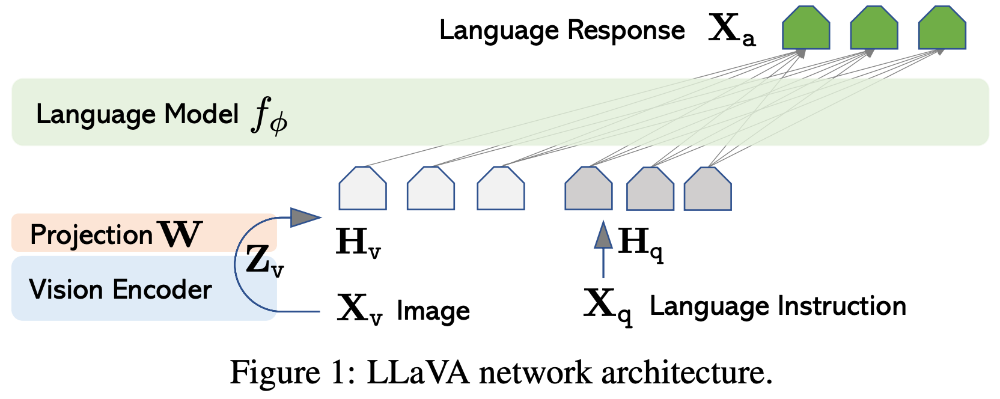
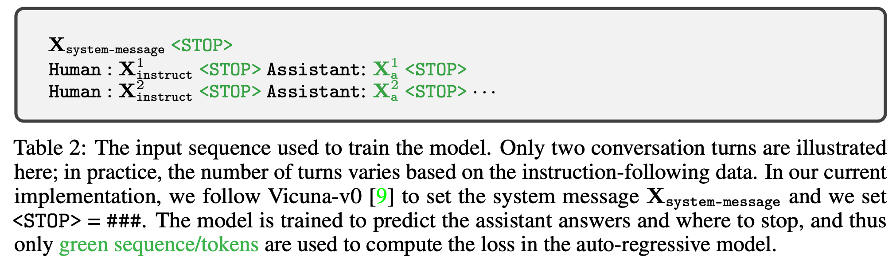

# 4 2023 LLaVA: Large Language and Vision Assistant

- [Visual Instruction Tuning](https://arxiv.org/pdf/2304.08485)

- https://github.com/haotian-liu/LLaVA

## Abstract

- Instruction tuning large language models (LLMs) using machine-generated instruction-following data has been shown to improve zero-shot capabilities on new tasks, but the idea is less explored in the multimodal field. 
    - We present the first attempt to use **language-only GPT-4** to generate multimodal language-image instruction-following data. 
    - By instruction tuning on such generated data, we introduce LLaVA: Large Language and Vision Assistant, an end-to-end trained large multimodal model that connects a vision encoder and an LLM for general purpose visual and language understanding. 
    - To facilitate future research on visual instruction following, we construct two evaluation benchmarks with diverse and challenging application-oriented tasks. 
    - Our experiments show that LLaVA demonstrates impressive multimodal chat abilities, sometimes exhibiting the behaviors of **multimodal GPT-4** on unseen images/instructions, and yields a 85.1% relative score compared with GPT-4 on a synthetic multimodal instruction-following dataset. 
    - When fine-tuned on Science QA, the synergy of LLaVA and GPT-4 achieves a new state-of-the-art accuracy of 92.53%. 

- We make GPT-4 generated visual instruction tuning data, our model, and code publicly available

## 1 Introduction

- Humans interact with the world through many channels such as vision and language, as each individual channel has a unique advantage in representing and communicating certain concepts, and thus facilitates a better understanding of the world. 
    - One of the core aspirations in artificial intelligence is to develop a general-purpose assistant that can effectively follow multi-modal vision-and-language instructions, aligned with human intent to complete various real-world tasks in the wild.

- To this end, the community has witnessed an emergent interest in developing language-augmented foundation vision models, with strong capabilities in open-world visual understanding such as classification, detection, segmentation and captioning, as well as visual generation and editing. 
    - We refer readers to the Computer Vision in the Wild reading list for a more up-to-date literature compilation. 
    - In this line of work, each task is solved independently by one single large vision model, with the task instruction implicitly considered in the model design. 
    - Further, language is only utilized to describe the image content. While this allows language to play an important role in mapping visual signals to language semantics — a common channel for human communication, it leads to models that usually **have a fixed interface with limited interactivity and adaptability to the user’s instructions**.

- Large language models (LLM), on the other hand, have shown that language can play a wider role: a universal interface for a general-purpose assistant, where various task instructions can be explicitly represented in language and guide the end-to-end trained neural assistant to switch to the task of interest to solve it. 
    - For example, the recent success of ChatGPT and GPT-4 have demonstrated the power of aligned LLMs in following human instructions, and have stimulated tremendous interest in developing open-source LLMs. Among them, **LLaMA is an open source LLM that matches the performance of GPT-3**. 
    - Alpaca, Vicuna, GPT-4-LLM utilize various **machine-generated high-quality instruction-following samples to improve the LLM’s alignment ability, reporting impressive performance compared with proprietary LLMs.** 
    - **Importantly, this line of work is text-only.**

- In this paper, we present visual instruction-tuning, the first attempt to extend instruction-tuning to the language-image multimodal space, to pave the way towards building a general-purpose visual assistant. In particular, our paper makes the following contributions:
    - Multimodal instruction-following data. One key challenge is the lack of vision-language instruction-following data. We present a data reformation perspective and pipeline to **convert image-text pairs into an appropriate instruction-following format, using ChatGPT/GPT-4.**
    - Large multimodal models. We develop a large multimodal model (LMM), by connecting the open-set visual encoder of **CLIP** with the language decoder **Vicuna**, and fine-tuning end-to-end on our generated instructional vision-language data. 
        - Our empirical study validates the effectiveness of using generated data for LMM instruction-tuning, and suggests practical tips for building a general-purpose instruction-following visual agent. 
        - When ensembled with GPT-4, our approach achieves SoTA on the Science QA multimodal reasoning dataset.
    - Multimodal instruction-following benchmark. We present LLaVA-Bench with two challenging benchmarks, with a diverse selection of paired images, instructions and detailed annotations.
    - Open-source. We release the following assets to the public: the generated multimodal instruction data, the codebase, the model checkpoints, and a visual chat demo.

## 2 Related Work

- Multimodal Instruction-following Agents. 
    - In computer vision, existing works that build instruction following agents can be broadly categorized into two classes: 
        - End-to-end trained models, which are separately explored for each specific research topic. For example, the vision-language navigation task and Habitat require the **embodied AI agent** to follow natural language instructions and take a sequence of actions to complete goals in visual environments. In the image editing domain, given an input image and a written instruction that tells the agent what to do, InstructPix2Pix edits images by following the human instructions. 
        - A system that coordinates various models via LangChain / LLMs, such as Visual ChatGPT, X-GPT, MM-REACT, VisProg, and ViperGPT. 
        - While sharing the same goal in building instruction-following agents, we focus on developing an end-to-end trained language-vision multimodal model for multiple tasks.

- Instruction Tuning. 
    - In the natural language processing (NLP) community, to enable LLMs such as GPT-3, T5, PaLM, and OPT to follow natural language instructions and complete real-world tasks, researchers have explored methods for LLM instruction-tuning, leading to instruction-tuned counterparts such as **InstructGPT/ChatGPT**, FLAN-T5, FLAN-PaLM, and OPT-IML, respectively. 
    - It turns out that this simple approach can effectively improve the zero- and few-shot generalization abilities of LLMs. 
    - It is thus natural to borrow the idea from NLP to computer vision. 
    - More broadly, the teacher-student distillation ideas with foundation models have been studied in other topics such as image classification. Flamingo can be viewed as the GPT-3 moment in the multimodal domain, due to its strong performance on zero-shot task transfer and in-context-learning. 
    - Other LMMs trained on image text pairs include BLIP-2, FROMAGe, and KOSMOS-1. PaLM-E is an LMM for embodied AI. 
    - Based on the recent “best” open-source LLM LLaMA, OpenFlamingo and LLaMA-Adapter are open-source efforts that enable LLaMA to use image inputs, paving the way to build open-source multimodal LLMs. 
    - While these models present promising task transfer generalization performance, they are not explicitly tuned with vision-language instruction data, and their performance in multimodal tasks usually falls short compared to language-only tasks. 
    - In this paper, we aim to fill this gap and study its effectiveness. 
    - Finally, note that **visual instruction tuning is different from visual prompt tuning: the former aims to improve the model’s instruction following abilities, while the latter aims to improve the parameter-efficiency in model adaptation.**

## 3 GPT-assisted Visual Instruction Data Generation

- The community has witnessed a surge in the amount of public multimodal data such as image-text pairs, ranging from CC to LAION. However, when it comes to multimodal instruction following data, the available amount is limited, partially because the process for creating such data is time-consuming and less well-defined when human crowd-scouring is considered. 
    - Inspired by the success of recent GPT models in text-annotation tasks, we propose to leverage ChatGPT/GPT-4 for multimodal instruction-following data collection, based on the widely existing image-pair data.
    - For an image $X_v$ and its associated caption $X_c$, it is natural to create a set of questions $X_q$ with the intent to instruct the assistant to describe the image content. We prompt GPT-4 to curate such a list of questions (see details in Appendix). 
    - Therefore, a simple way to expand an image-text pair to its instruction-following version is $\text{Human: } X_q \; X_v \text{ <STOP> Assistant: } X_c \text{ <STOP>}$. 
    - Though cheap to construct, this simple expanded version lacks diversity and in-depth reasoning in both the instructions and responses.
    - To mitigate this issue, we leverage language-only GPT-4 or ChatGPT as the strong teacher (both accept only text as input), to create instruction-following data involving visual content. 
    - Specifically, **in order to encode an image into its visual features to prompt a text-only GPT**, we use two types of symbolic representations: 
        - Captions typically describe the visual scene from various perspectives;
        - **Bounding boxes** usually localize the objects in the scene, and each box encodes the object concept and its spatial location. One example is shown in the top block of Table 14.
    - **This symbolic representation allows us to encode the image as an LLM-recognizable sequence**. 

- We use COCO images and generate three types of instruction-following data. One example per type is shown in the bottom block of Table 14. For each type, we first manually design a few examples. They are the only human annotations we have during data collection, and are used as seed examples in in-context-learning to query GPT-4.
    - Conversation. We design a conversation between the assistant and a person asking questions about this photo. The answers are in a tone as if the assistant is seeing the image and answering the question. A diverse set of questions are asked about the visual content of the image, including the object types, counting the objects, object actions, object locations, relative positions between objects. **Only questions that have definite answers are considered**. Please see Appendix for the detailed prompt.
    - Detailed description. To include a rich and comprehensive description for an image, we create a list of questions with such an intent. We prompt GPT-4 then curate the list (see detailed prompts and curation process in Appendix). For each image, we randomly sample one question from the list to ask GPT-4 to generate the detailed description.
    - Complex reasoning. The above two types focus on the visual content itself, based on which we further create in-depth reasoning questions. The answers typically require a step-by-step reasoning process by following rigorous logic.

- We collect 158K unique language-image instruction-following samples in total, including 58K in conversations, 23K in detailed description, and 77k in complex reasoning, respectively. We ablated the use of ChatGPT and GPT-4 in our early experiments, and found that GPT-4 consistently provides higher quality instruction-following data, such as spatial reasoning.

## 4 Visual Instruction Tuning

### 4.1 Architecture

- The primary goal is to effectively leverage the capabilities of both the pre-trained LLM and visual model. 
    - The network architecture is illustrated in Figure 1. 
    - We choose **[Vicuna](https://github.com/lm-sys/FastChat) as our LLM** $f_{\phi}(\cdot)$ parameterized by $\phi$, as it has the best instruction following capabilities in language tasks among publicly available checkpoints.
    - For an input image $X_v$, we consider the pre-trained **CLIP visual encoder ViT-L/14**, which provides the visual feature $Z_v = g(X_v)$. 
    
- The grid features before and after the last Transformer layer are considered in our experiments. We consider a simple linear layer to connect image features into the word embedding space. 
    - Specifically, we apply a trainable projection matrix $W$ to convert $Z_v$ into language embedding tokens $H_v$, which have the same dimensionality as the word embedding space in the language model:

$$
H_v = W \cdot Z_v, \text{ with } Z_v = g(X_v)
$$

- Thus, we have a sequence of visual tokens $H_v$. 
    - Note that our simple projection scheme is lightweight, which allows us to iterate data centric experiments quickly. 
    - More sophisticated schemes to connect the image and language representations can also be considered, such as gated cross-attention in Flamingo and Q-former in BLIP-2. 
    - We leave exploring possibly more effective and sophisticated architecture designs for LLaVA as future work.

## 4.2 Training

- For each image $X_v$, we generate multi-turn conversation data $(X_q^1, X_a^1, ... , X_q^T, X_a^T)$, where $T$ is the total number of turns. 
- We organize them as a sequence, by treating all answers as the assistant’s response, and the instruction $X_\text{instruct}^t$ at the $t$-th turn as:

$$
X_\text{instruct}^t = \begin{cases}
\text{Randomly choose } [X_q^1, X_v] \text{ or } [X_v, X_q^1] & t = 1 \\ 
X_q^t & t > 1
\end{cases}
$$

- This leads to the unified format for the multimodal instruction-following sequence illustrated in Table 2. 

- We perform instruction-tuning of the LLM on the prediction tokens, using its original auto-regressive training objective. Specifically, for a sequence of length $L$, we compute the probability of the target answers $X_a$ by:

$$
p(X_a | X_v, X_\text{instruct}) = \prod_{i=1}^L 
p_\theta (x_i | X_v, X_{\text{instruct},<i}, X_{a,<i})
$$

- where $\theta$ is the trainable parameters, $X_{\text{instruct},<i}$ and $X_{a,<i}$ are the instruction and answer tokens in all turns before the current prediction token $x_i$, respectively. 

- Please see Table 2 for an illustration of the prediction tokens. 

- For the conditionals in the equation above, we explicitly add $X_v$ to emphasize the fact that the image is grounded for all answers, and we omit $X_\text{system-message}$ and all previous `<STOP>` for better readability. 

- For LLaVA model training, we consider a two-stage instruction-tuning procedure.

- Stage 1: Pre-training for Feature Alignment. 
    - To strike a balance between concept coverage and training efficiency, we filter CC3M to 595K image-text pairs. Please see Appendix for details of the filtering process. 
    - These pairs are converted to the instruction-following data using the naive expansion method describe in Section 3. 
    - Each sample can be treated as a single-turn conversation. 
    - To construct the input $X_\text{instruct}$, for an image $X_v$, a question $X_q$ is randomly sampled, which is a language instruction to request the assistant to describe the image briefly. 
    - The ground-truth prediction answer $X_a$ is the original caption. 
    - **In training, we keep both the visual encoder and LLM weights frozen**, and maximize the likelihood of $p(X_a | X_v, X_\text{instruct})$ with trainable parameters $\theta = W$ (the projection matrix) only. 
    - **In this way, the image features $H_v$ can be aligned with the pre-trained LLM word embedding. This stage can be understood as training a compatible visual tokenizer for the frozen LLM.**

- Stage 2: Fine-tuning End-to-End. 
    - We always keep the visual encoder weights frozen, and continue to update both the pre-trained weights of the projection layer and LLM in LLaVA; i.e., the trainable parameters are $\theta = \{ W, \phi \}$. 
    - We consider two specific use case scenarios:
        - Multimodal Chatbot. We develop a Chatbot by fine-tuning on the 158K language-image instruction-following data in Section 3. Among the three types of responses, conversation is multi-turn while the other two are single-turn. They are uniformly sampled in training.
        - Science QA. We study our method on the ScienceQA benchmark, the first large-scale multimodal science question dataset that annotates the answers with detailed lectures and explanations. Each question is provided a context in the form of natural language or an image. The assistant provides the reasoning process in natural language and selects the answer among multiple choices. For training, we organize the data as a single turn conversation, the question & context as $X_\text{instruct}$, and reasoning & answer as $X_a$.

## 5 Experiments

### 5.1 Multimodal Chatbot

### 5.2 ScienceQA

## 6 Conclusion

- This paper demonstrated the effectiveness of visual instruction tuning. 

- We presented an automatic pipeline to create language-image instruction-following data, based on which we train LLaVA, a multimodal model to follow human intent to complete visual tasks. 
    - It achieves the new SoTA accuracy when fine-tuned on ScienceQA, and excellent visual chat capabilities when fine-tuned on multimodal chat data. 
    
- Besides, we present the first benchmark to study multimodal instruction following capability. 

- This paper is an initial step in visual instruction tuning, and mainly focuses on real-life tasks. 

- For more quantitative results of LLaVA on academic benchmarks, please refer to the improved baselines with visual instruction tuning. 

- We hope our work can inspire future research on building more capable multimodal models.
