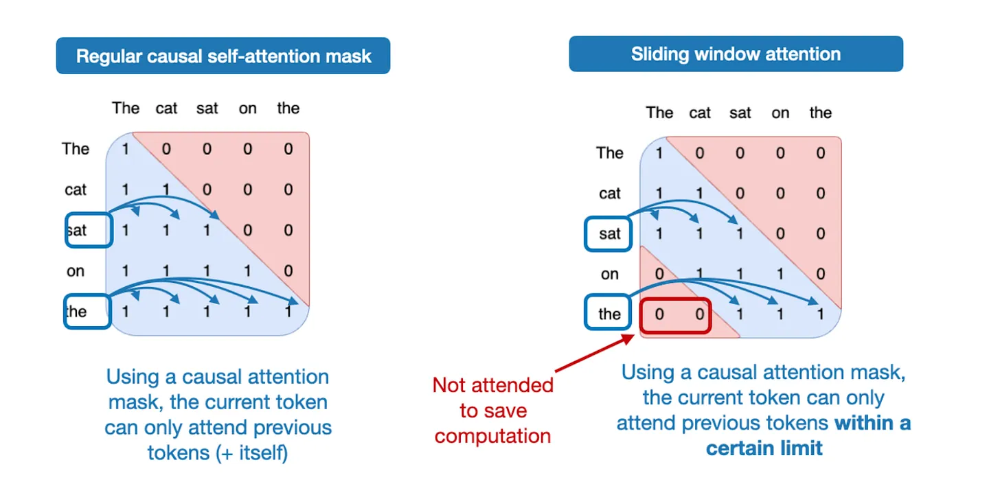
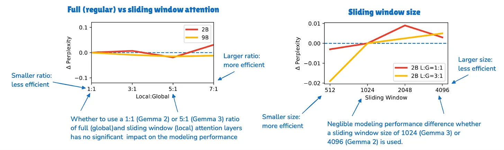
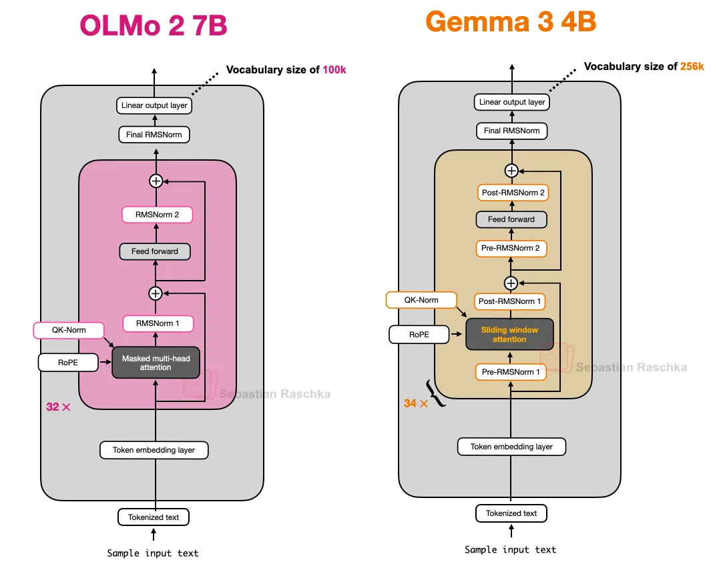
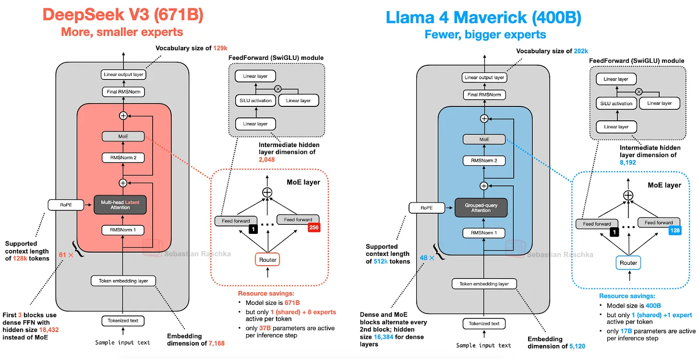
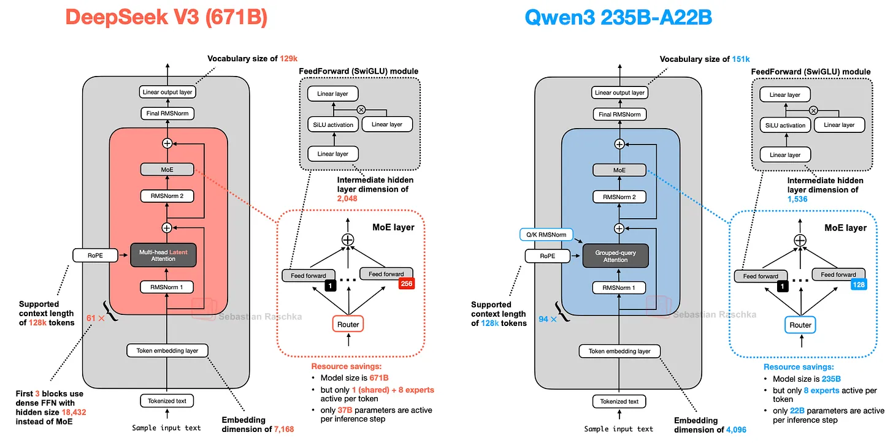

# 6 2025 The Big LLM Architecture Comparison

- [From DeepSeek V3 to GLM-5: A Look At Modern LLM Architecture Design](https://magazine.sebastianraschka.com/p/the-big-llm-architecture-comparison)

---

- It has been seven years since the original GPT architecture was developed. 
    - At first glance, looking back at **GPT-2 (2019)** and forward to DeepSeek V3 and Llama 4 (2024-2025), one might be surprised at how structurally similar these models still are.
        - Sure, positional embeddings have evolved from absolute to rotational (**RoPE**), 
        - Multi-Head Attention has largely given way to **Grouped-Query Attention**, 
        - and the more efficient **SwiGLU** has replaced activation functions like GELU. 
    - But beneath these minor refinements, have we truly seen groundbreaking changes, or are we simply polishing the same architectural foundations?

- Comparing LLMs to determine the key ingredients that contribute to their good (or not-so-good) performance is notoriously challenging: datasets, training techniques, and hyperparameters vary widely and are often not well documented.
    - However, I think that there is still a lot of value in examining the structural changes of the architectures themselves to see what LLM developers are up to in 2025. (A subset of them are shown in Figure 1 below.)

- So, in this article, rather than writing about benchmark performance or training algorithms, I will focus on the architectural developments that define today's flagship open models.

- As you may remember, I wrote about [multimodal LLMs](https://magazine.sebastianraschka.com/p/understanding-multimodal-llms) not too long ago; in this article, I will focus on the text capabilities of recent models and **leave the discussion of multimodal capabilities for another time.**

## 1. DeepSeek V3/R1

- As you have probably heard more than once by now, DeepSeek R1 made a big impact when it was released in January 2025. DeepSeek R1 is a reasoning model built on top of the DeepSeek V3 architecture, which was introduced in December 2024.

- In this section, I’ll focus on two key architectural techniques introduced in DeepSeek V3 that improved its computational efficiency and distinguish it from many other LLMs:
    - **Multi-Head Latent Attention (MLA)**
    - **Mixture-of-Experts (MoE)**

### 1.1 Multi-Head Latent Attention (MLA)

- Before discussing Multi-Head Latent Attention (MLA), let's briefly go over some background to motivate why it's used. 
    - For that, let's start with **Grouped-Query Attention (GQA)**, which has become the new standard replacement for a more compute- and parameter-efficient alternative to **Multi-Head Attention (MHA)** in recent years.

- So, here's a brief GQA summary. Unlike MHA, where each head also has its own set of keys and values, to reduce memory usage, GQA groups multiple heads to share the same key and value projections.
    - For example, as further illustrated in Figure 2 below, if there are 2 key-value groups and 4 attention heads, then heads 1 and 2 might share one set of keys and values, while heads 3 and 4 share another. This reduces the total number of key and value computations, which leads to lower memory usage and improved efficiency (without noticeably affecting the modeling performance, according to ablation studies).

- So, the core idea behind GQA is to reduce the number of key and value heads by sharing them across multiple query heads. 
    - This (1) lowers the model's parameter count 
    - and (2) reduces the memory bandwidth usage for key and value tensors during inference since fewer keys and values need to be stored and retrieved from the KV cache.

- (If you are curious how GQA looks in code, see my [GPT-2 to Llama 3 conversion guide](https://github.com/rasbt/LLMs-from-scratch/blob/main/ch05/07_gpt_to_llama/converting-llama2-to-llama3.ipynb) for a version without KV cache and my KV-cache variant [here](https://github.com/rasbt/LLMs-from-scratch/blob/main/pkg/llms_from_scratch/llama3.py))

- While GQA is mainly a computational-efficiency workaround for MHA, ablation studies (such as those in the original GQA paper and the Llama 2 paper) show it performs comparably to standard MHA in terms of LLM modeling performance.

- Now, **Multi-Head Latent Attention (MLA) offers a different memory-saving strategy** that also pairs particularly well with KV caching. 
    - **Instead of sharing key and value heads like GQA, MLA compresses the key and value tensors into a lower-dimensional space before storing them in the KV cache.**

- At inference time, these compressed tensors are projected back to their original size before being used, as shown in the Figure 3 below. This adds an extra matrix multiplication but reduces memory usage.

- **As a side note, the queries are also compressed, but only during training, not inference.**

- By the way, MLA is not new in DeepSeek V3, as its DeepSeek-V2 predecessor also used (and even introduced) it. **Also, the V2 paper contains a few interesting ablation studies that may explain why the DeepSeek team chose MLA over GQA (see Figure 4 below).**

- As shown in Figure 4 above, 
    - GQA appears to perform worse than MHA, 
    - whereas MLA offers better modeling performance than MHA, 
    - which is likely why the DeepSeek team chose MLA over GQA. (It would have been interesting to see the "KV Cache per Token" savings comparison between MLA and GQA as well!)

- To summarize this section before we move on to the next architecture component, 
    - MLA is a clever trick to reduce KV cache memory use while even slightly outperforming MHA in terms of modeling performance.

### 1.2 Mixture-of-Experts (MoE)

- The other major architectural component in DeepSeek worth highlighting is its use of Mixture-of-Experts (MoE) layers. 
    - While DeepSeek did not invent MoE, it has seen a resurgence this year, and many of the architectures we will cover later also adopt it.

- You are likely already familiar with MoE, but a quick recap may be helpful.
    - The core idea in MoE is to replace each FeedForward module in a transformer block with multiple expert layers, where each of these expert layers is also a FeedForward module. 
    - **This means that we swap a single FeedForward block for multiple FeedForward blocks**, as illustrated in the Figure 5 below.

- The FeedForward block inside a transformer block (shown as the dark gray block in the figure above) **typically contains a large number of the model's total parameters.** (Note that the transformer block, and thereby the FeedForward block, is repeated many times in an LLM; in the case of **DeepSeek V3, 61 times.**)

- So, replacing a single FeedForward block with multiple FeedForward blocks (as done in a MoE setup) substantially increases the model's total parameter count. 
    - However, the key trick is that we don't use ("activate") all experts for every token. Instead, a router selects only a small subset of experts per token. (In the interest of time, or rather article space, I'll cover the router in more detail another time.)

- Because only a few experts are active at a time, MoE modules are often referred to as sparse, in contrast to dense modules that always use the full parameter set. 
    - However, the large total number of parameters via an MoE increases the capacity of the LLM, which means it can take up more knowledge during training. The sparsity keeps inference efficient, though, as we don't use all the parameters at the same time.

- For example, DeepSeek V3 has **256 experts per MoE** module and a total of 671 billion parameters. Yet during inference, only **9 experts are active at a time (1 shared expert plus 8 selected by the router)**. This means just 37 billion parameters are used per inference step as opposed to all 671 billion.

- **One notable feature of DeepSeek V3's MoE design is the use of a shared expert.** This is an expert that is always active for every token. This idea is not new and was already introduced in the DeepSeek 2024 MoE and 2022 DeepSpeedMoE papers.
    - The benefit of having a shared expert was first noted in the DeepSpeedMoE paper, where they found that it boosts overall modeling performance compared to no shared experts. This is likely because common or repeated patterns don't have to be learned by multiple individual experts, which leaves them with more room for learning more specialized patterns.

### 1.3 DeepSeek Summary

- To summarize, DeepSeek V3 is a massive 671-billion-parameter model that, at launch, **outperformed other open-weight models, including the 405B Llama 3**. 
    - Despite being larger, it is much more efficient at inference time thanks to its Mixture-of-Experts (MoE) architecture, which activates only a small subset of (just 37B) parameters per token.

- Another key distinguishing feature is DeepSeek V3's use of Multi-Head Latent Attention (MLA) instead of Grouped-Query Attention (GQA). 
    - Both MLA and GQA are inference-efficient alternatives to standard Multi-Head Attention (MHA), particularly when using KV caching. While MLA is more complex to implement, a study in the DeepSeek-V2 paper has shown it delivers better modeling performance than GQA.

---

## 2. OLMo 2 (Allen Institute for AI)

- The OLMo series of models by the non-profit **Allen Institute for AI** is noteworthy due to its transparency in terms of training data and code, as well as the relatively detailed technical reports.

- While you probably won’t find OLMo models at the top of any benchmark or leaderboard, they are pretty clean and, more importantly, a great blueprint for developing LLMs, thanks to their transparency.

- And while OLMo models are popular because of their transparency, they are not that bad either. In fact, at the time of release in January (before Llama 4, Gemma 3, and Qwen 3), OLMo 2 models were sitting at the Pareto frontier of compute to performance, as shown in Figure 7 below.

- As mentioned earlier in this article, I aim to focus only on the LLM architecture details (not training or data) to keep it at a manageable length. So, what were the interesting architectural design choices in OLMo2? It mainly comes down to normalizations: the placement of **RMSNorm** layers as well as the addition of a **QK-norm**, which I will discuss below.

- **Another thing worth mentioning is that OLMo 2 still uses traditional Multi-Head Attention (MHA) instead of MLA or GQA.**

### 2.1 Normalization Layer Placement

- Overall, OLMo 2 largely follows the architecture of the **original GPT model**, similar to other contemporary LLMs. However, there are some noteworthy deviations. Let's start with the normalization layers.

- **Similar to Llama, Gemma, DeepSeek-V3, and most other LLMs, OLMo 2 switched from LayerNorm to RMSNorm.**

- **But since RMSNorm is old hat (it's basically a simplified version of LayerNorm with fewer trainable parameters)**, I will skip the discussion of RMSNorm vs LayerNorm. (Curious readers can find an RMSNorm code implementation in my GPT-2 to Llama conversion guide.)

- **However, it's worth discussing the placement of the RMSNorm layer.** 
    - The original transformer (from the "Attention is all you need" paper) placed the two normalization layers in the transformer block after the attention module and the FeedForward module, respectively. This is also known as Post-LN or **Post-Norm**.

- GPT and most other LLMs that came after placed the normalization layers before the attention and FeedForward modules, which is known as Pre-LN or **Pre-Norm**. A comparison between Post- and Pre-Norm is shown in the figure below.

- In 2020, Xiong et al. showed that **Pre-LN results in more well-behaved gradients at initialization. Furthermore, the researchers mentioned that Pre-LN even works well without careful learning rate warm-up, which is otherwise a crucial tool for Post-LN.**

- Now, the reason I am mentioning that is that OLMo 2 adopted a form of Post-LN (but with RMSNorm instead of LayerNorm, so I am calling it Post-Norm).

- In OLMo 2, instead of placing the normalization layers before the attention and FeedForward layers, they place them after, as shown in the figure above. However, notice that in contrast to the original transformer architecture, the normalization layers are still inside the residual layers (skip connections).

- So, why did they move the position of the normalization layers? The reason is that it helped with training stability, as shown in the figure below.

- **Unfortunately this figure shows the results of the reordering together with QK-Norm, which is a separate concept. So, it’s hard to tell how much the normalization layer reordering contributed by itself.**

### 2.2 QK-Norm

- Since the previous section already mentioned the QK-norm, and **other LLMs we discuss later, such as Gemma 2 and Gemma 3, also use QK-norm**, let's briefly discuss what this is.

- QK-Norm is essentially yet another RMSNorm layer. 
    - **It's placed inside the Multi-Head Attention (MHA) module and applied to the queries (q) and keys (k) before applying RoPE.** 

- As mentioned earlier, **together with Post-Norm, QK-Norm stabilizes the training**. Note that QK-Norm was not invented by OLMo 2 but goes back to the **2023 Scaling Vision Transformers paper**.

### 2.3 OLMo 2 Summary

- In short, the noteworthy OLMo 2 architecture design decisions are primarily 
    - the RMSNorm placements: RMSNorm after instead of before the attention and FeedForward modules (a flavor of Post-Norm), 
    - as well as the addition of RMSNorm for the queries and keys inside the attention mechanism (QK-Norm), 
    - which both, together, help stabilize the training loss.

---

## 3. Gemma 3 (Google DeepMind)

- Google's Gemma models have always been really good, and I think they have always been a bit underhyped compared to other popular models, like the Llama series.

- One of the distinguishing aspects of Gemma is the rather large vocabulary size (to support multiple languages better), and the stronger focus on the 27B size (versus 8B or 70B). But note that Gemma 2 also comes in smaller sizes: 1B, 4B, and 12B.

- The **27B** size hits a really nice sweet spot: it's much more capable than an 8B model but not as resource-intensive as a 70B model, and **it runs just fine locally on my Mac Mini.**

- So, what else is interesting in Gemma 3? As discussed earlier, other models like Deepseek V3/R1 use a **Mixture-of-Experts (MoE)** architecture to reduce memory requirements at inference, given a fixed model size. (The MoE approach is also used by several other models we will discuss later.)
    - **Gemma 3 uses a different "trick" to reduce computational costs, namely sliding window attention.**

### 3.1 Sliding Window Attention

- With sliding window attention (originally introduced in the **LongFormer paper in 2020** and also already used by Gemma 2), the Gemma 3 team was able to reduce the memory requirements in the KV cache by a substantial amount, as shown in the figure below.

- So, what is sliding window attention? If we think of regular self-attention as a global attention mechanism, since each sequence element can access every other sequence element, **then we can think of sliding window attention as local attention, because here we restrict the context size around the current query position.** This is illustrated in the figure below.

- Please note that **sliding window attention can be used with both Multi-Head Attention and Grouped-Query Attention; Gemma 3 uses grouped-query attention.**

- As mentioned above, sliding window attention is also referred to as local attention because the local window surrounds and moves with the current query position. In contrast, regular attention is global as each token can access all other tokens.

- Now, as briefly mentioned above, the Gemma 2 predecessor architecture also used sliding window attention before. **The difference in Gemma 3 is that they adjusted the ratio between global (regular) and local (sliding) attention.**
    - For instance, **Gemma 2 uses a hybrid attention mechanism that combines sliding window (local) and global attention in a 1:1 ratio.** Each token can attend to a **4k-token window** of nearby context.
    - **Where Gemma 2 used sliding window attention in every other layer, Gemma 3 now has a 5:1 ratio, meaning there's only 1 full attention layer for every 5 sliding windows (local) attention layers;moreover, the sliding window size was reduced from 4096 (Gemma 2) to just 1024 (Gemma 3). This shifts the model's focus towards more efficient, localized computations.**

- According to their ablation study, the use of sliding window attention has minimal impact on modeling performance, as shown in the figure below.

- While sliding window attention is the most notable architecture aspect of Gemma 3, I want to also briefly go over the placement of the normalization layers as a follow-up to the previous OLMo 2 section.

### 3.2 Normalization Layer Placement in Gemma 3

- A small but interesting tidbit to highlight is that Gemma 3 uses **RMSNorm in both a Pre-Norm and Post-Norm setting around its grouped-query attention module.**

- This is similar to Gemma 2 but still worth highlighting, as it differs from 
    - the Post-Norm used in the original transformer (“Attention is all you need”), 
    - the Pre-Norm, which was popularized by GPT-2 and used in many other architectures afterwards, 
    - and the Post-Norm flavor in OLMo 2 that we saw earlier.

- I think this normalization layer placement is a relatively intuitive approach as it gets the best of both worlds: Pre-Norm and Post-Norm. 
    - In my opinion, a bit of extra normalization can't hurt. 
    - In the worst case, if the extra normalization is redundant, this adds a bit of inefficiency through redundancy. 
    - In practice, since RMSNorm is relatively cheap in the grand scheme of things, this shouldn't have any noticeable impact, though.

### 3.3 Gemma 3 Summary

- Gemma 3 is a well-performing open-weight LLM that, in my opinion, is a bit underappreciated in the open-source circles. 
    - The most interesting part is the use of sliding window attention to improve efficiency (**it will be interesting to combine it with MoE in the future**).
    - Also, Gemma 3 has a unique normalization layer placement, placing RMSNorm layers both before and after the attention and FeedForward modules.

### 3.4 Bonus: Gemma 3n

- A few months after the Gemma 3 release, Google shared Gemma 3n, which is a Gemma 3 model that has been optimized for small-device efficiency with the goal of running on phones.
    - One of the changes in Gemma 3n to achieve better efficiency is the so-called **Per-Layer Embedding (PLE) parameters layer**. 
    - The key idea here is to keep only a subset of the model's parameters in GPU memory. Token-layer specific embeddings, such as those for text, audio, and vision modalities, are then streamed from the CPU or SSD on demand.
    - The figure below illustrates the PLE memory savings, listing 5.44 billion parameters for a standard Gemma 3 model. This likely refers to the Gemma 3 4-billion variant.

- The 5.44 vs. 4 billion parameter discrepancy is because Google has an interesting way of reporting parameter counts in LLMs. They often exclude embedding parameters to make the model appear smaller, except in cases like this, where it is convenient to include them to make the model appear larger. This is not unique to Google, as this approach has become a common practice across the field.

- Another interesting trick is the MatFormer concept (short for Matryoshka Transformer). 
    - For instance, **Gemma 3n uses a single shared LLM (transformer) architecture that can be sliced into smaller, independently usable models. Each slice is trained to function on its own, so at inference time, we can run just the part you need (instead of the large model).**

---

## 4. (skip) Mistral Small 3.1

## 5. Llama 4 (Meta AI)

- The extensive introductory discussion on Mixture-of-Experts (MoE) earlier in this article pays off again. 
    - Llama 4 has also adopted an MoE approach and otherwise follows a relatively standard architecture that is **very similar to DeepSeek V3**, as shown in the figure below. 
    - **Llama 4 includes native multimodal support, similar to models like Gemma and Mistral**. However, since this article focuses on language modeling, we only focus on the text model.

- While the Llama 4 Maverick architecture looks very similar to DeepSeek V3 overall, there are some interesting differences worth highlighting.
    - First, **Llama 4 uses Grouped-Query Attention** similar to its predecessors, whereas **DeepSeek V3 uses Multi-Head Latent Attention**, which we discussed at the beginning of this article. 
    - Now, both DeepSeek V3 and Llama 4 Maverick are very large architectures, with **DeepSeek V3 being approximately 68% larger** in its total parameter count. 
    - However, with 37 billion active parameters, **DeepSeek V3 has more than twice as many active parameters as Llama 4 Maverick (17B).**

- Llama 4 Maverick uses a more classic MoE setup with fewer but larger experts (2 active experts with 8,192 hidden size each) compared to DeepSeek V3 (9 active experts with 2,048 hidden size each). 
    - **Also, DeepSeek uses MoE layers in each transformer block (except the first 3), whereas Llama 4 alternates MoE and dense modules in every other transformer block.**

- Given the many small differences between architectures, it is difficult to determine their exact impact on final model performance. 
    - **The main takeaway, however, is that MoE architectures have seen a significant rise in popularity in 2025.**

## 6. Qwen3 (Alibaba Cloud)

- The Qwen team consistently delivers high-quality open-weight LLMs. 
    - **When I helped co-advising the LLM efficiency challenge at NeurIPS 2023, I remember that the top winning solutions were all Qwen2-based.**

- Now, Qwen3 is another hit model series at the top of the leaderboards for their size classes. 
    - There are 7 dense models: 0.6B, 1.7B, 4B, 8B, 14B, and 32B. And there are 2 MoE models: 30B-A3B, and 235B-A22B.

### 6.1 Qwen3 (Dense)

- Let's discuss the dense model architecture first. 
    - **As of this writing, the 0.6B model may well be the smallest current-generation open-weight model out there.** And based on my personal experience, it performs really well given its small size. 
    - It has great token/sec throughput and a low memory footprint if you are planning to run it locally. But what's more, it's also easy to train locally (for educational purposes) due to its small size.
    - So, Qwen3 0.6B has replaced Llama 3 1B for me for most purposes. A comparison between these two architectures is shown below.

- If you are interested in a human-readable Qwen3 implementation without external third-party LLM library dependencies, I recently implemented [Qwen3 from scratch (in pure PyTorch)](https://github.com/rasbt/LLMs-from-scratch/tree/main/ch05/11_qwen3).

- The computational performance numbers in the figure above are based on my from-scratch PyTorch implementations when run on an **A100 GPU**. 
    - As one can see, Qwen3 has a smaller memory footprint as it is a smaller architecture overall, but also uses smaller hidden layers and fewer attention heads. 
    - However, it uses more transformer blocks than Llama 3, which leads to a slower runtime (lower tokens/sec generation speed).

### 6.2 Qwen3 (MoE)

- As mentioned earlier, Qwen3 also comes in two MoE flavors: 30B-A3B and 235B-A22B. Why do some architectures, like Qwen3, come as regular (dense) and MoE (sparse) variants?
    - As mentioned at the beginning of this article, MoE variants help reduce inference costs for large base models. Offering both dense and MoE versions gives users flexibility depending on their goals and constraints.
    - Dense models are typically more straightforward to fine-tune, deploy, and optimize across various hardware.
    - On the other hand, MoE models are optimized for scaling inference. For instance, at a fixed inference budget, they can achieve a higher overall model capacity (i.e., knowledge uptake during training due to being larger) without proportionally increasing inference costs.

- By releasing both types, the Qwen3 series can support a broader range of use cases: dense models for robustness, simplicity, and fine-tuning, and MoE models for efficient serving at scale.

- To round up this section, let's look at Qwen3 235B-A22B (note that the A22B stands for "22B active parameters) to DeepSeek V3, which has almost twice as many active parameters (37B).

- As shown in the figure above, the **DeepSeek V3 and Qwen3 235B-A22B architectures are remarkably similar**. What's noteworthy, though, is that the **Qwen3 model moved away from using a shared expert (earlier Qwen models, such as Qwen2.5-MoE did use a shared expert).**
    - Unfortunately, the Qwen3 team did not disclose any reason as to why they moved away from shared experts. 
    - If I had to guess, it was perhaps simply not necessary for training stability for their setup when they increased the experts from 2 (in Qwen2.5-MoE) to 8 (in Qwen3). And then they were able to save the extra compute/memory cost by using only 8 instead of 8+1 experts. (However, this doesn't explain why DeepSeek V3 is still keeping their shared expert.)

> [Junyang Lin](https://scholar.google.com.hk/citations?user=qp6IwtgAAAAJ&hl=en): At that moment we did not find significant enough improvement on shared expert and we were worrying about the optimization for inference caused by shared expert. No straight answer to this question honestly.

## 7. SmolLM3 (Hugging Face)

- SmolLM3 is perhaps not as nearly as popular as the other LLMs covered in this article, but I thought it is still an interesting model to include as it offers really good modeling performance at a relatively small and convenient 3-billion parameter model size that sits between the 1.7B and 4B Qwen3 model, as shown in the figure below.

- Moreover, it also shared a lot of the training details, similar to OLMo, which is rare and always appreciated!

- As shown in the architecture comparison figure below, the SmolLM3 architecture looks fairly standard. **The perhaps most interesting aspect is its use of NoPE (No Positional Embeddings), though.**

### 7.1 No Positional Embeddings (NoPE)

- NoPE is, in LLM contexts, an older idea that goes back to a 2023 paper ([The Impact of Positional Encoding on Length Generalization in Transformers](https://arxiv.org/pdf/2305.19466)) to **remove explicit positional information injection** (like through classic absolute positional embedding layers in early GPT architectures or nowadays RoPE).

- **In transformer-based LLMs, positional encoding is typically necessary because self-attention treats tokens independently of order.** 
    - Absolute position embeddings solve this by adding an additional embedding layer that adds information to the token embeddings.
    - RoPE, on the other hand, solves this by rotating the query and key vectors relative to their token position.

- **In NoPE layers, however, no such positional signal is added at all: not fixed, not learned, not relative. Nothing.**

- Even though there is no positional embedding, the model still knows which tokens come before, thanks to the causal attention mask. 
    - This mask prevents each token from attending to future ones. As a result, a token at position $t$ can only see tokens at positions $\le t$, which preserves the autoregressive ordering.

- So while there is no positional information that is explicitly added, there is still an implicit sense of direction baked into the model's structure, and the LLM, in the regular gradient-descent-based training, can learn to exploit it if it finds it beneficial for the optimization objective. (Check out the NoPE paper's theorems for more information.)

- **So, overall, the NoPE paper not only found that no positional information injection is necessary, but it also found that NoPE has better length generalization, which means that LLM answering performance deteriorates less with increased sequence length, as shown in the figure below.**

- Note that the experiments shown above were conducted with a relatively small GPT-style model of approximately 100 million parameters and relatively small context sizes. It is unclear how well these findings generalize to larger, contemporary LLMs.

- **For this reason, the SmolLM3 team likely only "applied" NoPE (or rather omitted RoPE) in every 4th layer.**
