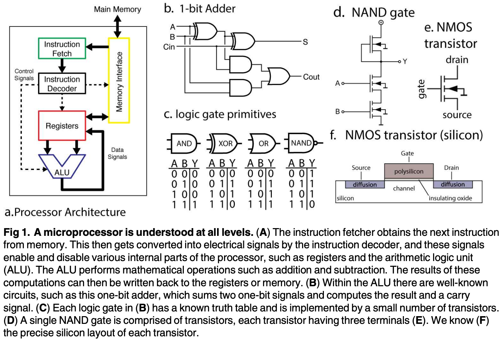
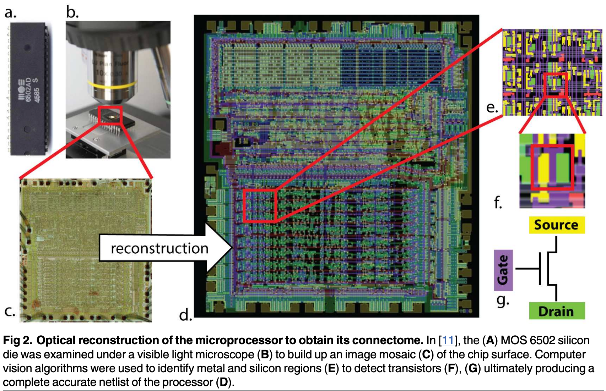
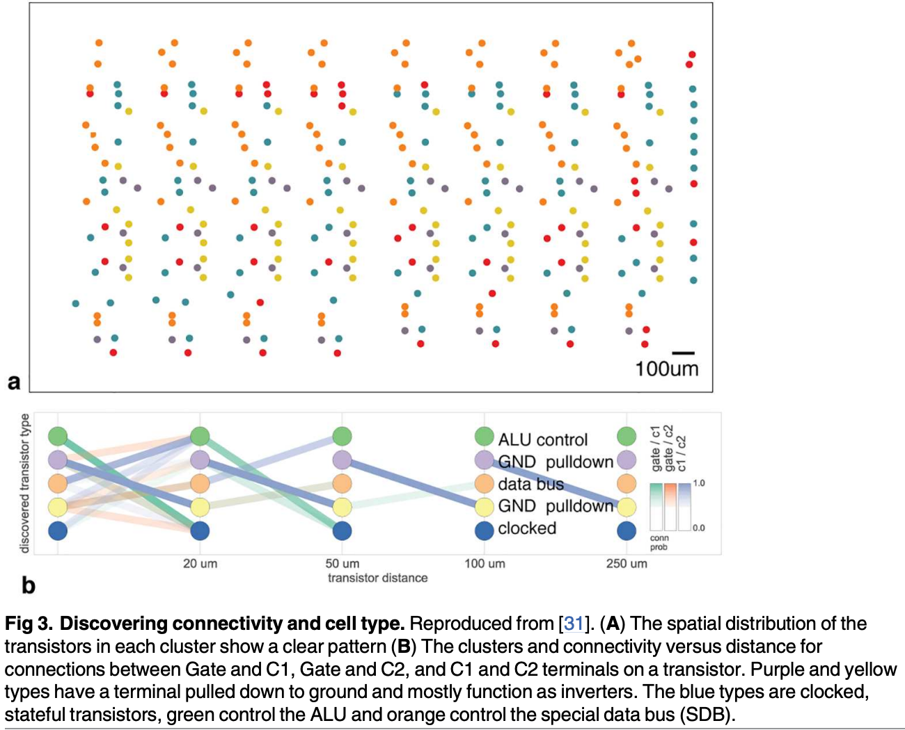

# 1 2017 Brain vs MPU

- [Could a Neuroscientist Understand a Microprocessor?](https://journals.plos.org/ploscompbiol/article/file?id=10.1371/journal.pcbi.1005268&type=printable)

## Abstract

- There is a popular belief in neuroscience that we are primarily data limited, and that producing large, multimodal, and complex datasets will, with the help of advanced data analysis algorithms, lead to fundamental insights into the way the brain processes information.
    - These datasets do not yet exist, and if they did we would have no way of evaluating whether or not the algorithmically-generated insights were sufficient or even correct. 
    - To address this, here **we take a classical microprocessor as a model organism, and use our ability to perform arbitrary experiments on it to see if popular data analysis methods from neuroscience can elucidate the way it processes information.** 
    
- Microprocessors are among those artificial information processing systems that are both complex and that we understand at all levels, from the overall logical flow, via logical gates, to the dynamics of transistors. 
    - We show that the approaches reveal interesting structure in the data but do not meaningfully describe the hierarchy of information processing in the microprocessor. 
    - This suggests current analytic approaches in neuroscience may fall short of producing meaningful understanding of neural systems, regardless of the amount of data. 
    - Additionally, we argue for scientists using complex non-linear dynamical systems with known ground truth, such as the microprocessor as a validation platform for time-series and structure discovery methods.

## Introduction

- The development of high-throughput techniques for studying neural systems is bringing about an era of big-data neuroscience. 
    - Scientists are beginning to reconstruct connectivity, record activity, and simulate computation at unprecedented scales. 
    - However, even state-of-the-art neuro-scientific studies are still quite limited in organism complexity and spatiotemporal resolution. 
    - It is hard to evaluate how much scaling these techniques will help us understand the brain.
    - In neuroscience it can be difficult to evaluate the quality of a particular model or analysis method, especially in the absence of known truth. 
    - However, there are other systems, in particular man made ones that we do understand. As such, one can take a human-engineered system and ask if the methods used for studying biological systems would allow understanding the artificial system. 
    - In this way, we take as inspiration Yuri Lazbnick’s well-known 2002 critique of modeling in molecular biology, “Could a biologist fix a radio?”. 
    - However, a radio is clearly much simpler than the nervous system, leading us to seek out a more complex, yet still well-understood engineered system. 
    - The microprocessors in early computing systems can serve this function.
    - Here we will try to understand a known artificial system, a classical microprocessor by applying data analysis methods from neuroscience. 
    - We want to see what kind of an understanding would emerge from using a broad range of currently popular data analysis methods.
    - To do so, we will analyze 
        - the connections on the chip, 
        - the effects of destroying individual transistors, 
        - single-unit tuning curves, 
        - the joint statistics across transistors, 
        - local activities, 
        - estimated connections, 
        - and whole-device recordings. 
    - For each of these, we will use standard techniques that are popular in the field of neuroscience. 
    - **We find that many measures are surprisingly similar between the brain and the processor but that our results do not lead to a meaningful understanding of the processor.** 
    - The analysis can not produce the hierarchical understanding of information processing that most students of electrical engineering obtain. 
    - **It suggests that the availability of unlimited data, as we have for the processor, is in no way sufficient to allow a real understanding of the brain.** 
    - We argue that when studying a complex system like the brain, methods and approaches should first be sanity checked on complex man-made systems that share many of the violations of modeling assumptions of the real system.

### An engineered model organism

- The MOS 6502 (and the virtually identical MOS 6507) were the processors in the Apple I, the Commodore 64, and the Atari Video Game System (VCS). 
    - **The Visual6502 team reverse-engineered the 6507 from physical integrated circuits by chemically removing the epoxy layer and imaging the silicon die with a light microscope. Much like with current connectomics work, a combination of algorithmic and human-based approaches were used to label regions, identify circuit structures, and ultimately produce a transistor-accurate netlist (a full connectome) for this processor consisting of 3510 enhancement-mode transistors. Several other support chips, including the Television Interface Adaptor (TIA) were also reverse-engineered and a cycle-accurate simulator was written that can simulate the voltage on every wire and the state of every transistor.** 
    - The reconstruction has sufficient fidelity to run a variety of classic video games, which we will detail below. 
    - The simulation generates roughly 1.5GB/sec of state information, allowing a real big-data analysis of the processor.

- The simplicity of early video games has led to their use as model systems for **reinforcement learning** and computational complexity research. 
    - The video game system (“whole animal”) has a well defined output in each of the three behavioral conditions (games). 
    - It produces an input-dependent output that is dynamic, and, in the opinion of the authors, quite exciting. 
    - It can be seen as a more complex version of the Mus Silicium project. It is also a concrete implementation of a thought experiment that has been mentioned on and off in the literature. 
    - The richness of the dynamics and our knowledge about its inner workings makes it an attractive test case for approaches in neuroscience.
    - Here we will examine three different “behaviors”, that is, three different games: Donkey Kong (1981), Space Invaders (1978), and Pitfall (1981). 
    - Obviously these “behaviors” are qualitatively different from those of animals and may seem more complicated. 
    - However, even the simple behaviors that are studied in neuroscience still involve a plethora of components, typically including the allocation of attention, cognitive processing, and multiple modalities of inputs and outputs. 
    - As such, the breadth of ongoing computation in the processor may actually be simpler than those in the brain.
    - The objective of clever experimental design in neuroscience often is to find behaviors that only engage one kind of computation in the brain. 
    - In the same way, all our experiments on the chip will be limited by us only using these games to probe it. 
    - As much as more neuroscience is interested in naturalistic behaviors, here we analyze a naturalistic behavior of the chip. 
    - In the future it may be possible to execute simpler, custom code on the processor to tease apart aspects of computation, but we currently lack such capability in biological organisms.
    - Much has been written about the differences between computation in silico and computation in vivo — the stochasticity, redundancy, and robustness present in biological systems seems dramatically different from that of a microprocessor. 
    - But there are many parallels we can draw between the two types of systems. 
        - Both systems consist of interconnections of a large number of simpler, stereotyped computing units. 
        - They operate on multiple timescales.
        - They consist of somewhat specialized modules organized hierarchically. 
        - They can flexibly route information and retain memory over time. 
    - Despite many differences there are also many similarities. We do not wish to overstate this case—in many ways, the functional specialization present in a large mammalian brain far eclipses that present in the processor. Indeed, the processor’s scale and specialization share more in common with C. elegans than a mouse.
    - Yet many of the differences should make analyzing the chip easier than analyzing the brain.
        - For example, it has a clearer architecture and far fewer modules. 
        - The human brain has hundreds of different types of neurons and a similar diversity of proteins at each individual synapse, whereas our model microprocessor has only one type of transistor (which has only three terminals). 
        - The processor is deterministic while neurons exhibit various sources of randomness. 
        - With just a couple thousand transistors it is also far smaller. 
        - And, above all, in the simulation it is fully accessible to any and all experimental manipulations that we might want to do on it.

### What does it mean to understand a system

- Importantly, the processor allows us to ask “do we really understand this system?” Most scientists have at least behavioral-level experience with these classical video game systems, and many in our community, including some electro-physiologists and computational neuroscientists, have formal training in computer science, electrical engineering, computer architecture, and software engineering. 
    - As such, we believe that most neuroscientists may have better intuitions about the workings of a processor than about the workings of the brain.

- What constitutes an understanding of a system? 
    - **Lazbnick’s original paper argued that understanding was achieved when one could “fix” a broken implementation. Understanding of a particular region or part of a system would occur when one could describe so accurately the inputs, the transformation, and the outputs that one brain region could be replaced with an entirely synthetic component.**
    - Indeed, some neuro-engineers are following this path for sensory and memory systems. 
    - Alternatively, we could seek to understand a system at differing, complementary levels of analysis, as David Marr and Tomaso Poggio outlined in 1982. 
        - First, we can ask if we understand what the system does at the computational level: what is the problem it is seeking to solve via computation? 
        - We can ask how the system performs this task algorithmically: what processes does it employ to manipulate internal representations?
        - Finally, we can seek to understand how the system implements the above algorithms at a physical level. What are the characteristics of the underlying implementation (in the case of neurons, ion channels, synaptic conductances, neural connectivity, and so on) that give rise to the execution of the algorithm? 
        - Ultimately, we want to understand the brain at all these levels.

- In this paper, much as in systems neuroscience, we consider the quest to gain an understanding of how circuit elements give rise to computation. 
    - Computer architecture studies how small circuit elements, like registers and adders, give rise to a system capable of performing general-purpose computation. 
    - When it comes to the processor, we understand this level extremely well, as it is taught to most computer science undergraduates. 
    - Knowing what a satisfying answer to “how does a processor compute?” looks like makes it easy to evaluate how much we learn from an experiment or an analysis.

### What would a satisfying understanding of the processor look like?

- We can draw from our understanding of computer architecture to firmly ground what a full understanding of a processor would look like (Fig 1). 
    - The processor is used to implement a computing machine. 
    - It implements a finite state machine which sequentially reads in an instruction from memory (Fig 1a, green) and then either modifies its internal state or interacts with the world. 
    - The internal state is stored in a collection of byte-wide registers (Fig 1a, red).
    - As an example, 
        - the processor might read an instruction from memory telling it to add the contents of register A to the contents of register B. 
        - It then decodes this instruction, enabling the arithmetic logic unit (ALU, Fig 1a, blue) to add those registers, storing the output. 
        - Optionally, the next instruction might save the result back out to RAM (Fig 1a, yellow). 
        - It is this repeated cycle that gives rise to the complex series of behaviors we can observe in this system. 
        - **Note that this description in many ways ignores the functions of the individual transistors, focusing instead on circuits modules like “registers” which are composed of many transistors, much as a systems neuroscientist might focus on a cytoarchitecturally-distinct area like hipppocampus as opposed to individual neurons.**

- Each of the functions within the processor contains algorithms and a specific implementation. 
    - Within the arithmetic logic unit, there is a byte wide adder, which is in part made of binary adders (Fig 1b), which are made out of AND/NAND gates, which are made of transistors. 
    - This is in a similar way as the brain consists of regions, circuits, microcircuits, neurons, and synapses.
    - If we were to analyze a processor using techniques from systems neuroscience we would hope that it helps guide us towards the descriptions that we used above. 

- In the rest of the paper we will apply neuroscience techniques to data from the processor. We will finally discuss how neuroscience can work towards techniques that will make real progress at moving us closer to a satisfying understanding of computation, in the chip, and in our brains.

## Results

- Validating our understanding of complex systems is incredibly difficult when we do not know the actual ground truth. 
    - Thus we use an engineered system, the MOS6502, where we understand every aspect of its behavior at many levels. We will examine the processor at increasingly-fine spatial and temporal resolutions, eventually achieving true “big-data” scale: a “processor activity map”, with every transistor state and every wire voltage. 
    - As we apply the various techniques that are currently used in neuroscience we will ask how the analyses bring us closer to an understanding of the microprocessor (Fig 2). We will use this well defined comparison to ask questions about the validity of current approaches to studying information processing in the brain.

### Connectomics

- The earliest investigations of neural systems were in-depth anatomical inquiries. 
    - Fortunately, through large scale microscopy (Fig 2a) we have available the full 3d connectome of the system. 
    - In other words, we know how each transistor is connected to all the others. 
    - The reconstruction is so good, that we can now simulate this processor perfectly—indeed, were it not for the presence of the processor’s connectome, this paper would not have been possible. 
    - This process is aided by the fact that we know a transistor’s deterministic input-output function, whereas neurons are both stochastic and vastly more complex.
    - Recently several graph analysis methods ranging from classic to modern approaches have been applied to neural connectomes. 
    - The approach in [31] was also applied to a region of this processor, attempting to identify both circuit motifs as well as transistor “types” (analogous to cell types) in the transistor wiring diagram. 

- Fig 3 (adapted from [31]) shows the results of the analysis. 
    - We see that one identified transistor type contains the “clocked” transistors, which retain digital state. 
    - Two other types contain transistors with pins C1 or C2 connected to ground, mostly serving as inverters. 
    - An additional identified type controls the behavior of the three registers of interest (X, Y, and S) with respect to the SB data bus, either allowing them to latch or drive data from the bus. 
- The repeat patterns of spatial connectivity are visible in Fig 3a, showing the man-made horizontal and vertical layout of the same types of transistors.

- While superficially impressive, based on the results of these algorithms we still can not get anywhere near an understanding of the way the processor really works. 
    - Indeed, we know that for this processor there is only one physical “type” of transistor, and that the structure we recover is a complex combination of local and global circuitry.

- In neuroscience, reconstructing all neurons and their connections perfectly is the dream of a large community studying connectomics. 
    - **Current connectomics approaches are limited in their accuracy and ability to definitively identify synapses, Unfortunately, we do not yet have the techniques to also reconstruct the i/o function–neurotransmitter type, ion channel type, I/V curve of each synapse, etc. — of each neuron. But even if we did, just as in the case of the processor, we would face the problem of understanding the brain based on its connectome. As we do not have algorithms that go from anatomy to function at the moment that go considerably beyond cell-type clustering it is far from obvious how a connectome would allow an understanding of the brain.**
    - Note we are not suggesting connectomics is useless, quite the contrary – in the case of the processor the connectome was the first crucial step in enabling reliable, whole-brain-scale simulation. 
    - **But even with the whole-brain connectome, extracting hierarchical organization and understanding the nature of the underlying computation is incredibly difficult.**

### Lesion a single transistor at a time

- Lesions studies allow us to study the causal effect of removing a part of the system. 
    - We thus chose a number of transistors and asked if they are necessary for each of the behaviors of the processor (Fig 4). In other words, we asked if removed each transistor, if the processor would then still boot the game. 
    - Indeed, we found a subset of transistors that makes one of the behaviors (games) impossible. We can thus conclude they are uniquely necessary for the game — perhaps there is a Donkey Kong transistor or a Space Invaders transistor. 
    - Even if we can lesion each individual transistor, we do not get much closer to an understanding of how the processor really works.

- This finding of course is grossly misleading. 
    - The transistors are not specific to any one behavior or game but rather implement simple functions, like full adders. 
    - The finding that some of them are important while others are not for a given game is only indirectly indicative of the transistor’s role and is unlikely to generalize to other games. 
    - Lazebnik made similar observations about this approach in molecular biology, suggesting biologists would obtain a large number of identical radios and shoot them with metal particles at short range, attempting to identify which damaged components gave rise to which broken phenotype.

- This example nicely highlights the importance of isolating individual behaviors to understand the contribution of parts to the overall function. 
    - If we had been able to isolate a single function, maybe by having the processor produce the same math operation every single step, then the lesioning experiments could have produced more meaningful results. 
    - However, the same problem exists in neuroscience. It is extremely difficult or technically impossible to produce behaviors that only require a single aspect of the brain.

- Beyond behavioral choices, we have equivalent problems in neuroscience that make the interpretation of lesioning data complicated. In many ways the chip can be lesioned in a cleaner way than the brain: we can individually abolish every single transistor (this is only now becoming possible with neurons in simple systems). 
    - Even without this problem, finding that a lesion in a given area abolishes a function is hard to interpret in terms of the role of the area for general computation. 
    - And this ignores the tremendous plasticity in neural systems which can allow regions to take over for damaged areas. 
    - In addition to the statistical problems that arise from multiple hypothesis testing, it is obvious that the “causal relationship” we are learning is incredibly superficial: a given transistor is obviously not specialized for Donkey Kong or Space Invaders.

- While in most organisms individual transistors are not vital, for many less-complex systems they are. 
    - Lesion individual interneurons in C. elegans or the H1 neuron in the fly can have marked behavioral impacts. 
    - And while lesioning larger pieces of circuitry, such as the entire TIA graphics chip, might allow for gross segregation of function, we take issue with this constituting “understanding”. 
    - Simply knowing functional localization, at any spatial scale, is only the most nascent step to the sorts of understanding we have outlined above.

### Analyzing tuning properties of individual transistors

- We may want to try to understand the processor by understanding the activity of each individual transistor. 
    - We study the “off-to-on” transition, or “spike”, produced by each individual transistor. Each transistor will be activated at multiple points in time. 
    - Indeed, these transitions look surprisingly similar to the spike trains of neurons (Fig 5). 
    - Following the standards in neuroscience we may then quantify the tuning selectivity of each transistor.
    - For each of our transistors we can plot the spike rate as a function of the luminance of the most recently displayed pixel (Fig 6). 
    - For a small number of transistors we find a strong tuning to the luminance of the most recently displayed pixel, which we can classify into simple (Fig 6a) and (Fig 6b) complex curves. 
    - Interestingly, however, we know for each of the five displayed transistors that they are not directly related to the luminance of the pixel to be written, despite their strong tuning. 
    - The transistors relate in a highly nonlinear way to the ultimate brightness of the screen. **As such their apparent tuning is not really insightful about their role.** 
    - In our case, it probably is related to differences across game stages. 
    - **In the brain a neuron can calculate something, or be upstream or downstream of the calculation and still show apparent tuning making the inference of a neurons role from observational data very difficult. This shows how obtaining an understanding of the processor from tuning curves is difficult.**

- **Much of neuroscience is focused on understanding tuning properties of neurons, circuits, and brain areas.** 
    - **Arguably this approach is more justified for the nervous system because brain areas are more strongly modular.**
    - However, this may well be an illusion and many studies that have looked carefully at brain areas have revealed a dazzling heterogeneity of responses. 
    - Even if brain areas are grouped by function, examining the individual units within may not allow for conclusive insight into the nature of computation.

### The correlational structure exhibits weak pairwise and strong global correlations

- Moving beyond correlating single units with behavior, we can examine the correlations present between individual transistors. 
    - We thus perform a spike-word analysis by looking at “spike words” across 64 transistors in the processor. 
    - We find little to very weak correlation among most pairs of transistors (Fig 7a). 
    - This weak correlation suggests modeling the transistors’ activities as independent, but as we see from shuffle analysis (Fig 7b), this assumption fails disastrously at predicting correlations across many transistors.

- In neuroscience, it is known that pairwise correlations in neural systems can be incredibly weak, while still reflecting strong underlying coordinated activity. 
    - This is often assumed to lead to insights into the nature of interactions between neurons. However, the processor has a very simple nature of interactions and yet produces remarkably similar spike word statistics. This again highlights how hard it is to derive functional insights from activity data using standard measures.

### Analyzing local field potentials

### Granger causality to describe functional connectivity

### Dimensionality reduction reveals global dynamics independent of behavior

---

## Discussion

## Methods

