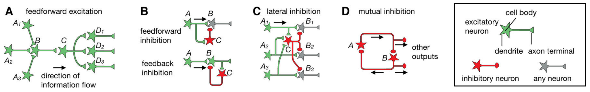
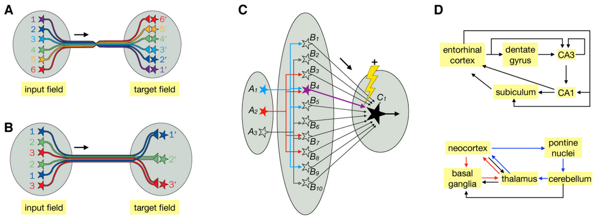
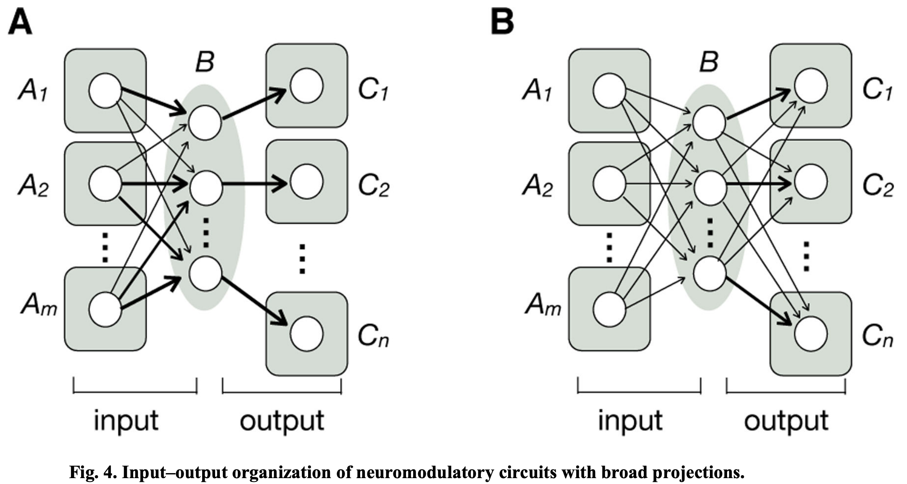
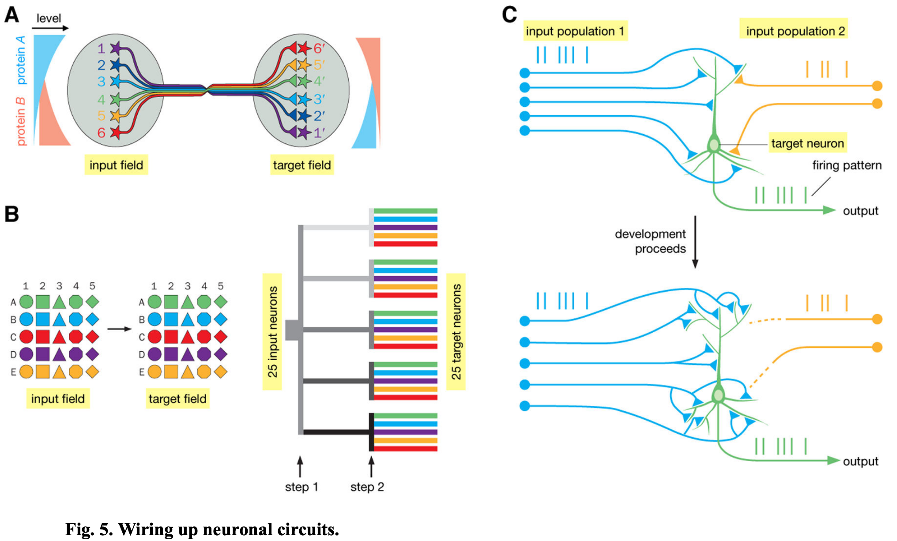

# 2 2021 NeuroCircuit Architectures

- [Architectures of Neuronal Circuits](https://pmc.ncbi.nlm.nih.gov/articles/PMC8916593/pdf/nihms-1746805.pdf)

## Abstract

- While individual neurons are the basic unit of the nervous system, they process information by working together in neuronal circuits with specific patterns of synaptic connectivity. 
    - Here we review common circuit motifs and architectural plans used in diverse brain regions and animal species. 
    - We also consider how these circuit architectures assemble during development and might have evolved. 
    - Understanding how specific patterns of synaptic connectivity can implement specific neural computations will help bridge the huge gap between the biology of the individual neuron and the function of the entire brain, will allow us to better understand the neural basis of behavior, and may inspire new advances in AI.

## One-sentence summary:

- Neuronal circuit architectures and their function, evolution, and development are reviewed here.

- Over a century ago, Santiago Ramón y Cajal and his contemporaries proposed that individual neurons are the basic unit of the nervous system. 
    - Cajal further proposed that information flows from dendrites to cell bodies to axons within individual neurons (Fig. 1). 
    - Given that dendrites and axons of most vertebrate neurons are readily distinguishable morphologically, systematic studies of isolated neurons labeled by Golgi stains provided the first overview of how information flows within vertebrate nervous systems.

- With the advent of modern technologies (Box 1), we have accumulated vast amounts of knowledge of the anatomical, physiological, and functional properties of individual neurons. 
    - However, individual neurons do not work in isolation: they work together in neuronal circuits to process information. 
    - What is less clear is whether there are generalizable principles about the structural organization of neuronal circuits across different brain regions and animal species. 
    - Here I discuss principles underlying how neurons communicate with each other through specific patterns of synaptic connectivity. 
    - While the importance of activity dynamics in neuronal populations has been increasingly recognized in information processing in diverse systems from invertebrates to mammals, synaptic connectivity patterns provide the physical bases on which neuronal dynamics execute their functions.
    - Understanding how these connectivity patterns implement specific computations will allow us to decipher information processing principles in the nervous system and should inspire new advances in AI.

## Commonly Used Circuit Motifs

- Fig. 2. Commonly used circuit motifs. See box on the right for notations. 
    - (A) **Feedforward excitation**. Information flows through a series of excitatory neurons, $A$ to $D$. Three different $A$ neurons synapse onto $B$, exemplifying convergent excitation. $C$ synapses onto three distinct $D$ neurons, exemplifying divergent excitation. 
    - (B) In **feedforward inhibition** (top), inhibitory neuron $C$ receives input from presynaptic excitatory neuron $A$ and sends inhibitory output to postsynaptic neuron $B$; in **feedback inhibition** (bottom), inhibitory neuron $C$ receives input from and sends inhibitory output to postsynaptic excitatory neuron $B$. 
    - (C) In **lateral inhibition**, parallel pathways ($A_n \to B_n$; 3 are shown) each excite inhibitory neuron $C$, which in turn sends inhibitory output to all pathways. 
    - (D) In **mutual inhibition**, two inhibitory neurons form reciprocal connections and also provide outputs through branched axons to broadcast their activity states. The inhibitory neurons can also act through intermediary excitatory neurons to inhibit each other (not shown). 

- If individual neurons are ‘letters’ in an alphabet used to write an ‘article’ that is a brain, then what are the intermediates? 
    - In this section, we focus on circuit motifs used across diverse brain regions and animal species (Fig. 2), which can be considered ‘words.’ 
    - In the next section, we explore circuit architectures that might operate at the level of ‘sentences.’
    - Here, we discuss the most commonly used circuit motifs involving excitatory and inhibitory neurons. 
    - Some of these motifs apply not only to neuronal circuits but also to gene regulatory circuits. 
    - [Architectures based on some of these motifs have also been used in AI to great effect](https://www.cs.toronto.edu/~hinton/absps/NatureDeepReview.pdf).

### Feedforward excitation.

- The primary means by which signals flow from one region to another is through feedforward excitation, a series of connections between excitatory neurons (Fig. 2A). 
    - At each stage, a neuron often receives input from multiple presynaptic partners (convergent excitation) and sends output via branched axons to multiple postsynaptic partners (divergent excitation).
    - **Convergent excitation** can enable postsynaptic neurons to respond selectively to features not solely or explicitly present in any of the presynaptic neurons. It can also increase signal-to-noise ratio if multiple input neurons carry the same signal but uncorrelated noise. 
    - **Divergent excitation** allows the same signal to be processed by multiple downstream pathways.

- One of the best characterized examples of feedforward excitation is the mammalian visual system, where signals flow from 
    - photoreceptors → 
    - bipolar cells → 
    - retinal ganglion cells → 
    - lateral geniculate nucleus (LGN) relay neurons → 
    - layer 4 primary visual cortical (V1) neurons → 
    - V1 neurons in other layers → 
    - neurons in higher cortical areas. 
- (Note that while the discussion here focuses on individual neurons and their synaptic connections, feedforward excitation can also be applied to neural regions in broad strokes, such as retina → LGN → V1.) 
- Along these feedforward pathways, representations of visual information are transformed from light intensity to contrasts, edges, objects, and motion. 
- The feedforward architecture of the mammalian visual system inspired the development of the **perceptron** and **deep neural network** for image recognition and categorization; deep neural networks have also been used in AI to solve problems far beyond image analysis.

### Feedforward/feedback inhibition.

- While long-range signals in the nervous system are mostly delivered by excitatory neurons (**notable exceptions include basal ganglia and cerebellum circuits**), inhibitory interneurons play key roles in sculpting such signals locally. 
    - Two widely used motifs are feedforward and feedback inhibition (Fig. 2B). 
    - In feedforward inhibition, an inhibitory neuron receives input from a presynaptic excitatory neuron, and both inhibitory and presynaptic excitatory inputs converge onto a postsynaptic neuron. 
    - In feedback inhibition, an inhibitory neuron receives input from and projects back onto an excitatory neuron, often at its presynaptic terminals. 
    - **Almost every excitatory connection in the visual pathway described above is accompanied by feedforward inhibition, feedback inhibition, or both.**
    - For example, LGN neurons directly excite V1 GABAergic neurons to provide feedforward inhibition to layer 4 excitatory neurons, and layer 4 excitatory neurons also activate V1 GABAergic neurons to provide feedback inhibition onto themselves.

- Feedforward inhibition acts more rapidly than feedback inhibition, as it reaches the postsynaptic target cell with only one synaptic delay after excitatory signals, whereas feedback inhibition has two synaptic delays (Fig. 2B). 
    - Feedforward inhibition is proportional to the strength of the input, whereas feedback inhibition is proportional to the strength of the output. 
    - Both are used to regulate the duration and magnitude of incoming excitatory signals. 
    - For example, limiting the duration of activation in response to sensory input allows circuits to quickly return to their baseline activity levels, so as to maximize their sensitivity to future inputs that signal changes in the environment. 
    - Networks of feedforward and feedback inhibitory neurons often act in concert and can perform many interesting functions, such as 
        - regulating the gain and dynamic range of input signals and 
        - facilitating synchronous or oscillatory firing.
    - Feedforward and feedback inhibition also play an essential role in maintaining a ‘balance’ between excitation and inhibition (e.g., strong excitation is accompanied by strong inhibition) to prevent overly excited or inhibited states.
    - Such ‘balanced’ networks can enhance the speed and signal-to-noise ratio of information processing.

### Lateral inhibition.

- Lateral inhibition (Fig. 2C) is a widely occurring circuit motif. 
    - It selects information to be propagated to downstream circuits by amplifying differences in activity between parallel pathways. 
    - **For example, photoreceptor neurons in the vertebrate retina activate horizontal cells, which provide feedback inhibition to many photoreceptor neurons nearby. This action is a major contributor to the classic center–surround receptive field in downstream ganglion cells, conferring on these neurons the ability to extract information about spatial or color contrast.**
    - Lateral inhibition is also used in other sensory systems, with the general purpose of sharpening representations of ethologically (从行为学角度) relevant information to be processed by downstream circuits.

### Mutual inhibition.

- Communication between inhibitory neurons can confer circuits interesting properties. 
    - For example, if inhibitory neuron A directly inhibits inhibitory neuron B, then activation of A would dis-inhibit target neurons of B. 
    - If B also inhibits A, then they form the mutual (reciprocal) inhibition motif (Fig. 2D). 
    - **Mutual inhibition is widely used in circuits that exhibit rhythmic activity, such as those involved in locomotion.** A classic example is the crustacean stomatogastric ganglion (甲壳动物胃食管神经节). 
    - **Operating on a longer timescale, mutual inhibition can also be used to regulate brain states, such as the sleep–wake cycle.**

---

- **So far, our discussion has involved an alphabet comprising just two letters: excitatory and inhibitory neurons. In reality, the neuronal alphabet is far richer.** 
    - Both excitatory and inhibitory neurons have many variations, thanks to the heterogeneity in their dendrite morphology, ion channel composition, spiking properties, and the subcellular distribution and strength of their input and output synapses. 
    - For example, in the **mammalian neocortex**, three classes of inhibitory neurons, the `Martinotti`, `basket`, and `chandelier` cells, target their presynaptic terminals to distal (远端) dendrites, cell bodies, and axon initial segments of excitatory pyramidal neurons, respectively, and thus control different aspects of how pyramidal neurons integrate synaptic inputs and produce spikes. 
    - In the stomatogastric ganglion, mutually inhibiting neurons have distinct ion channel compositions and input/output synaptic strengths, which underlie their sequential firing patterns within each rhythmic cycle. 
    - Finally, the neuronal ‘alphabet’ also includes many modulatory neuron types to be discussed later.

- At the level of core motifs, there are also many variations. 
    - For example, the mutual inhibition motif often includes intermediary neurons (e.g., inhibitory neuron A inhibits an excitatory neuron that excites inhibitory neuron B). 
    - It is important to note that the core motifs discussed above are almost always used in concert. 
    - Indeed, the large-scale architectural patterns discussed in the next section always contain these motifs.

- In summary, a rich alphabet of neurons with diverse intrinsic properties can be used to compose words using a set of core motifs and their variations. 
    - These words are often used in concert to produce phrases, which together form the basis for sentences, as we discuss next.

## Specialized Architectures for Specific Functions

- Fig. 3. Specialized architectures for specific functions. 
    - (A) **Continuous topographic mapping**. 
        - Neighboring neurons in the input field project their axons in an orderly fashion to connect to neighboring neurons in the target field, preserving their spatial relationships. 
        - A prime example is the retinotopic map. 
    - (B) **Discrete parallel processing**. 
        - Neurons of a specific type (same color) in the input field, regardless of their spatial locations, connect to the corresponding neuron type in the target field. 
        - A prime example is the olfactory glomerular map. 
        - Target neurons do not need to be spatially ordered as shown; they could extend their dendrites to connect specifically with the axons of specific input neuron types. 
    - (C) **Dimensionality expansion**. 
        - Signals represented by a small number of neurons in field A are represented by a much larger number of neurons in field B, such that activation of B neurons can represent specific combinations of A neurons (e.g., B4 represents co-activation of A1 and A2). 
        - Furthermore, the synaptic connections between B and C can be altered by coactivation of a teaching signal (the lightening and $+$ sign signals strengthening) and a specific B neuron to modify the synaptic strength between that particular B and C. 
        - Thus, only after training would coactivation of A1 and A2 reaches the threshold (thick arrow for B4) for activating C1. 
        - Likewise, a C2 neuron (not shown) can be trained to respond to the coactivation of A2 and A3 by modifying the strength of B7 → C2. 
        - Filled and open symbols represent active and inactive neurons, respectively. 
    - (D) Two examples of **recurrent loops**. 
        - In the entorhinal–hippocampal loop (内嗅-海马环路, top), arrows indicate direct connections between neurons within the indicated regions. 
        - Many connections within these regions are topographically organized. 
        - In the `neocortex – basal ganglia – thalamus` (red) and `neocortex–pons–cerebellum–thalamus` loops (blue), arrows represent connections between these brain regions but not necessarily direct synaptic connections between specific neuron types. 
        - Within the basal ganglia and cerebellum, for example, inputs are transformed at intermediary stages to produce outputs. 

- The next level of organization is more heterogeneous in scale and configuration and less readily generalizable. 
    - Nevertheless, I attempt here to extract some high-order circuit architectural patterns that have been found in multiple neural regions and diverse species.

### Continuous topographic mapping:

- This is a common organizational scheme for representing information in the nervous system.
    - Neighboring input neurons connect to neighboring target neurons through orderly axonal projections (Fig. 3A). 
    - **A prime example is retinotopy (视网膜拓扑映射): neighboring retinal ganglion cells synapse onto neighboring LGN neurons, which then connect to neighboring V1 neurons, which in turn connect to neighboring higher-order visual cortical neurons. Retinotopy enables spatial relationships in the outside world captured by the retina to be recapitulated (重述) in V1 and higher visual cortical areas.** 
    - Continuous topographic mapping is also used elsewhere. In the [sensory and motor homunculi](https://en.wikipedia.org/wiki/Cortical_homunculus), somatosensory (体感) stimuli from neighboring body parts are coarsely represented in neighboring areas of the primary somatosensory cortex, and motor outputs to neighboring body parts are coarsely controlled by neighboring areas of the motor cortex.

- Topographic maps provide a convenient way to organize information at successive stages of processing and can be constructed via robust developmental mechanisms (Fig. 5A). 
    - They have a variety of computational advantages. 
    - For example, retinotopy facilitates extraction of local contrast through lateral inhibition for object recognition. 
    - Furthermore, by placing circuit elements that are more often functionally connected nearby each other, topographic maps save energy by minimizing wiring length. 
    - The design of ‘CNN’ takes a page from topographic mapping to greatly reduce the number of variables needed to tune an ANN and thus speed up computation.

### Discrete parallel processing:

- Discrete parallel processing (Fig. 3B) allows signals to be represented and processed in parallel by discrete information channels. 
    - A prime example is the glomerular (肾小球的) organization of the vertebrate olfactory bulb (脊椎动物嗅球) and insect antennal lobe: olfactory receptor neurons (ORNs) expressing the same odorant receptors send their axons to the same glomerulus (肾小球) to synapse onto the dendrites of their corresponding second-order projection neurons, forming discrete olfactory processing channels. Tens to thousands of individual ORNs expressing the same odorant receptor converge their axons onto the same glomerulus, thus enhancing the signal-to-noise ratio. 
    - **Rather than representing continuous values, different glomeruli represent signals from discrete ORN types, and thus the nature of the chemicals that activate those odorant receptors.** 
    - Discrete parallel processing also characterizes the mammalian taste system.

- Discrete parallel processing is often used in conjunction with continuous topographic mapping. 
    - In the retina, for example, superimposed on the continuous retinotopy are discrete layers where different bipolar and ganglion cell types form specific connections to process different types of visual signals such as luminance, color, and motion in parallel. 
    - Compared to serial processing, parallel processing reduces computational depth, hence decreasing error rate and increasing processing speed. 
    - Indeed, massively parallel processing is a salient (显著的) feature of complex nervous systems with large numbers of neurons and large numbers of connections per neuron. 
    - This architecture is increasingly being adopted in computer systems design.

### Dimensionality expansion:

- In this architecture, signals from a relatively small number of input neurons diverge onto a much larger number of output neurons (Fig. 3C), allowing output neurons to represent distinct combinations of inputs. 
    - Similar signals at the input level are more readily distinguished at the output level, facilitating **pattern separation** by downstream neurons. 
    - Two prime examples are the insect mushroom body (olfactory projection neurons → mushroom body Kenyon cells → mushroom body output neurons) and the vertebrate cerebellum (mossy fibers → cerebellar granule cells → Purkinje cells). 
    - In both cases, a relatively small number of inputs (projection neurons or mossy fibers, respectively) synapse onto a much larger number of output neurons (Kenyon cells or granule cells, respectively).
    - Information at the level of the output neurons can thus be represented in a much higher dimensional space, with each dimension representing the firing rate of one cell. 
    - Small differences in input firing patterns (e.g., different projection neuron populations representing different odor combinations) can more readily be distinguished by the population firing patterns of their postsynaptic partners. 
    - **This architecture allows for learning by adjusting the synaptic strengths of the output neurons via ‘teaching’ signals from dopamine neurons in the mushroom body and climbing fibers in the cerebellum.** 
    - After training, the same input can produce different output patterns (Fig. 3C).

- Another example of dimensionality expansion is the entorhinal cortex → dentate gyrus granule cell → CA3 pyramidal neuron circuit (Fig. 3D, top). 
    - The large number of dentate gyrus granule cells can perform pattern separation for information from the entorhinal cortex  regarding space and objects for further processing by the downstream hippocampal circuit. 
    - **Unlike in the mushroom body and cerebellar cortex, ‘teaching neurons’ have not been identified here. This may be because the hippocampal circuit uses unsupervised learning, whereas the cerebellar and mushroom body circuits implement algorithms akin to supervised and reinforcement learning.**

### Recurrent loops:

- **Nervous systems are full of recurrent loops: neurons connect back onto themselves, often through intermediary neurons.**
    - These recurrent loops are heterogeneous in scale, ranging from within a particular neural region (e.g., mutual inhibition employed in the crustacean stomatogastric circuit) to spanning large parts of the brain. 
    - In the mammalian visual system, for example, in addition to ‘bottom-up’ projections from LGN → V1 → higher cortical areas, ‘top-down’ projections from higher cortical areas → V1 → LGN serve several functions such as attentional control. 
    - Long-range recurrent loops may incorporate continuous topographic mapping or discrete parallel processing architectures. 
    - Fig. 3D illustrates two examples in the mammalian brain at the level of neuronal populations (top) and brain regions (bottom). 
    - Recurrent loops generally support rich neural activity dynamics, but their exact computational roles are not clear in most cases and are likely to differ on a case-by-case basis. 
    - **Understanding the general principles of information processing in recurrent loops is a major challenge in modern neuroscience.**

### Biased input (偏置输入) – segregated output (分隔输出):

- Fig. 4. Input–output organization of neuromodulatory circuits with broad projections. Modulatory neurons in region B collectively receive inputs from regions $A_1 - A_m$ and send broad output to regions $C_1 - C_n$. 
    - (A) **Biased input – segregated output architecture**. 
        - This architecture applies to several neuromodulatory systems, including `midbrain dopamine neurons`, `dorsal raphe serotonin neurons (背侧中缝核血清素能神经元)`, and `preoptic area galanin neurons (视前区甘丙肽神经元)`. 
        - **Arrows of different thickness represent different input strengths.** 
    - (B) **Integration-and-broadcast architecture**. 
        - Neuronal populations in region B that project to a specific output region also send output to other output regions, with the possibility of a quantitative bias; these populations also receive similar inputs. 
        - `Locus coeruleus norepinephrine neurons (蓝斑核去甲肾上腺素能神经元)` approximate this architecture. 
        - **Each circle symbolizes a neuronal population rather than an individual neuron, as the input–output organization summarized here is based on studies at the population level rather than at the level of individual neurons.**

- The above discussions have focused on circuits comprising excitatory and inhibitory neurons. 
    - Nervous systems also employ modulatory neurons for important functions.
    - Modulatory neurons use neurotransmitters such as monoamines and neuropeptides that primarily engage G-protein-coupled receptors; hence their actions on postsynaptic neurons are slower and last between tens of milliseconds to seconds, compared to fast excitatory and inhibitory neurotransmitters, which engage ionotropic receptors and act within a few milliseconds. 
    - Besides acting across the synaptic cleft, modulatory neurotransmitters can also be released at sites without postsynaptic specializations — so-called ‘volume release’ — and can thus influence targets at distances greater than that of a typical synaptic cleft.

- Some modulatory neurons in the mammalian brain have cell bodies clustered in small regions but project axons broadly and receive diverse inputs. 
    - Viral-genetic tracing in the mouse (Box 1) revealed that midbrain dopamine, dorsal raphe serotonin, and hypothalamic neuropeptide galanin systems all adopt a ‘biased input–segregated output’ architecture at the population level (Fig. 4A). 
    - Each system can be divided into parallel subsystems defined based on their segregated output projections to distinct target regions that serve different behavioral functions. 
    - Each output subsystem receives inputs from similar regions with quantitative biases, allowing these subsystems to be differentially regulated by external and internal stimuli. 
    - One exception is the locus coeruleus (LC) norepinephrine system: at the population level, LC norepinephrine axons projecting to one brain region also project broadly to other regions, even though branching patterns of individual neurons can be idiosyncratic. 
    - These observations suggest that the LC norepinephrine system adopts an integration-and-broadcast architecture (Fig. 4B), which may suit its role in regulating global brain states such as arousal.

---

- Nervous systems also employ architectures not discussed above. 
    - A prominent architecture in bilaterians is interconnected bilateral symmetry; formal network analysis identified bilateral symmetry as the top-level organization in forebrain connectivity maps. 
    - The architectures of many neuronal circuits, such as those of the canonical mammalian neocortex and basal ganglia circuits, do not fit neatly into the categories described above, even though they utilize the aforementioned core circuit motifs, and can participate as parts of other architectures, such as topographic maps and recurrent loops (Fig. 3D bottom). 
    - This may be because we have not dug deep enough into these specific circuits to decipher their computational principles or because our understanding of the nervous system is not broad enough to identify shared architectures. 
    - We expect ample future opportunities to explore both the depth and breadth of neural circuit architectures by collecting greater amounts of data with increasingly sophisticated tools (Box 1). 
    - Only when we know more about these ‘sentences’ and their numerous variations and complex interactions will we have a deeper understanding of how they constitute ‘paragraphs’ (e.g., brain regions) and eventually the ‘article’ — the overall organization of an entire nervous system.

## Evolutionary and Developmental Perspectives

- Whereas computer circuits are products of top-down design, complex neuronal circuits have evolved over hundreds of millions of years. 
    - Neuronal circuits also self-assemble during development using evolutionarily selected genetic instructions and are fine-tuned by experience. 
    - Thus, existing neuronal circuit architectures are likely a selection of those that can be readily evolved and assembled during development. 
    - Looking at a neuronal circuit in isolation may not tell us what elements are functionally important. 
    - Seeing what has been evolutionarily selected, expanded, shrunken, eliminated, or repeatedly produced through convergent evolution can, however, suggest what elements to focus on in functional studies.

### Evolution of neuronal circuits.

- Extant bilaterian nervous systems (including all vertebrate and most invertebrate phyla) likely derived from ancestors via progressive sophistication: those with only myocytes, followed by the sequential evolution of sensorimotor neurons, separate sensory and motor neurons, interneurons, and centralized inter-neuron networks that gave rise to the central nervous system (CNS) and brain. 
    - The ubiquity (无处不在) of some core motifs, such as feedforward excitation and feedforward/feedback inhibition, may have originated early in animals with interneurons and a CNS, and have since been conserved across diverse species and spread across neural regions within each species due to their utility. 
    - Other architectures have evolved independently. 
    - The glomerular organization of the insect and vertebrate olfactory systems is likely the result of convergent evolution, as many clades descended from their last common ancestor do not have this organization, and different types of molecules are used as odorant receptors. 
    - Visual systems provide striking examples of convergent evolution of many fundamental features from retinotopy to motion detection algorithms in invertebrate and vertebrate lineages.

- Progressive sophistication of the nervous system requires expansion of neuronal numbers, neuron types and their connections, and brain regions. 
    - All these processes must result from changes to DNA. 
    - A key mechanism of evolutionary innovation is the duplication and divergence of genes; for example, duplication and divergence of a cone opsin gene (视锥蛋白基因) conferred (赋予) trichromacy (三色视觉) on some primates. 
    - Duplication-and-divergence is also used in the evolution of neuron types and brain regions. 
    - **Duplication-and-divergence for brain region evolution should in principle make neuronal circuits modular: rich connections within a duplicated unit and sparse connections between units (as opposed to all-to-all non-modular architectures employed as the starting conditions in many artificial neural networks).** 
    - In turn, the modular nature of neuronal circuits might speed up evolution, as different modules can evolve independently of each other.

### Development of neuronal circuits.

- Fig. 5. Wiring up neuronal circuits. 
    - (A) **Protein gradients** can be used to construct continuous topographic maps. 
        - In this example, both input and target fields are patterned by opposing gradients of cell-surface proteins A and B. 
        - Suppose that neuronal processes expressing protein A and protein B mutually **repel** each other. 
        - Because Neuron 1 has the highest level of protein A, it seeks a target field with the lowest level of protein B; likewise, Neuron 6 seeks a target field with the lowest level of protein A. 
    - (B) Illustration of **combinatorial strategies** to specify connections between 25 discrete cell types in the input and target fields. 
        - (Left) Suppose that connection specificities between the input and target fields are mediated by homophilic (同嗜性的) attraction molecules. 
            - If each connection is specified by a single molecule, 25 molecules are needed to specify 25 connections. 
            - If each connection is specified by a combination of two molecules (a letter and a number), only 10 molecules are needed. 
        - (Right) The combinatorial strategy is realized by dividing the wiring process into 2 steps. 
            - At step 1, 5 molecules (represented by different shades of gray) separate 5 input axons into 5 groups; 
            - at step 2, 5 more molecules (represented by different colors) are used in each of the 5 groups to specify the final connections. 
    - (C) Schematic illustration of **Hebb’s rule** in instructing wiring. 
        - At an early developmental stage, the target neuron is connected with two groups of input neurons with distinct coincident firing patterns (blue and yellow vertical lines). 
        - Because stronger connections to the group 1 input drive the target neuron to fire in a pattern (green vertical lines) similar to that of group 1, their connections are strengthened. 
        - Synaptic connections between group 2 input and the target neuron weaken due to their dissimilar firing patterns.
        - Eventually, the target neuron is only connected with group 1 input. 

- Evolution exerts (施加) its influence on neuronal circuits primarily by modifying genes involved in circuit wiring during development. 
    - A key question is how a limited number of genes (~20,000 across many animal species) can construct nervous systems with much larger numbers of synaptic connections ($\sim 10^7$ in fruit flies, $\sim 10^{11}$ in mice, $> 10^{14}$ in humans) with specific motifs and architectures.

- **Extracellular cues and their cell-surface receptors enable recognition of specific targets by axonal and dendritic growth cones. These molecules are the predominant force for establishing a coarse organization of the nervous system and can also specify synaptic connectivity with great precision in certain circuits and organisms.** 
    - **One strategy to establish specificity of a large number of connections with a limited number of genes is to use different expression levels of the same protein to specify different connections.**
    - This strategy is readily used in constructing continuous topographic maps (Fig. 5A), perhaps contributing to the prevalence of this circuit architecture (Fig. 3A). 
    - Graded expression of cell-surface molecules is also used in the early steps of constructing discrete maps. 
    - However, discrete parallel processing (Fig. 3B) requires distinguishing between discrete cell types, and often utilizes combinatorial cell-surface protein codes such that a small number of proteins can specify many more connections (Fig. 5B, left). 
    - An efficient way to implement combinatorial coding is to divide the wiring process into distinct spatiotemporal steps (Fig. 5B, right); in addition to conserving molecules, this strategy can also enhance robustness, as growth cones are faced with few simultaneous choices at each step. 
    - The same wiring molecules can be used at different times and places, sometimes in different parts of the same circuit, through elaborate spatiotemporal regulation of their expression patterns.

- Neuronal activity, both spontaneous and experience-driven, refines synaptic wiring diagrams. 
    - Activity-dependent wiring, often via competition between neurons with different activity levels, has been well documented. 
    - A prominent mechanism by which neuronal activity influences wiring is by implementing Hebb’s rule: synapses at which firing of presynaptic neurons causes firing of postsynaptic neurons are strengthened — colloquially, ‘fire together, wire together’ (Fig. 5C). 
    - Non-Hebbian mechanisms, such as homeostatic synaptic plasticity, also contribute to activity-dependent circuit wiring. 
    - These activity-dependent mechanisms continue to operate in the adult nervous system, enabling animals to change their synaptic connectivity patterns as a consequence of experience throughout life.

- Many synaptic connections are not completely specified. 
    - In vertebrate neuromuscular systems, for example, while the connections between motor neuron pools and muscles are precisely specified, the specific connection patterns between individual motor neurons and muscle fibers within a motor pool are highly variable. 
    - Likewise, in the fly olfactory circuit, synaptic connections between specific olfactory projection neuron types and mushroom body Kenyon cells (Fig. 3C) are mostly random. 
    - In both cases, it is not necessary, or even desirable, to have more stereotyped (模式化的) connectivity. 
    - As more synaptic connectomes are mapped (Box 1), more examples of wiring variability will surely emerge.

- **In summary, two broad kinds of mechanisms are used to establish wiring patterns of neuronal circuits:** 
    - **molecular cues** hard-wire the nervous system, and **neuronal activity and experience** fine-tune connectivity. 
    - There is also interplay between neuronal activity and molecular cues; for example, neuronal activity can regulate expression of molecular cues or complement their action. 
    - However, apart from the limited examples discussed above, most developmental studies have not focused on addressing how specific circuit motifs and architectures are established, while most investigations of circuit function have not considered developmental constraints. 
    - There is ample (充足) opportunity for cross-fertilization of developmental and functional studies of neuronal circuits.

## Outlook

- Applications of circuit mapping tools such as serial electron microscopy and trans-synaptic tracing (Box 1) to diverse neural regions and organisms will surely generate a wealth of data from which we can distill common principles of structural organization of neuronal circuits.
    - Relating structures to the functions they implement will be an important next step. 
    - This can be done by leveraging powerful tools that have been developed and applied to functionally interrogate neuronal circuits in the context of animal behavior. 
    - **Such interrogation is essential for identifying the functions of each circuit elements.** 
    - In addition, a key challenge is to investigate how these motifs and architectures interact with each other across scales.
    - Understanding how different architectures cooperate in an individual nervous system should also inspire new artificial neural networks that might someday achieve general-purpose artificial intelligence.

- We are still only beginning to gain insights into the evolutionary and developmental processes that give rise to circuit architecture in complex nervous systems. 
    - We still do not know, for example, whether and to what degree algorithmic changes in the wiring process and operation of neuronal circuits can account for the increased complexity of the mammalian brain. 
    - A deliberate effort to investigate how letters are assembled into words and words into sentences in key circuit architectures across different species could yield valuable insights. 
    - Comparative study of neuron type composition of homologous brain regions using single-cell transcriptomics (转录组学) is a useful first step. 
    - This can be followed by investigation of the mechanisms that establish their connectivity patterns and that underlie their functional operations. 
    - Integrating studies of the structure, function, development, and evolution of neuronal circuits will enable a deeper understanding of nervous system organization beyond the level of individual neurons.

## Box 1: Tools for mapping neuronal circuit architecture

- Diverse tools have been used to study the structural organization of the nervous system.

### Single neuron tracing.

- In this approach, a dense library of single neurons within a neural region is created by sparse labeling in individual animals, using the Golgi stain, intracellular dye filling, or genetic methods, such that dendritic morphology and axonal projections are clearly resolved using light microscopy. 
    - One can infer that neuron A synapses onto neuron B when A’s axon overlaps with B’s dendrites. 
    - Cajal used this approach to chart the coarse organization of the vertebrate nervous system. 
    - Genetic methods for sparse labeling now allow researchers to infer connectivity between neurons of specific types.
    - A key limitation of this method is that spatial overlap visualized with light microscopy between dendrites and axons is necessary but insufficient to confidently classify two neurons as synaptic partners. 
    - Thus, it is only useful for inferring possible connectivity at a coarse level.

### Serial electron microscopic (EM) reconstruction.

- This is the most comprehensive way of deciphering synaptic wiring diagrams, as **EM is the only method able to unambiguously visualize synapses**. 
    - All synapses can be visualized in the same specimen, with the potential of producing a complete wiring diagram. 
    - Serial EM reconstruction has been used to decipher the synaptic wiring diagram of the entire C. elegans nervous system. 
    - Recent years have seen rapid progress in the acquisition and partial reconstruction of EM volumes of neural regions from multiple organisms. 
    - **A densely reconstructed Drosophila hemi-brain has been achieved, and the entire mouse brain has been proposed as the next ambitious target.** 
    - Limitations include the extensive labor needed to accurately reconstruct connections from EM volumes, especially across large distances, and the difficulty of deciphering cell types or connection signs (excitatory vs. inhibitory) unless the region is also well characterized by other means.

### Trans-synaptic tracing.

- This approach relies on an event such as gene expression or viral transduction occurring in one neuron to trigger the labeling of its presynaptic partners (retrograde trans-synaptic labeling) or postsynaptic partners (anterograde trans-synaptic labeling). 
    - The most widely used methods in mammals utilize viruses that naturally transduce neurons across synapses, in particular rabies (狂犬病) virus for retrograde trans-synaptic tracing from a defined neuron type in a specific location. 
    - Axon terminal-initiated rabies tracing can reveal inputs to neuronal populations that project to specific targets, allowing inference of input–output architecture (Fig. 4). 
    - Anterograde (顺行的) methods have also been reported.
    - Limitations include poor understanding of trans-synaptic transmission mechanisms, potential biases due to cell type and subcellular locations of synapses, and incomplete characterization of false negatives (synaptic partners not labeled) and false positives (labeling of non-synaptic partners) for most methods.

### Electrophysiological and optical methods.

- **Simultaneous intracellular recordings** can reveal synaptic connections between multiple neurons, as well as their sign and strength. 
    - This method is mostly limited to in vitro preparations and is therefore mostly used to map local connectivity.
    - However, channelrhodopsin (ChR2, 通道视紫红质)-assisted circuit mapping can map long-range connections between a specific input population (expressing ChR2) and its target neurons in a brain slice, as photo-stimulating ChR2+ axon terminals can often elicit responses in postsynaptic neurons. 
    - **Due to their low throughput, these electrophysiological and optical methods are mostly used to validate connections suggested by other methods** and for detailed analysis of synaptic properties, rather than to reveal connectivity within or between neural regions de novo (从头).
