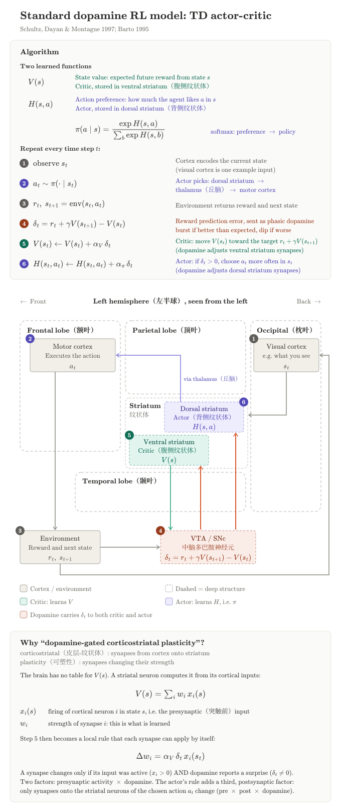

# 2 Striatum - RL.TDAC

**The claim.** Phasic dopamine reports one number, the TD error $\delta_t$. That one number is enough to train both a value predictor (critic) and a policy (actor). Below we derive this from the goal "maximize reward", then map it onto the brain.

**Setup.** In state $s_t$ the agent samples an action $a_t \sim \pi_\theta(\cdot \mid s_t)$. The world returns a reward $r_t$ and a next state $s_{t+1} \sim P(\cdot \mid s_t, a_t)$. The **return** is $R_t := \sum_{k \ge 0} \gamma^k r_{t+k}$, so $R_t = r_t + \gamma R_{t+1}$, and $R(\tau) := R_0$ for a whole trajectory $\tau$. **Markov:** given $s_t$, the future does not depend on the past.

## 1 Goal: improve the policy

- **Problem.** Maximize $J(\theta) := \mathbb E_{\tau \sim p_\theta}[R(\tau)]$. The rewards don't contain $\theta$: $\theta$ only changes *which* trajectories happen. We also don't know the world's dynamics $P$.
- **Result (policy gradient).**

$$
\nabla_\theta J = \mathbb E\Big[\sum_t \nabla_\theta \log \pi_\theta(a_t \mid s_t)\; R(\tau)\Big]
$$

- **Derivation.** The probability of a trajectory is "start, then choose, then transition, ...": $p_\theta(\tau) := \rho_0(s_0) \prod_t \pi_\theta(a_t \mid s_t)\, P(s_{t+1} \mid s_t, a_t)$, with $\rho_0$ the start-state distribution. Differentiate the probabilities, then use $\nabla p = p\, \nabla \log p$ to put $p_\theta$ back in front, so the result is again an average we can sample:

$$\begin{aligned}
\nabla_\theta J
&= \int \nabla_\theta p_\theta(\tau)\, R(\tau)\, d\tau
 = \int p_\theta(\tau)\, \nabla_\theta \log p_\theta(\tau)\, R(\tau)\, d\tau \\
\log p_\theta(\tau)
&= \log \rho_0(s_0) + \sum_t \log \pi_\theta(a_t \mid s_t) + \sum_t \log P(s_{t+1} \mid s_t, a_t)
\end{aligned}$$

- Only the $\pi$ terms depend on $\theta$, so the world model drops out.
- **Reading.** Make every action in a trajectory more likely, in proportion to the trajectory's return.

## 2 Too noisy → use the advantage

- **Problem.** In practice we estimate this average from a few sampled trajectories. The estimate is unbiased but has high variance, for two reasons:
    - an action gets credit for rewards that came *before* it;
    - if all returns are about $100 \pm 1$, every action gets pushed up, even though only the $\pm 1$ tells actions apart.
- **Result.**

$$
\nabla_\theta J = \mathbb E\Big[\sum_t {\color{red}\gamma^t}\, \nabla_\theta \log \pi_\theta(a_t \mid s_t)\; {\color{red}A(s_t, a_t)}\Big],
\qquad A := Q - V
$$

- with $V(s) := \mathbb E[R_t \mid s_t = s]$ (how good the state is) and $Q(s,a) := \mathbb E[R_t \mid s_t = s, a_t = a]$ (how good it is to take $a$ first). The **advantage** $A$ measures how much better $a$ is than the policy's average.
- All three depend on the policy $\pi$, since $\pi$ generates the future: strictly $V^\pi, Q^\pi, A^\pi$. The superscript is dropped while only one policy is around.
- **Derivation.** One lemma. Call $\nabla_\theta \log \pi_\theta(a \mid s)$ the **score**: the direction in $\theta$ that makes $a$ more likely in $s$. Shorthand: $\nabla \log \pi_t := \nabla_\theta \log \pi_\theta(a_t \mid s_t)$. The score has zero mean, so multiplying it by any $b(s)$ that doesn't depend on the action gives zero on average:

$$
\mathbb E_{a \sim \pi}\big[\nabla_\theta \log \pi(a \mid s)\, b(s)\big] = b(s) \sum_a \nabla_\theta \pi(a \mid s) = b(s)\, \nabla_\theta 1 = 0
$$

- Apply it twice:
    - **Past rewards (fixes reason 1).** Split $R(\tau) = \sum_k \gamma^k r_k$ into $k < t$ and $k \ge t$. The past rewards $r_{k<t}$ are already fixed when $a_t$ is drawn (constants given the history), so they play the role of $b$ and average out. What remains multiplying $\nabla \log \pi_t$ is $\sum_{k \ge t} \gamma^k r_k = \gamma^t R_t$.
    - **Baseline (fixes reason 2).** $V(s_t)$ depends only on the state, not the action, so it is a $b(s)$: subtracting it leaves the mean unchanged, $R_t \to R_t - V(s_t)$.
- Finally, replace $R_t$ by $Q$ (not the lemma). Do the expectation in two stages: first fix the past $h_t := (s_0, a_0, \dots, s_t, a_t)$ and average over the future, then average over $h_t$.
    - In the inner average the score is just a constant, so it comes out.
    - By Markov, the future depends on the past only through $(s_t, a_t)$, so the inner average of $R_t$ is $Q(s_t, a_t)$.

$$
\mathbb E\big[\nabla \log \pi_t\, R_t\big]
= \mathbb E_{h_t}\Big[\nabla \log \pi_t\; \mathbb E[R_t \mid h_t]\Big]
= \mathbb E_{h_t}\Big[\nabla \log \pi_t\; \underbrace{\mathbb E[R_t \mid s_t, a_t]}_{Q(s_t, a_t)}\Big]
$$

- So $R_t - V \to Q - V = A$.
- **Reading.** Push up actions that did better than average and push down those that did worse.

## 3 $A$ is unknown → Bellman equation

- **Problem.** To get $A = Q - V$ we must learn $V$ and $Q$. Their definitions average over entire futures. Is there a relation that involves only one step?
- **Result.**

$$
Q(s,a) = \mathbb E_{s'}\big[r + \gamma V(s')\big], \qquad V(s) = \mathbb E_{a \sim \pi}\big[Q(s,a)\big]
$$

- **Derivation.** Write $R_t = r_t + \gamma R_{t+1}$ and split the average into "where do we land" ($s'$) and "what happens after":

$$
Q(s,a) = \mathbb E\big[r_t + \gamma R_{t+1} \mid s, a\big]
= \mathbb E_{s'}\Big[r + \gamma\, \mathbb E\big[R_{t+1} \mid s, a, s'\big]\Big]
= \mathbb E_{s'}\big[r + \gamma V(s')\big]
$$

- The last step is Markov: once we are in $s'$, how we got there doesn't matter, so the inner average is $V(s')$.
- The $V$ equation is immediate: $V$ averages over the action too, so it is $Q$ averaged over $a \sim \pi$.

## 4 Learn $V$ online → TD error

- **Problem.** Learn $V(s) = \mathbb E[R_t \mid s_t = s]$ from experience. The direct way is to average the observed returns $R_t$, but each $R_t$ is only known at the end of the episode, and it is noisy. We want to learn after every single step, without knowing $P$.
- **Result.**

$$
\delta_t := r_t + \gamma V(s_{t+1}) - V(s_t), \qquad V(s_t) \leftarrow V(s_t) + \alpha_V\, \delta_t
$$

- **Derivation.**
    1. **Bellman turns a long average into a one-step one:** $V(s) = \mathbb E[y_t \mid s_t = s]$ with $y_t := r_t + \gamma V(s_{t+1})$. Each $y_t$ is available after one step.
    2. **Estimate a mean by a running average.** The standard way to estimate a mean $\mu$ from samples $y_1, y_2, \dots$ arriving one at a time: $\hat\mu \leftarrow \hat\mu + \alpha (y_k - \hat\mu)$, i.e. move a fraction $\alpha$ toward each new sample. ($\alpha = 1/k$ gives exactly the sample mean; a constant $\alpha$ gives an exponentially weighted one.) Here $\hat\mu = V(s_t)$ and the sample is $y_t$, so $V(s_t) \leftarrow V(s_t) + \alpha (y_t - V(s_t))$.
    3. **Bootstrapping.** We don't know the true $V(s_{t+1})$ inside $y_t$, so we plug in our current guess. Then $y_t - V(s_t) = \delta_t$, which is the update above.
- **Check.** On average the update stops when $\mathbb E[\delta_t \mid s_t = s] = 0$ for every $s$, which is exactly the Bellman equation. Its only solution is the true $V$, so that is where the updates stop. (In the tabular case with Robbins-Monro step sizes it provably gets there.)
- **Meaning.** Before the step we predicted $V(s_t)$. After it we have a better estimate, $r_t + \gamma V(s_{t+1})$, because one reward is now observed. $\delta_t$ is the difference: a **reward prediction error**.

## 5 Payoff: $\delta$ is also the advantage → actor-critic

### 5.1 $\delta$ is the advantage

- **Problem.** The actor needs $A = Q - V$, but the critic only learns $V$. Do we need to learn $Q$ as well?
- **Result.** No. With a correct critic ($V = V^\pi$),

$$
\mathbb E[\delta_t \mid s_t, a_t] = A(s_t, a_t)
$$

- so ${\color{red}\delta_t}\, \nabla_\theta \log \pi_\theta(a_t \mid s_t)$ is an unbiased one-step sample of the policy gradient. The single scalar $\delta$ trains both the critic and the actor.
- Red = what changed from section 2: $\gamma^t A(s_t,a_t) \to \delta_t$ ($\gamma^t$ is dropped in practice).
- **Derivation.**

$$
\mathbb E[\delta_t \mid s_t, a_t] = \mathbb E\big[r_t + \gamma V(s_{t+1}) \mid s_t, a_t\big] - V(s_t) = Q(s_t,a_t) - V(s_t)
$$

- The first equality is the definition of $\delta_t$ (only $V(s_t)$ is fixed given $s_t$); the second is the Bellman $Q$ equation (section 3).
### 5.2 The algorithm

- **TD actor-critic**, every step:
    1. $\delta_t := r_t + \gamma V(s_{t+1}) - V(s_t)$;
    2. critic: $V(s_t) \mathrel{+}= \alpha_V\, \delta_t$;
    3. actor: $\theta \mathrel{+}= \alpha_\pi\, {\color{red}\delta_t}\, \nabla_\theta \log \pi_\theta(a_t \mid s_t)$.
- The $\sum_t$ is not gone, it is spread over time: each step applies its own term, so over an episode the actor's updates add up to $\alpha_\pi \sum_t \delta_t\, \nabla \log \pi_t$. Applying the terms one at a time instead of summing first is ordinary stochastic gradient ascent.
- **Consequence: the policy changes at every step.** So the critic chases a moving target: it learns $V^\pi$ while $\pi$ keeps changing, and it is never exactly right. Then $\delta$ is a slightly biased estimate of $A$ (the result above assumed a correct critic). The standard fix is to let the critic learn faster than the actor, $\alpha_V \gg \alpha_\pi$, so that from the critic's point of view the policy is almost frozen.
### 5.3 A concrete actor: softmax over preferences

- So far $\pi_\theta$ was any parameterized policy. To see what the update actually does (and to map it onto neurons later), pick the simplest one: one free number $H(s,a)$ per state and action, a **preference**. Probabilities must be positive and sum to 1, while preferences can be any real numbers, so convert with a softmax:

$$
\pi(a \mid s) := \frac{e^{H(s,a)}}{\sum_c e^{H(s,c)}}
$$

- Here the parameters are the preferences themselves, $\theta = \{H(s,b)\}$, so the actor update $\theta \mathrel{+}= \alpha_\pi \delta_t \nabla_\theta \log \pi_t$ reads, for each entry, $H(s,b) \mathrel{+}= \alpha_\pi\, \delta_t\, \partial \log \pi(a_t \mid s_t) / \partial H(s,b)$. No chain rule is needed, just the derivative of the log-softmax. Only the row $s = s_t$ has a nonzero derivative:

$$\begin{aligned}
\log \pi(a_t \mid s_t) &= H(s_t,a_t) - \log \sum_c e^{H(s_t,c)} \\
\frac{\partial \log \pi(a_t \mid s_t)}{\partial H(s_t,b)} &= \mathbb 1[b = a_t] - \pi(b \mid s_t) \\
\Rightarrow \quad H(s_t, b) &\mathrel{+}= \alpha_\pi\, \delta_t \big(\mathbb 1[b = a_t] - \pi(b \mid s_t)\big)
\end{aligned}$$

- **Reading.** If $\delta_t > 0$, the chosen action's preference goes up and every other action's goes down a little; if $\delta_t < 0$, the reverse.
- **Barto's simpler rule.** Drop the $-\pi(b \mid s_t)$ term and update only the chosen action: $H(s_t,a_t) \mathrel{+}= \alpha_\pi \delta_t$. This is easier for neurons, since only the channel that acted changes (section 6). It gives the same update **on average**. Average over $a_t \sim \pi$ and use $\mathbb E[\delta_t \mid s, a] = A(s,a)$:

$$\begin{aligned}
\text{full rule:} \quad \mathbb E[\Delta H(s,b)]
&= \alpha_\pi \sum_a \pi(a \mid s)\, A(s,a) \big(\mathbb 1[b = a] - \pi(b \mid s)\big) \\
&= \alpha_\pi\, \pi(b \mid s)\, A(s,b) - \alpha_\pi\, \pi(b \mid s) \underbrace{\textstyle\sum_a \pi(a \mid s)\, A(s,a)}_{=\,0} \\
\text{Barto:} \quad \mathbb E[\Delta H(s,b)]
&= \alpha_\pi \sum_a \pi(a \mid s)\, A(s,a)\, \mathbb 1[b = a] = \alpha_\pi\, \pi(b \mid s)\, A(s,b)
\end{aligned}$$

- The underbraced sum is zero because the advantage averages to zero under the policy: $\sum_a \pi(a \mid s) A(s,a) = \sum_a \pi(a \mid s) Q(s,a) - V(s) = V(s) - V(s) = 0$. So the dropped term only adds noise, not direction.

## 6 The brain does exactly this

- **Problem.** Does the brain run TD actor-critic?
- **Result.** Yes, piece by piece:

| Algorithm | Brain |
|---|---|
| state $s_t$ | cortex |
| critic $V$ | ventral striatum |
| actor $H$, $\pi$ | dorsal striatum → thalamus → motor cortex |
| $\delta_t$ | phasic dopamine (VTA/SNc) |
| $\Delta w = \alpha \delta x$ | pre × dopamine plasticity |
| $\Delta w = \alpha \delta x (\mathbb 1 - \pi)$ | pre × post × dopamine plasticity |

### 6.1 Dopamine $= \delta$: Schultz's experiment

- **Setup.** Monkeys see a cue, and juice follows a fixed time later. The cue comes at unpredictable times. States: "pre" (waiting for the cue), cue $C$, delay $D$, then reward $1$; $\gamma = 1$ within a trial. After learning, $V(C) = V(D) = 1$, since the reward always follows.
- **Why $V(\text{pre}) \approx 0$.** The monkey does expect juice eventually, but the cue comes after a long, random wait. With discounting across trials that future juice is worth little now, and since the timing is unpredictable, the value can't rise as the cue approaches. So set $V(\text{pre}) = 0$ for simplicity. Only the jump at the cue matters: any $V(\text{pre}) < V(C)$ gives a positive $\delta$, i.e. a burst, at the cue.

- **Each $\delta$ belongs to a transition** $s_t \to s_{t+1}$, computed as $\delta_t = r_t + \gamma V(s_{t+1}) - V(s_t)$. A trial has three:
    - cue appears: $\text{pre} \to C$, so $\delta = 0 + V(C) - V(\text{pre})$;
    - delay: $C \to D$, so $\delta = 0 + V(D) - V(C)$;
    - reward (or not) on leaving $D$, then the trial ends ($V = 0$ after it), so $\delta = r + 0 - V(D)$.

| Situation | Transition | $\delta$ | Dopamine neurons |
|---|---|---|---|
| Before learning, at the reward | $D \to$ end, $r = 1$ | $1 + 0 - 0 = 1$ | burst at the reward |
| After learning, at the cue | $\text{pre} \to C$ | $0 + 1 - 0 = 1$ | burst moves to the cue |
| After learning, during the delay | $C \to D$ | $0 + 1 - 1 = 0$ | nothing |
| After learning, at the reward | $D \to$ end, $r = 1$ | $1 + 0 - 1 = 0$ | no response to a predicted reward |
| After learning, reward omitted | $D \to$ end, $r = 0$ | $0 + 0 - 1 = -1$ | dip at the expected time |

- During learning, the burst moves backward from the reward to the cue: $V(D)$ is learned first, and $V(C)$ bootstraps from $V(D)$.

### 6.2 Synapses: the update rules

- **Setup.** Let $x_i(s)$ be the firing of cortical input $i$ in state $s$, and $w$ the corticostriatal synaptic weights. The brain stores no table, so $V$ and $H$ become functions of $w$, and the updates of section 5 become updates of $w$.
- **Critic.** One model neuron computes $V(s) := \sum_i w_i x_i(s)$. (In the brain this is a population of ventral striatal neurons; the model lumps it into one unit.)
- The tabular update $V(s_t) \mathrel{+}= \alpha_V \delta_t$ was a running average toward the target $y_t$. With weights, the same idea is a gradient step that shrinks the error $\tfrac12 (y_t - V(s_t))^2$, treating the target $y_t$ as fixed:

$$\begin{aligned}
\Delta w_i
&= -\alpha_V\, \frac{\partial}{\partial w_i}\, \tfrac12 \big(y_t - V(s_t)\big)^2 \\
&= \alpha_V\, \big(y_t - V(s_t)\big)\, \frac{\partial V(s_t)}{\partial w_i} \\
&= \alpha_V\, \underbrace{\delta_t}_{\text{dopamine}}\, \underbrace{x_i(s_t)}_{\text{pre}} \qquad \text{(two factors)}
\end{aligned}$$

- The last line uses $\partial V(s_t) / \partial w_i = x_i(s_t)$, since $V$ is linear in $w$. Check: if $x$ is one-hot (one input per state), this is exactly the tabular update.
- **Actor.** One model neuron per action $b$ computes $H(s,b) := \sum_i w_{bi} x_i(s)$. (In the brain each is a population of dorsal striatal neurons, an action "channel".)
- Now the parameters are $\theta = w$, so the actor update is $\Delta w_{bi} = \alpha_\pi\, \delta_t\, \partial \log \pi(a_t \mid s_t) / \partial w_{bi}$. $\log \pi$ depends on $w_{bi}$ through the preferences $H(s_t, c)$, so use the chain rule. Only $H(s_t, b)$ contains $w_{bi}$, with $\partial H(s_t,c) / \partial w_{bi} = \mathbb 1[c = b]\, x_i(s_t)$:

$$\begin{aligned}
\frac{\partial \log \pi(a_t \mid s_t)}{\partial w_{bi}}
&= \sum_c \underbrace{\frac{\partial \log \pi(a_t \mid s_t)}{\partial H(s_t,c)}}_{\mathbb 1[c = a_t] - \pi(c \mid s_t)\ \text{(section 5)}}\, \frac{\partial H(s_t,c)}{\partial w_{bi}} \\
&= \sum_c \big(\mathbb 1[c = a_t] - \pi(c \mid s_t)\big)\, \mathbb 1[c = b]\, x_i(s_t) \\
&= \big(\mathbb 1[b = a_t] - \pi(b \mid s_t)\big)\, x_i(s_t)
\\[6pt]
\Rightarrow \quad \Delta w_{bi}
&= \alpha_\pi\, \underbrace{\delta_t}_{\text{dopamine}}\, \underbrace{x_i(s_t)}_{\text{pre}}\, \underbrace{\big(\mathbb 1[b = a_t] - \pi(b \mid s_t)\big)}_{\text{post}} \qquad \text{(three factors)}
\end{aligned}$$

- Why "post": $\mathbb 1[b = a_t]$ says whether unit $b$ won and drove the action, i.e. whether the postsynaptic neurons fired. The $-\pi(b \mid s_t)$ part slightly weakens the losing units. Barto's rule drops it, so only synapses onto the winning unit change.
- **Timing.** $\delta_t$ arrives after the input fired, so each synapse keeps a short **eligibility trace** of its recent activity. Dopamine potentiates synapses that were active about 0.3–2 s earlier.

<!-- Sections 7-10 (PPO, GAE, SAC, comparison) parked for later.

## 7 Wasteful: one step per sample → PPO

- **Problem.** The policy gradient is the slope *at* the current $\theta$. So one batch of data supports only one small step. Large steps can wreck the policy, and a bad policy collects bad data. We want many gradient steps per batch while staying close to the policy that collected it.
- **Result.**

$$
L^{\text{CLIP}}(\theta) := \mathbb E_t\Big[\min\big(\rho_t \hat A_t,\ \mathrm{clip}(\rho_t, 1-\epsilon, 1+\epsilon)\, \hat A_t\big)\Big],
\qquad \rho_t := \frac{\pi_\theta(a_t \mid s_t)}{\pi_{\text{old}}(a_t \mid s_t)}
$$

- **Derivation, step 1: how much better is a new policy $\pi'$?** Two facts:
    - The start state doesn't depend on the policy, so $J(\pi) = \mathbb E_{\tau \sim \pi'}[V^\pi(s_0)]$.
    - The sum $\sum_t \gamma^t(\gamma V^\pi(s_{t+1}) - V^\pi(s_t))$ telescopes to $-V^\pi(s_0)$.

$$\begin{aligned}
J(\pi') - J(\pi)
&= \mathbb E_{\tau \sim \pi'}\Big[\sum_t \gamma^t \big(r_t + \gamma V^\pi(s_{t+1}) - V^\pi(s_t)\big)\Big] \\
&= \mathbb E_{\tau \sim \pi'}\Big[\sum_t \gamma^t A^\pi(s_t, a_t)\Big]
\end{aligned}$$

- The second line uses $\mathbb E[\delta \mid s,a] = A$. That holds even though $a$ was chosen by $\pi'$: once $a$ is fixed, $s'$ comes from the world alone.
- **Step 2: evaluate it with old data.**
    - The states should come from $\pi'$. If $\pi' \approx \pi$, use the old states instead.
    - The actions are handled exactly by importance sampling: $\mathbb E_{a \sim \pi'}[A] = \mathbb E_{a \sim \pi}[\rho A]$ with $\rho := \pi'(a \mid s) / \pi(a \mid s)$.
    - Together this gives the surrogate $L := \mathbb E_{\text{old data}}[\rho A]$. At $\theta = \theta_\text{old}$, $\nabla \rho = \nabla \log \pi$, so $\nabla L$ is the policy gradient.
- **Step 3: stay close.** $L$ is only trustworthy near $\pi_\text{old}$. The $\min$ with the clipped term removes any incentive to go further:
    - if $\hat A > 0$, the objective stops growing once $\rho > 1+\epsilon$;
    - if $\hat A < 0$, it stops growing once $\rho < 1-\epsilon$.
    - Moves in the unprofitable direction are not clipped, so they can still be undone.
- **Full loss.** $L^{\text{CLIP}} - c_1 (V_\phi - \hat R_t)^2 + c_2\, \mathcal H[\pi]$. The middle term trains the critic toward $\hat R_t := \hat A_t + V_\text{old}(s_t)$, and the entropy bonus keeps the policy exploring.
- **Loop.**
    1. Run $\pi_\text{old}$ for $T$ steps.
    2. Compute $\hat A$ (section 8).
    3. Do $K$ epochs of minibatch ascent.
    4. Discard the data.

## 8 Which $\hat A$? → GAE

- **Problem.** $\delta_t$ has low variance but is biased if $V$ is wrong. $R_t - V(s_t)$ is unbiased but noisy. We want a dial between them.
- **Result.**

$$
\hat A_t := \sum_{l \ge 0} (\gamma\lambda)^l\, \delta_{t+l} = \delta_t + \gamma\lambda\, \hat A_{t+1}
$$

- $\lambda = 0$ gives $\delta_t$ (the dopamine signal). $\lambda = 1$ gives $R_t - V(s_t)$. Typically $\lambda = 0.95$, computed backward through the batch.
- **Derivation.** An $n$-step estimate uses $n$ real rewards and then bootstraps. In terms of $\delta$, the $V$ terms telescope:

$$
\hat A_t^{(n)} := \sum_{l=0}^{n-1} \gamma^l \delta_{t+l} = \sum_{l=0}^{n-1} \gamma^l r_{t+l} + \gamma^n V(s_{t+n}) - V(s_t)
$$

- $\hat A_t$ is the average of $\hat A_t^{(n)}$ over $n$ with weights $(1-\lambda)\lambda^{n-1}$. Then $\delta_{t+l}$ appears in every $n > l$, with total weight $\lambda^l$.
- This is TD($\lambda$): an error is credited back to earlier steps with decaying weight, the same role as the synaptic eligibility trace.

## 9 Still on-policy, exploration ad hoc → SAC

- **Problem.** PPO throws away each batch, and exploration is a bolt-on bonus. We want to reuse all past data (a replay buffer) and build exploration into the objective itself.
- **Result.** Maximize reward plus entropy, with $\mathcal H(\pi(\cdot \mid s)) := \mathbb E_{a \sim \pi}[-\log \pi(a \mid s)]$:

$$
J := \mathbb E\Big[\sum_t \gamma^t \big(r_t + \alpha\, \mathcal H(\pi(\cdot \mid s_t))\big)\Big]
\quad\Rightarrow\quad
\pi^*(a \mid s) \propto \exp\big(Q(s,a)/\alpha\big)
$$

- **Derivation.**
    - **Soft Bellman.** Same as section 3, with the entropy added to the value: $Q(s,a) = \mathbb E[r + \gamma V(s')]$ and $V(s) = \mathbb E_{a \sim \pi}[Q(s,a) - \alpha \log \pi(a \mid s)]$.
- **Best policy for a given $Q$.** Define $\pi_Q := e^{Q/\alpha}/Z$ with $Z := \sum_a e^{Q(s,a)/\alpha}$, so $Q/\alpha = \log \pi_Q + \log Z$:

$$
\mathbb E_{a \sim \pi'}\big[Q - \alpha \log \pi'\big] = -\alpha\, \mathrm{KL}\big(\pi' \,\|\, \pi_Q\big) + \alpha \log Z
$$

- This is maximized at $\pi' = \pi_Q$. As $\alpha \to 0$ it becomes $\arg\max_a Q$: a "soft" max.
- **Why off-policy works.** The $Q$ target holds for any $(s,a)$, no matter which old policy chose $a$, and $a'$ is drawn fresh from the current policy. The policy gradient instead needs trajectories from the current policy.
- **Practical pieces.**
    - **Critic.** Target $y := r + \gamma\big(\min_j \bar Q_j(s',a') - \alpha \log \pi(a' \mid s')\big)$. Taking the min over two Q-networks counters overestimation; slow target copies $\bar Q$ keep the target stable.
    - **Actor.** Minimize $\mathbb E_s[\alpha \log \pi(a_\theta \mid s) - Q(s, a_\theta)]$ with $a_\theta := \tanh(\mu_\theta + \sigma_\theta \odot \varepsilon)$. This is the KL above. The gradient flows *through* the critic, via $\nabla_a Q$.
    - **Temperature.** $\alpha$ is tuned automatically: it rises when the entropy drops below a target and falls when it is above.

## 10 Comparison

| | Dopamine AC | PPO | SAC |
|---|---|---|---|
| Critic | $V(s)$ | $V_\phi(s)$ | twin $Q(s,a)$ |
| Teaching signal | $\delta_t$ | $\hat A_t = \sum_l (\gamma\lambda)^l \delta_{t+l}$ | soft TD error $y - Q$ |
| Actor moved by | scalar $\delta_t$ | scalar $\hat A_t$, clipped | gradient $\nabla_a Q$ |
| Data | online, one step | on-policy batches | replay buffer |
| Exploration | softmax noise | entropy bonus | entropy in objective |
| Implemented by | synapses + one broadcast scalar | backprop | backprop |

- **Dopamine AC = PPO stripped down.** Take PPO with $\lambda = 0$ (so $\hat A = \delta$), batch size 1 and one epoch (so $\rho = 1$ and the clip never acts), and tabular $V$ and $H$. What remains is exactly section 5.
- **SAC is the farthest from the brain.** Its critic learns $Q$ instead of $V$. Its actor follows $\nabla_a Q$, which needs the critic's gradient rather than a single broadcast scalar.
- **Link back.** SAC's optimal policy $\pi \propto e^{Q/\alpha}$ is the striatal softmax with $H = Q/\alpha$. Striatal preferences can be read as action values divided by a temperature.

-->
