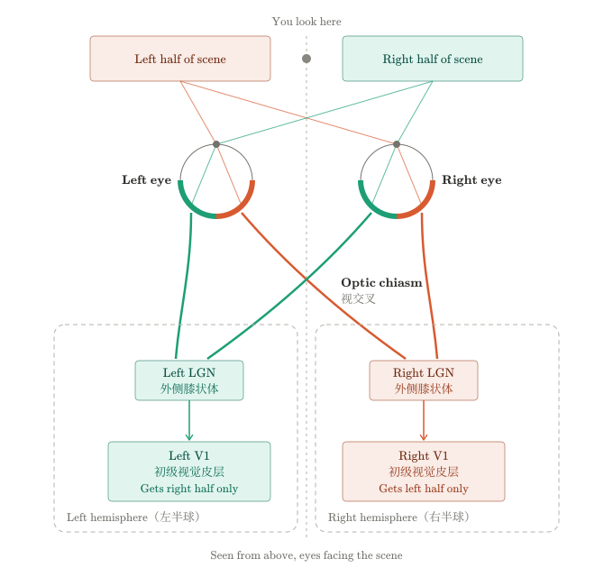
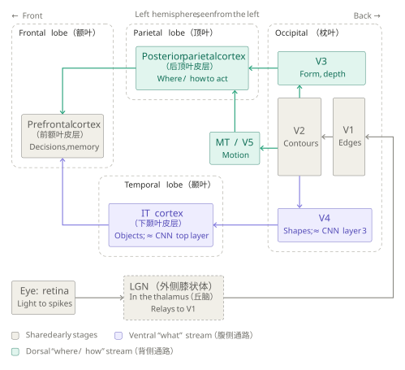
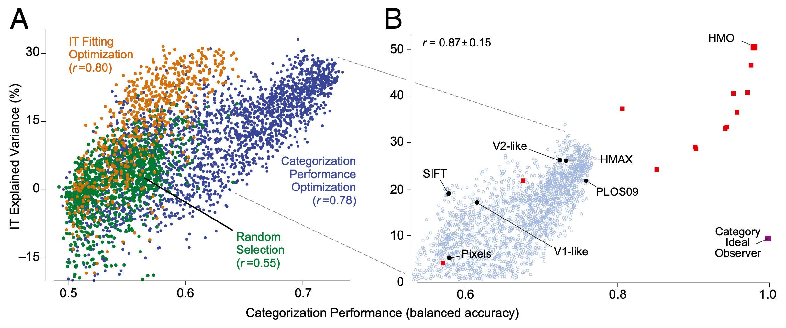
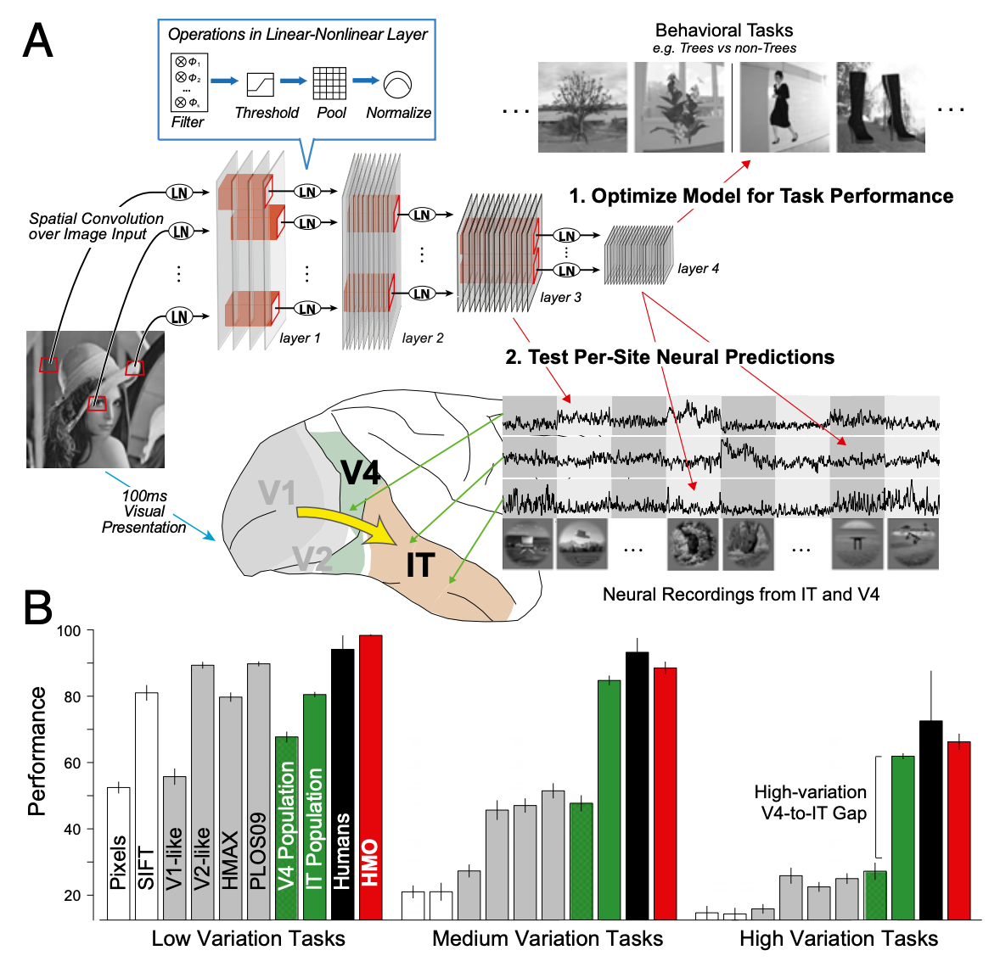

# 1 2014 Ventral Stream - CNN

- [Performance-optimized hierarchical models predict neural responses in higher visual cortex](https://pmc.ncbi.nlm.nih.gov/articles/PMC4060707/pdf/pnas.201403112.pdf)

## Abstract

- The ventral visual stream underlies key human visual object recognition abilities. 
    - However, neural encoding in the higher areas of the ventral stream remains poorly understood. 
    - Here, we describe a modeling approach that yields a quantitatively accurate model of inferior temporal (IT) cortex, the highest ventral cortical area. 
    - Using high-throughput computational techniques, we discovered that, within a class of biologically plausible hierarchical neural network models, there is a strong correlation between a model’s categorization performance and its ability to predict individual IT neural unit response data. 
    - To pursue this idea, we then identified a high-performing neural network that matches human performance on a range of recognition tasks. 
    - Critically, even though we did not constrain this model to match neural data, its top output layer turns out to be highly predictive of IT spiking responses to complex naturalistic images at both the single site and population levels. 
    - Moreover, the model’s intermediate layers are highly predictive of neural responses in the V4 cortex, a mid-level visual area that provides the dominant cortical input to IT. 
    - These results show that performance optimization — applied in a biologically appropriate model class — can be used to build quantitative predictive models of neural processing.

## Introduction

- Retinal images of real-world objects vary drastically due to changes in object pose, size, position, lighting, nonrigid deformation, occlusion, and many other sources of noise and variation. 
    - Humans effortlessly recognize objects rapidly and accurately despite this enormous variation, an impressive computational feat. 
    - This ability is supported by a set of interconnected brain areas collectively called the ventral visual stream, with homologous areas in nonhuman primates. 
    - The ventral stream is thought to function as a series of hierarchical processing stages that encode image content (e.g., object identity and category) increasingly explicitly in successive cortical areas. 
        - For example, neurons in the lowest area, V1, are well described by Gabor-like edge detectors that extract rough object outlines, although the V1 population does not show robust tolerance to complex image transformations. 
        - Conversely, rapidly evoked population activity in top-level inferior temporal (IT) cortex can directly support realtime, invariant object categorization over a wide range of tasks. 
        - Midlevel ventral areas — such as V4, the dominant cortical input to IT — exhibit intermediate levels of object selectivity and variation tolerance.

- Significant progress has been made in understanding lower ventral areas such as V1, where conceptually compelling models have been discovered. 
    - These models are also quantitatively accurate and can predict response magnitudes of individual neuronal units to novel image stimuli. 
    - Higher ventral cortical areas, especially V4 and IT, have been much more difficult to understand. 
    - Although first principles-based models of higher ventral cortex have been proposed, these models fail to match important features of the higher ventral visual neural representation in both humans and macaques. 
    - Moreover, attempts to fit V4 and IT neural tuning curves on general image stimuli have shown only limited predictive success.
    - Explaining the neural encoding in these higher ventral areas thus remains a fundamental open question in systems neuroscience.

- As with V1, models of higher ventral areas should be neurally predictive. 
    - However, because the higher ventral stream is also believed to underlie sophisticated behavioral object recognition capacities, models must also match IT on performance metrics, equalling (or exceeding) the decoding capacity of IT neurons on object recognition tasks. 
    - A model with perfect neural predictivity in IT will necessarily exhibit high performance, because IT itself does. 
    - Here we demonstrate that the converse is also true, within a biologically appropriate model class. 
    - Combining high-throughput computational and electrophysiology techniques, we explore a wide range of biologically plausible hierarchical neural network models and then assess them against measured IT and V4 neural response data. 
    - We show that there is a strong correlation between a model’s performance on a challenging high-variation object recognition task and its ability to predict individual IT neural unit responses.

- Extending this idea, we used optimization methods to identify a neural network model that matches human performance on a range of recognition tasks. 
    - We then show that even though this model was never explicitly constrained to match neural data, its output layer is highly predictive of neural responses in IT cortex — providing a first quantitatively accurate model of this highest ventral cortex area. 
    - Moreover, the middle layers of the model are highly predictive of V4 neural responses, suggesting top-down performance constraints directly shape intermediate visual representations.

## Significance

- Humans and monkeys easily recognize objects in scenes. 
    - This ability is known to be supported by a network of hierarchically interconnected brain areas. 
    - However, understanding neurons in higher levels of this hierarchy has long remained a major challenge in visual systems neuroscience. 
    - We use computational techniques to identify a neural network model that matches human performance on challenging object categorization tasks. 
    - Although not explicitly constrained to match neural data, this model turns out to be highly predictive of neural responses in both the V4 and inferior temporal cortex, the top two layers of the ventral visual hierarchy. 
    - In addition to yielding greatly improved models of visual cortex, these results suggest that a process of biological performance optimization directly shaped neural mechanisms.

## Results

- Fig. 1. `Performance` / `IT-predictivity` correlation. 
    - (A) **Object categorization performance vs. IT neural explained variance percentage (IT-predictivity) for CNN models in three independent high-throughput computational experiments (each point is a distinct neural network architecture).** 
        - The x axis shows performance (balanced accuracy, chance is 0.5) of the model output features on a high-variation categorization task; 
        - the y axis shows the median single site IT explained variance percentage (n=168 sites) of that model. 
        - Each dot corresponds to a distinct model selected from a large family of convolutional neural network architectures. 
        - Models were selected by 
            - random draws from parameter space (green dots), 
            - object categorization performance-optimization (blue dots), or 
            - explicit IT predictivity optimization (orange dots). 
    - (B) Pursuing the correlation identified in A, a high-performing neural network was identified that matches human performance on a range of recognition tasks, the HMO model. 
        - The object categorization performance vs. IT neural predictivity correlation extends across a variety of models exhibiting a wide range of performance levels. 
        - Black circles include controls and published models; 
        - red squares are models produced during the HMO optimization procedure. 
        - The category ideal observer (purple square) lies significantly off the main trend, but is not an actual image-computable model. 
        - The $r$ value is computed over red and black points. 
        - For reference, light blue circles indicate performance optimized models (blue dots) from A.

### Invariant Object Recognition Performance Strongly Correlates with IT Neural Predictivity. 

- We first measured IT neural responses on a benchmark testing image set that exposes key performance characteristics of visual representations. 
    - This image set consists of 5,760 images of photorealistic 3D objects drawn from eight natural categories (animals, boats, cars, chairs, faces, fruits, planes, and tables) and contains high levels of the object position, scale, and pose variation that make recognition difficult for artificial vision systems, but to which humans are robustly tolerant. 
    - The objects are placed on cluttered natural scenes that are randomly selected to ensure background content is uncorrelated with object identity (Fig. S1A).

- **Using multiple electrode arrays, we collected responses from 168 IT neurons to each image.** 
    - We then used high-throughput computational methods to evaluate thousands of candidate neural network models on these same images, measuring object categorization performance as well as IT neural predictivity for each model (Fig. 1A; each point represents a distinct model).
    - **To measure categorization performance, we trained support vector machine (SVM) linear classifiers on model output layer units and computed cross-validated testing accuracy for these trained classifiers.** 
    - **To assess models’ neural predictivity, we used a standard linear regression methodology: for each target IT neural site, we identified a synthetic neuron composed of a linear weighting of model outputs that would best match that site on fixed sample images and then tested response predictions against actual neural site’s output on novel images (Materials and Methods and SI Text).**

- Models were drawn from a large parameter space of **convolutional neural networks (CNNs)** expressing an inclusive version of the hierarchical processing concept. 
    - CNNs approximate the general retinotopic organization of the ventral stream via spatial convolution, with computations in any one region of the visual field identical to those elsewhere. 
    - Each convolutional layer is composed of simple and neurally plausible basic operations, including 
        - linear filtering, 
        - thresholding, 
        - pooling, and 
        - normalization (Fig. S2A). 
    - These layers are stacked hierarchically to construct deep neural networks.

- Each model is specified by a set of 57 parameters controlling the number of layers and parameters at each layer, fan-in and fan-out, activation thresholds, pooling exponents, and local receptive field sizes at each layer. 
    - **Network depth ranged from one to three layers**, and filter weights for each layer were chosen randomly from bounded uniform distributions whose bounds were model parameters (SI Text). 
    - **These models are consistent with the Hierarchical Linear-Nonlinear (HLN) hypothesis that higher level neurons (e.g., IT) output a linear weighting of inputs from intermediate-level (e.g., V4) neurons followed by simple additional nonlinearities.**

- **Models were selected for evaluation by one of three procedures**: 
    - (i) **random sampling** of the uniform distribution over parameter space (Fig. 1A; n = 2,016, green dots); 
    - (ii) **optimization for performance** on the high-variation eight-way categorization task (n = 2,043, blue dots); and 
    - (iii) **optimization directly for IT neural predictivity** (n = 1,876, orange dots; also see SI Text and Fig. S3). 
- In each case, we observed significant variation in both performance and IT predictivity across the parameter range. 
    - Thus, although the HLN hypothesis is consistent with a broad spectrum of particular neural network architectures, specific parameter choices have a large effect on a given model’s recognition performance and neural predictivity.

- **Performance was significantly correlated with neural predictivity in all three selection regimes. Models that performed better on the categorization task were also more likely to produce outputs more closely aligned to IT neural responses.** 
    
- Although the class of HLN-consistent architectures contains many neurally inconsistent architectures with low IT predictivity, performance provides a meaningful way to a priori rule out many of those inconsistent models. 
    - **No individual model parameters correlated nearly as strongly with IT predictivity as performance (Fig. S4), indicating that the performance/IT predictivity correlation cannot be explained by simpler mechanistic considerations (e.g., receptive field size of the top layer).**

- **Critically, directed optimization for performance significantly increased the correlation with IT predictivity compared with the random selection regime ($r=0.78$ vs. $r=0.55$), even though neural data were not used in the optimization. Moreover, when optimizing for performance, the best-performing models predicted neural output as well as those models directly selected for neural predictivity, although the reverse is not true. Together, these results imply that, although the IT predictivity metric is a complex function of the model parameter landscape, performance optimization is an efficient means to identify regions in parameter space containing IT-like models.**

### IT Cortex as a Neural Performance Target. 

- Fig. 2. Neural-like models via performance optimization. 
    - (A) 
        - We (1) used high-throughput computational methods to optimize the parameters of a hierarchical CNN with linear-nonlinear (LN) layers for performance on a challenging invariant object recognition task. 
        - Using new test images distinct from those used to optimize the model, we then (2) compared output of each of the model’s layers to IT neural responses and the output of intermediate layers to V4 neural responses. 
        - To obtain neural data for comparison, we used chronically implanted multi-electrode arrays to record the responses of multiunit sites in IT and V4, obtaining the mean visually evoked response of each of 296 neural sites to ∼6,000 complex images. 
    - (B) Object categorization performance results on the test images for eight-way object categorization at three increasing levels of object view variation (y axis units are 8-way categorization percent-correct, chance is 12.5%). 
        - IT (green bars) and V4 (hatched green bars) neural responses, and computational models (gray and red bars) were collected on the same image set and used to train support vector machine (SVM) linear classifiers from which population performance accuracy was evaluated. 
        - Error bars are computed over train/test image splits. 
        - Human subject responses on the same tasks were collected via psychophysics experiments (black bars); error bars are due to inter-subject variation.

- Fig. 1A suggests a next step toward improved encoding models of higher ventral cortex: drive models further to the right along the x axis — if the correlation holds, the models will also climb on the y axis. 
    - Ideally, this would involve identifying hierarchical neural networks that perform at or near human object recognition performance levels and validating them using rigorous tests against neural data (Fig. 2A). 
    - However, the difficulty of meeting the performance challenge itself can be seen in Fig. 2B. 
    - To obtain neural reference points on categorization performance, we trained linear classifiers on the IT neural population (Fig. 2B, green bars) and the V4 neural population (n=128, hatched green bars). 
    - To expose a key axis of recognition difficulty, we computed performance results at three levels of object view variation, from low (fixed orientation, size, and position) to high (180° rotations on all axes, 2.5× dilation, and full-frame translations; Fig. S1A). 
    - As a behavioral reference point, we also measured human performance on these tasks using web-based crowd-sourcing methods (black bars). 
    - A crucial observation is that at all levels of variation, the IT population tracks human performance levels, consistent with known results about IT’s high category decoding abilities.
    - The V4 population matches IT and human performance at low levels of variation, but performance drops quickly at higher variation levels. (This V4-to-IT performance gap remains nearly as large even for images with no object translation variation, showing that the performance gap is not due just to IT’s larger receptive fields.)

- As a computational reference, we used the same procedure to evaluate a variety of published ventral stream models targeting several levels of the ventral hierarchy. 
    - To control for low-level confounds, we tested the (trivial) pixel model, as well as SIFT, a simple baseline computer vision model. 
    - We also evaluated 
        - a V1-like Gabor-based model, 
        - a V2-like conjunction-of-Gabors model, and 
        - HMAX, a model targeted at explaining higher ventral cortex and that has receptive field sizes similar to those observed in IT. 
    - The HMAX model can be trained in a domain-specific fashion, and to give it the best chance of success, we performed this training using the benchmark images themselves (see SI Text for more information on the comparison models). 
    - Like V4, the control models that we tested approach IT and human performance levels in the low-variation condition, but in the high-variation condition, all of them fail to match the performance of IT units by a large margin. 
    - It is not surprising that V1 and V2 models are not nearly as effective as IT, but it is instructive to note that the task is sufficiently difficult that the HMAX model performs less well than the V4 population sample, even when pretrained directly on the test dataset.

### Constructing a High-Performing Model. 

- **Although simple three-layer hierarchical CNNs can be effective at low-variation object recognition tasks, recent work has shown that they may be limited in their performance capacity for higher-variation tasks.**
    - For this reason, we extended our model class to contain combinations (e.g., mixtures) of deeper CNN networks (Fig. S2B), which correspond intuitively to architecturally specialized subregions like those observed in the ventral visual stream.
    - To address the significant computational challenge of finding especially high-performing architectures within this large space of possible networks, we used **hierarchical modular optimization (HMO)**. 
    - The HMO procedure embodies a conceptually simple hypothesis for how high-performing combinations of functionally specialized hierarchical architectures can be efficiently discovered and hierarchically combined, without needing to pre-specify the subtasks ahead of time. 
    - **Algorithmically, HMO is analogous to an adaptive boosting procedure interleaved with hyperparameter optimization (see SI Text and Fig. S2C).**

- As a pretraining step, we applied the HMO selection procedure on a screening task (Fig. S1B). 
    - Like the testing set, the screening set contained images of objects placed on randomly selected backgrounds, but used entirely different objects in totally non-overlapping semantic categories, with none of the same backgrounds and widely divergent lighting conditions and noise levels. 
    - Like any two samples of naturalistic images, the screening and testing images have high-level commonalities but quite different semantic content. 
    - For this reason, performance increases that transfer between them are likely to also transfer to other naturalistic image sets. 
    - Via this pretraining, the HMO procedure identified a **four-layer CNN with 1,250 top-level outputs** (Figs. S2B and S5), which we will refer to as the HMO model.

- Using the same classifier training protocol as with the neural data and control models, we then tested the HMO model to determine whether its performance transferred from the screening to the testing image set. 
    - In fact, the HMO model matched the object recognition performance of the IT neural sample (Fig. 2B, red bars), even when faced with large amounts of variation — a hallmark of human object recognition ability. 
    - These performance results are robust to the number of training examples and number of sampled model neurons, across a variety of distinct recognition tasks (Figs. S6 and S7).

### Predicting Neural Responses in Individual IT Neural Sites. 

- Given that the HMO model had plausible performance characteristics, we then measured its IT predictivity, both for the top layer and each of the three intermediate layers (Fig. 3, red lines/bars). 
    - **We found that each successive layer predicted IT units increasingly well, demonstrating that the trend identified in Fig. 1A continues to hold in higher performance regimes and across a wide range of model complexities (Fig. 1B).** 
    - Qualitatively examining the specific predictions for individual images, the model layers show that category selectivity and tolerance to more drastic image transformations emerges gradually along the hierarchy (Fig. 3A, top four rows). 
    - At lower layers, model units predict IT responses only at a limited range of object poses and positions. 
    - At higher layers, variation tolerance grows while category selectivity develops, suggesting that as more explicit “untangled” object recognition features are generated at each stage, the representations become increasingly IT-like.

- Critically, we found that the top layer of the high-performing HMO model achieves high predictivity for individual IT neural sites, predicting $48.5 \pm 1.3\%$ of the explainable IT neuronal variance (Fig. 3 B and C). 
    - This represents a nearly 100% improvement over the best comparison models and is comparable to the prediction accuracy of state-of-the-art models of lower-level ventral areas such as V1 on complex stimuli. 
    - In comparison, although the HMAX model was better at predicting IT responses than baseline V1 or SIFT, it was not significantly different from the V2-like model.

- To control for how much neural predictivity should be expected from any algorithm with high categorization performance, we assessed semantic ideal observers, including a hypothetical model that has perfect access to all category labels. 
    - The ideal observers do predict IT units above chance level (Fig. 3C, left two bars), consistent with the observation that IT neurons are partially categorical. 
    - However, the ideal observers are significantly less predictive than the HMO model, showing that high IT predictivity does not automatically follow from category selectivity and that there is significant noncategorical structure in IT responses attributable to intrinsic aspects of hierarchical network structure (Fig. 3A, last row). 
    - **These results suggest that high categorization performance and the hierarchical model architecture class work in concert to produce IT-like populations, and neither of these constraints is sufficient on its own to do so.**

### Population Representation Similarity. 

- Characterizing the IT neural representation at the population level may be equally important for understanding object visual representation as individual IT neural sites. 
    - The representation dissimilarity matrix (RDM) is a convenient tool comparing two representations on a common stimulus set in a task-independent manner. 
    - Each entry in the RDM corresponds to one stimulus pair, with high/low values indicating that the population as a whole treats the pair stimuli as very different/similar. 
    - Taken over the whole stimulus set, the RDM characterizes the layout of the images in the high-dimensional neural population space. 
    - When images are ordered by category, the RDM for the measured IT neural population (Fig. 4A) exhibits clear block-diagonal structure — associated with IT’s exceptionally high categorization performance — as well as off-diagonal structure that characterizes the IT neural representation more finely than any single performance metric (Fig. 4A and Fig. S8). 
    - We found that the neural population predicted by the output layer of the HMO model had very high similarity to the actual IT population structure, close to the split-half noise ceiling of the IT population (Fig. 4B). 
    - This implies that much of the residual variance unexplained at the single-site level may not be relevant for object recognition in the IT population level code.

- We also performed two stronger tests of generalization: 
    - (i) object-level generalization, in which the regressor training set contained images of only 32 object exemplars (four in each of eight categories), with RDMs assessed only on the remaining 32 objects, and 
    - (ii) category-level generalization, in which the regressor sample set contained images of only half the categories but RDMs were assessed only on images of the other categories (see Figs. S8 and S9). 
- We found that the prediction generalizes robustly, capturing the IT population’s layout for images of completely novel objects and categories (Fig. 4 B and C and Fig. S8).

### Predicting Responses in V4 from Intermediate Model Layers. 

- Cortical area V4 is the dominant cortical input to IT, and the neural representation in V4 is known to be significantly less categorical than that of IT. 
    - Comparing a performance-optimized model to these data would provide a strong test both of its ability to predict the internal structure of the ventral stream, as well as to go beyond the direct consequences of category selectivity. 
    - We thus measured the HMO model’s neural predictivity for the V4 neural population (Fig. 5). 
    - We found that the HMO model’s penultimate layer is highly predictive of V4 neural responses ($51.7\pm 2.3\%$ explained V4 variance), providing a significantly better match to V4 than either the model’s top or bottom layers.

- **These results are strong evidence for the hypothesis that V4 corresponds to an intermediate layer in a hierarchical model whose top layer is an effective model of IT.** 
    - Of the control models that we tested, the V2-like model predicts the most V4 variation ($34.1 \pm 2.4\%$). 
    - Unlike the case of IT, semantic models explain effectively no variance in V4, consistent with V4’s lack of category selectivity. 
    - **Together these results suggest that performance optimization not only drives top-level output model layers to resemble IT, but also imposes biologically consistent constraints on the intermediate feature representations that can support downstream performance.**

## Discussion

- **Here, we demonstrate a principled method for achieving greatly improved predictive models of neural responses in higher ventral cortex.** 
    - **Our approach operationalizes a hypothesis for how two biological constraints together shaped visual cortex:**
        - **(i) the functional constraint of recognition performance** and
        - **(ii) the structural constraint imposed by the hierarchical network architecture.**

### Generative Basis for Higher Visual Cortical Areas. 

- Our modeling approach has common ground with existing work on neural response prediction, e.g., the HLN hypothesis. 
    - However, in a departure from that line of work, we do not tune model parameters (the nonlinearities or the model filters) separately for each neural unit to be predicted. 
    - In fact, with the exception of the final linear weighting, we do not tune parameters using neural data at all. 
    - Instead, the parameters of our model were independently selected to optimize functional performance at the top level, and these choices create fixed bases from which any individual IT or V4 unit can be composed. 
    - This yields a generative model that allows the sampling of an arbitrary number of neurally consistent units. 
    - As a result, the size of the model does not scale with the number of neural sites to be predicted — and because the prediction results were assessed for a random sample of IT and V4 units, they are likely to generalize with similar levels of predictivity to any new sites that are measured.

### What Features Do Good Models Share? 

- Although the highest-performing models had certain commonalities (e.g., more hierarchical layers), many poor models also exhibited these features, and no one architectural parameter dominated performance variability (Fig. S3). 
    - To gain further insight, we performed an exploratory analysis of the parameters of the learned HMO model, evaluating each parameter both for how sensitively it was tuned and how diverse it was between model mixture components.
    - Two classes of model parameters were especially sensitive and diverse (SI Text and Figs. S10 and S11): 
        - (i) filter statistics, including filter mean and spread, and 
        - (ii) the exponent trading off between max-pooling and average-pooling. 
    - This observation hints at a computationally rigorous explanation for experimentally observed heterogeneities in higher ventral cortex areas, but much work remains to be done to confirm such a hypothesis.

### Top-Down Approach to Understanding Cortical Circuits. 

- **A common assumption in visual neuroscience is that understanding the tuning curves of neurons in lower cortical areas will be a necessary precursor to explaining higher visual cortex.** 
    - For example, significant work has gone into assessing the extent to which V4 neurons can be understood as a curvature-selective shape representation. 
    - **Our results indicate that it is useful to complement this bottom-up approach with a top-down perspective characterizing IT as the product of an evolutionary/developmental process that selected for high performance on recognition on tasks like those used in our optimization.** 
    - **V4 may in turn be characterized as having been selected precisely to support the downstream computation in IT.** 
    - This type of explanation is qualitatively different from more traditional approaches that seek explicit descriptions of neural responses in terms of particular geometrical primitives. 
    - However, our results show functionally relevant constraints can be used to obtain quantitatively predictive models even when such explicit bottom-up primitives have not been identified.

- **Going forward, we will bridge these bottom-up and top-down explanations by building links to lower and intermediate visual cortex, especially in V1 and V2.** 
    - We will also explore recent high-performing computer vision systems with architectures inspired by the ventral stream. 
    - Our results show that behaviorally driven computational approaches have an important role in understanding the details of visual processing and suggest that the overall approach may be applicable to other cortical areas and task domains.

## Materials and Methods

### Array Electrophysiology. 

- Neural data were collected in two awake behaving rhesus macaques (普通猕猴, Macaca mulatta, 7 and 9 kg) using parallel multi-electrode array electrophysiology systems ([Cerebus System; BlackRock Microsystems](https://blackrockneurotech.com/products/cerebus/)).
    - All procedures were done in accordance with National Institutes of Health guidelines and approved by the Massachusetts Institute of Technology (MIT) Committee on Animal Care. 
    - **296 neural sites (168 in IT and 128 in V4) were selected as being visually driven.** 
    - **Fixating animals were presented with testing images for 100 ms, and scalar firing rates were obtained from spike trains by averaging spike counts in the period 70–170 ms after stimulus presentation.** 
    - See SI Text for additional details.

### Neural Predictivity Metric. 

- **For each IT neural site, we used linear regression to identify a linear weighting of model output units (from the top or intermediate layers) that is most predictive of that site’s actual output on a fixed set of sample images.** 
    - **Using this “synthetic neuron,” we then produced per-image response predictions on novel images not used in the regression training and compared them to the actual neural site’s output for those images (Figs. 3A and 5A).** 
    - We computed the goodness-of-fit $r^2$ value, normalized by the neural site’s trial-by-trial variability, to obtain the explained variance percentage for that site. 
    - The overall area predictivity of a model is the median explained variance over all measured sites in that area (Figs. 3 B and C and 5 B and C and see SI Text).
