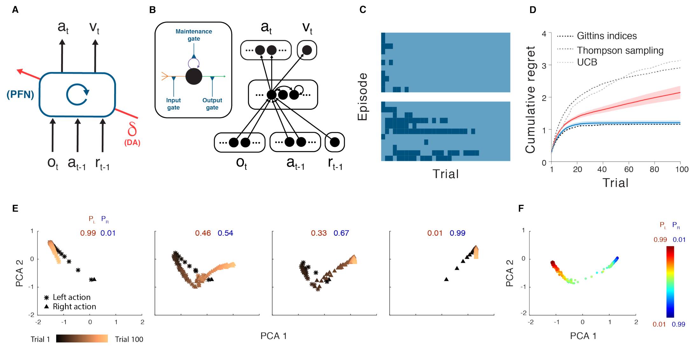

# 3 2018 PFC - MetaRL

- **Warning: the original paper (text below) is very unclear about how the algorithm actually works or how it is implemented by the brain, so I will make another custom note instead**

- [Prefrontal cortex as a meta-reinforcement learning system](https://www.biorxiv.org/content/10.1101/295964v2.full.pdf)

## Abstract

- Over the past twenty years, neuroscience research on reward-based learning has converged on a canonical model, under which the neurotransmitter dopamine ‘stamps in’ associations between situations, actions and rewards by modulating the strength of synaptic connections between neurons.
    - However, a growing number of recent findings have placed this standard model under strain. 
    - In the present work, we draw on recent advances in artificial intelligence to introduce a new theory of reward-based learning. 
    - Here, the dopamine system trains another part of the brain, the prefrontal cortex, to operate as its own free-standing learning system. 
    - This new perspective accommodates the findings that motivated the standard model, but also deals gracefully with a wider range of observations, providing a fresh foundation for future research.

## Introduction

- Exhilarating (令人极度兴奋的) advances have recently been made toward understanding the mechanisms involved in reward-driven learning. 
    - This progress has been enabled in part by the importation of ideas from the field of reinforcement learning (RL). 
    - Most centrally, this input has led to an RL-based theory of dopaminergic function. 
    - Here, phasic dopamine (DA) release is interpreted as conveying a reward prediction error (RPE) signal, an index of surprise which figures centrally in temporal-difference RL algorithms. 
    - **Under the theory, the RPE drives synaptic plasticity in the striatum, translating experienced action-reward associations into optimized behavioral policies.** 
    - Over the past two decades, evidence has steadily mounted for this proposal, establishing it as the standard model of reward-driven learning.

- However, even as this standard model has solidified, a collection of problematic observations has accumulated. 
    - One quandary (困境) arises from research on prefrontal cortex (PFC). 
    - **A growing body of evidence suggests that PFC implements mechanisms for reward-based learning, performing computations that strikingly resemble those ascribed (归咎于) to DA-based RL.** 
    - It has long been established that sectors of the PFC represent the expected values of actions, objects and states. 
    - More recently, it has emerged that PFC also encodes the recent history of actions and rewards. 
    - The set of variables encoded, along with observations concerning the temporal profile of neural activation in the PFC, has led to the conclusion that “PFC neurons dynamically encode conversions from reward and choice history to object value, and from object value to object choice”. 
    - **In short, neural activity in PFC appears to reflect a set of operations that together constitute a self-contained RL algorithm.**

- Placing PFC beside DA, we obtain a picture containing two full-fledged RL systems, one utilizing activity-based representations and the other synaptic learning. 
    - What is the relationship between these systems? 
    - If both support RL, are their functions simply redundant? 
    - **One suggestion has been that DA and PFC subserve different forms of learning**, 
        - with **DA implementing model-free RL**, based on direct stimulus-response associations, 
        - and **PFC performing model-based RL**, which leverages internal representations of task structure. 
    - However, an apparent problem for this dual-system view is the repeated observation that DA prediction-error signals are informed by task structure, reflecting “inferred” and “model-based” value estimates that are difficult to square with the standard theory as originally framed.

### A New Formulation

- Figure 1. 
    - A. Agent architecture. 
        - The prefrontal network (PFN), including sectors of the basal ganglia and the thalamus that connect directly with PFC, is modeled as a **recurrent neural network**, with synaptic weights adjusted through an RL algorithm driven by DA. 
            - $o$ = perceptual input, 
            - $a$ = action, 
            - $r$ = reward, 
            - $v$ = state value, 
            - $t$ = timestep, 
            - $\delta$ = RPE. 
        - The central box denotes a single, fully connected set of **LSTM** units. 
    - B. A more detailed schematic of the neural network implementation used in our simulations. 
        - Input units encoding the current observation, and previous action and reward connect all-to-all with hidden units, which are themselves fully connected **LSTM** units. 
        - These units connect all-to-all, in turn, with a **softmax** layer (see Methods) coding for actions, and a single linear unit coding for estimated state value.
        - Inset: A single **LSTM** unit. 
        - Input (orange) is a weighted sum of other unit outputs, plus the activity of the **LSTM** unit itself (purple). 
        - Output (green) puts these summed inputs through a sigmoid non-linearity. 
        - All three quantities are multiplicatively gated (blue). 
        - **Full details, including relevant equations are presented in Methods.**
    - C. Trial-by-trial model behavior on bandit problems with Bernoulli (arm 1, arm 2) reward parameters 0.25, 0.75 (top), 0.6, 0.4 (bottom). 
        - Contrasting colors demark left versus right actions. 
        - The network shifts from exploration to exploitation, making this transition more slowly in the more difficult problem. 
    - D. Performance for the meta-RL network trained on bandits with independently, identically distributed arm parameters, and tested on 0.25, 0.75 (red), measured in terms of cumulative regret, defined as the cumulative loss (in expected rewards) suffered when playing sub-optimal (lower-reward) arms. 
        - Performance of several standard machine-learning bandit algorithms is plotted for comparison.
        - Blue: Performance on the same problem after training on correlated bandits (parameters always summed to 1). 
    - E. Evolution of RNN activation pattern during individual trials while testing on correlated bandits, after training on problems from the same distribution. 
        - PL= probability of reward for action left. 
        - PR= probability of reward for action right. 
    - F. RNN activity patterns from step 100 in the correlated bandit task, across a range of payoff parameters. 
        - Further analyses are presented in Supplementary Figure 1. 
        - Analysis done for 300 evaluation episodes, each consisting of 100 trials, performed by 1 fully trained network.

- In the present work we offer a new perspective on the computations underlying reward-based learning, one that accommodates the findings that motivated the existing theories reviewed above, but which also resolves many of the prevailing quandaries (普遍存在的困境). 
    - On a wider level, the theory suggests a coherent explanation for a diverse range of findings previously considered unconnected.

- We begin with three key premises (前提):
    1. **System architecture**: In line with previous work, we conceptualize the **PFC**, together with the **basal ganglia** and **thalamic nuclei** with which it connects, as forming a **recurrent neural network**. 
        - This network’s inputs include **perceptual data**, which either contains or is accompanied by information about **executed actions and received rewards**. 
        - On the output side, the network **triggers actions** and, additionally, **emits estimates of state value** (Figure 1A,B).
    2. **Learning**: As suggested in past research, we assume that the synaptic weights within the **prefrontal network**, including its **striatal** components, are adjusted by a **model-free RL** procedure, within which DA conveys a RPE signal. 
        - Via this role, the DA-based RL procedure shapes the activation dynamics of the recurrent prefrontal network.
    3. **Task environment**: Following past proposals, we assume that RL takes place not on a single task, but instead in a dynamic environment posing a series of interrelated tasks. 
        - The learning system is thus required to engage in ongoing inference and behavioral adjustment.

- **As indicated, these premises are all firmly grounded in existing research. The novel contribution of the present work is to identify an emergent effect that results when the three premises are concurrently satisfied.**
    - As we will show, these conditions, when they co-occur, are sufficient to produce a form of **meta-learning, where one learning algorithm gives rise to a second, more efficient learning algorithm**. 
    - Specifically, by adjusting the connection weights within the prefrontal network, DA-based RL creates a second RL algorithm, implemented entirely in the prefrontal network’s activation dynamics. 
    - This new learning algorithm is independent of the original one, and differs in ways that are suited to the task environment. 
    - Crucially, the emergent algorithm is a full-fledged RL procedure: 
        - It copes with the exploration-exploitation tradeoff, 
        - maintains a representation of the value function, and 
        - progressively adjusts the action policy. 
    - In view of this point, and in recognition of some precursor research, we refer to the overall effect as meta-reinforcement learning.

### Meta-reinforcement learning: An illustrative example

- For demonstration, we leverage the simple model shown in Figure 1A, a recurrent neural network (Figure 1B) whose weights are trained using a model-free RL algorithm (see Algorithm 1 and Methods), exploiting recent advances in deep learning research. 
    - We consider this model’s performance in a simple ‘two-armed bandit’ RL task. 
    - On each trial, the system outputs an action: left or right. 
    - Each has a probability of yielding a reward, but these probabilities change with each training episode, thus presenting a new bandit problem. 
    - After training on a series of problems, the weights in the recurrent network are fixed, and the system is tested on further problems. 
    - Figure 1C,D illustrates its performance. 
    - The network explores both arms, gradually honing in on the richer one, learning with an efficiency that rivals standard machine-learning algorithms.

- Because the weights in the network were fixed at test, the system’s learning ability cannot be attributed to the RL algorithm that was used to tune the weights. 
    - Instead, learning reflects the activation dynamics of the recurrent network. 
    - As a result of training, these dynamics implement their own RL algorithm, integrating reward information over time, exploring, and refining the action policy (see Figure 1E,F and Supplementary Figure 1). 
    - This learned RL algorithm not only functions independently of the algorithm that was originally used to set the network weights; it also differs from that original algorithm in ways that make it specially adapted to the task distribution on which the system was trained. 
    - An illustration of this point is presented in Figure 1D, which shows performance of the same system after training on a structured version of the bandit problem, where the arm parameters were anti-correlated across episodes. 
    - Here, the recurrent network converges on an RL algorithm that exploits the problem’s structure, identifying the superior arm more rapidly than in the unstructured task. 

### Neuroscientific Interpretation

- Having introduced meta-RL in abstract computational terms, we now return to its neurobiological interpretation. 
    - This starts by **regarding the prefrontal network, including its subcortical components, as a recurrent neural network.** 
    - **DA, as in the standard model, broadcasts an RPE signal, driving synaptic learning within the prefrontal network.** 
    - **The principal role of this learning is to shape the dynamics of the prefrontal network by tuning its recurrent connectivity.** 
    - Through meta-RL, these dynamics come to implement a second RL algorithm, which differs from the original DA-driven algorithm, assuming a form tailored to the task environment. 
    - The role of DA-driven RL, under this account, plays out across extended series of tasks. 
    - Rapid within-task learning is mediated primarily by the emergent RL algorithm inherent in the dynamics of the prefrontal network. 

## Results

- Simulation 1. Reinforcement learning in the prefrontal network
- Simulation 2. Adaptation of prefrontal-based learning to the task environment
- Simulation 3. Reward prediction errors reflecting inferred value
- Simulation 4. ‘Model-based’ behavior: The Two-Step Task
- Simulation 5. Learning to learn 
- Simulation 6. The role of dopamine: Effects of optogenetic manipulation
- Functional Neuroanatomy

## Discussion

## Methods

### Architecture and Learning Algorithm

- All of our simulations employed a common set of methods, with minor implementational variations. 
    - The agent architecture centers on a fully connected, gated recurrent neural network (LSTM). 
    - In all experiments except where specified, the input included 
        - the observation, 
        - a scalar indicating the reward received on the preceding time-step, and 
        - a one-hot representation of the action taken on the preceding time-step. 
    - The outputs consisted of 
        - a scalar baseline (value function) and 
        - a real vector with length equal to the number of available actions. Actions were sampled from the softmax distribution defined by this vector. 
    - Some other architectural details were varied as required by the structure of different tasks (see simulation-specific details below). 
    - [Reinforcement learning was implemented by **A3C (Asynchronous Advantage Actor-Critic)**, as detailed in Mnih et al. Details of training, including the use of **entropy regularization** and a combined policy and value estimate loss, are described in Mnih et al.](https://arxiv.org/pdf/1602.01783)
    - In brief, the gradient of the full objective function is the weighted sum of the policy gradient, the gradient with respect to the state-value function loss, and an entropy regularization term, defined as follows:

$$
\nabla L = 
\underbrace{ \delta_t \nabla_\theta \log \pi_t }_\text{policy}
+ \beta_V \underbrace{ \delta_t \nabla_\phi V }_\text{V func}
+ \beta_e \underbrace{ \nabla_\theta H(\pi_t) }_\text{entropy} \\[5pt]
\pi_t := \pi_\theta(a_t|s_t) \\[5pt]
\delta_t := R_t - V_\phi(s_t) \\[5pt]
R_t := \left[ \sum_{i=0}^{k-1} \gamma^i r_{t+i} \right] + \gamma^k V_\phi(s_{t+k}) 
$$

- where $a_t$, $s_t$, and $R_t$ define the action, state, and discounted n-step bootstrapped return at time $t$ (with discount factor $\gamma$), $k$ is the number of steps until the next terminal state and is upper bounded by the maximum unroll length $t_\text{max}$, $\pi$ is the policy (parameterized by neural network parameters $\theta$), $V$ is the value function (parameterized by $\phi$), estimating the expected return from state $s$, $H(\pi)$ is the entropy of the policy, and $\beta_V$ and $\beta_e$ are hyperparameters controlling the relative contributions of the value estimate loss and entropy regularization term, respectively. 
    - $\delta_t$ is the n-step return **TD-error that provides an estimate of the advantage function** for actor-critic. 
    - The parameters of the neural network were updated via gradient descent and backpropagation through time, using advantage actor-critic as detailed in Mnih et al. 
    - Note that while the parameters $\theta$ and $\phi$ are being shown as separate, as in Mnih et al., **in practice they share all non-output layers and differ only in the softmax output for the policy and one linear output for the value function.** 
    - Simulations 1-4 and 6 used a single thread and received discrete observations coded as one-hot vectors, with length of the number of possible states (see Algorithm 1 for pseudocode for single-threaded advantage actor-critic). 
    - Simulation 5 used 32 asynchronous threads during training and received RGB frames as input (see Mnih et al. for **asynchronous multi-threaded algorithm** and pseudocode). 
    - The core recurrent network consisted of **48 LSTM units** in simulations 1-4, **256 units** in simulation 5, and **two separate LSTMs of 48 units each** (for policy and value) in simulation 6 (see below).

---

- In a standard non-gated recurrent neural network, the state at time step $t$ is a linear projection of the state at time step $t–1$, followed by a nonlinearity. 
    - **This kind of “vanilla” RNN can have difficulty with long-range temporal dependencies because it has to learn a very precise mapping just to copy information unchanged from one time state to the next.** 
    - **An LSTM, on the other hand, works by copying its internal state (called the “cell state”) from each time step to the next.Rather than having to learn how to remember, it remembers by default.** 
    - However, it is also able to 
        - choose to forget, using a **“forget” (or maintenance) gate**, and to 
        - choose to allow new information to enter, using an **“input gate”**. 
        - Because it may not want to output its entire memory contents at each time step, there is also an **“output gate”** to control what to output. 
    - Each of these gates are modulated by a learned function of the state of the network.

- More precisely, the dynamics of the LSTM were governed by standard equations:

$$
\text{input: } x_t \\[5pt]
{\color{gray} \text{define linear op: } L_y := W_{xy} x_t + W_{hy} h_{t-1} + b_y }\\[5pt]
{\color{gray} \text{define gate op: } G_y := \text{sigmoid}(L_y)} \\[5pt]
\text{cell state: } c_t = \underbrace{G_m}_\text{maintenance} \odot c_{t-1} + \underbrace{G_i}_\text{input} \odot \tanh(L_c) \\[5pt]
\text{hidden state: } h_t = \underbrace{G_o}_\text{output} \odot \tanh(c_t)
$$

### General task structure

- Tasks were episodic, comprising a set number of trials (fixed to a constant number per episode unless otherwise specified), with task parameters randomly drawn from a distribution and fixed for the duration of the episode. 
    - In simulations 1, 3, 4 and 6, each trial began with a fixation cue, requiring a distinct central fixation response ($a_c$), followed by one or more stimulus cues, each requiring a stimulus response (either left, $a_L$, or right, $a_R$).
    - Failure to produce a valid response to either the fixation or stimulus cues resulted in a reward of -1. 
    - In simulation 5, which involved high dimensional visual inputs, fixation and image selection required emitting left-right actions continuously to shift the target to within the center of the field of view. 
    - An additional no-op action was provided to allow the agent to maintain fixation as necessary, and no negative reward was given for producing invalid actions.
    - See simulation-specific methods for more details.

### Training and testing

- Both training and testing environments involved sampling a task from predetermined task distributions — in most cases sampling randomly, although see Simulations 1 and 2 for principled exceptions — with the LSTM hidden state initialized at the beginning of each episode (initial state learned for simulations 1-4 and 6; initialized to 0 for simulation 5). 
    - Unless otherwise noted, training hyperparameters (as defined in Mnih et al.) were as follows: 
        - learning rate = 0.0007, 
        - discount factor = 0.9, 
        - state-value estimate cost $\beta_V$ = 0.05, and 
        - entropy cost $\beta_e$ = 0.05. 
    - Weights were optimized using Shared **RMSProp** and backpropagation through time, which involved unrolling the recurrent network a fixed number of timesteps that ranged from $t_\text{max}$ = 100-300 depending on task, and determined the number of steps when calculating the bootstrapped n-step return. 
    - The agent was then evaluated on a testing episodes, during which all network weights were held fixed. 
    - No parameter optimization was undertaken to improve fits to data, beyond the selection of what appeared to be sensible a priori values, based on prior experience with related work, and minor adjustment simply to obtain robust task acquisition.

- We now detail the simulation-specific task designs, hyperparameters, and analyses. 
    - Note that details of the simulations reported in the introductory two-armed bandit simulations were drawn from Wang et al.

- Simulation 1. Reinforcement learning in the prefrontal network.
- Simulation 2. Adaptation of prefrontal-based learning to the task environment. 
- Simulation 3. Reward prediction errors reflecting inferred value.
- Simulation 4. ‘Model-based’ behavior: The Two-Step Task.
- Simulation 5. Learning to learn. 
- Simulation 6. The role of dopamine: Effects of optogenetic manipulation.
