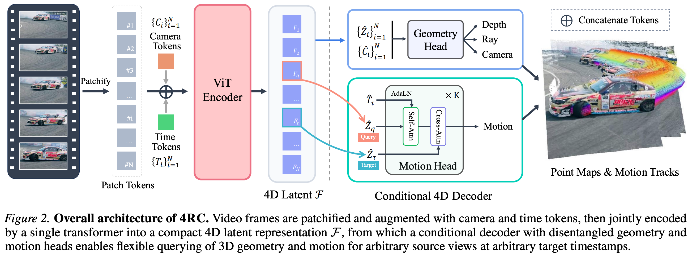

# 4 2026 NTU 4RC

- [4RC: 4D Reconstruction via Conditional Querying Anytime and Anywhere](https://arxiv.org/pdf/2602.10094)
- https://github.com/Luo-Yihang/4RC

## Abstract

- We present 4RC, a unified **feed-forward framework** for 4D reconstruction from **monocular videos**. 
    - Unlike existing methods that typically decouple motion from geometry or produce limited 4D attributes, such as sparse trajectories or two-view scene flow, 4RC learns a holistic 4D representation that jointly captures dense scene geometry and motion dynamics. 
    - At its core, 4RC introduces a novel encode-once, query-any-where and anytime paradigm: **a transformer backbone encodes the entire video into a compact spatial-temporal latent space, from which a conditional decoder can efficiently query 3D geometry and motion for any query frame at any target timestamp.** 
    - To facilitate learning, we represent per-view 4D attributes in a minimally factorized form, decomposing them into base geometry and time-dependent relative motion. 
    - Extensive experiments demonstrate that 4RC outperforms prior and concurrent methods across a wide range of 4D reconstruction tasks. 

## 1. Introduction

- 3D reconstruction has seen remarkable progress over the past decades. 
    - Classical geometric pipelines such as Structure-from-Motion (SfM, 2016) and Multi-View Stereo (MVS, 2019) established a solid foundation.
    - More recently, learning-based approaches, exemplified by **DUSt3R-like** point-map predictor have enabled direct feed-forward inference of dense 3D geometry, advancing general-purpose 3D perception in terms of efficiency, scalability, and generalization.

- Despite this progress, existing approaches largely focus on static geometry, while real-world scenes are inherently dynamic. 
    - A truly general visual perception system must therefore reason not only about 3D structure, but also about how the scene evolves over time. 
    - This motivates the task of 4D reconstruction, which aims to jointly model 3D geometry and motion. 
    - Such a representation is fundamental for applications ranging from video synthesis and scene understanding to robotics, where reasoning about object trajectories, deformations, and interactions is essential.

- Existing approaches to 4D reconstruction, however, remain fragmented and limited in flexibility. 
    - A common strategy decomposes the problem into sequential subtasks, typically separating motion estimation from 3D reconstruction.
    - For example, `SpatialTracker` (2025) performs reconstruction and tracking in a staged manner, relying on iterative refinement, and producing only sparse 3D trajectories. 
    - `MonST3R` (2025) further requires post-hoc optimization to establish correspondences across time. 
    - Although recent feed-forward methods such as `ST4RTrack` (2025) and `Dynamic Point Map` (2025) pioneer direct 4D prediction, they are restricted to pairwise views and thus struggle to model long-term and complex motion. 
    - Concurrently, `TraceAnything` (2025) represents motion using Bezier curves, enabling long-range 3D trajectory tracking, but often at a cost of reduced geometry quality. 
    - `Any4D` (2025) supports feed-forward 3D reconstruction, but only predicts scene flow for the first frame and is unable to model 3D motion for the remaining frames. 
    - `V-DPM` (2026) extends `VGGT` to 4D, but suffers from slow inference and limited flexibility at inference.

- Motivated by these limitations, we investigate whether a unified, feed-forward model can enable complete and flexible 4D prediction. 
    - In this work, we propose `4RC`, a unified feed-forward approach for 4D reconstruction from monocular videos. 
    - Unlike previous approaches that require multiple stages, 4RC learns a holistic and compact 4D representation that jointly encodes scene geometry and motion across the entire video sequence. 
    - This representation serves as a centralized 4D latent from which geometry and motion can be efficiently queried and decoded. 
    - Instead of directly reconstructing a full 3D point cloud for each frame at each timestamp, we adopt a compact factorized output formulation. 
    - Specifically, we represent each frame with a view-point-invariant base geometry together with time-dependent relative motion, parameterized as 3D displacements. 
    - By querying the model at different timestamps, 4RC can recover both geometry and motion information, such as point trajectories between any frame and any target time. 
    - This design enables both flexible and efficient 4D reconstruction.

- Our contributions can be summarized as follows:
    - A unified feed-forward transformer framework for 4D reconstruction from monocular videos, which jointly models 3D geometry and motion within a single network, eliminating the need for auxiliary estimators or per-scene optimization.
    - An encode-once, query-anywhere and anytime paradigm built upon a compact 4D latent representation. This allows our conditional decoder to flexibly retrieve dense 3D geometry and motion for arbitrary query frames at any target timestamp.
    - A minimally factorized 4D representation that decomposes each frame into a viewpoint-invariant base geometry and time-dependent relative motion, enabling unified and flexible reconstruction of dynamic scenes.

- Extensive experiments demonstrate that 4RC achieves competitive performance on standard benchmarks across a wide range of 3D and 4D reconstruction tasks, including 
    - camera pose estimation, 
    - video depth prediction, 
    - point cloud reconstruction, 
    - 3D point tracking, and 
    - dense motion modeling.

## 2. Related Work

### Feed-forward 3D Reconstruction. 

- Reconstructing 3D geometry from 2D images is a long-standing problem in computer vision. 
    - Traditional pipelines such as `SfM` (2016) and `MVS` (2019) recover camera parameters and dense geometry through multi-stage optimization, achieving strong performance but at high computational cost. 
    - Recent work has shifted toward **feed-forward 3D reconstruction**, aiming to replace these complex pipelines with a single neural network that directly predicts 3D attributes.
    - `DUSt3R` (2024) demonstrates that dense stereo reconstruction can be achieved in one forward pass, while `VGGT` (2025) further unifies camera pose estimation and depth prediction across multiple views using a transformer backbone. 
    - These methods highlight that, given sufficient data and model capacity, feed-forward architectures can effectively solve static 3D reconstruction.
    - Extensions to dynamic settings, such as `MonST3R` (2025), `Pi3` (2025), `DA3` (2025) and related approaches, jointly estimate camera parameters and per-frame geometry from dynamic data. 
    - **Despite operating on dynamic scenes, these methods only reconstruct geometry for each view and thus require separate pipelines to explicitly model 3D motion or temporal correspondence.**

### Point Tracking. 

- Modeling motion over time has traditionally been studied through `optical flow` and `point tracking` 
    - `Optical flow methods` estimate dense pixel-wise displacements between adjacent frames. 
    - These methods are typically limited to short temporal windows and often suffer from drift errors when applied to long video sequences. 
    - To address long-range correspondence, 2D point tracking methods aim to track sparse points across entire videos. 
    - `PIPs` (2022) introduced a deep tracking framework for point tracking, followed by `TAP-Net` (2022), `TAPIR` (2023), and `CoTracker` (2023), which rely on correlation-based matching and iterative updates to propagate tracks over time. 
    - These approaches operate purely in 2D and typically depend on carefully designed matching and update mechanisms. 
    - Recent 3D point tracking approaches extend this paradigm by decoupling geometry reconstruction from motion modeling. 
    - `SpatialTracker` (2024), and subsequent methods combine a pre-trained depth estimator with a lifted 2D tracking pipeline (2023) to operate in 3D. 
    - Despite enabling 3D tracking, their multi-stage pipelines remain limited in efficiency and flexibility, and they do not learn a unified spatiotemporal representation. 
    - **In contrast, 4RC directly models dense geometry and motion jointly within a unified feed-forward framework, without decoupled stages or tracking heuristics.**

### 4D Reconstruction.

- The goal of 4D reconstruction is to recover a representation that captures both the 3D structure of a scene and how it evolves over time. 
    - Early methods typically formulate this problem as **test-time optimization**, which can produce high-quality results but requires **costly per-scene optimization.** 
    - Recent efforts have gradually **shifted toward feed-forward formulations** of 4D reconstruction. 
    - `St4RTrack` (2025) predicts point maps for pairs of views, jointly encoding static geometry and dynamic motion; however, its pairwise formulation inherently limits the temporal range of the reconstruction.

- We also acknowledge several recent concurrent works that explore feed-forward formulations for 4D reconstruction.
    - `TraceAnything` (2025) represents scenes using continuous trajectory fields parameterized by `Bezier curves`. 
        - Although this formulation enables smooth and long-range motion modeling, it often struggles to represent complex or high-frequency dynamics and may compromise geometric accuracy. 
    - `Any4D` (2025) jointly predicts scene flow and 3D geometry from a canonical reference view, but lacks the flexibility to infer motion originating from arbitrary viewpoints. 
    - Similarly, `V-DPM` (2026) extends `VGGT` to dynamic settings, but relies on an inflexible decoding scheme that aggregates information from all views, leading to high computational costs.

---

- **Concurrently, `D4RT` (2025) introduces a unified model for 2D and 3D point tracking.** 
    - **Specifically, D4RT first encodes the entire video into a global scene representation using a self-attention encoder,** 
    - **and then answers spatio-temporal per-point queries through a lightweight cross-attention decoder.**

- **Likewise, our method, 4RC, employs a flexible query-based decoder that efficiently recovers complete and dense 4D attributes for any view at any timestamp**, 
    - **without expensive per-point computation.**

## 3. Method

- Our goal is to develop a unified and feed-forward model, 4RC, that takes a monocular video as input and reconstructs the full underlying 4D attributes of the scene. 
    - The core of our approach lies in encoding the entire video sequence into a compact 4D representation, which can then be queried on-demand to decode the geometry and motion of any query frame at any target timestamp, as illustrated in Figure 2.

### 3.1. Problem Formulation

- Given a monocular video sequence $V = \{I_i\}_{i=1}^N$, where $I_i \in R^{H\times W\times 3}$ denotes the RGB frame captured at timestamp $t_i$ and $N$ is the total number of frames, our goal is to recover the full 4D attributes of the scene, capturing both its 3D structure and temporal evolution. 

- Specifically, for any query frame $I_i$ and an arbitrary target timestamp $\tau \in \{t_i\}_{i=1}^N$, we define a time-indexed 3D point map:

$$ P_i^{t_i \to \tau} \in R^{H\times W\times 3} $$

- which represents the **3D positions of points observed in frame $I_i$ as they appear at time $\tau$**. 
    - When $\tau = t_i$, $P_i^{t_i \to \tau}$ corresponds to the static 3D geometry of the frame. 
    - When $\tau \ne t_i$, it describes the dynamic time-dependent point maps of the scene by **mapping the points from the source frame to their locations at the target time.**

#### Factorized 4D Attributes. 

- Directly predicting point maps $P_i^{t_i \to \tau}$ for all possible $(i, \tau)$ pairs is redundant and intractable (棘手). 
    - Once the underlying 3D geometry at the source time is known, the geometry at other times can be expressed through **relative motion**. 
    - We therefore adopt a factorized representation:

$$ P_i^{t_i \to \tau} = P_i^{t_i} + \Delta P_i^{t_i \to \tau} $$

- where $P_i^{t_i}$ denotes the base 3D geometry at time $t_i$, and $\Delta P_i^{t_i \to \tau}$ represents the 3D displacement from time $t_i$ to $\tau$

- This formulation offers both conceptual and practical advantages. 
    - The base geometry $P_i^{t_i}$ is **reconstructed from image $I_i$ under the perspective camera model**, a property that allows us to directly leverage recent advances of effective geometry representation in monocular 3D reconstruction (Lin et al., 2025).
    - Meanwhile, the displacement field $\Delta P_i^{t_i \to \tau}$  explicitly captures temporal motion. 
    - This provides clear motion cues that are useful for downstream applications, while avoiding the need to re-predict complex geometry at every time step. 
    - As a result, the representation remains temporally consistent, especially in static regions and under rigid motion. 
    - **Unless otherwise stated, all point maps are viewpoint-invariant and expressed in a world coordinate system defined by the camera of the first frame**

#### Relation with Other Work. 

- The key distinction between 4RC and several prior or concurrent approaches lies in the flexibility and completeness of our 4D output. 
    - Recent feed-forward 3D reconstruction methods focus solely on predicting the base 3D geometry for each input frame, i.e., $P_i^{t_i}$, and thus fail to capture the motion within the scene.
    - Traditional 3D point tracking methods, on the other hand, estimate sparse trajectories initialized from selected points and therefore cannot recover dense 4D geometry. 
    - Concurrent feed-forward 4D reconstruction methods also exhibit limitations in motion modeling. 
    - `St4RTrack` is restricted to pairwise motion. 
    - `TraceAnything` models trajectory fields using Bezier curves, which limits its ability to capture accurate geometry and complex motion. 
    - `Any4D` predicts motion only relative to the first frame, i.e., $P_1^{t_1 \to \tau}$ with $\tau \in \{t_i\}_{i=1}^N$, and therefore cannot support motion queries from other source frames. 
    - `V-DPM` regresses the point map $P_i^{t_i \to \tau}$ for all source frames $i \in \{1, ..., N\}$ at a given target timestamp $\tau$, by attending to all frames jointly, which incurs substantial computational overhead and limits inference flexibility. 

- In contrast, `4RC` enables flexibly querying dense 3D motion from any single source frame to any target timestamp within a unified and fully feed-forward framework.

### 3.2. 4D Representation Encoder

- The encoder $E$ processes the input video $V$ to produce a unified 4D representation:

$$ F = \{F_i\}_{i=1}^N = E(V) \\[5pt]
F_i = \{\hat{Z}_{i,j}\}_{j=1}^M \cup \{\hat{C}_i\} \cup \{\hat{T}_i\} \\[5pt]
\begin{cases}
\hat{Z}_{i,j} & \text{patch tokens} \\
\hat{C}_i & \text{camera token} \\
\hat{T}_i & \text{time token} \\
\end{cases}
 $$

- We adopt a plain **ViT-based transformer** architecture that **alternates between frame-wise self-attention and global self-attention.** 

- Similar to the camera token in `VGGT`, which primarily encodes camera geometry information for subsequent decoding, we further append each view’s patchified tokens with a dedicated time token $T_i$. 
    - This time token aggregates temporal information for that view and serves as a conditioning signal for target-time motion decoding, as described in Section 3.3. 
    - The encoder produces a unified spatio-temporal latent representation $F = \{F_i\}_{i=1}^N$
    - Each $F_i = \{\hat{Z}_{i,j}\}_{j=1}^M \cup \{\hat{C}_i\} \cup \{\hat{T}_i\}$ consists of $M$ patch tokens $\hat{Z}_{i,j} \in R^D$ corresponding to the $i$-th frame, together with an encoded camera token $\hat{C}_i$ and a time token $\hat{T}_i$. 
    - We treat $F$ as an ordered sequence of frame-level token sets.

### 3.3. Conditional 4D Decoder

#### Geometry Head. 

- To recover the base geometry for each input frame, we use a geometry decoder $D_g$. 
    - Given the encoded spatial tokens $\hat{Z}_i$ and camera tokens $\hat{C}_i$, the geometry decoder predicts per-frame depth and rays, together with camera parameters:

$$ \left( \hat{D}_i, \hat{R}_i, \hat{\theta}_i \right) = D_g \left( \hat{Z}_i, \hat{C}_i \right) \\[5pt]
\begin{cases}
\hat{D}_i \in R^{H\times W} & \text{depth map} \\
\hat{R}_i \in R^{ {1\over2}H \times {1\over2} W \times 6 } & \text{ray map} \\
\hat{\theta}_i & \text{camera parameters} \\
\end{cases} $$

- The base point map $P_i^{t_i}$ is then obtained from $(\hat{D}_i, \hat{R}_i, \hat{\theta}_i)$ under the perspective camera model. 

- The geometry decoder $D_g$ follows a `dual-DPT` design with a lightweight camera head

#### Motion Head. 

- To recover motion for any query frame $I_q$ at a target timestamp $\tau$, we use a lightweight transformer based motion decoder $D_m$ with $K$ layers of alternating self-attention and cross-attention. 
    - We initialize the query tokens $\hat{Z}_q$ from the encoder output $F$. 
    - The decoder outputs a dense 3D displacement field:

$$ \Delta \hat{P}_q^{t_q \to \tau} = D_m \left( \hat{Z}_q, \hat{T}_\tau, \hat{Z}_\tau \right) $$

- Specifically, to condition on the target time, we inject time embedding $\hat{T}_\tau$ via **Adaptive Layer Normalization (AdaLN)** in the self-attention blocks, and then apply cross-attention to the target spatial token set $\hat{Z}_\tau$
- This design supports dense motion estimation and point tracking while remaining compatible with our per-frame geometry decoding.

- **Study note**: [Adaptive Layer Normalization (AdaLN)](https://arxiv.org/pdf/2212.09748)    

    $$ \text{AdaLN}(x, c) = \gamma(c) \odot  {x - \mu \over \sigma}  + \beta(c) \\[5pt]
    c: \text{ context} $$

### 3.4. Training Scheme

- We train 4RC in an end-to-end manner with joint supervision over geometry and motion attributes. 
    - Following prior works, we normalize the ground-truth scene scale such that the average Euclidean distance of all valid 3D points to the origin is $1$. 
    - The overall training objective is defined as:

$$ L = L_\text{depth} + L_\text{ray} + L_\text{cam} + L_\text{motion} $$

- For all loss terms except the camera parameter loss $L_\text{cam}$, we adopt an **aleatoric (偶然性) uncertainty formulation**. 
    - We denote the loss function as $l(\hat{y}, y, \Sigma)$, where $\Sigma$ represents the **predicted pixel-wise uncertainty map**, which **adaptively down-weights unreliable regions during training**.

- To better supervise both geometry and motion, we apply gradient-based constraints in the spatial and temporal domains separately. 
    - For geometry learning, we enforce spatial smoothness on the predicted depth maps $\hat{D} = \{\hat{D}_i\}$ by applying image-space gradients $\nabla_x$. 
    - The depth loss is formulated as:

$$ L_\text{depth} = l(\hat{D}, D, \Sigma_D) + l(\nabla_x\hat{D}, \nabla_x D, \Sigma_D) $$

- Similarly, the motion loss supervises the displacement field $\Delta P$, but we incorporate an additional temporal gradient term $\nabla_t$ that constrains the first-order temporal derivative of the displacement (i.e., velocity) to encourage temporally consistent motion behavior:

$$ L_\text{motion} = l(\Delta \hat{P}, \Delta P, \Sigma_M) + l(\nabla_t \Delta\hat{P}, \nabla_t \Delta P, \Sigma_M) $$

## 4. Experiments

### 4.1. Training Setup

### 4.2. 4D Reconstruction

### 4.3. 3D Reconstruction

### 4.4. Ablation Studies

## 5. Conclusion

- We present 4RC, a unified feed-forward transformer framework for 4D reconstruction from monocular videos. 
    - Central to our approach is a novel encode-once, query-anywhere and anytime paradigm, in which a compact 4D representation of the entire video is learned once and subsequently queried to recover geometry and motion at arbitrary time instances.
    - This paradigm effectively bridges the global spatio-temporal modeling with flexible, on-demand query-based reconstruction, achieving both accurate 4D reconstruction and high efficiency. 
    - Extensive experiments demonstrate that 4RC consistently outperforms prior methods across a wide range of challenging 4D reconstruction benchmarks. 
    - Looking ahead, unified models such as 4RC, which jointly reason about geometry and motion, represent a promising direction toward more general-purpose perceptual systems.
