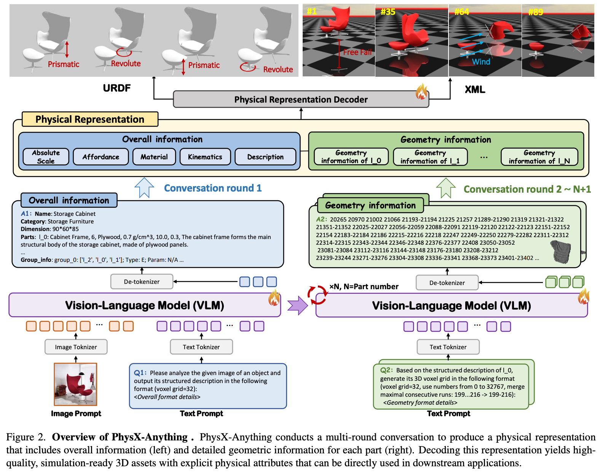
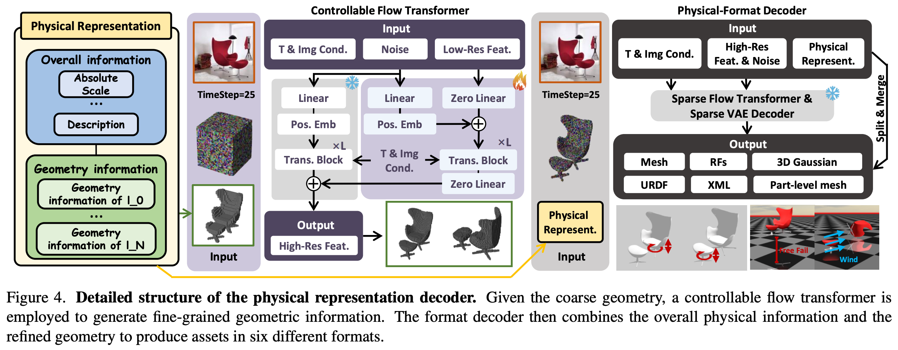

# 5 2025 NTU PhysX-Anything

- [PhysX-Anything: Simulation-Ready Physical 3D Assets from Single Image](https://arxiv.org/pdf/2511.13648)

## Abstract

- 3D modeling is shifting from static visual representations toward physical, articulated (含骨骼关节的) assets that can be directly used in simulation and interaction. 
    - However, most existing 3D generation methods overlook key physical and articulation properties, thereby limiting their utility in **embodied AI**. 
    - To bridge this gap, we introduce PhysX-Anything, the first simulation-ready physical 3D generative framework that, given a single in-the-wild image, produces high quality sim-ready 3D assets with explicit geometry, articulation, and physical attributes. 
    - **Specifically, we propose the first VLM-based physical 3D generative model, along with a new 3D representation that efficiently tokenizes geometry.** 
    - It reduces the number of tokens by 193×, enabling explicit geometry learning within standard VLM token budgets without introducing any special tokens during fine-tuning and significantly improving generative quality.
    - In addition, to overcome the limited diversity of existing physical 3D datasets, we construct a new dataset, PhysXMobility, which expands the object categories in prior physical 3D datasets by over 2× and includes more than 2K common real-world objects with rich physical annotations.
    - Extensive experiments on PhysX-Mobility and in-the-wild images demonstrate that PhysX-Anything delivers strong generative performance and robust generalization. 
    - Furthermore, simulation-based experiments in a **MuJoCo-style** environment validate that our sim-ready assets can be directly used for contact-rich **robotic policy learning.** 
    - We believe PhysX-Anything can substantially empower a broad range of downstream applications, especially in embodied AI and physics-based simulation.

## 1. Introduction

- For a broad range of downstream applications in robotics, embodied AI, and interactive simulation, there is an increasing demand for high-quality physical 3D assets that can be directly executed in simulators. 
    - However, most existing 3D generation methods either focus on global 3D geometry and visual appearance, or on part-aware generation that models object hierarchies and fine grained structures. 
    - Despite their visually impressive performance, the resulting assets typically lack essential physical and articulation information — such as **density, absolute scale, and joint constraints** — which creates a substantial gap to real-world applications and makes these assets difficult to deploy directly in simulators or physics engines.

- In parallel, a few works have started to explore the generation of articulated objects. 
    - Yet, due to the scarcity of large-scale high-quality annotated 3D datasets, many of these methods adopt retrieval-based paradigms:
        - they retrieve an existing 3D model and attach plausible motions, rather than synthesizing fully novel, physically grounded assets. 
    - As a result, they provide only limited articulation information, generalize poorly to in-the-wild images, and still **lack the physical attributes required for realistic simulation.** 
    - While prior efforts attempt to learn deformation behavior for 3D assets, they often impose a homogeneous-material assumption or neglect some essential physical attributes. 
    - Even [**PhysXGen (NTU)**](https://arxiv.org/pdf/2507.12465), which can directly generate physical 3D assets, does not yet support plug-and-play deployment in standard simulators or physics engines, thereby constraining its practical utility for downstream embodied AI and control tasks.

- To bridge the gap between synthetic 3D assets and real downstream applications, **we propose PhysXAnything — the first simulation-ready (sim-ready) physical 3D generative paradigm.** 
    - Given a single in-the-wild image, PhysX-Anything produces a high-quality sim-ready 3D asset, as illustrated in Fig. 1. 
    - Specifically, we introduce the first unified VLM-based generative model that jointly predicts 
        - geometry, 
        - articulation structure, and 
        - essential physical properties. 
    - Meanwhile, to resolve the intrinsic tension between the limited token budget of VLMs and the complexity of detailed 3D geometry, we design **a new 3D representation that tokenizes geometry efficiently** 
        - This representation reduces the number of tokens by 193×, making it feasible to learn explicit geometry directly while avoiding the introduction of special tokens and new tokenizer during fine-tuning. 
    - **Based on the coarse geometry generated by the VLM, we further develop a controllable flow transformer and decoder to synthesize fine-grained geometry and the corresponding `URDF` & `XML` structure**, yielding sim-ready assets that can be directly imported into standard simulators.

- Additionally, to significantly enrich the diversity of existing physically grounded 3D datasets, we build a new dataset, `PhysX-Mobility`, by collecting assets from `PartNet-Mobility` and carefully annotating their physical attributes. 
    - PhysX-Mobility spans 47 categories and covers common real-world objects such as toilets, fans, cameras, coffee machines, and staplers, thereby substantially broadening the category coverage of physical 3D assets. 
    - Comprehensive experiments on PhysX-Mobility, in-the-wild images, and user studies demonstrate that PhysXAnything achieves strong generative quality and robust generalization compared with recent state-of-the-art methods.
    - Furthermore, to validate executability in standard simulators and physics engines, we conduct experiments in a MuJoCo-style simulator, showing that our sim-ready assets can be directly used in robotic policy learning for contact-rich tasks, such as safe manipulation of delicate objects like eyeglasses. 
    - We believe our work opens up new possibilities and directions for future research in 3D generation, embodied AI, and robotics.

- To summarize, our main contributions are:
    - We introduce PhysX-Anything, the first sim-ready physical 3D generative paradigm that, given a single in-the-wild image, produces high-quality sim-ready 3D assets, thereby pushing the frontier of physically grounded 3D content creation and unlocking new possibilities for downstream applications in simulation and embodied AI.
    - We propose a unified VLM-based generative pipeline together with a novel physical 3D representation. Our representation compresses geometry tokens at a high rate while preserving explicit geometric structure, and avoids introducing any special tokens during fine-tuning.
    - We construct a new physically grounded 3D dataset, PhysX-Mobility, which enriches the category diversity of existing physical 3D datasets by over 2×, including **over 2K common real-world objects** such as cameras, coffee machines, and staplers.
    - Through comprehensive evaluations on PhysX-Mobility and in-the-wild images, we demonstrate the strong generative quality and robust generalization of PhysXAnything. 
    - Furthermore, we validate the feasibility of directly deploying our sim-ready assets in simulation environments, thereby empowering downstream applications such as embodied AI and robotic manipulation.

## 2. Related Works

### 2.1. 3D Generative Models

- As one of the earliest paradigms for 3D generation, **generative adversarial networks (GANs)** played a central role in the early stage of this field. 
    - However, they **struggle to maintain stable and robust** generative performance in complex, diverse scenarios. 

- Subsequently, **DreamFusion introduced the SDS loss**, which leverages the strong prior of **2D diffusion models** to achieve **impressive text-driven 3D generation quality**. 
    - Nevertheless, optimization-based methods still suffer from the **multi-face Janus problem** and low optimization efficiency. 

- Recently, **feed-forward methods** have become the **mainstream** in 3D generation due to their favorable efficiency and robustness. 

- Beyond **diffusion based models**, several works introduce **autoregressive** modeling into 3D generation. 

- Motivated by the strong performance of vision–language models (VLMs), **recent approaches have begun to employ VLMs to generate 3D assets.**
    - To limit the token length, LLaMA-Mesh adopts a simplified mesh representation, 
    - upon which MeshLLM builds a part-to-assembly pipeline to further improve generative quality. 
    - Instead of using a simplified mesh representation, ShapeLLM-Omni adopts a 3D VQ-VAE to compress the token sequence length, but at the cost of introducing additional special tokens and a new tokenizer for geometry, which complicates the training procedure.

- In contrast to prior work, to better unlock the potential of VLMs for 3D generation, we propose a new, efficient representation that substantially compresses the token sequence while preserving explicit structural information. 
    - Moreover, our approach introduces no additional special tokens during fine-tuning, thereby avoiding both the need for large-scale task-specific pretraining datasets and the overhead of training a new tokenizer for sim-ready physical 3D generation.

### 2.2. Articulated (含骨骼关节的) and Physical 3D Object Generation

- Articulated object generation has attracted increasing attention due to its wide range of applications. 
    - Most existing methods are **retrieval-based**: they first define a source library and then retrieve meshes from it to construct articulated 3D assets. 
    - Other works adopt graph structured representations, combining the kinematic graph of an articulated object with diffusion models to enable shape generation without texture. 
    - However, these approaches struggle to robustly generalize to novel structures, unseen categories, and complex texture. 
    - DreamArt instead attempts to optimize articulated 3D objects from video generation outputs, but it requires manually annotated part masks and becomes unstable when handling objects with many movable parts. 
    - URDF-Anything can directly generate URDF files. However, it relies on robust point cloud inputs and is hard to generate detailed texture for 3D assets. 
    - Although some works attempt to learn the physical deformation of 3D assets, they either treat all objects as homogeneous or ignore some key physical attributes. 
    - To push 3D generation toward physical realism, PhysXGen first proposes a unified framework that directly generates 3D assets with essential physical properties, including absolute dimension, density, and so on. 
    - Despite its promising performance in physical 3D generation, there remains a substantial gap between the synthesized assets and the requirements of modern physics simulators, resulting in limited direct usability in downstream tasks.

- To fully realize the downstream utility of synthetic 3D assets, we introduce the first 3D generation paradigm that, from a single real-world image, produces high-quality sim-ready 3D assets equipped with explicit physical properties.
    - We compare PhysX-Anything with existing approaches in Table 1, which highlights that our method is the only one that simultaneously supports articulation, physical modeling, strong generalization, and simulation-ready deployment. 
    - We believe that our approach offers a new direction for using synthetic data to empower related applications.

## 3. Methodology

- In this section, we present the detailed paradigm of PhysXAnything, as illustrated in Fig. 3. 
    - It adopts a global-to-local pipeline. 
    - Specifically, given a real-world image, PhysXAnything conducts a multi-round conversation to sequentially generate the overall physical description and the geometric information of each part. 
    - To mitigate context forgetting caused by overly long prompts, we retain only the overall information when generating per-part geometry. 
    - In other words, the geometric descriptions of different parts are generated independently, conditioned solely on the shared overall information. 
    - Finally, by decoding the physical representation, PhysX-Anything can output simulation-ready physical 3D assets in six commonly used formats.

### 3.1. Physical Representation

- Previously, to reduce the token length of raw 3D meshes in VLM-based frameworks, most 3D generation methods adopt text-serialized representations based on vertex quantization. 
    - However, the resulting token sequences remain excessively long. 
    - Although 3D VQ-GAN can further compress geometric tokens, it requires introducing additional special tokens and a customized tokenizer during fine-tuning, which complicates training and deployment.

- To address these limitations, we propose a new 3D representation that substantially reduces token length while preserving explicit geometric structure, without introducing any additional tokenizer. 
    - **Motivated by the impressive tradeoff between fidelity and efficiency of voxel-based representations, we build our representation on voxels.** 
    - Directly encoding high-resolution voxels, however, still yields an unaffordable number of tokens for VLMs, even after mapping geometry to a compressed space. 
    - We therefore adopt a coarse-to-fine strategy for geometry modeling: 
        - **the VLM operates on a $32^3$ voxel grid to capture coarse geometry, while a downstream decoder refines this coarse shape into high-fidelity geometry. In this way, we retain the explicit structural advantages of 3D voxels while avoiding excessive token consumption.** 
    - As shown in Fig. 3, converting meshes to coarse voxels alone reduces the number of tokens by 74×. 
    - To further eliminate redundancy in sparse voxel data, we linearize the $32^3$ grid into indices from 0 to $32^3-1$ and serialize only occupied voxels. 
    - Finally, by **merging neighboring occupied indices and connecting continuous ranges with a hyphen `−`**, we achieve an even higher token compression rate (193×) while maintaining explicit geometric structure.

- For overall information, we adopt a tree-structured, VLM-friendly representation following [PhysX-3D (NTU)](https://arxiv.org/pdf/2507.12465) 
    - Compared with standard `URDF` files, our **JSON-style** format provides richer physical attributes and textual descriptions, thereby facilitating understanding and reasoning by VLMs. 
    - Moreover, to maintain consistency between kinematic structure and geometry, we convert key kinematic parameters into the voxel space, including direction of motion, axis location, motion range, and related articulation properties.

### 3.2. VLM & Physical Representation Decoder

- Building on the above representation for physical 3D assets, **we adopt Qwen2.5 as our foundation model and fine-tune the VLM on our physical 3D datasets.** 

- Through a tailored **multi-round dialogue**, PhysX-Anything then generates both 
    - high-quality global descriptions (overall physical and structural properties) and 
    - local information (part-level geometry). 

- To obtain more detailed geometry, we further design a **controllable flow transformer** inspired by [Stanford ControlNet](https://arxiv.org/pdf/2302.05543). 
    - Built on the flow transformer architecture, we introduce a transformer-based control module that **takes the coarse voxel representation as guidance for the diffusion model**, thereby **steering the synthesis of fine-grained voxel geometry.** 
    - Thus, the training objective of the controllable flow transformer is formulated as:

$$ L_\text{geo} = \mathbb{E}_{t, x_1, \epsilon, c, V^\text{low}} \| f_\theta(x_t, t, c, V^\text{low}) − (x_1 - \epsilon) \|^2 \\[5pt]
\begin{cases}
f_\theta & \text{Controllable Flow Transformer} \\
x_1 & \text{fine-grained voxel target} \\ 
\epsilon & \text{Gaussian noise} \\ 
x_t & := (1 − t)\epsilon + t x_1 \\ 
c & \text{image condition} \\  
V^\text{low} & \text{coarse voxel representation} \\ 
\end{cases}
$$

- **Given the fine-grained voxel representation**, 
    - we adopt a pre-trained structured [**latent diffusion model (Microsoft TRELLIS)**](https://github.com/Microsoft/TRELLIS) to generate 3D assets, including 
        - mesh surfaces, 
        - radiance fields, and 
        - 3D Gaussians. 
    - We then apply a **nearest-neighbor algorithm to segment the reconstructed mesh into part-level components**, conditioned on the voxel assignments. 
    - Finally, by combining the global structural information with the fine-grained voxel geometry, PhysX-Anything can generate `URDF`, `XML`, and part-level meshes for sim-ready physical 3D generation.

## 4. Experiments

### 4.1. Evaluation on PhysX-Mobility

### 4.2. In-the-Wild Evaluation

### 4.3. Ablation Studies

### 4.4. Robotic Policy Learning in Simulation

## 5. Conclusion

- In this paper, we aim to fully unlock the potential of synthesized 3D assets in real-world applications by introducing PhysX-Anything, the first sim-ready physical 3D generative paradigm. 
    - Through a unified VLM-based pipeline and a tailored 3D representation, PhysX-Anything achieves substantial token compression (over 193×) while preserving explicit geometric structure, enabling efficient and scalable physical 3D generation. 
    - In addition, to enrich the diversity of existing physical 3D datasets, we construct PhysXMobility by carefully collecting and annotating common real-world objects with rich physical attributes. 
    - It includes 47 the most common real-life categories with detailed physical attributes. 
    - Comprehensive experiments on PhysX-Mobility and in-the-wild scenarios demonstrate the strong performance and robust generalization of PhysXAnything in sim-ready physical 3D generation. 
    - Furthermore, simulation-based experiments highlight its potential for downstream robotic policy learning. 
    - We believe PhysXAnything will spur new research directions across 3D vision, embodied AI and robotics.
