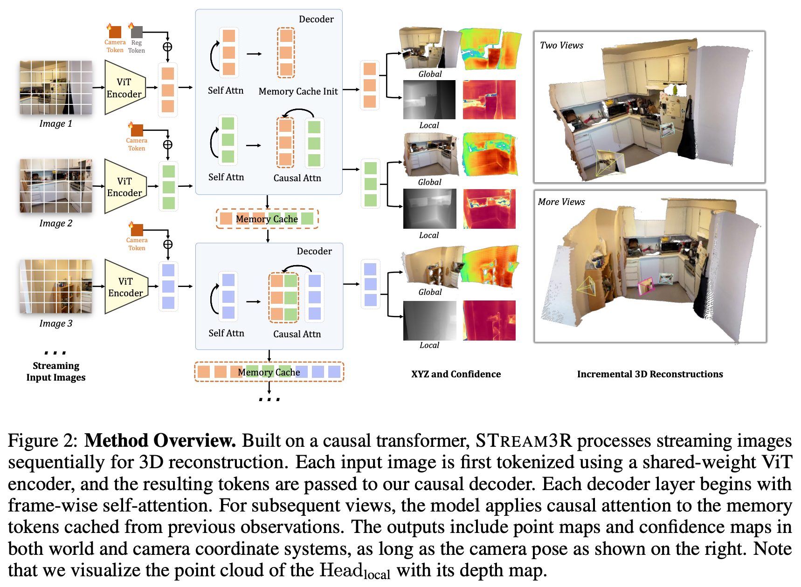

# 6 2025 NTU STREAM3R

- [STREAM3R: Scalable Sequential 3D Reconstruction with Causal Transformer](https://arxiv.org/pdf/2508.10893)
- https://github.com/NIRVANALAN/STream3R

## Abstract

- We present STREAM3R, a novel approach to 3D reconstruction that reformulates **point-map prediction** as a decoder-only Transformer problem. 
    - Existing state-of-the-art methods for multi-view reconstruction either depend on expensive global optimization or rely on simplistic memory mechanisms that scale poorly with sequence length. 
    - In contrast, STREAM3R introduces an streaming framework that processes image sequences efficiently using causal attention, inspired by advances in modern language modeling. 
    - By learning geometric priors from large-scale 3D datasets, STREAM3R generalizes well to diverse and challenging scenarios, including dynamic scenes where traditional methods often fail. 
    - Extensive experiments show that our method consistently outperforms prior work across both static and dynamic scene benchmarks. 
    - Moreover, STREAM3R is inherently compatible with LLM-style training infrastructure, enabling efficient large-scale pretraining and fine-tuning for various downstream 3D tasks. 
    - Our results underscore the potential of causal Transformer models for online 3D perception, paving the way for realtime 3D understanding in streaming environments. 

## 1 Introduction

- Reconstructing detailed 3D geometry from images is the crux in computer vision and serves as the pre-requisite for a series of downstream applications, like autonomous driving, virtual reality, robotics, and more. 
    - While traditional visual-geometry methods like `SfM` and `Multi-view Stereo` tackle this problem by solving a series of sub-problems through handcrafted designs, a recent trend led by `DUSt3R` has demonstrated a promising new way of directly regressing **point clouds** using powerful transformers. 
    - This paradigm, along with its follow-up works including `MASt3R`, `Fast3R`, and `VGG-T`, enables the reconstruction of 3D geometry from a number of input images – ranging from a single image to hundreds – offering a more unified solution to 3D reconstruction.

- While these works focus on processing a fixed set of images, real-world applications often require continuously processing streaming visual input and updating the reconstruction on-the-fly, such as when an autonomous agent explores a new environment or when processing a long video sequence. 

- **Handling streaming input poses significant new challenges.** 
    - For example, naively running `Fast3R` or `VGG-T` every time a new image arrives would incur significant redundant computation, as they have to reconstruct from scratch without inheriting previous results. 
    - These methods also struggle with long videos due to the expensive full-attention operation. 
    - `Spann3R` extends `DUSt3R` with a memory design to support incremental reconstruction, but it still suffers from significant accumulated drift and fails over dynamic scenes. 
    - The most relevant concurrent work is `CUT3R`, which proposes a **RNN paradigm** to handle unstructured or streaming inputs. 
    - However, the RNN-based design does not scale well with modern network architectures and struggles with long-range dependency due to its limited memory size.

- In light of the **streaming nature of this task**, in this work, we are interested in investigating the use of a transformer with uni-directional causal attention to achieve **online, incremental 3D reconstruction.**
    - In an LLM-style transformer with causal attention, the prediction at each step reuses previous computations through a **KVCache**, which is proved successful in many language and audio tasks. 
    - We observe that this property is also highly desirable for addressing online 3D reconstruction from streaming data, as each step should build upon the previous reconstruction while integrating new content from the incoming frame.

- Motivated by this, we propose `STREAM3R`, a comprehensive framework that performs 3D reconstruction from unstructured or streaming input images, and predicts the corresponding point maps in both world and local coordinates. 
    - Unlike concurrent works that resolve this issue by replacing `DUSt3R`’s asymmetric decoders with bi-directional attention blocks, `STREAM3R` follows the modern **decoder-only** transformer design, where incoming frames are sequentially processed and registered with **causal attention**. 
    - In this way, `STREAM3R` is naturally compatible with modern Large Language Models (LLMs) training and inference techniques such as **window attention** and **KVCache**, i.e., the tokens of processed observations will be saved as reference for registering incoming frames.

- We train our method end-to-end on a large collection of 3D data, and benchmark the proposed method on a series of downstream applications. In summary, our key contributions are as follows:
    - We propose `STREAM3R`, a **decoder-only** transformer framework that reformulates dense 3D reconstruction into a sequential registration task with **causal attention**, enabling scalability to unstructured and streaming inputs.
    - `STREAM3R` is inherently compatible with modern LLM-style training and inference techniques, allowing efficient and scalable context accumulation across frames.
    - Our architecture supports both world- and local-coordinate point-map prediction, and naturally generalizes to large-scale novel view synthesis scenarios via splatting-based rendering.
    - We train the model end-to-end on diverse 3D data and demonstrate competitive or superior performance on standard benchmarks, with strong generalization and fast inference speed.

## 2 Related Work

### Classic 3D Reconstruction. 

- Early 3D reconstruction pipelines – such as `Structure-from-Motion (SfM)` and `SLAM` – estimate sparse geometry and camera poses from image collections via geometric reasoning. 

- More recent approaches such as `NeRF` and `Gaussian Splatting` shift the focus to high-fidelity novel view synthesis using **continuous volumetric representations**. 

- However, these methods are typically trained per-scene with no learned priors, leading to slow convergence and poor generalization to sparse or occluded inputs — a limitation sometimes referred to as the tabula rasa assumption. 

- In contrast, we adopt a data-driven approach that learns geometric priors from large-scale 3D datasets, enabling fast and generalizable reconstruction from unstructured or streaming inputs.

### Learning 3D Priors from Data. 

- Recent works leverage large-scale data to learn priors for depth estimation, pose+depth estimation, and bundle adjustment. 
    - While these methods improve generalization, most focus on monocular depth or two-view setups, limiting their ability to reconstruct full geometry in the absence of known intrinsics. 
    
- `VGGSfM` introduces differentiable bundle adjustment by integrating neural feature matching with classic optimization, but remains iterative and computationally heavy, impeding scalability. 

- In the multi-view stereo domain, approaches such as `MVSNeRF` and `MVSNet` integrate neural networks into the `MVS` pipeline but typically require known camera poses and still heavily rely on hand-crafted components to effectively incorporate 3D geometry.

### Point-map-based Representations. 

- Point-map-based representations have recently emerged as a unifying format for dense 3D geometry prediction, aligning well with the output structure of neural networks. 
    - Compared to `voxels`, `meshes`, or `implicit fields`, point-maps enable feedforward inference and real-time rendering, and can directly support applications such as rasterization-based rendering, `SLAM`, and few-shot synthesis. 
    
- `DUSt3R` and follow-ups like `MASt3R` recast stereo 3D reconstruction as dense point-map regression, jointly estimating depth, pose, and intrinsics from image pairs. 
    - However, their pairwise design fundamentally limits scalability – requiring quadratic fusion operations and complex global alignment procedures when handling multi-view scenarios. 

- **Our approach maintains the advantages of point-map representations while overcoming these scalability limitations.**

### 4D Reconstruction from Monocular Videos. 

- Reconstructing dense geometry of dynamic scenes from monocular video is significant but challenging for conventional methods. 
    - Recent methods leverages depth priors to resolve this challenge. 
    - Specifically, `Robust-CVD` and `MegaSAM` requires time-consuming per-video optimization. 
    - `MonST3R` builds on `DUSt3R` to output point-maps for dynamic scenes by fine-tuning `DUSt3R` on the dynamic datasets. 
    - However, it still requires a sliding-window based per-video global alignment as post-processing. 

- In contrast, **our method enables feedforward 4D reconstruction directly from monocular videos**, supporting online prediction without costly per-video optimization or post-processing alignment.

### Reconstruction Methods from Streaming Inputs. 

- Streaming approaches offer a more scalable alternative solution for the 3D reconstruction problem, represented by the monocular `SLAM` pipelines. 
    - Inspired by the existing learning-based online 3D reconstruction methods, recently `Spann3R` introduces a memory-based extension to `DUSt3R`, while `Fast3R` and `VGG-T` replace asymmetric decoders with Transformer-based attention stacks to directly enable multi-view fusion. 
    - Despite these advances, **these approaches still predominantly rely on global full-attention mechanisms, limiting their real-time scalability with increasing sequence length.** 
    - `CUT3R` adopts an RNN-style architecture to process unstructured inputs incrementally, but suffers from limited memory capacity and poor compatibility with modern hardware acceleration techniques. 
    
- **Our method fundamentally re-conceptualizes point-map prediction as a decoder-only Transformer task, enabling efficient causal inference through techniques like `KVCache` and `windowed attention`**
    - This architectural design allows us to scale effectively to long sequences while maintaining full compatibility with modern LLM-style training infrastructure and optimization techniques, overcoming the limitations of previous approaches.

## 3 Preliminaries: [DUSt3R](https://github.com/naver/dust3r)

- We reformulate `DUSt3R` to accept a stream of images as input. 
    - In `DUSt3R`, each incoming image $I_t$ is initially patchified into a set of $K$ tokens, $F_t = \text{Encoder}(I_t)$, where $F_t \in R^{K\times C}$ and `Encoder` is a weight-sharing **ViT**. 
    - Specifically, DUSt3R is designed to ingest two input images at a time, i.e., $t \in \{1, 2\}$. 
    - The encoded images yield two sets of tokens:

$$ F_t = \text{Encoder}(I_t) \quad t \in \{1, 2\} $$

- Afterwards, the decoder networks $\text{Decoder}_t$ reason over both of them through a series of transformer blocks with **cross attention** layer:

$$ G_1^i = \text{DecoderBlock}_1^i (G_1^{i-1}, G_2^{i-1}) \qquad G_1^0 := F_1 \\[5pt]
G_2^i = \text{DecoderBlock}_2^i (G_2^{i-1}, G_1^{i-1}) \qquad G_2^0 := F_2 \\[5pt]
\text{block index: } i \in \{1, ..., B\} $$

- Finally, the corresponding regression head of each branch predicts a **point-map** with an associated **confidence map**:

$$ \hat{X}_{t,1} , \hat{C}_{t,1} = \text{Head}_t (G_t^0, ..., G_t^B)  $$

- Note that `DUSt3R` is designed for two-view inputs and requires an expensive and unscalable global alignment process to incorporate more input views.

## 4 Method

- We introduce STREAM3R, a transformer that ingests uncalibrated streaming images as inputs and yields a series of 3D attributes as output. 
    - The input can be either unstructured image collections or video. 
    - **Unlike existing approaches that address this issue by adopting costly bi-directional attention over the entire input sequence or using fixed-size memory buffers, STREAM3R instead caches the features from the past frames as context and sequentially processes the incoming frame by performing causal attention over the accumulated observations.** 
    - This design not only enables faster training and quicker convergence but also aligns with the architectural principles of modern LLMs, allowing us to leverage the advancement of that domain. 
    - We first introduce the problem formulation in Sec. 4.1, the architecture in Sec. 4.2, and the training objectives in Sec. 4.3, and the implementation details in Sec. 5. 
    - An overview of the proposed method is shown in Fig. 2.

### 4.1 Problem Definition and Notation

- STREAM3R is a **regression model** that sequentially takes a streaming of $N$ RGB images $(I)_t^N$, where each image $I \in R^{3\times H\times W}$ belongs to the same 3D scene. 

- The streaming inputs are successively transformed into a set of 3D annotations corresponding to each frame:

$$ f_\theta( (I)_t^N ) = ( \hat{X}_t^\text{local}, \hat{X}_t^\text{global}, \hat{P}_t )_t^N \\[5pt]
\begin{cases}
\hat{X}_t^\text{local} \in R^{3\times H\times W} & \text{ point-map in local coordinate } \\
\hat{X}_t^\text{global} \in R^{3\times H\times W} & \text{ point-map in global coordinate } \\
\hat{P}_t \in R^9 & \text{ relative camera pose}
\end{cases} $$

- Technically, STREAM3R is implemented as a **causal transformer** that maps each image $I_t$ into its corresponding 
    - point-map of the local coordinate and its 
    - point-map in a global coordinate indicated by the first input frame $I_0$, and its 
    - relative camera pose including both intrinsics and extrinsics. 
    
- We devise later how these 3D attributes are predicted.

### 4.2 Causal Transformer for 3D Regression

#### Causal Attention for Long-context 3D Reasoning. 

- As mentioned in Sec. 3, given the streaming inputs, for each current image, $I_t$, our method first tokenizes it into the features $F_t = \text{Encoder}(I_t)$.

- **The main difference lies in the decoder side**: 
    - rather than performing bi-directional attention over the whole sequence or interacting with a learnable state as in RNN, 
    - we draw inspiration from the LLMs and perform causal attention efficiently with previous observations.
    - Specifically, after performing **frame-wise self-attention** in each decoder block, the current feature $G_t^{i-1}$ will cross-attend to the features of previously observed frames corresponding to the same layer:

$$ G_t^i = \text{DecoderBlock}^i (G_t^{i-1}, G_0^{i-1} \oplus G_1^{i-1} \oplus ... \oplus G_{t-1}^{i-1} ) \\[5pt]
\oplus \text{ denotes concatenation } $$

- This interaction ensures efficient information transfer to handle long-context dependencies. 
    - Note that this operation is easy to implement and well optimized with `KV cache` during inference for efficient computation.

#### Simplified Decoder Design. 

- To achieve this, several network architecture modifications are required.
    - In `DUSt3R`, the decoder follows a symmetric design, i.e., two separate decoders $\text{Decoder}_1, \text{Decoder}_2$ are employed to handle two input views. 
    - **To extend to an arbitrary number of inputs, we remove the symmetric design and only retain a single decoder $\text{Decoder}$ to process all the input frames.**
    - Specifically, each block in the decoder contains 
        - a $\text{SelfAttn}$ block for frame-wise attention, and 
        - a $\text{CrossAttn}$ block for causally attending to the features of all previous observations. 
    - Note that we process the first two frames following the convention of `DUSt3R` due to the lack of historical context. 
    - All incoming frames afterwards follow the causal operation in Eq. (5). 
    - Note that to indicate the canonical world space, we add a learnable register token `[reg]` to the tokens of the first frame $F_1 = F_1 + \text{[reg]}$, in an element-wise manner, as shown in Fig. 2. 
    - In this way, the model learns to output the global points without introducing $N$ separate decoders. 
    - **Unlike existing work, we did not impose positional embedding for other frames for simplicity.**

#### Prediction Heads. 

- After the decoding operation, the 3D attributes corresponding to each frame can be predicted accordingly. 
    - Following existing works, we predict two sets of point maps $\hat{X}_t^\text{local}, \hat{X}_t^\text{global}$ with their corresponding confidence maps $\hat{C}_t^\text{local}, \hat{C}_t^\text{global}$ 
    - Specifically, the local point map $\hat{X}_t^\text{local}$ is defined in the **coordinate frame of the viewing camera**, and 
    - the global point map $\hat{X}_t^\text{global}$ is in the **coordinate frame of the first image $I_1$**. 
    - We use two `DPT` heads for point map prediction:

$$ \hat{X}_t^\text{local}, \hat{C}_t^\text{local} = \text{Head}_\text{local} (G_t^0, ..., G_t^B) \\[5pt]
\hat{X}_t^\text{global}, \hat{C}_t^\text{global} = \text{Head}_\text{global} (G_t^0, ..., G_t^B) \\[5pt]
\hat{P}_t = \text{Head}_\text{pose} (G_t^0, ..., G_t^B) $$

- where this redundant prediction has been demonstrated to simplify training and facilitates training on 3D datasets with partial annotations, e.g., single-view depth datasets.

### 4.3 Training Objective

- STREAM3R is trained using a generalized form of the point-map loss introduced in `DUSt3R`, we apply a confidence-aware regression loss to the pointmaps:

$$ L_\text{conf} = \sum_{ \hat{x}, \hat{c} } \left(
    \hat{c} \cdot \left\| {\hat{x} \over \hat{s}} - {x\over s} \right\|_2 - \alpha \log \hat{c}
\right) $$

- where $\hat{s}$ and $s$ are **scale normalization factors** for $\hat{X}$ and $X$ for scale-invariant supervision.
    - We also set $\hat{s} := s$ for metric-scale datasets as in `MASt3R` to enable metric-scale point-maps prediction. 

- For the camera prediction loss, we parameterize pose $\hat{P}_t$ as **quaternion** $\hat{q}_t$, translation $\hat{\tau}_t$ and focal $\hat{f}_t$, and minimize the `L2` norm between the prediction and ground truth:

$$ L_\text{pose} = \sum_{t=1}^N \left(
\| \hat{q}_t - q_t \|_2
+ \left\| {\hat{\tau}_t \over \hat{s}} - {\tau_t \over s} \right\|_2
+ \| \hat{f}_t - f_t \|_2
\right) $$

## 5 Experiments

### 5.1 Monocular and Video Depth Estimation

### 5.2 3D Reconstruction

### 5.3 Camera Pose Estimation

### 5.4 Ablation on the Effectiveness of the Proposed Architecture

## 6 Conclusion and Discussions

- We have introduced STREAM3R, a decoder-only transformer framework for dense 3D reconstruction from unstructured or streaming image inputs. 
- By reformulating reconstruction as a sequential registration task with causal attention, STREAM3R overcomes the scalability bottlenecks of prior work and aligns naturally with LLM-style training and inference pipelines. 
- Our design allows efficient integration of geometric context across frames, supports dual-coordinate pointmap prediction, and generalizes to novel-view synthesis over large-scale scenes without the need for global postprocessing. 
- Through extensive experiments across standard benchmarks, we show that STREAM3R achieves competitive or superior performance in the monocular/video-depth estimation and 3D reconstruction tasks, with significantly improved inference efficiency. 
- By bridging geometric learning with scalable sequence modeling, we hope this work paves the way toward more general-purpose, real-time 3D understanding systems.

- **Our method comes with some limitations.** 
    - First, the naive causal modeling naturally suffers from error accumulation and drifting. Some inference strategies can be proposed to alleviate this issue.
    - Second, currently STREAM3R is still a regression model with deterministic outputs. Extending it further into an autoregressive generative model shall further unlock a series of downstream applications. 
    - Finally, since STREAM3R follows a similar design of modern LLMs, more training techniques like `MLA` can be introduced to further boost the training efficiency and performance.

